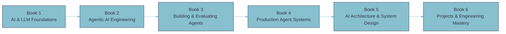

# Notes

> Every folder below is one of two things: a **book** — a `README.md` table of contents whose
> chapters wikilink out to concept notes instead of duplicating them — or an **applied/reference**
> folder ([[projects/readme|Projects]]) that the books link _into_. One folder doesn't fit the
> numbered-book shape by design: [[projects/readme|Projects]] is applied docs over two real systems,
> each with its own internal Parts. A 🚧 marks a book that's thinner today than its own description
> promises. Start at a book's `README.md`; follow wikilinks from there rather than browsing files
> directly.

**28 books · ~2,469 chapters** across this wiki.

## Start here, by goal

| Goal                                            | Start with                                                                      | Then                                                                                                                                                                                                                                                                                                                                                      |
| ----------------------------------------------- | ------------------------------------------------------------------------------- | --------------------------------------------------------------------------------------------------------------------------------------------------------------------------------------------------------------------------------------------------------------------------------------------------------------------------------------------------------- |
| MAANG interview prep (DSA + system design)      | [[data-structures-algorithms/readme\|Data Structures & Algorithms]]             | → [[low-level-design/readme\|Low-Level Design]] → [[object-oriented-programming/readme\|OOP]] → [[system-design/readme\|System Design]] → [[operating-system/readme\|Operating Systems]] → [[networks/readme\|Networks]] → [[dbms/readme\|DBMS]] → [[aptitude/readme\|Aptitude]]                                                                          |
| Observability & SRE reference (day-to-day)      | [[observability/readme\|Observability Engineering]]                             | → [[prometheus/readme\|Prometheus]] → [[grafana-cloud/readme\|Grafana Cloud]] → [[sre/readme\|SRE]]                                                                                                                                                                                                                                                       |
| Platform engineering reference                  | [[platform-engineering-fundamentals/readme\|Platform Engineering Fundamentals]] | → [[kubernetes/readme\|Kubernetes]] → [[kubernetes-platform-engineering/readme\|K8s Platform Engineering]] → [[infrastructure-platform-engineering/readme\|Infrastructure Platform Engineering]] → [[internal-developer-platforms/readme\|IDPs]] → [[ci-cd/readme\|CI/CD]] → [[patterns/readme\|Patterns]]                                                |
| AI & agentic systems (the stated reading order) | [[ai-foundations/readme\|AI & LLM Foundations]] (Book 1)                        | → [[agentic-ai-engineering/readme\|Agentic AI Engineering]] → [[building-agentic-systems/readme\|Building & Evaluating Agents]] → [[production-agent-systems/readme\|Production Agent Systems]] → [[ai-architecture-and-system-design/readme\|AI Architecture & System Design]] → [[agentic-ai-projects-and-mastery/readme\|Projects & Mastery]] (Book 6) |
| See it applied to a real system                 | [[projects/readme\|Projects]]                                                   | → `platform-shipsolid` (the ShipSolid observability platform) or `app-signal-forge` (the OTel validation lab), depending which system you want                                                                                                                                                                                                            |
| Personal practice                               | [[productivity/readme\|Productivity]]                                           | → [[philosophy/readme\|Philosophy]] 🚧                                                                                                                                                                                                                                                                                                                    |

## MAANG interview-prep core

| Book                                                                | Scope                                   | Summary                                                                                                                | Cross-links                                                                                           |
| ------------------------------------------------------------------- | --------------------------------------- | ---------------------------------------------------------------------------------------------------------------------- | ----------------------------------------------------------------------------------------------------- |
| [[data-structures-algorithms/readme\|Data Structures & Algorithms]] | 16 parts · 168 chapters                 | Python foundations through MAANG interview mastery — Google/Meta/Amazon/Apple/Netflix/Microsoft (L4–L6) readiness.     | —                                                                                                     |
| [[low-level-design/readme\|Low-Level Design]]                       | 16 parts · 115 chapters                 | OOP fundamentals through SOLID, UML, design patterns, dependency management, and classic interview problems.           | [[object-oriented-programming/readme\|OOP]], [[patterns/readme\|Patterns]]                            |
| [[object-oriented-programming/readme\|Object-Oriented Programming]] | 12 parts · 51 chapters                  | Paradigm foundations, the four pillars, SOLID/GRASP, GoF design patterns, OOP at system scale.                         | [[patterns/readme\|Patterns]], concurrency, [[low-level-design/readme\|Low-Level Design]]             |
| [[system-design/readme\|System Design]]                             | 16 parts (01–16) · 140 chapters         | Principal/Staff-level system design reference — observability pipelines, distributed systems, reliability engineering. | —                                                                                                     |
| [[operating-system/readme\|Operating Systems]]                      | 13 parts · 45 chapters                  | Processes, threads, concurrency, memory management, file systems, Linux internals at interview depth.                  | [[sre/readme\|SRE]]/linux-networking, kubernetes-security, [[patterns/readme\|Patterns]]/concurrency  |
| [[networks/readme\|Computer Networks]]                              | 13 parts · 76 chapters (+ `reference/`) | Ethernet through IP, TCP/UDP/QUIC, DNS, the HTTP ecosystem, cloud/Kubernetes networking.                               | [[kubernetes/readme\|Kubernetes]], [[sre/readme\|SRE]], [[system-design/readme\|System Design]], tech |
| [[dbms/readme\|Database Management Systems]]                        | 16 parts · 78 chapters                  | Relational foundations through SQL mastery, storage internals, transactions, distributed databases, NoSQL.             | [[system-design/readme\|System Design]], [[patterns/readme\|Patterns]]                                |
| [[aptitude/readme\|Aptitude]]                                       | 5 parts · 22 chapters                   | Quantitative aptitude, logical reasoning, verbal ability, mock-test strategy for aptitude-gated pipelines.             | —                                                                                                     |

## Observability & SRE

| Book                                                | Scope                                    | Summary                                                                                                                                            | Cross-links                                                                                                                                              |
| --------------------------------------------------- | ---------------------------------------- | -------------------------------------------------------------------------------------------------------------------------------------------------- | -------------------------------------------------------------------------------------------------------------------------------------------------------- |
| [[observability/readme\|Observability Engineering]] | 21 parts · 178 chapters (+ `reference/`) | Foundations through architecture, metrics, logging, tracing, profiling, OpenTelemetry, AI-driven operations, MAANG prep.                           | [[prometheus/readme\|Prometheus]], [[grafana-cloud/readme\|Grafana Cloud]], [[kubernetes/readme\|Kubernetes]], [[sre/readme\|SRE]], platform-engineering |
| [[prometheus/readme\|Prometheus]]                   | 12 parts · 46 chapters                   | Monitoring foundations through architecture, PromQL, alerting, production operation, PCA certification.                                            | existing notes (unspecified)                                                                                                                             |
| [[grafana-cloud/readme\|Grafana Cloud]]             | 13 parts · 57 chapters (+ `reference/`)  | Platform foundations through Mimir/Loki/Tempo/Pyroscope, application observability, enterprise reference architectures.                            | existing notes (unspecified)                                                                                                                             |
| [[sre/readme\|Site Reliability Engineering]]        | 15 parts · 185 chapters                  | The complete SRE curriculum — Linux internals through Staff/Principal-level MAANG interview prep, ordered the way SRE expertise actually develops. | —                                                                                                                                                        |

## Platform & cloud-native engineering

| Book                                                                                | Scope                                    | Summary                                                                                                                     | Cross-links                                                                                                                                                         |
| ----------------------------------------------------------------------------------- | ---------------------------------------- | --------------------------------------------------------------------------------------------------------------------------- | ------------------------------------------------------------------------------------------------------------------------------------------------------------------- |
| [[kubernetes/readme\|Kubernetes]]                                                   | 19 parts · 158 chapters                  | Cloud-native foundations, the CKAD/CKA/CKS tracks, control-plane internals, multi-cluster architecture, MAANG-level design. | [[prometheus/readme\|Prometheus]], [[observability/readme\|Observability]], platform-engineering                                                                    |
| [[kubernetes-platform-engineering/readme\|Kubernetes Platform Engineering]]         | 15 parts · 75 chapters                   | Multi-tenancy, platform automation, Helm, Cluster API, Crossplane, enterprise operations.                                   | [[kubernetes/readme\|Kubernetes]], [[observability/readme\|Observability]], platform-engineering                                                                    |
| [[infrastructure-platform-engineering/readme\|Infrastructure Platform Engineering]] | 17 parts · 84 chapters                   | IaC foundations, Terraform/OpenTofu, cloud platform design, networking, identity, governance, MAANG prep.                   | [[sre/readme\|SRE]], [[networks/readme\|Networks]], [[kubernetes/readme\|Kubernetes]], [[patterns/readme\|Patterns]], [[internal-developer-platforms/readme\|IDPs]] |
| [[internal-developer-platforms/readme\|Internal Developer Platforms]]               | 16 parts · 86 chapters                   | IDP fundamentals, Backstage, golden paths, software catalogs, platform APIs, developer experience.                          | [[platform-engineering-fundamentals/readme\|Platform Eng. Fundamentals]], [[sre/readme\|SRE]], [[observability/readme\|Observability]]                              |
| [[platform-engineering-fundamentals/readme\|Platform Engineering Fundamentals]]     | 11 parts · 59 chapters                   | Platform-as-a-product thinking, core principles, DORA/SPACE metrics, platform lifecycle, MAANG prep.                        | [[sre/readme\|SRE]], [[patterns/readme\|Patterns]], [[observability/readme\|Observability]], [[projects/readme\|Projects]]                                          |
| [[ci-cd/readme\|CI/CD Platform Engineering]]                                        | 16 parts · 125 chapters (+ `reference/`) | Pipeline foundations, GitHub Actions end to end, Argo Workflows, Tekton, Jenkins, release engineering, MAANG prep.          | tech, [[kubernetes/readme\|Kubernetes]], [[platform-engineering-fundamentals/readme\|Platform Eng. Fundamentals]], [[system-design/readme\|System Design]]          |
| [[patterns/readme\|Patterns]]                                                       | 18 parts · 79 chapters                   | Reusable engineering patterns across OOP, distributed systems, messaging, cloud infra, security, AI/agentic systems.        | —                                                                                                                                                                   |

## AI & data systems

The first six books below form the **AI Systems Engineering series** — written to be read in order:

| Book                                                                                            | Scope                                  | Summary                                                                                                                                      | Cross-links                             |
| ----------------------------------------------------------------------------------------------- | -------------------------------------- | -------------------------------------------------------------------------------------------------------------------------------------------- | --------------------------------------- |
| [[ai-foundations/readme\|AI & LLM Foundations]] — Book 1                                        | 2 parts · 23 chapters                  | The pre-agentic substrate — symbolic AI through transformers, tokens, embeddings, attention, foundation models.                              | —                                       |
| [[agentic-ai-engineering/readme\|Agentic AI Engineering]] — Book 2                              | 7 parts · 74 chapters                  | Where "LLM application" becomes "agent" — cognition, memory, planning, tools, retrieval, context engineering.                                | —                                       |
| [[building-agentic-systems/readme\|Building & Evaluating Agents]] — Book 3                      | 4 parts · 35 chapters                  | The architectural core of agent design — single-agent, multi-agent, evaluation, framework landscape.                                         | —                                       |
| [[production-agent-systems/readme\|Production Agent Systems]] — Book 4                          | 5 parts · 54 chapters                  | The runtime substrate, observability, reliability/security/governance, performance/cost, platform engineering.                               | —                                       |
| [[ai-architecture-and-system-design/readme\|AI Architecture & System Design]] — Book 5          | 2 parts · 25 chapters                  | The cross-cutting agent pattern catalog and full enterprise system-design case studies, L6/L7 depth.                                         | —                                       |
| [[agentic-ai-projects-and-mastery/readme\|Agentic AI: Projects & Engineering Mastery]] — Book 6 | 3 parts · 60 chapters (+ `reference/`) | Hands-on practitioner builds, Principal/Staff-level leadership, lookup appendices for the whole series.                                      | —                                       |
| [[data-engineering/readme\|Data Engineering]]                                                   | 17 parts · 63 chapters                 | Modeling, storage, ingestion/CDC, Spark/Flink, SQL mastery, orchestration, MAANG prep through capstone builds. Not part of the series above. | [[observability/readme\|Observability]] |

## Personal practice

| Book                                                        | Scope                                    | Summary                                                                                                    | Cross-links                                                                    |
| ----------------------------------------------------------- | ---------------------------------------- | ---------------------------------------------------------------------------------------------------------- | ------------------------------------------------------------------------------ |
| [[productivity/readme\|Productivity for Knowledge Workers]] | 17 parts · 137 chapters (+ `reference/`) | Foundations, self-management, PKM, learning, task systems, habits, digital productivity, career practice.  | existing notes (unspecified)                                                   |
| [[philosophy/readme\|Philosophy]] 🚧                        | 1 part · 2 chapters                      | Cognitive biases and decision-making — mental models and stoic practice are described but not yet written. | [[productivity/readme\|Productivity]], [[system-design/readme\|System Design]] |

> 🚧 `philosophy` is thinner than its own description promises — only
> `00-cognitive-biases-and-decision-making` is written so far. Mental models and stoic practice are
> the next Parts to add.

## Applied & reference

| Folder                        | Scope                        | Summary                                                                                                                                                                                                                              |
| ----------------------------- | ---------------------------- | ------------------------------------------------------------------------------------------------------------------------------------------------------------------------------------------------------------------------------------ |
| [[projects/readme\|Projects]] | 2 subprojects · 191 chapters | Applied documentation for real, running systems — SignalForge (an OTel validation lab, `app-signal-forge/`) and the ShipSolid observability platform (`platform-shipsolid/`) — as opposed to the cross-linked reference books above. |

## Metadata

|        |            |
| ------ | ---------- |
| Author | Amit Singh |
| Scope  | notes      |
