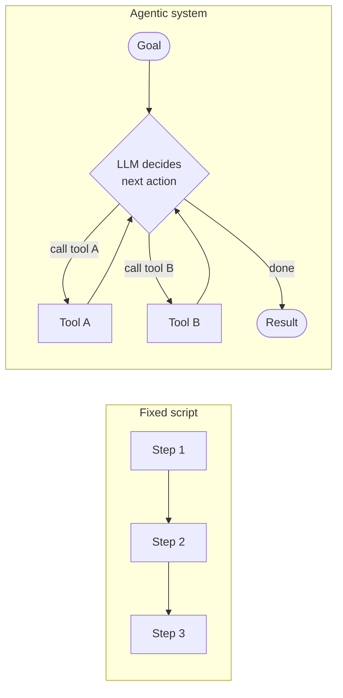

## What is Agentic AI?

> Chapter of
> [[agentic-ai-engineering/readme#00 — Introduction to Agentic AI|Introduction to Agentic AI]], part
> of [[agentic-ai-engineering/readme|Agentic AI Engineering]].

## What you will understand at the end

- The precise thing that changes when a system becomes "agentic" — it is a shift in _who decides the
  next step_, not the presence of a chat interface or a system prompt that says "you are an agent"
- Why this shift only became viable once foundation models crossed a reliability threshold, not
  because the idea of autonomous software is new
- The engineering mindset the rest of this book assumes: an agent is a probabilistic component
  wrapped in deterministic guardrails, not a program you can fully specify in advance

---

## The one-sentence definition

**An agentic AI system is one where an LLM decides, at runtime, what to do next — and that decision
can change the sequence of steps actually taken, not just the content of a single response.**

Everything else in this chapter unpacks that sentence. The load-bearing phrase is "decides what to
do next": a chatbot decides what to _say_ next, which is a much smaller decision surface than
deciding what to _do_ next when "do" includes calling a tool, querying a database, escalating to a
human, or deciding the task is already finished.

The script's path through steps 1→2→3 is fixed before the program ever runs. The agent's path
through tools A and B is decided by the model, one step at a time, based on what it observes. That
difference — decided in advance versus decided at runtime — is the entire subject of
[[02-agent-vs-workflow-vs-automation|Agent vs Workflow vs Automation]], the next chapter.

## How the field converged on this definition

There is no single, industry-agreed definition of "AI agent" — the field converged on three usable
ones, increasing in precision, before landing close to the one-sentence definition above:

| #   | Definition                                        | Source                         | Why it moved past the last one                                                              |
| --- | ------------------------------------------------- | ------------------------------ | ------------------------------------------------------------------------------------------- |
| 1   | An AI system that does work for you independently | OpenAI / Sam Altman (earliest) | The starting point — but "independently" and "do work" aren't testable criteria             |
| 2   | A system where an LLM controls the workflow       | Anthropic / Hugging Face       | Names the mechanism (control flow delegated to a model's output), still loose on specifics  |
| 3   | An LLM with tools, in a loop, to achieve a goal   | Simon Willison (most concrete) | Every term is checkable: a model, a tool interface, repeated calls, a termination condition |

Willison's is the one worth defaulting to in a design review or an interview, because every phrase
in it is testable against a real system: is there a model, does it have tools, is it called more
than once, is there a defined exit condition. The mental model underneath all three, and the one
thing worth never forgetting: **the LLM never _acts_ — it only predicts tokens. Code interprets
those tokens and decides what actually happens.** An LLM is an advisor who writes a recommendation
memo; your code is the executive who reads it and decides whether to act on it, the same way this
chapter's one-sentence definition frames "an LLM decides" as shorthand for "your code interprets the
LLM's output and treats that as the decision."

## Why now, not ten years ago

"Software that decides its own next step" is not a new ambition — planning systems and expert
systems chased it for decades (see
[[01-the-evolution-of-artificial-intelligence|The Evolution of Artificial Intelligence]]). What
changed is that a [[07-foundation-models|foundation model]] can now:

| Capability                                              | Why it's the unlock                                                                       |
| ------------------------------------------------------- | ----------------------------------------------------------------------------------------- | ----------------------------------------------------------------------------------------- |
| Parse an open-ended goal expressed in natural language  | No hand-built grammar or intent classifier is required to know what the user wants        |
| Reliably emit a structured [[05-tool-calling            | tool call]]                                                                               | The model's decision can be executed by ordinary code instead of staying trapped as prose |
| Read a tool's result and decide the next action from it | The loop can continue unattended instead of returning control to a human after every step |

None of these three capabilities were reliable enough to build on before instruction-tuned,
tool-calling-capable [[08-large-language-models|large language models]]. Agentic AI is therefore
best understood as an _application pattern that became viable_, not a new subfield of AI research —
the same underlying idea, finally sitting on a foundation reliable enough to build production
systems on.

## What agentic AI is not

Two confusions are worth heading off immediately, because both get reused as marketing language far
more loosely than this book uses them:

- **Not "any product with an LLM in it."** A feature that calls an LLM once per request to summarize
  or classify something is an LLM _application_, not an agent — there is no runtime decision about
  what to do next, only a single mapping from input to output.
- **Not "fully autonomous, unsupervised software."** Most production agents in
  [[08-ai-agent-use-cases|AI Agent Use Cases]] run inside explicit guardrails, approval gates, and
  iteration limits — see [[06-agent-design-principles|Agent Design Principles]] and
  [[09-enterprise-adoption-patterns|Enterprise Adoption Patterns]]. Autonomy is a dial, not a binary
  switch, and this book treats "how much autonomy" as a design decision made per use case, not an
  aspiration to maximize everywhere.

## The engineering mindset this book assumes

The single hardest adjustment for an engineer coming from deterministic systems: **the reasoning
component is probabilistic, and the system around it has to be engineered as if it will occasionally
be wrong.** That reframes the job from "write correct code" to "wrap an unreliable component in
reliable scaffolding" — retries, validation, guardrails, evaluation, human escalation. Every later
Part of this book is, in one way or another, a piece of that scaffolding:

- [[01-agent-architecture|Agent Architecture]] (Part 00 of Building & Evaluating Agents) is the deep
  architectural treatment of the loop this chapter only sketched above
- [[production-agent-systems/readme#02 — Reliability, Security & Governance|Reliability, Security & Governance]]
  (Part 02 of Production Agent Systems) is the guardrail layer around it
- [[production-agent-systems/readme#01 — Observability|Observability]] (Part 01 of Production Agent
  Systems) is how you find out the guardrails failed before a user does

## Where this Part is headed

The remaining chapters in this Part build the vocabulary the rest of the book uses without
re-explaining it: drawing the line against workflows and plain automation (Chapter 2), the specific
properties that qualify a system as agentic (Chapter 3), the lifecycle a single agent run goes
through (Chapter 4), how architectures are classified (Chapter 5), the design principles and
decision criteria for choosing to build one at all (Chapters 6–7), and where agents are already
proven in production (Chapters 8–9).

## Metadata

|        |                        |
| ------ | ---------------------- |
| Author | Amit Singh             |
| Scope  | agentic-ai-engineering |
