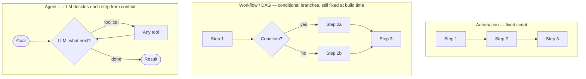
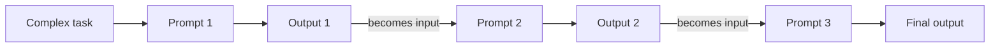
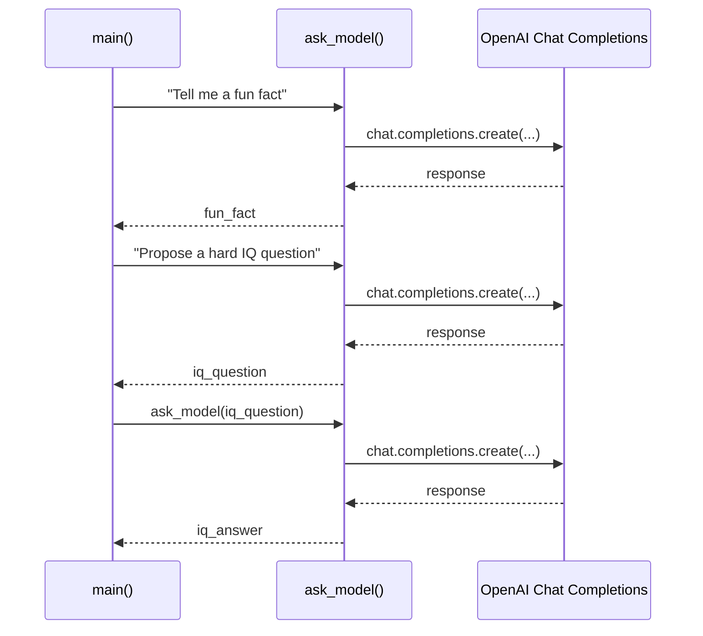

## Agent vs Workflow vs Automation

> Chapter of
> [[agentic-ai-engineering/readme#00 — Introduction to Agentic AI|Introduction to Agentic AI]], part
> of [[agentic-ai-engineering/readme|Agentic AI Engineering]].

## What you will understand at the end

- Where control flow actually originates in an automation script, a workflow/DAG, and an agent — the
  single axis that separates all three
- Why "we added an LLM call" does not by itself make a system agentic
- How to answer the question an interviewer asks first when you say "agent": _what decides the next
  step, and when is that decision made?_

---

## The axis that matters: when is the next step decided?

[[01-what-is-agentic-ai|What is Agentic AI?]] established that agentic systems are defined by
runtime decision-making. That single axis — **when is the sequence of steps decided, and by what** —
is enough to place any system into one of three buckets:

| Paradigm       | Who decides the next step | When it's decided     | Can the sequence change per run?      |
| -------------- | ------------------------- | --------------------- | ------------------------------------- |
| Automation     | The engineer, in code     | At build time         | No — same steps, every run            |
| Workflow / DAG | The engineer, as a graph  | At build time         | Only along pre-defined branches       |
| Agent          | The LLM, from context     | At run time, per step | Yes — steps and their order both vary |



## Automation — the baseline

A fixed automation script executes the same sequence of operations every time, regardless of the
data it encounters. A nightly cron job that exports a table, transforms it, and uploads the result
is automation: there is no branching decision at all, just a linear pipeline. Automation is the
right choice whenever the task is genuinely the same every time — it is also the cheapest, fastest,
and most auditable option on this list, so it should never be replaced with something fancier just
because agentic tooling exists.

## Workflow / DAG — branching, but still fixed at build time

A workflow adds conditional branches and parallel paths, usually expressed as a directed acyclic
graph: "if the payment fails, retry up to 3 times, then escalate; otherwise proceed to fulfillment."
The branches are richer than automation's straight line, but every branch and every condition was
written by an engineer before the workflow ever ran. Given the same input and the same state, a
workflow always takes the same path — it is deterministic even though it isn't linear.
[[04-workflow-agents|Workflow Agents]] (Part 00 of Building & Evaluating Agents) covers agents that
intentionally adopt this shape — an LLM call embedded inside an otherwise fixed graph, used for its
language understanding without handing it control over the graph's structure.

**The common trap:** wiring an LLM call into step 2 of an otherwise-fixed workflow does not make the
overall system an agent. If the LLM's output only ever selects among branches the engineer already
enumerated, the workflow is still deciding the shape of execution — the LLM is just filling in a
value, the same role a lookup table or a classifier would play.

## Prompt chaining — workflows in their most common shape

The single most common workflow shape in practice is a straight-line special case of the DAG above:
split a complex task into smaller, interconnected prompts where each step's output becomes the next
step's input, building a structured reasoning pipeline instead of asking one model call to do
everything at once. Anthropic's
["Building Effective Agents"](https://www.anthropic.com/engineering/building-effective-agents) names
this **prompt chaining** — the first and simplest of the five workflow patterns it catalogs, with
[[05-router-pattern|Router]],
[[production-agent-systems/03-performance-and-cost-engineering/02-parallel-execution/02-parallel-execution|Parallel Execution]],
[[ai-architecture-and-system-design/00-ai-architecture-patterns/04-orchestrator-worker-pattern/04-orchestrator-worker-pattern|Orchestrator-Workers]],
and
[[agentic-ai-engineering/03-planning-and-reasoning-algorithms/10-debate-and-critic-agents/10-debate-and-critic-agents|Debate & Critic Agents]]
covering the remaining four, in increasing order of complexity.



A monolithic prompt asking a model to reason through several distinct phases at once tends to blend
those phases together — errors in an early step propagate invisibly, and there is no seam at which
to validate, retry, or inspect intermediate reasoning. Chaining trades that for explicit stages:
each prompt is small and single-purpose, its output is inspectable, and failures are isolated to the
step that produced them. Beyond plain sequencing, real implementations commonly add one of several
variants:

| Technique                                                                                                             | What it does                                                            |
| --------------------------------------------------------------------------------------------------------------------- | ----------------------------------------------------------------------- |
| Sequential chaining                                                                                                   | Fundamental ordered step-by-step breakdown — the baseline shape above   |
| Parallel chaining                                                                                                     | Runs multiple independent prompts concurrently — the                    |
| [[production-agent-systems/03-performance-and-cost-engineering/02-parallel-execution/02-parallel-execution            | Parallel Execution]]                                                    |
| pattern, applied inside a chain                                                                                       |
| Conditional chaining                                                                                                  | Branches dynamically based on an intermediate output — the workflow/DAG |
| shape this section sits under                                                                                         |
| Feedback chaining                                                                                                     | Iterates a step until a quality criterion is met — the                  |
| [[agentic-ai-engineering/03-planning-and-reasoning-algorithms/10-debate-and-critic-agents/10-debate-and-critic-agents | critic-agent]]                                                          |
| loop, run inside one stage of the chain                                                                               |
| Hierarchical chaining                                                                                                 | Parent/child prompt relationships for multi-level decomposition         |
| Parallel synthesis                                                                                                    | Runs multiple streams, then resolves conflicts across their outputs     |

Chaining's failure modes are the same ones any pipeline has: building a chain where a single prompt
would have sufficed adds latency and cost for no accuracy gain; missing error handling at one step
lets a bad output cascade silently downstream; and tight coupling between steps makes the whole
chain brittle to change. The worked example below deliberately avoids the second failure — each step
fails fast rather than letting a missing output flow silently into the next prompt.

### Worked example — chained OpenAI prompt/response demo

A small lab script (`labs/day1.2.py`) implements the simplest form of this pattern: sequential
chaining via explicit dependency injection between three `ask_model()` calls, with no hidden
conversation state. It sends a fun-fact prompt, feeds that response into a second prompt asking the
model to propose a hard IQ question, then feeds _that_ output into a third call asking the model to
answer its own question.



The chaining here is explicit dependency injection: call 2's output (`iq_question`) becomes call 3's
_input_. There is no hidden conversation state — each `ask_model()` call is a fresh, single-turn
request, which is precisely what keeps the chain inspectable at every seam.

```python
def ask_model(prompt: str, *, client: OpenAI, model: str = DEFAULT_MODEL) -> str:
    """Send a single-turn user prompt; raises RuntimeError if the reply has no text."""
    messages: list[ChatCompletionMessageParam] = [{"role": "user", "content": prompt}]
    response = client.chat.completions.create(model=model, messages=messages)
    content = response.choices[0].message.content
    if content is None:
        raise RuntimeError(f"Model returned no text content for prompt: {prompt!r}")
    return content


def main() -> int:
    client = build_client()
    fun_fact = ask_model("Tell me a fun fact", client=client)
    iq_question = ask_model(
        "Please propose a hard, challenging question to assess someone's IQ. "
        "Respond only with the question.",
        client=client,
    )
    iq_answer = ask_model(iq_question, client=client)
    return 0
```

Each `ask_model()` call raises `RuntimeError` immediately if the model returns no content, rather
than letting a `None` silently flow into the next prompt in the chain — fail-fast at the step
boundary, deliberately avoiding chaining's most common failure mode (a bad or missing output
propagating downstream unnoticed).

> [!WARNING] The script as written has a real bug: `import httpx2` is a typo for `httpx` — only
> `httpx` is installed, and `requirements.txt` pins neither (only `openai` is listed there). As
> written, `build_client()` fails on that import before any of the chain above runs. Left here
> deliberately as a reminder that a chain's individual steps being well-isolated doesn't protect
> against a failure in the setup code that wires them together.

## Agent — the LLM decides, per step, from what it observes

An agent's next action is chosen by the LLM at runtime, conditioned on the current context —
including the results of steps that haven't happened yet at build time. Concretely: the model is
given a goal and a set of available [[05-tool-calling|tools]], and it decides, one step at a time,
which tool to call, what arguments to pass, and when the goal is satisfied. The same goal can
produce a completely different sequence of tool calls on two different runs, because what the model
observes after step 1 shapes what it chooses for step 2 — that is [[02-react|ReAct]]'s interleaved
reason-then-act loop, the mechanism that makes this dynamic control flow possible in practice. This
is the architecture [[01-agent-architecture|Agent Architecture]] (Part 00 of Building & Evaluating
Agents) covers component by component.

## A worked comparison

Take "process a customer refund request":

- **Automation:** every refund request is auto-approved and processed identically, no matter the
  amount or reason. Fast, but wrong the moment a $5,000 request needs the same treatment as a $12
  request.
- **Workflow:** refunds under $50 auto-approve; refunds $50–$500 route to a rules engine checking
  order history; refunds over $500 route to a human. All three branches and their thresholds were
  decided in advance — the workflow is more nuanced than automation, but it still can't handle a
  case the engineer didn't anticipate (a $40 refund on an account with 15 prior disputes).
- **Agent:** given the goal "resolve this refund request fairly," the agent pulls order history,
  checks the dispute count, reads the stated reason, decides whether it needs another signal it
  doesn't have yet, and only then decides whether to approve, deny, or escalate — the specific
  sequence of lookups it performs is not fixed in advance and can differ for every request.

Named products land cleanly on the workflow/agent side of this same line. **Deep Research**
(ChatGPT, Claude, and similar) runs through fixed stages — ask clarifying questions → run web
searches → build a report → summarize and synthesize — every stage a known step in a known sequence,
so it reads as a workflow even though an LLM is doing real work at each stage. **OpenAI's GPT Agent
(formerly Operator)** and coding agents like **Claude Code** and **Codex** sit on the other side:
given a goal, they keep deciding what to do next — which page to open, which file to edit, which
command to run — until they judge the task complete, with no predefined sequence of steps to point
to in advance. The mental shortcut worth keeping: **an LLM never _acts_ — it only predicts tokens;
your code interprets those tokens and decides what actually happens.** Whether that interpretation
runs along a fixed path (workflow) or asks the model again at every step (agent) is exactly the axis
this chapter is about.

## Choosing between them

The decision is not "agents are the advanced choice, prefer them" — it inverts the usual
default-to-simplicity engineering instinct only when the task itself demands it:

| Signal                                                                     | Favors                 |
| -------------------------------------------------------------------------- | ---------------------- |
| Steps and their order are always the same                                  | Automation             |
| Steps vary, but every variation was already enumerated                     | Workflow / DAG         |
| The right sequence of steps depends on information only available mid-task | Agent                  |
| Full auditability of every execution path is a hard requirement            | Automation or Workflow |
| The cost of an occasional wrong decision is acceptable given the upside    | Agent                  |

[[07-when-not-to-build-an-agent|When NOT to Build an Agent]] goes deeper on the last two rows — the
decision criteria for staying with a workflow even when an agent is technically possible.

## Metadata

|        |                        |
| ------ | ---------------------- |
| Author | Amit Singh             |
| Scope  | agentic-ai-engineering |
