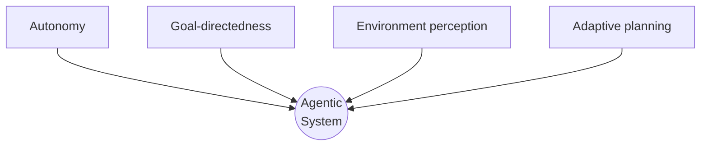

## Characteristics of Intelligent Agents

> Chapter of
> [[agentic-ai-engineering/readme#00 — Introduction to Agentic AI|Introduction to Agentic AI]], part
> of [[agentic-ai-engineering/readme|Agentic AI Engineering]].

## What you will understand at the end

- The four properties a system must have to earn the word "agentic" — and why each one is necessary,
  not decorative
- How the classical AI definition of an agent (perceive, decide, act) maps directly onto an
  LLM-based system's context window, reasoning step, and tool call
- A checklist you can run against any "AI agent" product claim to tell whether it's genuinely
  agentic or a chatbot with a few tools bolted on

---

## The classical definition, translated

Russell & Norvig's foundational definition of an agent — something that **perceives** its
environment through sensors and **acts** upon it through actuators — predates LLMs by decades, and
[[01-the-evolution-of-artificial-intelligence|The Evolution of Artificial Intelligence]] traces that
lineage back through symbolic AI's planning systems. What's new is the substrate the definition runs
on:

| Classical AI term | LLM-agent equivalent                                                         |
| ----------------- | ---------------------------------------------------------------------------- | ---------------------------- |
| Sensors           | Tool results, retrieved documents, user messages fed into the context window |
| Percept           | The current turn's context — everything the model can see right now          |
| Agent program     | The LLM's forward pass, conditioned on that context                          |
| Actuators         | [[05-tool-calling                                                            | Tool calls]] the model emits |

This isn't a loose analogy — it's the same architecture, with a foundation model standing in for the
hand-coded agent program of the symbolic-AI era. That substitution is exactly what makes today's
agents both more general and less predictable than their predecessors.

## The four defining properties

A system needs all four of the following to be genuinely agentic — missing any one leaves you with
something else (a chatbot, a lookup tool, a fixed pipeline), not a weaker agent.

### 1. Autonomy

The system acts without a human approving every individual step. Autonomy is a spectrum, not a
binary — an agent that pauses for approval before any destructive action still has autonomy over the
steps leading up to that gate. See [[09-enterprise-adoption-patterns|Enterprise Adoption Patterns]]
for how production systems dial autonomy up gradually rather than granting it all at once.

**Test:** if you removed the human from the loop entirely, would the system still be able to make
forward progress toward the goal? If every single step requires a human decision, autonomy is absent
— you have a decision-support tool, not an agent.

### 2. Goal-directedness

The system is working toward an objective, not just responding to the immediately preceding message.
A goal-directed agent can be given "resolve this customer's billing dispute" and hold that objective
across many tool calls, discarding dead ends and adjusting its approach, rather than treating each
tool result as the end of its job.

**Test:** does the system know when it's _done_? A goal-directed agent can recognize task completion
and stop; a system that just keeps generating output has no notion of "the goal is satisfied."

### 3. Environment perception

The system can observe the actual state of the world it's operating in — not just the user's text,
but the outputs of the tools it calls: a database query result, a file's contents, an API's error
response. Perception is what lets the agent's next decision be grounded in reality instead of purely
in the model's internal assumptions. [[01-perception|Perception]] (Part 01) covers this in depth —
structured tool outputs, unstructured text, and multimodal input.

**Test:** if a tool call returns an unexpected result (an error, an empty set, data the model didn't
anticipate), does the agent's subsequent behavior change? If the agent proceeds identically
regardless of what it observed, it isn't actually perceiving its environment — it's executing a
script that happens to call tools.

### 4. Adaptive planning

The system can revise its approach mid-task based on what it learns, rather than executing a plan
formed once at the very start and never revisited. This is the property
[[02-agent-vs-workflow-vs-automation|Agent vs Workflow vs Automation]] used as the defining axis,
and [[03-planning|Planning]] (Part 01) and
[[agentic-ai-engineering/readme#03 — Planning & Reasoning Algorithms|Planning & Reasoning Algorithms]]
(Part 03) cover the concrete algorithms — ReAct, Plan-and-Execute, Tree of Thoughts — that implement
it.

**Test:** if the first approach fails, does the system try something different, or does it repeat
the same failing action? Non-adaptive systems loop or fail outright; adaptive ones reroute.

## Running the checklist

| Property               | Present in a single-turn chatbot? | Present in a workflow with an LLM step?             | Present in an agent? |
| ---------------------- | --------------------------------- | --------------------------------------------------- | -------------------- |
| Autonomy               | No — waits for the next message   | Partial — autonomous within fixed branches          | Yes                  |
| Goal-directedness      | No — no persistent objective      | Partial — the workflow embeds the goal, not the LLM | Yes                  |
| Environment perception | No — text in, text out only       | Sometimes — if a step reads a tool result           | Yes                  |
| Adaptive planning      | No                                | No — branches are fixed at build time               | Yes                  |

A system that's missing even one row of this table is worth naming precisely rather than calling it
an "agent" by default — see [[02-agent-vs-workflow-vs-automation|Agent vs Workflow vs Automation]]
for why that precision matters when an interviewer or a stakeholder asks you to justify the
architecture.

## Why all four, and not fewer

It's tempting to treat autonomy alone as sufficient — "it runs without me watching it" — but a
system that autonomously executes a fixed script has no goal-directedness or adaptive planning; it's
just unattended automation. Conversely, a system with a clear goal but no environment perception (an
LLM asked to "write a report" with no tools) can't ground its output in anything real. All four
properties compose: autonomy without goal-directedness is aimless, goal-directedness without
perception is blind, and perception without adaptive planning can observe a problem but never
respond to it.

## Metadata

|        |                        |
| ------ | ---------------------- |
| Author | Amit Singh             |
| Scope  | agentic-ai-engineering |
