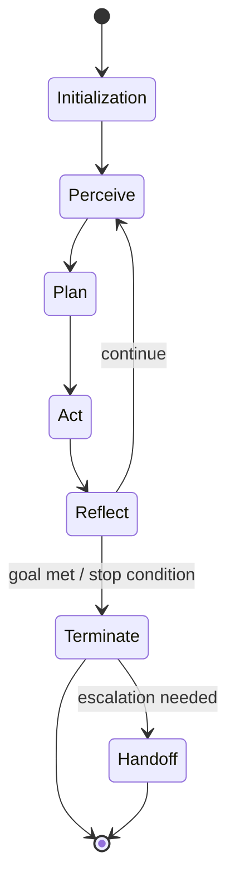

## Agent Lifecycle

> Chapter of
> [[agentic-ai-engineering/readme#00 — Introduction to Agentic AI|Introduction to Agentic AI]], part
> of [[agentic-ai-engineering/readme|Agentic AI Engineering]].

## What you will understand at the end

- The full lifecycle of a single agent invocation, from initialization to termination or handoff —
  not just the perceive-act loop in the middle
- Which state must persist across that boundary and which must reset, and why getting this wrong is
  one of the most common production agent bugs
- Where each lifecycle stage is covered at implementation depth elsewhere in this book

---

## The full lifecycle, not just the loop

It's easy to picture an agent as nothing but its inner loop — perceive, plan, act, repeat. In
production, that loop is bracketed by an initialization stage before it and a termination stage
after it, and both matter as much as the loop itself for correctness and cost.

## Stage 1 — Initialization and context loading

Before the agent reasons about anything, its runtime assembles the context it will reason over: the
system prompt, the tool schemas it's permitted to call, and whatever memory is relevant to this
invocation. This is where [[05-long-term-memory|long-term memory]] gets retrieved and injected, and
where [[02-session-management|session state]] (Part 00 of Production Agent Systems) is loaded if
this invocation is continuing a prior conversation rather than starting fresh.

**Why this stage is easy to under-engineer:** initialization cost is paid on every single
invocation, so a slow or unbounded retrieval here (pulling in too much history, an unindexed memory
query) becomes a latency and token-cost problem multiplied across every request — see
[[05-context-optimization|Context Optimization]].

## Stage 2 — The perceive → plan → act → reflect loop

This is the part [[01-agent-architecture|Agent Architecture]] (Part 00 of Building & Evaluating
Agents) covers component-by-component and
[[agentic-ai-engineering/readme#01 — Agent Cognition|Agent Cognition]] (Part 01) covers
stage-by-stage:

| Loop stage | What happens                                                                     | Covered in depth               |
| ---------- | -------------------------------------------------------------------------------- | ------------------------------ | ---------------------------------- | ----------------- |
| Perceive   | The model reads the current context — prior steps, tool results, user input      | [[01-perception                | Perception]]                       |
| Plan       | The model decides the next action, or revises its approach given new information | [[03-planning                  | Planning]], [[02-decision-making   | Decision Making]] |
| Act        | The model's decision is executed — a tool call runs, a message is sent           | [[01-tool-calling-architecture | Tool Calling Architecture]]        |
| Reflect    | The result is evaluated against the goal — continue, retry, or stop              | [[05-reflection                | Reflection]], [[06-self-correction | Self-Correction]] |

Each pass through this loop is one iteration. The reflect stage is what decides whether the loop
continues (back to perceive), terminates (the goal is met or a stop condition fires), or hands off
(the agent recognizes it can't proceed without a human).

## Stage 3 — Termination

An iteration loop that never terminates is not a design detail to fix later — it is the single most
common way an agent turns a bounded task into an unbounded one, in both latency and dollar cost.
Every production agent needs an explicit answer to "how does this stop":

| Termination condition      | What it looks like                                                                 |
| -------------------------- | ---------------------------------------------------------------------------------- |
| Goal satisfied             | The model determines the task is complete and emits a final answer                 |
| Max iterations reached     | A hard iteration ceiling fires regardless of task state — the last line of defense |
| Token/cost budget exceeded | The invocation is stopped before it exceeds its allotted spend                     |
| Unrecoverable error        | A tool failure the agent can't route around surfaces as a terminal failure         |

## Stage 4 — Handoff

Termination and handoff are not the same thing. Termination ends the loop; handoff transfers an
unfinished task to something else — usually a human, sometimes another agent. A well-designed
handoff carries forward everything the receiving party needs to pick the task up without re-deriving
it: what's been tried, what was learned, and specifically what's blocking further progress.
[[07-human-in-the-loop-systems|Human-in-the-Loop Systems]] (Part 00 of Building & Evaluating Agents)
covers designing this handoff so the human resumes with full context rather than a bare "I got
stuck" message.

## What persists versus what resets

This is the question that most often gets answered wrong in a first production agent: which state
survives across invocations, and which is thrown away when one ends.

| State                                      | Persists across invocations?  | Where it lives                                     |
| ------------------------------------------ | ----------------------------- | -------------------------------------------------- | ------------------- |
| Working memory (this run's scratchpad)     | No — discarded at termination | In-process variables; see [[03-working-memory      | Working Memory]]    |
| Conversation history (this session)        | Yes, within a session bound   | [[04-short-term-memory                             | Short-Term Memory]] |
| Learned facts, preferences, prior outcomes | Yes, across sessions          | [[05-long-term-memory                              | Long-Term Memory]]  |
| Iteration counters, cost accumulators      | No — reset per invocation     | Runtime state, not memory — see [[01-agent-runtime | Agent Runtime]]     |

Getting this boundary wrong in either direction causes real failures: letting working memory leak
into long-term storage pollutes future sessions with one-off scratch state, while failing to persist
genuinely long-term facts forces the agent to rediscover the same thing every single session.

## Metadata

|        |                        |
| ------ | ---------------------- |
| Author | Amit Singh             |
| Scope  | agentic-ai-engineering |
