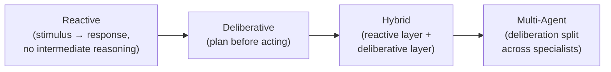

## Agent Taxonomy

> Chapter of
> [[agentic-ai-engineering/readme#00 — Introduction to Agentic AI|Introduction to Agentic AI]], part
> of [[agentic-ai-engineering/readme|Agentic AI Engineering]].

## What you will understand at the end

- The four architecture classes agents fall into — reactive, deliberative, hybrid, and multi-agent —
  and the axis (how much internal reasoning happens before acting) that separates them
- Which class fits which production use case, and the reliability tradeoff each class accepts in
  exchange for its strengths
- Where each class is covered at implementation depth later in the book

---

## The classification axis: reasoning before acting

The four classes below sit on a single spectrum: how much internal reasoning happens between
observing something and acting on it.

## Reactive agents

A reactive agent maps a perceived state directly to an action, with no intermediate planning step —
closer to a lookup table or a rule engine than to a reasoning system. In an LLM context, this looks
like a single-shot prompt-to-tool-call mapping with no multi-step loop: classify this support ticket
and route it, with no back-and-forth.

- **Strengths:** low latency, low cost, highly predictable — the same input reliably produces the
  same class of output.
- **Weaknesses:** cannot handle a situation that doesn't fit its immediate stimulus-response
  mapping; no ability to recover from an unexpected observation mid-task, because there is no
  "mid-task."
- **Best fit:** high-volume, well-bounded classification and routing tasks where the cost of an
  occasional misroute is low and predictability matters more than sophistication.

## Deliberative agents

A deliberative agent reasons through a plan before acting, and can revise that plan as it learns
more — this is the [[02-react|ReAct]] and [[07-plan-and-execute|Plan-and-Execute]] territory, and
the loop [[01-agent-architecture|Agent Architecture]] (Part 00 of Building & Evaluating Agents)
describes end to end. It exhibits all four properties from
[[03-characteristics-of-intelligent-agents|Characteristics of Intelligent Agents]]: autonomy,
goal-directedness, environment perception, and adaptive planning, working together across multiple
iterations rather than a single stimulus-response pass.

- **Strengths:** can handle novel situations it wasn't explicitly programmed for, by reasoning from
  first principles about the goal and the tools available.
- **Weaknesses:** higher latency and cost per task (more LLM calls, more tool round-trips); harder
  to fully predict or audit, since the exact sequence of steps is decided at runtime.
- **Best fit:** open-ended tasks where the right sequence of steps genuinely can't be enumerated in
  advance — research synthesis, incident investigation, multi-step customer issue resolution.

## Hybrid agents

A hybrid architecture layers a fast reactive tier on top of (or alongside) a slower deliberative
tier: simple, well-understood requests are handled reactively for speed, while anything that doesn't
match a known pattern escalates to deliberative reasoning. This is the same idea as
[[07-model-selection-and-routing|Model Selection & Routing]] (Part 01 of AI & LLM Foundations),
applied to reasoning depth instead of just model tier — and it composes directly with the
[[05-router-pattern|Router Pattern]] (Part 00 of AI Architecture & System Design).

- **Strengths:** captures most of the cost/latency benefit of reactive handling for the common case,
  without sacrificing the deliberative tier's ability to handle the long tail.
- **Weaknesses:** two architectures to build, test, and maintain instead of one; the routing
  decision between them becomes its own point of failure if miscalibrated.
- **Best fit:** production systems with a highly skewed request distribution — most traffic is
  simple and repetitive, a minority is genuinely novel.

## Multi-agent systems

A multi-agent architecture splits deliberation itself across multiple specialized agents —
coordinated by a supervisor, a shared message bus, or a negotiation protocol — rather than asking
one generalist agent to hold every concern in a single context window.
[[01-why-multi-agent-systems|Why Multi-Agent Systems]] (Part 01 of Building & Evaluating Agents)
covers the concrete failure modes — context overload, tool sprawl, conflicting objectives — that
motivate this split, and [[09-supervisor-architectures|Supervisor Architectures]] covers the most
common coordination pattern.

- **Strengths:** each specialist agent carries a smaller, more focused context and tool set, which
  tends to make each one individually more reliable than one generalist trying to do everything.
- **Weaknesses:** coordination overhead, new failure modes around inter-agent communication, and
  harder end-to-end observability — see [[03-communication-protocols|Communication Protocols]].
- **Best fit:** tasks that decompose naturally into distinct specialties — a metrics specialist, a
  logs specialist, and a traces specialist collaborating on one incident investigation, rather than
  one agent holding all three tool sets and contexts at once.

## Choosing a class

| Class        | Latency/cost | Predictability | Handles novel situations    | Typical use case                                |
| ------------ | ------------ | -------------- | --------------------------- | ----------------------------------------------- |
| Reactive     | Lowest       | Highest        | No                          | High-volume classification/routing              |
| Deliberative | Higher       | Lower          | Yes                         | Open-ended, multi-step tasks                    |
| Hybrid       | Mixed        | Mixed          | Yes, for the escalated tier | Skewed request distributions                    |
| Multi-agent  | Highest      | Lowest         | Yes, per specialist         | Tasks that naturally decompose into specialties |

None of these four is a strictly better choice than the others — each trades reliability and
predictability for adaptability at a different point on the spectrum, and picking one earlier or
later than the task warrants is exactly the mistake
[[07-when-not-to-build-an-agent|When NOT to Build an Agent]] covers from the other direction.

## Metadata

|        |                        |
| ------ | ---------------------- |
| Author | Amit Singh             |
| Scope  | agentic-ai-engineering |
