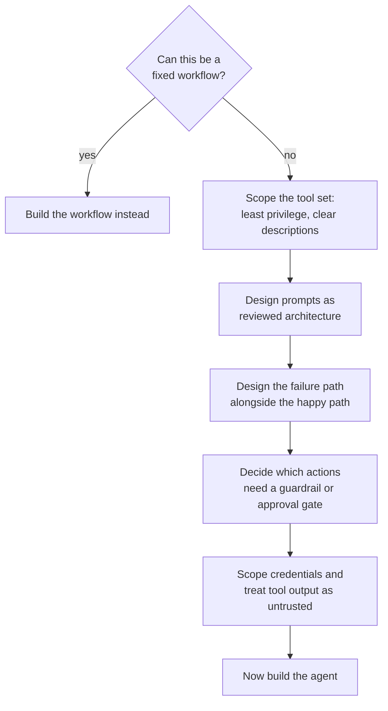

## Agent Design Principles

> Chapter of
> [[agentic-ai-engineering/readme#00 — Introduction to Agentic AI|Introduction to Agentic AI]], part
> of [[agentic-ai-engineering/readme|Agentic AI Engineering]].

## What you will understand at the end

- The design decisions that should be settled before a line of agent code is written, not discovered
  from a production incident afterward
- How to scope a tool set deliberately instead of exposing "everything the model might need"
- Why guardrails and error handling are load-bearing architecture, not a hardening pass added at the
  end

---

## Design happens before code

Every principle in this chapter is a question to answer on paper first, because each one shapes
architecture decisions that are expensive to reverse once an agent is live: which tools exist, what
the model is and isn't trusted to decide, and what happens when something goes wrong. Treat this
chapter as the checklist to run before opening [[01-agent-architecture|Agent Architecture]] (Part 00
of Building & Evaluating Agents) and wiring up the five components it describes.

## Principle 1 — Default to deterministic; earn the right to be agentic

[[02-agent-vs-workflow-vs-automation|Agent vs Workflow vs Automation]] already made the
architectural case; the design principle version of it is a discipline: for every proposed agentic
capability, ask whether a fixed workflow could handle it, and only reach for dynamic control flow
once that answer is genuinely no. A deterministic system beats an agentic one whenever the task's
steps are actually enumerable in advance — it's cheaper, faster, and far easier to test and audit.
[[07-when-not-to-build-an-agent|When NOT to Build an Agent]] is this principle's dedicated chapter.

## Principle 2 — Scope tools deliberately

A tool set is not "everything the agent might conceivably need" — it's a deliberately scoped
interface, chosen the same way you'd design any other API surface:

- **Least privilege first.** A tool that can read customer records should not also be able to delete
  them, even if one underlying API technically supports both — split the capability, don't rely on
  the model to self-restrict. [[12-tool-security|Tool Security]] (Part 04) covers this in depth.
- **Fewer, clearer tools over many overlapping ones.** Tool-selection accuracy degrades as the
  catalog grows and tool descriptions start to overlap in ambiguous ways — see
  [[11-tool-selection-strategies|Tool Selection Strategies]].
- **Description quality is part of the design, not an afterthought.** The model chooses tools based
  on their descriptions; a vague or overlapping description is a design defect, the same category of
  bug as an ambiguous function name in ordinary code.

## Principle 3 — Prompt engineering is architecture, not wording

The instructions given to the model — the system prompt, the tool descriptions, the format the model
is asked to reason in — determine how reliably it stays within its intended scope just as much as
any code around it does. [[01-prompt-engineering-fundamentals|Prompt Engineering Fundamentals]] and
[[02-prompt-design-patterns|Prompt Design Patterns]] (Part 01 of AI & LLM Foundations) cover the
mechanics; the design-time discipline is treating prompt changes with the same review rigor as a
code change, because a prompt regression can silently change agent behavior in production the same
way a logic bug would.

## Principle 4 — Error handling is a first-class path, not an exception

An agent calling external tools will encounter failures constantly — a timeout, a malformed
response, a rate limit, a tool that succeeds but returns data the model misinterprets. Design the
happy path and the failure path together:

| Failure type                        | Design response                                                                                |
| ----------------------------------- | ---------------------------------------------------------------------------------------------- | --------------------------- |
| Transient tool error                | Retry with backoff — see [[11-failure-recovery                                                 | Failure Recovery]]          |
| Malformed or unexpected output      | Validate before feeding back to the model; don't let garbage compound across iterations        |
| Repeated failure on the same step   | Escalate to a human rather than looping — see [[07-human-in-the-loop-systems                   | Human-in-the-Loop Systems]] |
| Ambiguous instruction from the user | Have the agent ask a clarifying question rather than guess and act on a high-stakes assumption |

## Principle 5 — Guardrails constrain what the model is trusted to decide autonomously

Not every decision an agent could make should be made without a check. Guardrails are the explicit
boundary between "the model decides this" and "a human or a deterministic rule decides this instead"
— [[01-guardrails|Guardrails]] and [[08-human-approval-systems|Human Approval Systems]] (Part 02 of
Production Agent Systems) cover the implementation. At design time, the question is simply: for this
action, what is the cost of the model getting it wrong, and does that cost justify a gate?

## Principle 6 — Security is a design input, not a review-stage add-on

Tool-calling agents introduce an attack surface that doesn't exist in a plain chatbot: a malicious
or poisoned tool result can attempt to redirect the agent's behavior (prompt injection via data, not
just via the user's own message). Two design-time commitments matter most:

- Treat every tool result as untrusted input, the same way you'd treat user input in a web
  application — see [[09-ai-failure-modes|AI Failure Modes]] (Part 01 of AI & LLM Foundations) and
  [[02-prompt-injection|Prompt Injection]] (Part 02 of Production Agent Systems).
- Scope credentials and permissions per tool, not per agent — a compromised or misled reasoning step
  should never be able to reach further than the single tool call it's making.

## Principle 7 — Start from the business problem, not the presumed solution

The two principles above assume the task itself is already correctly scoped. In practice, the more
common failure happens earlier: a sponsor asks for an agent by _name_ — "I need a strategy agent,"
"I need a culture agent" — before any business problem has been identified at all. The fix is a
discipline, not a one-time check: for every requested agent, ask what business problem it solves
before accepting the request, because only a defined, measurable problem lets you later verify the
agent actually solved anything.

A worked case makes the stakes concrete. A client once asked for a culture agent to advise the
business on culture — pushed on "what problem is this solving," the client was initially annoyed;
they had already decided the solution and didn't want to revisit the problem. Persistent probing
surfaced the real issue: low morale, which traced further to higher-than-desired attrition.
Attrition is measurable, and it opened up a real solution space — starting with something as
unglamorous as an employee survey to find the root cause, with an AI agent as _possibly_ one of
several candidate interventions, not the presumed answer.

The deeper point underneath "ask about the problem first": an ungrounded agent would still happily
generate believable-sounding advice about improving culture — convincingly, fluently, with no
guarantee any of it is correct, because **an LLM is trained to produce plausible, believable
content; that is literally its training objective.** Believable is not the same as correct or
useful. The only way to tell the difference is to measure against a real business outcome and
iterate — which is exactly why this principle has no teeth without
[[production-agent-systems/01-observability/01-ai-observability-fundamentals/01-ai-observability-fundamentals|AI Observability Fundamentals]]'
business evals sitting underneath it.

## Principle 8 — Don't let human org-chart intuition design the architecture

A related trap shows up one layer deeper, after the problem is correctly scoped: jumping straight to
an agent _architecture_ diagram — naming roles like "trade manager," "market research agent," "risk
manager agent" — before any evidence that dividing the work this way improves performance. The root
cause is treating LLMs as if they were people with roles and responsibilities, when they are token
generation engines predicting the next plausible tokens for a sequence, with no inherent need to be
organized the way a human team would be.

The correct default is the same discipline [[05-router-pattern|Router Pattern]] applies one level
down when deciding whether to route to multiple models or just use one: **start as simple as
possible.** One LLM, one prompt, one objective — then measure it against the business metric, and
only decompose into more LLM calls or agents if doing so _measurably_ improves that metric. A
trading-system example makes this concrete: faced with "build something that trades on the stock
market," the anthropomorphizing instinct jumps straight to a team — trade manager → market research
agent → trader agent → risk manager agent — with documents written and agents built before any of it
is tested against a metric. The disciplined approach starts with one LLM call doing the whole task,
measures its real-world outcome, and only splits into more calls or agents when a split is shown to
perform better.

An org-chart-shaped architecture isn't automatically wrong — it can turn out to be genuinely better.
The trap is arriving there because it _feels_ human-intuitive, instead of arriving there through
measurement. This is Principle 1's "default to deterministic, earn the right to be agentic"
discipline, reapplied one level down: not just _whether_ to use an agent at all, but _how many_ LLM
calls or agents the chosen architecture actually needs.

## The checklist, assembled

Every step above this line is cheaper to get right on paper than to retrofit after the agent is
already in production — which is exactly why it belongs in this Part, before
[[01-agent-architecture|Agent Architecture]] (Part 00 of Building & Evaluating Agents) walks through
building the thing itself.

## Metadata

|        |                        |
| ------ | ---------------------- |
| Author | Amit Singh             |
| Scope  | agentic-ai-engineering |
