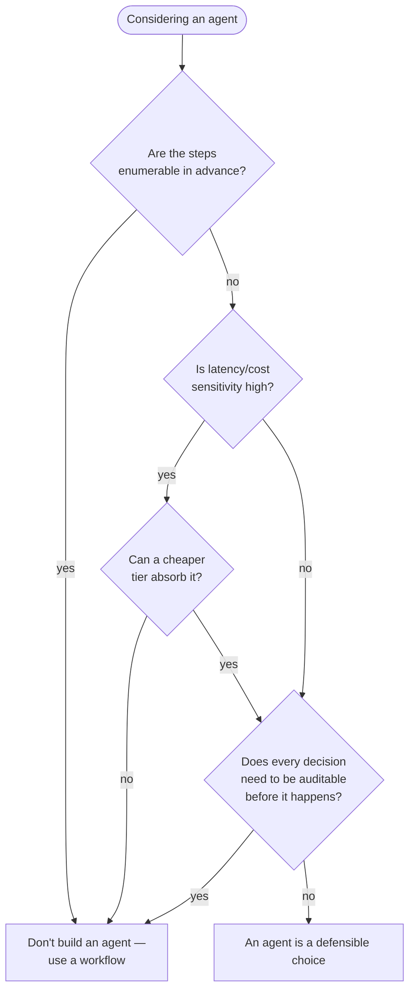

## When NOT to Build an Agent

> Chapter of
> [[agentic-ai-engineering/readme#00 — Introduction to Agentic AI|Introduction to Agentic AI]], part
> of [[agentic-ai-engineering/readme|Agentic AI Engineering]].

## What you will understand at the end

- The concrete decision criteria for rejecting an agentic architecture, not just a vague sense that
  "simpler is better"
- Why bounded task scope, latency/cost sensitivity, and auditability requirements each independently
  argue against dynamic control flow
- How to make this call defensibly in a design review, rather than defaulting to "agent" because the
  term is available

---

## The default should be "no"

[[06-agent-design-principles|Agent Design Principles]] already stated this as its first principle:
default to deterministic, and earn the right to be agentic. This chapter is that principle's
decision framework — the specific signals that should make you reject an agentic architecture even
when one is technically possible to build.

## Criterion 1 — Bounded task scope

If every path the task could take is already known and small in number, an agent buys you nothing —
[[02-agent-vs-workflow-vs-automation|Agent vs Workflow vs Automation]] already covers why a workflow
handles enumerable branches at lower cost and higher predictability. The tell-tale sign: if you can
draw the complete decision tree on a whiteboard in five minutes, it belongs in a workflow, not an
agent.

**Concrete test:** try to write down every possible sequence of steps the task could require. If you
succeed, and the list is short enough to review, build the workflow. If you find yourself writing
"...and other cases we'll handle as they come up," that's the actual signal an agent is warranted —
not before.

## Criterion 2 — Latency and cost sensitivity

Every reasoning step in an agent's loop is at least one additional LLM call, and each one adds
latency and token cost. A deliberative agent making five tool-call decisions to resolve a request is
paying for five LLM round-trips that a single well-designed workflow branch might avoid entirely.
[[01-latency-optimization|Latency Optimization]] and [[08-cost-engineering|Cost Engineering]] (Part
03 of Production Agent Systems) cover mitigating this once you've committed to an agent — but the
cheapest mitigation is not needing the extra round-trips in the first place.

**Concrete test:** does the use case have a hard latency SLA (sub-second response, synchronous user
wait) or a cost ceiling that a multi-step reasoning loop would blow through? If so, either a
reactive agent (see [[05-agent-taxonomy|Agent Taxonomy]]) or a plain workflow is the right fit, not
a deliberative one.

## Criterion 3 — Auditability requirements

A deterministic workflow's execution path can be fully explained before it ever runs — every branch
and its condition is visible in the code. An agent's execution path is decided at runtime and can
differ between two runs with identical input, which makes "explain exactly why the system did this"
a harder question to answer after the fact, and often impossible to answer _before_ the fact for a
specific future run.

Regulated domains — financial transactions, medical decisions, anything under
[[09-compliance|Compliance]] review — frequently require the ability to state, in advance, every
decision path the system can take. If that requirement is non-negotiable for your use case, an
agent's runtime-decided control flow is a liability, not a strength, no matter how well-guardrailed
it is.

**Concrete test:** could a regulator, auditor, or incident reviewer ask "what could this system have
done in this situation, and why did it choose what it chose" and get a complete, pre-computed
answer? If the honest answer requires re-running the model and hoping it explains itself faithfully,
that's a signal to reconsider.

## What "not an agent" doesn't mean

Rejecting an agentic architecture for a given task does not mean rejecting LLMs entirely. A workflow
with an LLM step embedded in it — see [[04-workflow-agents|Workflow Agents]] (Part 00 of Building &
Evaluating Agents) — captures the model's language understanding without ceding control of the
execution path to it. The decision in this chapter is specifically about **who decides the sequence
of steps**, the same axis [[02-agent-vs-workflow-vs-automation|Agent vs Workflow vs Automation]]
introduced — not about whether an LLM is involved at all.

## The cost of getting this wrong in either direction

| Mistake                                                       | Consequence                                                                              |
| ------------------------------------------------------------- | ---------------------------------------------------------------------------------------- |
| Building an agent for a task with enumerable steps            | Unnecessary latency, cost, and unpredictability for zero adaptability benefit            |
| Building a rigid workflow for a task with unbounded variation | Constant maintenance as new cases are discovered, each requiring a new hand-coded branch |

Neither direction is free — this chapter's criteria exist to make the choice deliberately, in either
direction, rather than defaulting to whichever architecture is currently fashionable.
[[08-ai-agent-use-cases|AI Agent Use Cases]] surveys where the agentic side of this decision has
actually paid off in production.

## Metadata

|        |                        |
| ------ | ---------------------- |
| Author | Amit Singh             |
| Scope  | agentic-ai-engineering |
