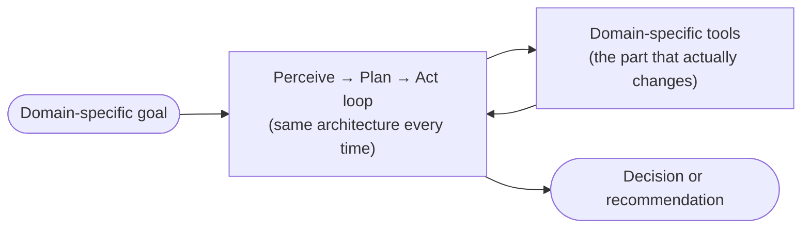

## AI Agent Use Cases

> Chapter of
> [[agentic-ai-engineering/readme#00 — Introduction to Agentic AI|Introduction to Agentic AI]], part
> of [[agentic-ai-engineering/readme|Agentic AI Engineering]].

## What you will understand at the end

- Four production-proven agent use case families, and the shape of the problem each one shares
- The common architectural skeleton underneath all four, once you strip away the domain-specific
  framing
- Where to look in this book for the implementation-depth chapters behind each use case

---

## The common shape underneath every use case

Before the four use cases below, notice the pattern they all share: a goal that can't be resolved
from a single lookup, a set of tools that gather evidence, and a synthesis step that turns gathered
evidence into a decision or a recommendation. That shape is
[[01-agent-architecture|Agent Architecture]] (Part 00 of Building & Evaluating Agents) again — the
specific tools and prompts change per domain, the loop underneath does not.

## Use case 1 — Customer support triage

**The problem:** an incoming request needs to be understood, checked against account/order history,
and either resolved directly or routed to the right specialist — with the right sequence of lookups
varying by request.

**The architecture:** a router or single deliberative agent (see
[[05-agent-taxonomy|Agent Taxonomy]]) that pulls account context, applies policy checks, and either
answers directly or escalates. This is the refund-resolution example walked through in
[[02-agent-vs-workflow-vs-automation|Agent vs Workflow vs Automation]].

**Where the reliability bar comes from:** the cost of a wrong autonomous decision (an incorrect
refund, a mishandled account change) sets the guardrail requirements — see
[[08-human-approval-systems|Human Approval Systems]] (Part 02 of Production Agent Systems) for
gating the highest-stakes actions behind explicit approval.

## Use case 2 — Code review

**The problem:** a diff needs to be evaluated across dimensions that don't reduce to a single static
analysis pass — correctness, security, style, and whether the change actually does what it claims to
— each of which may need different context to evaluate well.

**The architecture:** often a multi-pass or multi-agent design, where different passes (or different
specialist agents) evaluate different dimensions and a final step aggregates their findings — the
same [[09-supervisor-architectures|Supervisor Architectures]] (Part 01 of Building & Evaluating
Agents) pattern used in incident investigation below, applied to a diff instead of a metrics query.
[[08-code-execution|Code Execution]] (Part 04) covers the sandboxed-execution tool this use case
typically depends on to verify claims about the code rather than trusting the model's read of it.

**Where the reliability bar comes from:** a reviewer agent that misses a real bug is a false
negative with the same cost as a human reviewer missing it — the bar is "at least as good as the
review it's assisting or replacing," measured against a held-out set of known-good and known-bad
diffs (see [[04-offline-evaluation|Offline Evaluation]], Part 02 of Building & Evaluating Agents).

## Use case 3 — Incident investigation

**The problem:** something is wrong in production, and the root cause requires correlating signals
that live in different systems — metrics, logs, and traces — none of which alone tells the whole
story, and the right correlation path depends on what the first signal actually shows.

**The architecture:** commonly a multi-agent design with specialists per signal type (a metrics
agent, a logs agent, a traces agent) reporting to a supervisor that synthesizes a root-cause
hypothesis — exactly the [[02-collaboration-models|Collaboration Models]] (Part 01 of Building &
Evaluating Agents) pattern of tool isolation and prompt specialization. This is the same class of
problem [[01-aiops-agentic-rca|AIOps / Agentic RCA]] covers from the observability side.

**Where the reliability bar comes from:** an incorrect root-cause hypothesis during an active
incident can send a responder down the wrong path while the real problem continues — which is why
this use case leans heavily on [[01-ai-observability-fundamentals|AI Observability Fundamentals]]
(Part 01 of Production Agent Systems) to make the agent's own reasoning traceable, not just its
conclusion.

## Use case 4 — Research synthesis

**The problem:** answering a question requires gathering information from multiple sources, none of
which individually contains the full answer, and then synthesizing a coherent response that's
grounded in what was actually found rather than the model's unaided recall.

**The architecture:** [[01-retrieval-augmented-generation-rag|Retrieval-Augmented Generation (RAG)]]
as the grounding layer, often extended into [[07-agentic-rag|Agentic RAG]] (Part 05) where the agent
decides what to retrieve next based on gaps in what it's found so far, rather than retrieving once
and generating.

**Where the reliability bar comes from:** the defining failure mode here is confident-sounding
synthesis that isn't actually grounded in the retrieved sources — see
[[08-hallucination-management|Hallucination Management]] (Part 01 of AI & LLM Foundations), which
makes citation-backed, confidence-calibrated output the reliability bar rather than fluency alone.

## The pattern across all four

| Use case                | Domain-specific tools                    | Coordination shape                     | What sets the reliability bar                     |
| ----------------------- | ---------------------------------------- | -------------------------------------- | ------------------------------------------------- |
| Customer support triage | Account/order lookup, policy checks      | Single agent or router                 | Cost of a wrong autonomous action                 |
| Code review             | Static analysis, sandboxed execution     | Multi-pass or multi-agent + supervisor | Parity with human review on a golden set          |
| Incident investigation  | Metrics, logs, traces queries            | Multi-agent specialists + supervisor   | Cost of chasing the wrong hypothesis mid-incident |
| Research synthesis      | Retrieval over internal/external corpora | Agentic RAG, iterative retrieval       | Groundedness of the synthesized answer            |

Recognizing this shared skeleton is what lets you evaluate a fifth use case you haven't seen before:
identify the tools, the coordination shape, and what actually sets the cost of being wrong, and
you've mapped it onto the same architecture this book covers in depth from Part 06 onward.

## Metadata

|        |                        |
| ------ | ---------------------- |
| Author | Amit Singh             |
| Scope  | agentic-ai-engineering |
