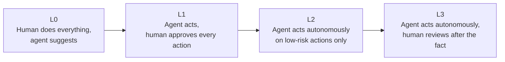

## Enterprise Adoption Patterns

> Chapter of
> [[agentic-ai-engineering/readme#00 — Introduction to Agentic AI|Introduction to Agentic AI]], part
> of [[agentic-ai-engineering/readme|Agentic AI Engineering]].

## What you will understand at the end

- Why enterprises roll out agentic systems in graduated stages rather than granting full autonomy on
  day one
- The four-level autonomy model that structures that rollout, and what has to be true at each level
  before advancing to the next
- The governance structures — audit logging, sign-off, org-level policy — that precede a
  full-autonomy deployment, and why they're a prerequisite rather than paperwork

---

## Autonomy is adopted in stages, not granted at once

[[03-characteristics-of-intelligent-agents|Characteristics of Intelligent Agents]] established
autonomy as a spectrum, not a binary. Enterprise adoption takes that spectrum seriously: an agent
earns more autonomy only after it has demonstrated reliability at the level below it, with evidence,
not assumption.

## The four autonomy levels

| Level | Who acts                                                                   | Human's role                                         | Typical gate to advance                                                                        |
| ----- | -------------------------------------------------------------------------- | ---------------------------------------------------- | ---------------------------------------------------------------------------------------------- |
| L0    | Human, with agent-generated suggestions                                    | Makes every decision; agent is advisory only         | Agent's suggestions match human judgment at an acceptable rate over a sample                   |
| L1    | Agent proposes, human approves each action                                 | Approves or rejects every individual action          | Approval rate stays high and approval latency doesn't become the bottleneck                    |
| L2    | Agent acts autonomously on low-risk actions; high-risk actions still gated | Reviews only the gated, high-risk subset             | Low-risk autonomous actions show an acceptable error rate over a monitored period              |
| L3    | Agent acts autonomously across the board                                   | Reviews a sampled or triggered subset after the fact | Sustained reliability at L2, plus incident response and rollback procedures proven in practice |

This is the same escalation ladder [[08-human-approval-systems|Human Approval Systems]] (Part 02 of
Production Agent Systems) covers at the implementation level — approval UI, timeout handling, audit
trail — and [[08-approval-workflows|Approval Workflows]] (Part 00 of Building & Evaluating Agents)
covers at the architecture level. This chapter is the organizational policy layer that decides when
an agent is allowed to move up that ladder.

## Why the phased approach, not a straight jump to full autonomy

The core argument mirrors [[06-agent-design-principles|Agent Design Principles]]'s guardrail
principle, applied at the rollout-process level rather than the single-decision level: the cost of a
wrong autonomous action, multiplied across every action the agent takes before anyone notices a
problem, is what a phased rollout is designed to bound. Each level exists to generate evidence —
real production data on error rate, failure modes, and edge cases — before the next level removes a
layer of human review. Skipping straight to full autonomy means discovering that evidence in
production, against real customers and real stakes, instead of during a gated review.

## Audit logging as the evidence layer

None of the levels above are verifiable without a record of what the agent actually did, what it
decided not to do, and why. Audit logging is what turns "we believe the agent is reliable" into
"here is the evidence the agent is reliable":

- Every action taken (or proposed, at lower autonomy levels) is logged with enough context to
  reconstruct why the agent chose it — see [[07-ai-logging|AI Logging]] (Part 01 of Production Agent
  Systems).
- Every human approval or rejection is logged alongside the action it applied to, so approval-rate
  trends over time are the actual evidence used to justify advancing an autonomy level.
- Logs feed directly into the [[10-ai-governance|AI Governance]] (Part 02 of Production Agent
  Systems) review process that formally signs off on a level change — the log is the artifact that
  review is based on, not a retrospective justification written after the decision.

## Governance structures that precede full autonomy

Beyond per-decision logging, enterprise adoption typically requires organizational structures that
exist independently of any single agent:

- **A sign-off process** — who is accountable for approving an agent's move to a higher autonomy
  level, and what evidence they require before doing so. See [[10-ai-governance|AI Governance]].
- **A rollback path** — the ability to demote an agent back to a lower autonomy level (or disable it
  entirely) the moment monitored reliability degrades, without that being a novel, untested
  procedure the first time it's actually needed. See [[12-rollback-strategies|Rollback Strategies]].
- **A compliance review** — for any use case touching regulated data or decisions, confirming the
  governance model satisfies the same requirements
  [[07-when-not-to-build-an-agent|When NOT to Build an Agent]]'s auditability criterion raised at
  the architecture-decision stage. See [[09-compliance|Compliance]].

## The pattern, end to end

An enterprise agent's path to production autonomy is therefore not a single launch decision but a
sequence of evidence-gated promotions: start at L0 with a human doing everything and the agent
merely suggesting, log enough to measure whether those suggestions are trustworthy, promote to L1
once they are, gate only the highest-risk actions once L1's low-risk approvals are consistently
rubber-stamped, and reserve full L3 autonomy for the parts of the system that have actually
accumulated the evidence to support it — not the parts where autonomy would simply be convenient.

## Metadata

|        |                        |
| ------ | ---------------------- |
| Author | Amit Singh             |
| Scope  | agentic-ai-engineering |
