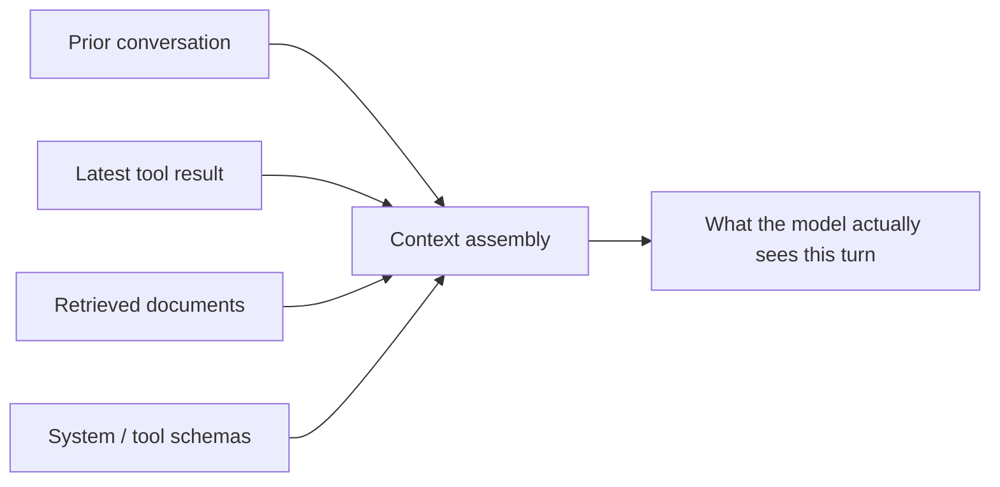

## Perception

> Chapter of [[agentic-ai-engineering/readme#01 — Agent Cognition|Agent Cognition]], part of
> [[agentic-ai-engineering/readme|Agentic AI Engineering]].

## What you will understand at the end

- Why an agent's perception is a discrete, per-turn assembly step, not a continuous sensory stream
- The three input modalities an agent must encode — structured, unstructured, and multimodal — and
  why each demands a different representation
- Where perception fidelity is traded against token cost, and why that trade is the root cause of
  most "the agent didn't notice X" bugs

---

## Perception is context assembly, not sensing

A human perceives continuously — the visual and auditory stream never stops. An agent perceives once
per turn: its runtime assembles a snapshot of everything relevant — prior messages, the latest tool
result, retrieved documents — into the context window, and that snapshot is the entirety of what the
model can reason over for that step. Nothing outside it exists as far as the model is concerned.

This reframing matters because it turns "the agent perceives its environment" into a concrete
engineering question: what gets included in the snapshot, in what form, and what gets left out. Get
that wrong and the model isn't reasoning poorly — it's reasoning correctly over an incomplete or
distorted picture. This is the same context-assembly step [[04-agent-lifecycle|Agent Lifecycle]]
calls out under Stage 1 (initialization) and Stage 2 (the perceive step of the loop) — this chapter
is what "perceive" actually does.

## Three input modalities, three encoding problems

| Modality         | Example                                              | Encoding problem                                                                  |
| ---------------- | ---------------------------------------------------- | --------------------------------------------------------------------------------- |
| **Structured**   | A tool's JSON return value, a database row           | Preserve fields the model needs; drop or summarize the rest before it eats tokens |
| **Unstructured** | A web page, a log excerpt, a support ticket body     | Chunking and summarization decisions that determine what survives into context    |
| **Multimodal**   | A screenshot, a UI element tree, an image attachment | Converting pixels/DOM into a representation the model can act on precisely        |

**Structured input** is the easiest case in principle — it already has a schema — but the failure
mode is over-inclusion: passing a tool's full raw response (nested objects, pagination metadata,
internal IDs) instead of the subset the task actually needs. See
[[01-tool-calling-architecture|Tool Calling Architecture]] for how the tool boundary itself should
shape this.

**Unstructured input** is where perception and memory retrieval overlap:
[[01-retrieval-augmented-generation-rag|Retrieval-Augmented Generation]] and
[[03-chunking-strategies|Chunking Strategies]] are, from this chapter's vantage point,
perception-encoding problems: how much of a source document becomes part of what the agent
perceives, and at what granularity.

**Multimodal input** is the newest and least forgiving case.
[[07-computer-use-agents|Computer-Use Agents]] perceive a screen either as raw pixels (expensive,
imprecise for exact coordinates) or as a structured accessibility/DOM tree (cheaper, more precise,
but only as complete as the tree extraction). The encoding choice here directly bounds what actions
are even possible downstream.

## The fidelity-versus-cost trade

Every encoding choice in the table above is really the same trade in different clothing: more
fidelity (raw JSON, full document text, pixel-perfect screenshots) costs more tokens and latency;
more compression (field extraction, summarization, DOM simplification) risks dropping the one detail
the task actually needed.

| Compression level      | Token cost | Risk                                                                             |
| ---------------------- | ---------- | -------------------------------------------------------------------------------- | ----------------- |
| Raw / uncompressed     | Highest    | Context window fills fast — see [[02-context-windows                             | Context Windows]] |
| Field-level extraction | Low        | Silent loss if a needed field wasn't anticipated                                 |
| Summarized             | Lowest     | Lossy by construction — summarization can drop the exact fact a later step needs |

There is no globally correct point on this curve — it is a per-tool, per-task decision, and it is
exactly what [[01-context-assembly|Context Engineering]] and
[[05-context-optimization|Context Optimization]] (Part 03 of Production Agent Systems) cover in
implementation depth.

## Why perception bugs look like reasoning bugs

When an agent takes a wrong action, the instinctive diagnosis is "bad reasoning" or "bad planning."
In practice, a large share of these failures trace back to perception: the fact the model needed was
truncated out of the tool result, summarized away, or never made it into context because retrieval
missed it. Before debugging the planning or decision-making layer, check what the model actually
perceived that turn — the failure is often already visible there. This is the first thing to inspect
in [[02-agent-tracing|Agent Tracing]]: what context did the model receive, not just what did it
output.

Once perception has assembled a faithful (or deliberately compressed) snapshot,
[[02-decision-making|Decision Making]] is what turns that snapshot into a choice of next action.

## Metadata

|        |                        |
| ------ | ---------------------- |
| Author | Amit Singh             |
| Scope  | agentic-ai-engineering |
