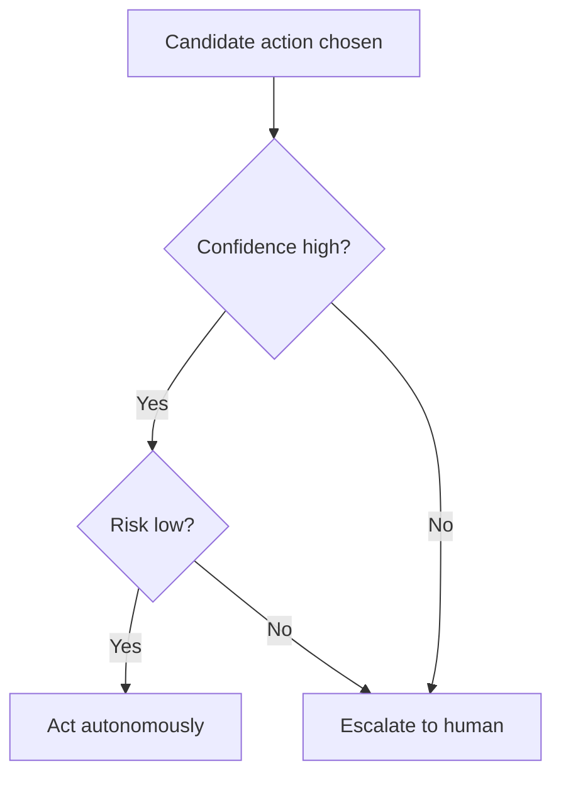

## Decision Making

> Chapter of [[agentic-ai-engineering/readme#01 — Agent Cognition|Agent Cognition]], part of
> [[agentic-ai-engineering/readme|Agentic AI Engineering]].

## What you will understand at the end

- The three mechanisms an agent can use to pick its next action, and why most production agents
  combine more than one
- Why "decision making" and "planning" are different layers even though a single LLM call often
  appears to do both at once
- How confidence and risk thresholds decide whether an agent acts on its own or escalates to a human

---

## Decision making is the layer between perceiving and acting

[[01-perception|Perception]] produces a snapshot of the current state. Decision making is the
narrower step that follows immediately: given that snapshot, which single next action does the agent
take? It is easy to conflate this with planning — both involve "figuring out what to do" — but the
distinction matters: [[03-planning|Planning]] is about the shape of the whole approach (what
sequence of steps solves the goal); decision making is the moment-to-moment choice of the next
concrete action, whether or not a plan already exists.

## Three decision mechanisms

| Mechanism             | How it decides                                                        | Where it fits                                                  |
| --------------------- | --------------------------------------------------------------------- | -------------------------------------------------------------- |
| **LLM-driven choice** | The model reasons over context and emits a choice directly            | Open-ended tasks where the option space isn't enumerable       |
| **Rule-based gating** | A deterministic rule intercepts before or after the model's choice    | Compliance boundaries, hard safety limits, known bad actions   |
| **Utility scoring**   | Candidate actions are scored against an explicit objective and ranked | Multiple valid options where "best," not just "valid," matters |

Most production agents are not purely one of these. A common pattern is LLM-driven choice
constrained by rule-based gates: the model proposes an action, and a deterministic layer checks it
against a policy before execution ever reaches
[[01-tool-calling-architecture|Tool Calling Architecture]]. [[01-guardrails|Guardrails]] covers this
gating layer as a system component; this chapter covers it as a cognitive step — the point at which
a candidate decision either survives or gets rejected before it becomes an action.

Utility scoring shows up explicitly in patterns like
[[10-debate-and-critic-agents|Debate and Critic Agents]] (Part 03), where multiple candidate actions
or answers are generated and then ranked, rather than the first plausible one being taken.

## Confidence and risk: the act-versus-escalate threshold

The mechanism that picks an action is only half the decision. The other half is whether the agent
should take that action autonomously at all. This is governed by two independent axes:

- **Confidence** — how certain is the model that this is the right action, given what it perceived?
- **Risk** — if this action is wrong, how expensive or hard-to-reverse is the mistake?

A high-confidence, low-risk action (reading a file, querying a read-only API) should never stop to
ask a human — that would make the agent slower than the task requires without buying any safety. A
low-confidence or high-risk action (deleting data, sending an email on someone's behalf, an
irreversible financial transaction) should route to
[[07-human-in-the-loop-systems|Human-in-the-Loop Systems]] or an
[[08-approval-workflows|Approval Workflow]] regardless of how confident the model claims to be —
confidence is a self-reported signal from the model, not a guarantee, and should never be the sole
gate on an irreversible action.

| Confidence | Risk | Decision                          |
| ---------- | ---- | --------------------------------- |
| High       | Low  | Act autonomously                  |
| High       | High | Escalate — confidence isn't proof |
| Low        | Low  | Act, but log for review           |
| Low        | High | Escalate, always                  |

This same threshold logic is what [[10-autonomous-execution|Autonomous Execution]] (Chapter 10)
formalizes into autonomy-level gating for the execution layer itself — decision making is where the
threshold is evaluated; execution is where it's enforced.

## Why this layer is easy to get wrong

The most common failure is treating every decision as maximum-confidence by default because the
model's output reads fluently — fluency is not the same signal as calibrated confidence. A model can
be completely wrong about a fact and still phrase the resulting decision with total certainty. Real
confidence signals come from structural sources instead: whether the model's own
[[05-reflection|Reflection]] pass flagged uncertainty, whether retrieval actually found supporting
evidence, or whether a validator independently confirmed the input state. Building the escalation
threshold on top of self-reported model confidence alone is the single most common production
mistake in this layer.

## Metadata

|        |                        |
| ------ | ---------------------- |
| Author | Amit Singh             |
| Scope  | agentic-ai-engineering |
