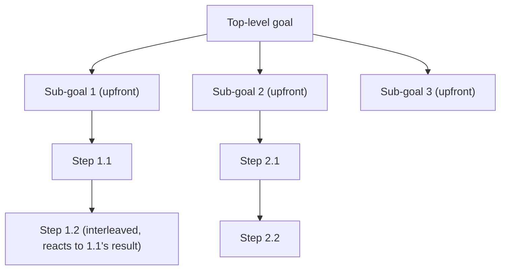

## Planning

> Chapter of [[agentic-ai-engineering/readme#01 — Agent Cognition|Agent Cognition]], part of
> [[agentic-ai-engineering/readme|Agentic AI Engineering]].

## What you will understand at the end

- The difference between planning upfront and planning interleaved with action, and why that choice
  is the single biggest lever on an agent's cost and adaptability
- How task decomposition and hierarchical planning turn one large, ambiguous goal into steps small
  enough to execute and verify individually
- Where this chapter's concepts map onto the concrete algorithms cataloged in Part 03

---

## Planning is deciding the shape of the approach

If [[02-decision-making|Decision Making]] is "what do I do right now," planning is "what sequence of
actions gets me from the current state to the goal." A plan can be as explicit as a numbered list of
steps or as implicit as a policy the model re-derives every iteration — but every agent that does
more than one thing to reach a goal is planning in some form, whether or not it produces a visible
plan artifact.

## Upfront planning versus interleaved planning

This is the central design axis for this chapter, and it recurs throughout the algorithm catalog in
[[agentic-ai-engineering/readme#03 — Planning & Reasoning Algorithms|Planning & Reasoning Algorithms]]:

| Style                     | When the plan is produced                                  | Adapts mid-task?                |
| ------------------------- | ---------------------------------------------------------- | ------------------------------- |
| **Plan-and-execute**      | Fully upfront, before any action is taken                  | Only by replanning from scratch |
| **Interleaved (ReAct)**   | One step at a time, informed by each action's result       | Naturally, every iteration      |
| **Hierarchical planning** | Upfront at the top level, interleaved within each sub-plan | Partially — locally adaptive    |

[[07-plan-and-execute|Plan-and-Execute]] front-loads the reasoning cost: the model spends effort
producing a complete plan before execution starts, which is cheap to execute (no re-planning per
step) but brittle if an early assumption turns out wrong — the whole plan may need to be discarded
rather than adjusted.

[[02-react|ReAct]] does the opposite: it interleaves a reasoning step with every action, so each
step's plan reflects the latest observation. This is more adaptive but costs a full reasoning pass
per step, which compounds token and latency cost across a long task — see
[[01-latency-optimization|Latency Optimization]].

[[11-hierarchical-planning|Hierarchical Planning]] is the practical middle ground most production
agents converge on: decompose the goal into a small number of upfront sub-goals, then plan each
sub-goal's concrete steps interleaved, close to execution time. This bounds the blast radius of "the
upfront plan was wrong" to a single sub-goal instead of the whole task.

## Task decomposition

Decomposition is the mechanical act of turning one large goal into smaller, independently verifiable
steps. Good decomposition has a specific property: each resulting step should be small enough that
its success or failure is unambiguous — "search for X" either returns results or doesn't; "solve the
customer's problem" does not have that property and isn't a usable plan step on its own.
[[04-task-decomposition|Task Decomposition]] (Part 01 of Building & Evaluating Agents) covers the
version of this problem where sub-tasks are distributed across multiple agents rather than executed
sequentially by one — the decomposition principles are the same; the difference is only who executes
each piece.

## Replanning cost is the real budget

The upfront-versus-interleaved choice is ultimately a bet on how likely the plan is to survive
contact with reality. A task with a well-understood, stable environment (a fixed API, deterministic
tools) tolerates upfront planning well — few surprises mean few replans. A task with an
unpredictable environment (search results of unknown quality, a flaky external system, another
agent's output) favors interleaved planning, because the cost of discovering a wrong assumption late
and replanning from scratch usually exceeds the cost of the extra per-step reasoning passes.

| Environment predictability | Favored style       | Why                                                    |
| -------------------------- | ------------------- | ------------------------------------------------------ |
| High                       | Plan-and-execute    | Few surprises; upfront plan rarely needs revision      |
| Low                        | Interleaved (ReAct) | Frequent surprises; cheap-to-adjust plan wins          |
| Mixed / large-scope        | Hierarchical        | Bounds replanning to the sub-goal that actually failed |

Planning produces the sequence; [[04-reasoning|Reasoning]] is the cognitive work that generates each
individual step within that sequence, and [[09-goal-oriented-behavior|Goal-Oriented Behavior]] is
what keeps the overall sequence aligned to the original objective across however many replans it
takes.

## Metadata

|        |                        |
| ------ | ---------------------- |
| Author | Amit Singh             |
| Scope  | agentic-ai-engineering |
