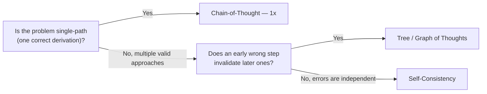

## Reasoning

> Chapter of [[agentic-ai-engineering/readme#01 — Agent Cognition|Agent Cognition]], part of
> [[agentic-ai-engineering/readme|Agentic AI Engineering]].

## What you will understand at the end

- The difference between reasoning that happens inside a single model call and reasoning that spans
  multiple calls or branches
- Why "just make it reason more" is not a free quality lever — every added reasoning strategy has a
  concrete latency and token-cost price
- Which reasoning strategy from Part 03 fits which shape of problem

---

## Reasoning is the computation between perceiving and deciding

Where [[03-planning|Planning]] decides the shape of the overall approach, reasoning is the actual
cognitive work performed to produce each individual step — working through a problem, weighing
alternatives, or deriving an intermediate conclusion before a decision is made or an action is
taken. A single agent loop iteration can involve several reasoning strategies stacked, not just one.

## Single-pass versus multi-path reasoning

| Strategy                           | Shape                           | Cost multiplier vs. one call                                         |
| ---------------------------------- | ------------------------------- | -------------------------------------------------------------------- | -------------------------------------------------- |
| [[01-chain-of-thought              | Chain-of-Thought]]              | One linear reasoning trace, one model call                           | 1x                                                 |
| [[03-self-consistency              | Self-Consistency]]              | Several independent CoT traces, majority-vote the answer             | Nx (N samples)                                     |
| [[04-tree-of-thoughts              | Tree of Thoughts]]              | Branching exploration with backtracking on dead ends                 | Highest — proportional to branching factor × depth |
| [[05-graph-of-thoughts             | Graph of Thoughts]]             | Non-tree dependency graph — branches can merge back together         | Similar to ToT, more flexible topology             |
| [[08-program-aided-language-models | Program-Aided Language Models]] | Reasoning offloaded to generated code, executed rather than inferred | 1x reasoning + execution cost                      |

Chain-of-Thought is the baseline: the model works through a problem step by step in a single
response, no branching, no extra calls. It is effective for well-structured problems (arithmetic,
logic, single-path derivations) precisely because those problems don't benefit from exploring
multiple approaches — there's one correct line of reasoning to walk.

Self-Consistency and Tree of Thoughts both spend extra compute to explore more than one line of
reasoning, but for different reasons: self-consistency assumes the correct answer is the one most
independent attempts converge on (useful when errors are random, not systematic), while Tree of
Thoughts assumes some reasoning paths are dead ends that need to be abandoned partway through
(useful when a wrong early step invalidates everything after it, and that's detectable before the
end).

Program-Aided reasoning takes a different axis entirely: instead of the model reasoning through
arithmetic or logic in natural language (where it can make silent errors), it generates code that
performs the computation exactly, then reasons over the code's output. This trades reasoning
uncertainty for execution correctness wherever the sub-problem is expressible as code.

## The depth-versus-cost trade is not optional to consider

Every strategy above the Chain-of-Thought baseline multiplies cost — in tokens, latency, or both —
and none of them are free quality upgrades. The engineering question is never "should this agent
reason more," it's "does this specific step's error cost justify this specific strategy's compute
cost."

A support-ticket triage agent classifying into five known categories gains little from Tree of
Thoughts — there's no deep branching structure to explore, and the extra latency is pure waste. A
multi-step proof or an open-ended design problem, where an early wrong turn compounds, is exactly
where the extra branching cost earns its keep. See [[04-token-optimization|Token Optimization]] for
how to instrument and bound this cost in production rather than discovering it in a monthly bill.

## Reasoning strategies versus reasoning models

This chapter's strategies are prompting patterns applied on top of any model. They are distinct from
[[09-reasoning-models|Reasoning Models]] — models with extended, built-in inference-time reasoning
trained into them directly. A reasoning model performs something functionally similar to
Chain-of-Thought internally without the caller having to prompt for it explicitly, but the
strategies in this chapter (self-consistency, tree-of-thoughts, program-aided reasoning) remain
applicable on top of a reasoning model too — they are not mutually exclusive, they compose.

Once a step's reasoning produces a conclusion, [[05-reflection|Reflection]] is the next cognitive
step: critiquing that conclusion before it becomes a committed decision or action.

## Metadata

|        |                        |
| ------ | ---------------------- |
| Author | Amit Singh             |
| Scope  | agentic-ai-engineering |
