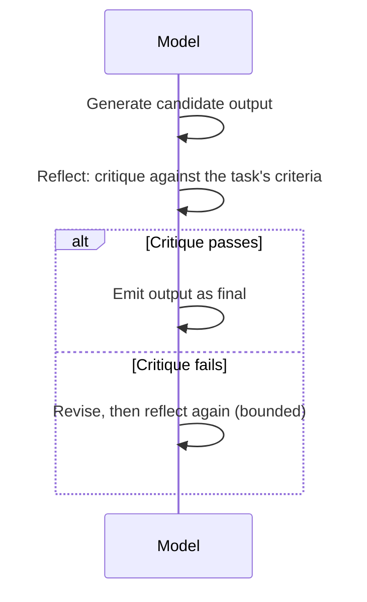

## Reflection

> Chapter of [[agentic-ai-engineering/readme#01 — Agent Cognition|Agent Cognition]], part of
> [[agentic-ai-engineering/readme|Agentic AI Engineering]].

## What you will understand at the end

- What reflection actually is — a critique pass over the agent's own output, distinct from producing
  that output in the first place
- The concrete prompting patterns that implement reflection, from a single self-critique turn to a
  separate critic model
- Why reflection earns its extra round trip on some steps and is pure waste on others

---

## Reflection is evaluation, not generation

[[04-reasoning|Reasoning]] produces a conclusion or a candidate output. Reflection is a distinct
step that follows: the agent (or a separate pass) evaluates that output against the task's
requirements before it is acted on or returned. The key property that makes this useful is asymmetry
— a model is often measurably better at judging whether an answer meets a set of criteria than it is
at producing the correct answer directly on the first attempt, especially for tasks with verifiable
structure (does this code compile, does this plan address every requirement, does this summary miss
any named entity from the source).

## Reflection prompting patterns

| Pattern                  | Mechanism                                                                                                |
| ------------------------ | -------------------------------------------------------------------------------------------------------- |
| **Self-critique prompt** | Same model, asked explicitly to critique its own prior output against stated criteria                    |
| **Separate critic pass** | A second model call (sometimes a different, cheaper model) scores or critiques the first model's output  |
| **Rubric-based scoring** | The critique is structured against an explicit rubric rather than open-ended judgment                    |
| **Reflexion**            | Reflection output is stored as verbal feedback and fed back into the next attempt, rather than discarded |

[[06-reflexion|Reflexion]] (Part 03) is the specific algorithm that formalizes reflection into a
loop: generate, reflect, turn the reflection into an explicit lesson, retry with that lesson in
context. What distinguishes it from a one-off self-critique is that the reflection itself becomes an
artifact carried forward, not just a gate the output has to pass.

A rubric-based critique is generally more reliable than an open-ended "is this good?" prompt, for
the same reason structured decision criteria beat vague judgment calls anywhere else: an open
critique can rubber-stamp a flawed output because nothing forces the model to check any specific
dimension, while a rubric ("does the plan cover requirement A? requirement B? does it violate
constraint C?") forces each dimension to be evaluated explicitly.

## Reflection versus repair

It's worth being precise about scope here: reflection is the **evaluation** — did this output meet
the bar. What happens after a failed reflection — actually fixing the output — is a separate step
covered in [[06-self-correction|Self-Correction]] (Chapter 6). Conflating the two leads to prompts
that ask a model to "reflect and fix it" in one pass, which tends to produce weaker critiques,
because the model is incentivized to converge on a fix rather than genuinely interrogate the
original output's flaws.

## The cost of the extra round trip

Reflection is not free: at minimum it is one more model call, and often a full duplicate of the
context the first call already used. That cost has to be weighed against what it buys:

| Task property                                                         | Reflection value                                                     |
| --------------------------------------------------------------------- | -------------------------------------------------------------------- |
| High cost of a wrong answer (code that ships, an irreversible action) | High — the round trip is cheap relative to the failure cost          |
| Verifiable correctness criteria exist (tests pass, schema matches)    | High — reflection has something concrete to check against            |
| Low-stakes, high-volume, simple task                                  | Low — the extra latency and cost rarely pay for themselves           |
| No clear criteria for what "correct" means                            | Low — an open-ended critique without a rubric adds noise, not signal |

This is the same cost/benefit question [[03-online-evaluation|Online Evaluation]] answers at the
system level — measuring, in production, whether a reflection step measurably reduces downstream
error rate enough to justify its latency and token cost, rather than assuming it does.

## Metadata

|        |                        |
| ------ | ---------------------- |
| Author | Amit Singh             |
| Scope  | agentic-ai-engineering |
