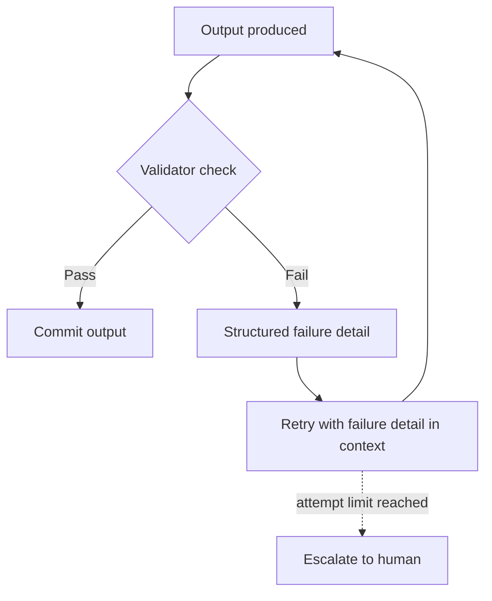

## Self-Correction

> Chapter of [[agentic-ai-engineering/readme#01 — Agent Cognition|Agent Cognition]], part of
> [[agentic-ai-engineering/readme|Agentic AI Engineering]].

## What you will understand at the end

- The difference between detecting a flawed output (reflection) and actually repairing it
  (self-correction)
- The two dominant repair mechanisms — retry-with-feedback and validator-driven correction — and
  when each applies
- Where the boundary sits between "keep trying" and "stop and hand off to a human," and why that
  boundary must be explicit rather than implicit

---

## Self-correction is repair, not detection

[[05-reflection|Reflection]] answers "is this output good enough." Self-correction is the step that
follows a **no**: given a known flaw, produce a repaired output. Treating these as one step tends to
produce weak repairs, because a model asked to "critique and fix simultaneously" has an incentive to
declare the fix successful rather than interrogate whether it actually addressed the flaw.
Separating them — critique first, repair second, ideally re-critique after — produces
better-calibrated loops.

## Two repair mechanisms

| Mechanism                       | How it works                                                                                                                                         | Best suited for                                                |
| ------------------------------- | ---------------------------------------------------------------------------------------------------------------------------------------------------- | -------------------------------------------------------------- |
| **Retry-with-feedback**         | The failure (error message, critique, test output) is fed back into context and the model tries again                                                | Errors the model itself can reason about and fix               |
| **Validator-driven correction** | An external, deterministic check (schema validator, linter, test suite) identifies exactly what's wrong, and that structured signal drives the retry | Errors with a precise, machine-checkable definition of "wrong" |

Retry-with-feedback is the general case: a tool call fails, the error string goes back into the
context, and the model reasons about what to change. Its reliability depends entirely on how
informative the feedback is — "Error: invalid input" gives the model almost nothing to correct
toward, while a validator's structured output ("field `date` must be ISO-8601, got `07/25/2026`")
gives it an exact, actionable correction target. This is why validator-driven correction reliably
outperforms bare retry-with-feedback wherever a deterministic check is available: it replaces vague
diagnosis with a precise repair target.

## Bounded retries, not infinite loops

Every self-correction loop needs an explicit bound, for the same reason
[[04-agent-lifecycle|Agent Lifecycle]]'s termination stage insists on a hard iteration ceiling: an
agent that keeps retrying a failing action without a limit turns a single bad tool call into an
unbounded cost and latency problem. A sound retry policy needs three things, not just a counter:

1. **A max attempt count** — the hard stop regardless of anything else
2. **Backoff or variation between attempts** — retrying the identical action against the identical
   failure produces the identical failure; each retry should incorporate the new feedback, not
   repeat verbatim
3. **A distinguishable terminal state** — "gave up after N attempts" must be a different, detectable
   outcome from "succeeded," not silently swallowed

## The escalation boundary

Not every failure is worth retrying, and this boundary needs to be decided in advance, not
discovered live. A useful split:

| Failure category                                                            | Self-correct?                                                                       |
| --------------------------------------------------------------------------- | ----------------------------------------------------------------------------------- | ----------------------------- |
| Transient (rate limit, timeout, momentary tool unavailability)              | Yes — retry with backoff                                                            |
| Malformed output the model can reason about (schema mismatch, syntax error) | Yes — retry with structured feedback                                                |
| Ambiguous or underspecified task ("the requirements don't cover this case") | No — this is a decision problem, not a repair problem; escalate                     |
| Repeated failure after the attempt limit                                    | No — stop and hand off                                                              |
| Action already partially executed with side effects                         | No — repair here risks compounding the damage; hand off to [[12-rollback-strategies | Rollback Strategies]] instead |

[[11-failure-recovery|Failure Recovery]] and
[[07-human-in-the-loop-systems|Human-in-the-Loop Systems]] cover what happens on the far side of
this boundary — this chapter's scope ends at recognizing when that boundary has been crossed. A
self-correction loop that doesn't know where its own limit is isn't more resilient than one with no
correction at all — it's just slower to fail.

## Metadata

|        |                        |
| ------ | ---------------------- |
| Author | Amit Singh             |
| Scope  | agentic-ai-engineering |
