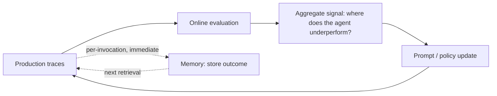

## Learning Loops

> Chapter of [[agentic-ai-engineering/readme#01 — Agent Cognition|Agent Cognition]], part of
> [[agentic-ai-engineering/readme|Agentic AI Engineering]].

## What you will understand at the end

- Why "learning" for a production agent almost never means retraining the underlying model
- The three mechanisms an agent actually improves through between invocations — memory,
  prompt/policy updates, and the online-eval feedback loop
- How these mechanisms differ in how fast they take effect and how long the improvement persists

---

## Learning without retraining

Every other chapter in this Part covers something that happens within a single invocation: perceive,
decide, plan, reason, reflect, correct. Learning loops are the exception — this is what lets an
agent's behavior improve **across** invocations, without anyone retraining the underlying model.
That distinction matters because retraining (fine-tuning, RLHF) is out of scope here and usually out
of scope for a production agent team entirely — it's slow, expensive, and not what "the agent got
better after last week" actually means in most real systems.

## Three mechanisms, three time constants

| Mechanism                     | What updates                                                                               | Time to take effect                           | Persists via                                           |
| ----------------------------- | ------------------------------------------------------------------------------------------ | --------------------------------------------- | ------------------------------------------------------ | ------------------- |
| **Memory-based adaptation**   | Facts, preferences, and past outcomes stored and retrieved                                 | Immediate — next retrieval                    | [[05-long-term-memory                                  | Long-Term Memory]]  |
| **Prompt / policy updates**   | The system prompt, few-shot examples, or routing rules                                     | Requires a deploy                             | Version-controlled prompt/config, not the model itself |
| **Online-eval feedback loop** | Aggregate signal from production traces informs the next round of prompt or policy changes | Slowest — needs enough data to be trustworthy | [[03-online-evaluation                                 | Online Evaluation]] |

**Memory-based adaptation** is the fastest and most immediate form of learning available to an
agent: store an outcome, a correction, or a user preference once, and every future invocation that
retrieves it behaves as if it "learned" that fact — without any change to the model or its prompt.
[[09-vector-databases|Vector Databases]] make this retrieval semantic rather than exact-match, so a
relevant past outcome surfaces even when the current situation is phrased differently. This is
genuinely powerful but scoped: it improves recall of specific facts and precedents, not the agent's
underlying judgment or strategy.

**Prompt and policy updates** are a slower, deliberate mechanism: someone (or an automated process)
looks at where the agent underperforms and changes the system prompt, adds a few-shot example, or
adjusts a routing rule. This is "learning" in the sense that the system's behavior improves, but the
update is external and versioned — it looks and behaves like a code change, not an in-context
adaptation, and should be tested and rolled out the same way.

**The online-eval feedback loop** is what closes the cycle between the two: production traces
(successes, failures, human corrections) are collected and evaluated, and that aggregate signal is
what tells a team which prompt or policy change is actually worth making, rather than guessing. This
is the slowest mechanism precisely because it needs enough real traffic to produce a trustworthy
signal — a handful of anecdotes isn't enough to justify a prompt change with confidence.

## Why this is not the same as model fine-tuning

It's worth being explicit that none of these three mechanisms touch model weights.
[[04-offline-evaluation|Offline Evaluation]] is closer to where an actual fine-tuning decision would
be evaluated, if a team decided that was warranted — but that's a different, much heavier
intervention than anything in this chapter, and most teams get most of their improvement from memory
and prompt/policy iteration long before fine-tuning becomes the right lever to pull. Reaching for
retraining before exhausting these three is usually a sign the feedback loop itself hasn't been
built yet, not that in-context learning has hit its ceiling.

## Metadata

|        |                        |
| ------ | ---------------------- |
| Author | Amit Singh             |
| Scope  | agentic-ai-engineering |
