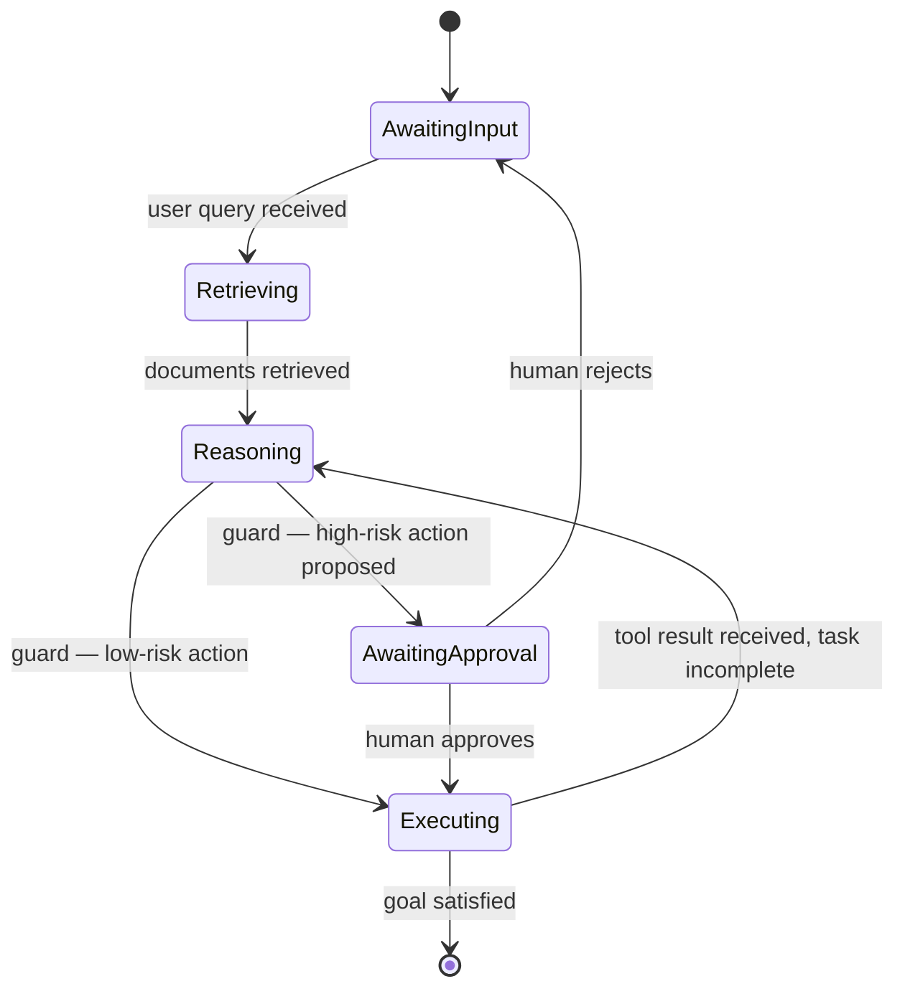

## Agent State Machines

> Chapter of [[agentic-ai-engineering/readme#01 — Agent Cognition|Agent Cognition]], part of
> [[agentic-ai-engineering/readme|Agentic AI Engineering]].

## What you will understand at the end

- The difference between an agent whose control flow lives implicitly in a prompt versus one whose
  control flow is an explicit state machine
- The three things a state machine formalizes — states, transitions, and guards — and what each buys
  you operationally
- Why this pattern is what makes an agent resumable and debuggable, not just a cleaner diagram

---

## Implicit loop versus explicit state machine

Every chapter so far in this Part describes cognitive steps — perceive, decide, plan, reason,
reflect, correct. Those steps have to run in some control flow, and there are two fundamentally
different ways to implement that control flow:

- **Implicit**: the system prompt tells the model what to do next in natural language ("after
  searching, summarize the results, then ask if the user wants more detail"), and the model's own
  judgment drives which branch executes. The control flow lives inside the prompt, invisibly.
- **Explicit**: the agent's possible states, the transitions between them, and the conditions that
  guard each transition are defined as code or configuration, outside the model. The model still
  decides content within a state; it does not decide what state comes next on its own.

## What a state machine formalizes

| Concept         | What it captures                                                                                                                    |
| --------------- | ----------------------------------------------------------------------------------------------------------------------------------- |
| **States**      | The distinct modes the agent can be in — awaiting input, retrieving, reasoning, awaiting approval, executing                        |
| **Transitions** | Which state legally follows which — the model can't jump from "awaiting approval" straight to "executing" even if it wants to       |
| **Guards**      | Conditions that must hold for a transition to fire — e.g. only transition to `Executing` if the proposed action passed a risk check |

This is the same act-versus-escalate logic from [[02-decision-making|Decision Making]], but here
it's enforced structurally rather than left to the model to honor voluntarily. A guard on the
`AwaitingApproval → Executing` transition means a high-risk action literally cannot execute without
that transition firing — the model proposing the action isn't sufficient, regardless of how the
prompt is worded.

## Why this pattern earns its structure

An implicit, prompt-driven loop is faster to build and fine for simple, low-stakes agents. It starts
costing you as soon as any of the following becomes true:

- **Debuggability** — when something goes wrong, "what state was the agent in when it did that" is
  answerable by inspecting explicit state, instead of re-reading a transcript and inferring intent
  from prose.
- **Testability** — individual transitions and guards can be unit tested in isolation ("given state
  X and this input, does the guard correctly block Y") without invoking the full model end to end.
- **Resumability** — if execution is interrupted (a process restart, a timeout), an explicit state
  can be persisted and resumed from exactly where it left off. An implicit loop has no serializable
  notion of "where it was" beyond the raw message history.

[[03-state-persistence|State Persistence]] (Part 00 of Production Agent Systems) covers the
mechanics of durably storing this state between invocations; [[02-agent-tracing|Agent Tracing]]
covers observing state transitions in production once they're explicit enough to be observed at all.

## Where this shows up in frameworks

[[03-langgraph|LangGraph]]'s `StateGraph` is the most direct framework-level implementation of this
pattern — nodes are states, edges are transitions, and conditional edges are guards. Recognizing
this chapter's concepts in that API (or any other graph/workflow-based agent framework) is largely a
matter of vocabulary translation, not new concepts.

## Metadata

|        |                        |
| ------ | ---------------------- |
| Author | Amit Singh             |
| Scope  | agentic-ai-engineering |
