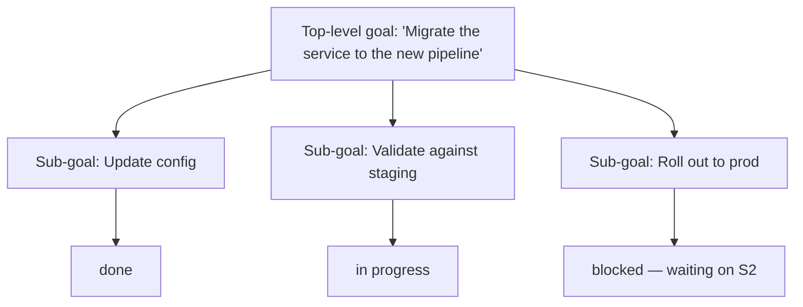

## Goal-Oriented Behavior

> Chapter of [[agentic-ai-engineering/readme#01 — Agent Cognition|Agent Cognition]], part of
> [[agentic-ai-engineering/readme|Agentic AI Engineering]].

## What you will understand at the end

- Why a goal needs to be an explicit, persistent artifact rather than something implicitly
  re-derived from conversation history each turn
- How sub-goals are tracked and reconciled against the top-level goal across a long, multi-step
  execution
- The specific failure mode — goal drift — that this layer exists to prevent

---

## A goal is a persistent artifact, not a memory

[[03-planning|Planning]] decomposes a goal into steps. This chapter is about the goal itself: how
it's represented, and how it stays intact as the reference point across however many steps, replans,
and sub-goals the execution ends up requiring. The naive approach — letting the goal live only
implicitly in the first user message, re-inferred from context each turn — degrades over a
long-running task, because [[02-context-windows|Context Windows]] fill up, get summarized, or have
their earlier turns dropped, and the original goal is exactly the kind of thing that quietly falls
out of that window if it isn't held onto explicitly.

The more robust pattern treats the goal as a first-class, persistent piece of state — held apart
from the rolling conversation history, referenced explicitly at each decision point rather than
re-derived from it.

## Goal decomposition and progress tracking

A single top-level goal typically decomposes into a small tree of sub-goals, each of which can be
independently in progress, complete, blocked, or abandoned:

Tracking this explicitly (rather than inferring "what's left" from conversation history each time)
is what makes it possible for the agent to answer, at any point, exactly what remains — and it's
what makes an interrupted execution resumable, the same way explicit state does for
[[08-agent-state-machines|Agent State Machines]] (Chapter 8). The two concepts are closely related:
a state machine models _how_ execution moves between steps; goal tracking models _what_ those steps
are collectively working toward, and how much of it is done.

## Sub-goal conflicts

Sub-goals aren't always independent — sometimes achieving one makes another harder or impossible,
and the agent needs an explicit way to notice and resolve that rather than blindly completing
sub-goals in whatever order they were generated.

| Conflict type              | Example                                                                | Resolution approach                                                                                        |
| -------------------------- | ---------------------------------------------------------------------- | ---------------------------------------------------------------------------------------------------------- |
| **Resource contention**    | Two sub-goals both need exclusive write access to the same record      | Serialize — order matters, pick explicitly, don't parallelize                                              |
| **Mutual exclusivity**     | "Minimize cost" and "maximize redundancy" sub-goals trade off directly | Surface the trade-off; escalate to the user or a stated priority ordering rather than silently picking one |
| **Precondition violation** | Sub-goal C assumed sub-goal A's output, but A failed or changed        | Replan C, or block it explicitly rather than proceeding on stale assumptions                               |

This is a decision-making problem layered on top of the tracking structure — see
[[02-decision-making|Decision Making]] for how conflicting candidate actions get resolved in
general; here the candidates are entire sub-goals rather than single steps.

## Goal drift

The specific failure this chapter's discipline exists to prevent is goal drift: across enough steps,
replans, and sub-goal completions, the agent's actions gradually stop serving the original objective
— not through any single wrong decision, but through the slow accumulation of locally-reasonable
steps that no longer add up to the thing the user actually asked for. This is most likely exactly
when there's no persistent, explicit goal artifact to check each new action against — every check is
implicitly "does this seem reasonable given recent context," which is a weaker question than "does
this still serve the original goal."

Guarding against drift means every non-trivial decision point re-checks the candidate action against
the explicit top-level goal, not just against the immediately preceding step — and
[[04-task-decomposition|Task Decomposition]]'s sub-goal boundaries are exactly where this check is
cheapest to insert, since a sub-goal's own "done" condition is a natural place to also re-verify it
still serves the parent goal.

Once a goal, its sub-goals, and their current state are tracked,
[[10-autonomous-execution|Autonomous Execution]] (Chapter 10) is what actually carries each
individual step through to completion.

## Metadata

|        |                        |
| ------ | ---------------------- |
| Author | Amit Singh             |
| Scope  | agentic-ai-engineering |
