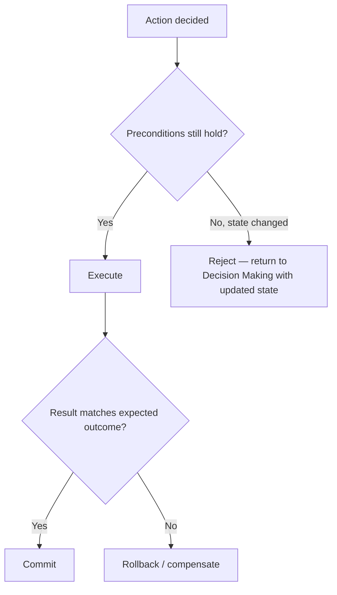

## Autonomous Execution

> Chapter of [[agentic-ai-engineering/readme#01 — Agent Cognition|Agent Cognition]], part of
> [[agentic-ai-engineering/readme|Agentic AI Engineering]].

## What you will understand at the end

- Why execution is a distinct cognitive step from deciding — and the specific things that can go
  wrong only at execution time
- The three-part discipline that makes autonomous execution safe: pre-execution validation, and
  rollback/compensation if it fails anyway
- How autonomy-level gating turns the confidence/risk threshold from Chapter 2 into an enforced
  policy rather than a per-decision judgment call

---

## Execution is where a decision meets the real world

[[02-decision-making|Decision Making]] chooses an action. Execution is what actually carries it out
— and it's a distinct step worth its own chapter because a whole class of failures only exists here:
the decision was correct given what the agent perceived, but the world had changed by the time the
action ran, or the action's real-world side effect didn't match what the model expected it to do.
Good reasoning does not guarantee good execution; this layer is where that gap gets closed or
exposed.

## Pre-execution validation

Before a decided action actually runs, it should be checked against the current state one more time
— not re-decided, just validated that its preconditions still hold:

This matters most for actions with a gap between decision and execution — a queued action, a
multi-step tool call, anything where other things could happen in between. A decision to "cancel
order #4521" made against a snapshot that's since changed (the order already shipped) needs to be
caught by validation, not discovered as a downstream inconsistency later.

## Rollback and compensation when execution fails partway

Some actions are atomic — they either fully happen or don't. Many real actions are not: a multi-step
workflow can fail after step 2 of 4, leaving the system in a partial state that is worse than either
"fully done" or "not started." Two related but distinct recovery patterns apply:

| Pattern          | What it does                                                                                      | Requires                                               |
| ---------------- | ------------------------------------------------------------------------------------------------- | ------------------------------------------------------ |
| **Rollback**     | Undo the completed steps, returning to the pre-execution state                                    | Each step must have a defined inverse operation        |
| **Compensation** | Cannot literally undo (e.g. an email already sent), so a corrective follow-up action runs instead | A defined corrective action for each non-undoable step |

[[12-rollback-strategies|Rollback Strategies]] covers the system-level mechanics of this in depth.
The cognitive-layer point that belongs in this chapter is narrower: an agent designed for autonomous
execution must know, for every action it can take, whether that action is rollback-able,
compensable, or neither — and an action in the last category should never execute autonomously
without a human already having approved it, because there is no path back from a mistake.

## Autonomy-level gating

[[02-decision-making|Decision Making]] introduced the confidence/risk threshold as a per-decision
judgment. Autonomy-level gating turns that into an enforced system policy rather than something the
model applies on its own each time — the same idea self-driving vehicle autonomy levels formalize: a
fixed classification of how much unsupervised action is permitted, set in advance, not inferred in
the moment.

| Level | Description                                                    | Example                                              |
| ----- | -------------------------------------------------------------- | ---------------------------------------------------- |
| L0    | No autonomous execution — every action needs explicit approval | New agent in early rollout, high-risk domain         |
| L1    | Autonomous for read-only / reversible actions only             | Search, query, draft (not send)                      |
| L2    | Autonomous for pre-approved action classes within bounds       | Send from an approved template, within a spend cap   |
| L3    | Autonomous by default; escalates only on explicit risk signals | Most mature production agents                        |
| L4    | Fully autonomous, no human gate                                | Rare — reserved for low-risk, well-validated domains |

The point of fixing this as policy rather than per-decision judgment is that it removes the model's
own confidence from being the sole determinant of whether a high-risk action runs unsupervised — the
gate is enforced by the runtime regardless of how the model frames its own certainty. This is the
same enforcement principle [[08-approval-workflows|Approval Workflows]] and
[[08-human-approval-systems|Human Approval Systems]] implement at the system level; here it's the
cognitive-layer discipline of knowing, before execution, which level the current action falls under.

This closes the loop for this Part: perception assembles the state, decision making and planning
choose and sequence actions, reasoning and reflection refine them, self-correction repairs what's
fixable, goal-oriented behavior keeps the whole sequence honest against the original objective, and
autonomous execution is where all of that finally becomes a real, validated, recoverable side effect
in the world.

## Metadata

|        |                        |
| ------ | ---------------------- |
| Author | Amit Singh             |
| Scope  | agentic-ai-engineering |
