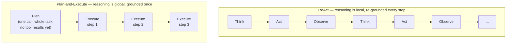

## Plan-and-Execute

> Chapter of
> [[agentic-ai-engineering/readme#03 — Planning & Reasoning Algorithms|Planning & Reasoning Algorithms]],
> part of [[agentic-ai-engineering/readme|Agentic AI Engineering]].

This chapter stays at the reasoning-strategy altitude: what the model is doing differently, turn by
turn, compared to ReAct. For component boundaries and when to reach for this as a production
architecture, see
[[ai-architecture-and-system-design/00-ai-architecture-patterns/02-planner-executor-pattern/02-planner-executor-pattern|the Planner–Executor Pattern (Part 00 of AI Architecture & System Design)]].
For how it fits into a single agent's execution loop alongside Memory and Tools, see
[[building-agentic-systems/00-building-single-agent-systems/01-agent-architecture/01-agent-architecture|Agent Architecture]].

---

## The distinction that matters: when does reasoning happen relative to grounding

ReAct interleaves reasoning and action one step at a time: think, act, observe, think again — each
reasoning step is conditioned on the real result of the previous action. Plan-and-Execute splits
that into two phases: one reasoning pass produces an ordered plan for the _entire_ task before a
single tool has been called, then each step executes against that fixed plan.



That single difference — reasoning about the whole task before any observation exists, versus
reasoning one observation at a time — is the actual algorithmic contrast. Everything else (fewer
planning-phase LLM calls, easier checkpointing, brittleness under surprise) follows from it.

---

## Where the reasoning actually happens

**Plan generation is one reasoning-heavy call**, structurally close to
[[agentic-ai-engineering/03-planning-and-reasoning-algorithms/01-chain-of-thought/01-chain-of-thought|Chain-of-Thought]]:
the model reasons entirely in its own head, with no tool results to ground against, and emits an
ordered list of steps. **Step execution is a narrower decision per step** — once the plan is fixed,
"run step 3" is a much smaller problem than "figure out what to do next," which is why early
Plan-and-Execute implementations paired a capable model for planning with a cheaper model for
execution. I'm confident in the mechanism; I won't cite a specific benchmark for the cost delta it
buys — measure it on your own workload rather than assume the tiering pays off by default.

---

## The failure mode this ordering buys you: the stale plan

Because the plan is committed before any tool has run, step 3 encodes an assumption about what step
2 will return. If step 2's actual result differs from what the planner implicitly assumed, step 3 as
written may no longer make sense — and nothing in the pure loop notices, because the executor's job
is to run the plan, not to re-evaluate it.

```txt
Plan (generated before any tool call):
  1. Look up the customer's current subscription tier
  2. If tier is "enterprise", pull their dedicated account manager's contact
  3. Draft an email to the account manager about the renewal

Execute step 1: lookup_tier(customer) → "trial", not "enterprise"
Execute step 2: pull_account_manager(customer) → no account manager exists for trial tier
Execute step 3: draft_email(???) → drafting a mail to a contact that was never found
```

ReAct would have caught this at step 2's observation and reasoned about what to do next. A pure
Plan-and-Execute loop just keeps running the plan it already committed to.

---

## Replanning is the escape hatch — and it blurs the two strategies

The practical fix is to feed each step's result back to the planner and ask "does the rest of the
plan still hold?" whenever a result diverges from what the plan assumed. This is the same **replan**
exit covered at the run-recovery altitude in
[[production-agent-systems/02-reliability-security-and-governance/11-failure-recovery/11-failure-recovery|Failure Recovery]]
§3: a surprising result goes back to the planner as new context, which emits a revised plan instead
of the executor blindly continuing.

Worth naming directly: Plan-and-Execute with aggressive per-step replanning converges, in the limit,
toward ReAct's re-grounding property — through an explicit plan-revision call instead of folding
reasoning and action into the same turn. The strategies aren't opposites; replanning frequency is a
dial between them.

---

## Plan-and-Execute vs. ReAct, as reasoning strategies

| Dimension                            | Plan-and-Execute                                            | ReAct                                                               |
| ------------------------------------ | ----------------------------------------------------------- | ------------------------------------------------------------------- |
| When the full plan is reasoned about | Once, upfront, before any grounding                         | Never as a whole — one step reasoned at a time                      |
| Reasoning calls for N steps          | 1 (plan) + N (execute, often cheap)                         | N (reason+act interleaved every step)                               |
| Re-grounds on surprising results     | Only if replanning is explicitly added back in              | Every step, by construction                                         |
| Easiest to checkpoint                | Yes — the plan is a durable artifact from step 0            | Harder — "the plan" only exists implicitly in message history       |
| Best fit                             | Long tasks whose steps are mostly independent of each other | Tasks where each step's next move depends on what was just observed |

---

## Concept check

| Question                                                                             | Answer hint                                                                                                                  |
| ------------------------------------------------------------------------------------ | ---------------------------------------------------------------------------------------------------------------------------- |
| What is the one structural difference between Plan-and-Execute and ReAct?            | Whether reasoning about the whole task happens once upfront (ungrounded) or once per step (grounded on the last observation) |
| Why can step 3 of a fixed plan fail even though step 3 itself is executed correctly? | It encoded an assumption about step 2's result that turned out false, and the pure loop never re-checks it                   |
| What turns Plan-and-Execute back into something closer to ReAct?                     | Replanning after steps whose results diverge from the plan — a frequency dial, not a binary choice                           |

---

## Vocabulary glossary

| Term            | Definition                                                                                                        |
| --------------- | ----------------------------------------------------------------------------------------------------------------- |
| Plan generation | The single upfront reasoning pass that decomposes a task into an ordered list of steps, before any tool has run   |
| Stale plan      | A plan step whose implicit assumption about an earlier step's result no longer holds after execution              |
| Replanning      | Feeding a step's actual result back to the planner to revise the remaining plan, rather than executing it blindly |
