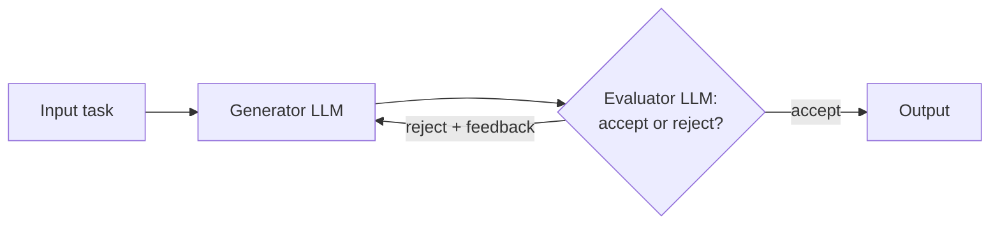
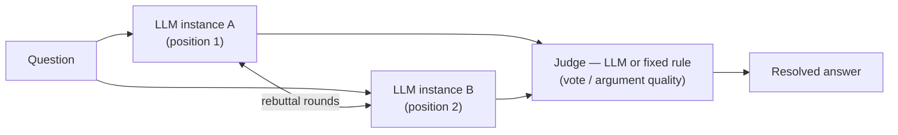

## Debate & Critic Agents

> Chapter of
> [[agentic-ai-engineering/readme#03 — Planning & Reasoning Algorithms|Planning & Reasoning Algorithms]],
> part of [[agentic-ai-engineering/readme|Agentic AI Engineering]].

## What you will understand at the end

- The critic-agent pattern precisely: a **generator** LLM produces a candidate, an **evaluator** LLM
  accepts or rejects it with feedback, and rejection loops back to the generator — a bounded
  feedback loop, not an open-ended agent
- Why this pattern is almost always called **"LLM-as-judge"** in papers, docs, and production
  systems, and why that's the name to default to in conversation even though "evaluator-optimizer"
  is the more descriptive term for the mechanism
- Debate as the related-but-distinct pattern this chapter also covers: independent LLM instances
  arguing or voting toward a more reliable answer than any single one would produce alone
- What separates a critic-agent loop from [[06-reflexion|Reflexion]] (the neighboring chapter):
  whether the critique comes from a second, independent role or from the same agent reflecting on
  its own attempt
- When the extra generate/evaluate round-trips this pattern costs are worth paying for, and the
  concrete failure mode of a miscalibrated evaluator in either direction

---

## Part 1 — Critic Agents (Evaluator-Optimizer / LLM-as-Judge)

### The mental model

A **generator** LLM produces a candidate solution. An **evaluator** LLM reviews that candidate
against some criteria and either **rejects** it — sending it back to the generator, usually with
feedback on what to fix — or **accepts** it, letting it proceed to the output. This is a feedback
loop, but a bounded one: it lives inside a predefined workflow shape (generate → evaluate → repeat
or exit), not an open-ended agent loop that could in principle run forever without a defined exit
condition.

Conceptually this mirrors a human writer-and-editor relationship: the generator drafts, the
evaluator gives editorial feedback, and the draft goes through another pass until the editor signs
off. In practice, this exact mechanism is almost always called **LLM-as-judge** rather than
"evaluator-optimizer" — know both names, but default to "LLM-as-judge" in conversation and design
docs, since that's the term you'll encounter far more often.

### When to use it

- Evaluation criteria for "is this good enough" can be clearly articulated — the evaluator needs
  something concrete to check against, not a vague sense of quality
- Iterative refinement measurably improves the output, the way human redrafting does — a second (or
  third) pass genuinely produces something better than the first attempt
- The cost of extra generate/evaluate round-trips is worth paying for the quality gain

### Examples

- **Literary translation** — nuances of tone, idiom, and meaning are hard for a single generation
  pass to capture; an evaluator LLM can flag exactly where a translation misses the original's
  intent, and the generator revises against that specific feedback.
- **Complex search tasks requiring multiple rounds** — an evaluator checks whether search results
  gathered so far actually answer the question, and if not, sends it back for another round of
  searching with more targeted queries.
- **LLM-as-judge evals in production monitoring** — the identical mechanism applied to evaluation
  instead of iterative refinement: a second LLM scores a generated output for quality before it
  ships, rather than sending it back for another attempt. See
  [[production-agent-systems/01-observability/01-ai-observability-fundamentals/01-ai-observability-fundamentals|AI Observability Fundamentals]]
  for where this fits into a broader monitoring strategy, and why a business/commercial eval is
  still the more important of the two when one is available.

### Benefits

- Catches quality issues a single generation pass would miss, without needing a human in the loop
  for every iteration
- Feedback from the evaluator is specific and actionable, not just accept/reject, so each generator
  pass has a real chance of converging rather than repeating the same mistake
- Bounded and testable — the loop has a defined entry/exit shape even though the number of
  iterations can vary per run

### Tradeoffs and pitfalls

- Every rejection costs another full generate + evaluate round-trip — latency and cost scale with
  how many passes it takes to converge
- Needs a cap on iterations; without one, a generator that can't satisfy the evaluator's criteria
  loops indefinitely
- **The evaluator is the bottleneck for correctness, and it fails in both directions.** A lenient
  evaluator lets bad outputs through, silently defeating the entire point of the loop. An overly
  strict evaluator rejects genuinely good outputs and burns extra rounds for no gain — and because
  the evaluator's own judgment is itself an LLM call, its calibration needs the same scrutiny you'd
  give any other model output before trusting it as a quality gate. This mirrors the exact caution
  [[ai-foundations/01-language-models-in-practice/08-hallucination-management/08-hallucination-management|Hallucination Management]]
  gives self-reported confidence: an LLM's stated judgment correlates only loosely with ground truth
  unless it's been calibrated against a held-out labeled set.
- Only pays off when the criteria are checkable; if "good enough" can't be articulated concretely,
  the evaluator has nothing reliable to evaluate against

### Distinguishing this from Reflexion

[[06-reflexion|Reflexion]], the neighboring chapter, looks similar at a glance — both involve an
agent receiving critical feedback and trying again. The distinction is _who_ produces the critique:

| Axis                     | Critic Agents (this chapter)                                   | Reflexion                                                                                                            |
| ------------------------ | -------------------------------------------------------------- | -------------------------------------------------------------------------------------------------------------------- |
| Who critiques            | A second, independent evaluator LLM/role                       | The same agent, reflecting on its own prior attempt                                                                  |
| Independence of judgment | The evaluator has no stake in defending the generator's output | The agent is critiquing work it produced itself — a real risk of the same blind spots recurring in the self-critique |
| Typical use              | Quality gating before output ships; LLM-as-judge evals         | An agent improving across attempts at the same task, in-context or across episodes                                   |

Neither is strictly better — an independent evaluator catches blind spots a self-critiquing agent
can't see in its own output, but costs an extra model call per round; self-reflection is cheaper but
inherits whatever the agent was already prone to miss.

---

## Part 2 — Debate

Where a critic agent pairs one generator with one evaluator in an asymmetric loop, **debate** puts
multiple LLM instances in symmetric opposition or independent competition on the _same_ question,
and resolves the disagreement — by argument, by vote, or by a judge — rather than by one role
reviewing another's draft.

Two shapes of debate show up in practice, and they overlap with mechanisms this book already covers
elsewhere rather than introducing something wholly new:

- **Adversarial debate** — two or more LLM instances are assigned opposing positions on a question
  and exchange rebuttals for a fixed number of rounds; a judge (another LLM call, or a fixed rule)
  scores which side argued more convincingly. The value isn't that either debater is more
  trustworthy alone — it's that a position has to survive direct rebuttal before it's accepted,
  which surfaces weak reasoning a single generation pass wouldn't be forced to defend.
- **Independent voting** — multiple LLM instances (or the same model resampled at nonzero
  temperature) each answer the same question independently, without seeing each other's output, and
  the result is resolved by majority vote. This is the identical mechanism
  [[production-agent-systems/03-performance-and-cost-engineering/02-parallel-execution/02-parallel-execution|Parallel Execution]]'s
  **voting** variant already covers, and also what [[03-self-consistency|Self-Consistency]] does
  specifically for multi-step reasoning traces — debate in this voting form is the same idea applied
  to whole-answer resolution rather than to eliminating variance in one call's chain of reasoning.

**When debate earns its cost over a single well-prompted call:** the question is genuinely
contestable (reasonable positions can disagree, not just "the model might get the facts wrong"), and
the cost of running N calls plus a judge is justified by how much the decision matters — content
moderation appeals, evaluating a chain of reasoning for a high-stakes decision, or red-teaming an
agent's own proposed action before it executes. For questions with a single checkable correct
answer, the generator/evaluator asymmetry in Part 1 or plain voting is usually cheaper and just as
effective; debate's rebuttal rounds add cost that only pays off when the disagreement itself — not
just resampling for variance — is doing useful work.

---

## Concept check

| Question                                                                            | Answer hint                                                                                                                                                                                                             |
| ----------------------------------------------------------------------------------- | ----------------------------------------------------------------------------------------------------------------------------------------------------------------------------------------------------------------------- |
| What is "LLM-as-judge," and how does it relate to the term "evaluator-optimizer"?   | The same mechanism — a generator/evaluator feedback loop — under its more common production name; "evaluator-optimizer" is the more descriptive but less-used term                                                      |
| What distinguishes a critic-agent loop from Reflexion?                              | Who produces the critique: a second, independent evaluator (critic agents) vs. the same agent reflecting on its own prior attempt (Reflexion)                                                                           |
| Why can't an evaluator's own judgment be trusted uncritically as a quality gate?    | It's itself an LLM output — a lenient evaluator lets bad outputs through, an overly strict one burns rounds rejecting good ones, and its calibration needs verification against ground truth like any other model claim |
| How does debate's "independent voting" shape relate to Parallel Execution?          | It's the identical mechanism as Parallel Execution's voting variant — multiple independent attempts at the same task, resolved by majority vote                                                                         |
| When does debate's adversarial rebuttal form earn its extra cost over plain voting? | When the question is genuinely contestable and the disagreement itself (not just resampling variance) surfaces weak reasoning — high-stakes or appealable decisions, not questions with one checkable correct answer    |

---

## Vocabulary glossary

| Term               | Definition                                                                                                           |
| ------------------ | -------------------------------------------------------------------------------------------------------------------- |
| Generator          | The LLM role that produces a candidate solution in a critic-agent loop                                               |
| Evaluator          | The LLM role that accepts or rejects a generator's candidate, with feedback, in a critic-agent loop                  |
| LLM-as-judge       | The common production name for the evaluator-optimizer mechanism — one LLM scoring another's output                  |
| Adversarial debate | Two or more LLM instances assigned opposing positions, exchanging rebuttals before a judge resolves the disagreement |
| Independent voting | Multiple LLM instances answering the same question independently, resolved by majority vote                          |

## Metadata

|        |                        |
| ------ | ---------------------- |
| Author | Amit Singh             |
| Scope  | agentic-ai-engineering |
