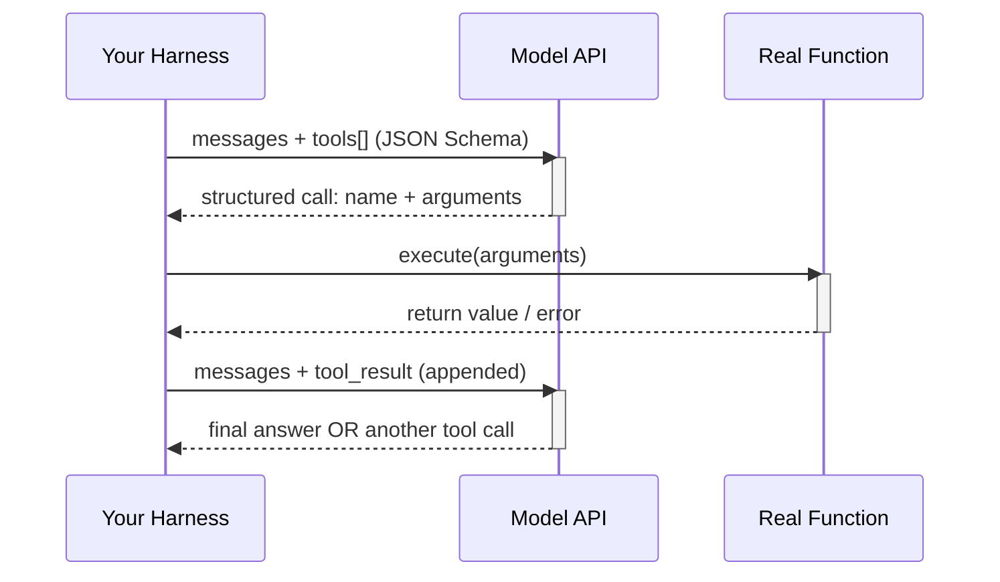
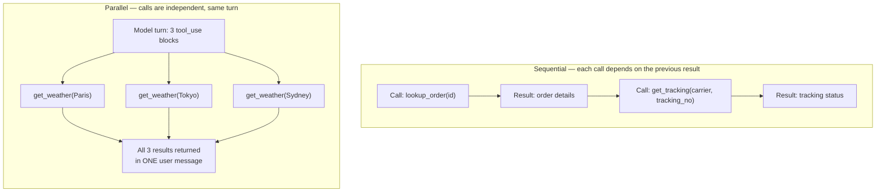

## Tool Calling Architecture

> Chapter of
> [[agentic-ai-engineering/readme#04 — Tools & Environment Interaction|Tools & Environment Interaction]],
> part of [[agentic-ai-engineering/readme|Agentic AI Engineering]].

## What you will understand at the end

- Why "tool calling" is a text-generation trick wearing a function-call costume, and what that
  implies for reliability
- How to read and write a tool's JSON Schema so the model calls it correctly on the first try
- The wire-level differences between OpenAI, Anthropic, and Google tool-calling formats — and why
  those differences leak into your harness code
- When to let the model fire tool calls in parallel versus force them sequential, and the
  correctness traps each choice creates
- Exactly how a tool's result gets back into the model's context, and why the re-injection step is
  where most agent bugs actually live
- The four failure modes that account for nearly all tool-calling incidents in production, and the
  concrete mitigation for each
- How this maps onto GitHub Copilot's agent mode and custom-agent tool invocation — the GH-600
  ("Developing in Agentic AI Systems") angle on the same mechanics

---

## The mental model

Tool calling is not the model executing code. The model has no hands. What actually happens is: you
hand the model a menu of function signatures, the model — during ordinary next-token generation —
produces text that happens to be a structured, schema-conformant description of a function call,
your harness parses that text and executes the real function, and you feed the return value back in
as more context for the next generation step.

Every "agent" you will ever build is a loop wrapped around this single request/response contract:



Three things fall out of this model immediately, and they explain most of what is unintuitive about
tool calling in practice:

1. **The model never sees the function body.** It sees the name, the description, and the parameter
   schema — nothing else. If the description is ambiguous, the model's only recourse is to guess
   from the name and the schema shape, the same way a developer would guess from a stub with no
   docstring.
2. **Arguments are generated the same way as any other output token** — autoregressively, with the
   same hallucination risk as prose. A model that can invent a plausible-sounding citation can
   invent a plausible-sounding argument value.
3. **The loop terminates only when the model chooses to stop calling tools** (or your harness forces
   it to via a max-iteration cap, a `tool_choice: "none"` override, or a budget). There is no
   framework-level guarantee of termination — that guarantee is something _you_ build.

---

## 1 — The tool definition is a JSON Schema contract, not documentation

Every provider's tool-calling API takes the same three-part shape, because it is really just
[[ai-foundations/01-language-models-in-practice/03-structured-outputs|structured output]]
constrained to a function-call envelope:

```json
{
  "name": "get_shipping_quote",
  "description": "Get a shipping cost quote for a package. Use this when the user asks for a price, ETA, or carrier options for shipping a specific item — not for tracking an existing shipment (use track_shipment for that).",
  "input_schema": {
    "type": "object",
    "properties": {
      "origin_zip": { "type": "string", "description": "5-digit US origin ZIP code" },
      "destination_zip": { "type": "string", "description": "5-digit US destination ZIP code" },
      "weight_kg": { "type": "number", "description": "Package weight in kilograms" },
      "service_level": {
        "type": "string",
        "enum": ["standard", "expedited", "overnight"],
        "description": "Requested delivery speed"
      }
    },
    "required": ["origin_zip", "destination_zip", "weight_kg"]
  }
}
```

Treat this the way you'd treat a public API contract, not a code comment, because the model treats
it that way — it is the _only_ information the model has about what the function does and when to
reach for it:

| Design choice                                                          | Why it matters                                                                                      | Failure if you get it wrong                                                                  |
| ---------------------------------------------------------------------- | --------------------------------------------------------------------------------------------------- | -------------------------------------------------------------------------------------------- |
| Name is specific and verb-first (`get_shipping_quote`, not `shipping`) | The model disambiguates between similar tools mostly on name + description, not schema shape        | Wrong-tool selection when two tools overlap semantically                                     |
| Description states _when to use it_ and _when not to_                  | Current-generation models increasingly under-trigger tools unless the trigger condition is explicit | The model answers from memory instead of calling the tool, or calls the wrong one            |
| Every parameter has its own `description`                              | Parameter names alone (`zip`, `level`) are not enough context for correct value generation          | Malformed or semantically wrong argument values                                              |
| `enum` used for closed value sets                                      | Removes an entire class of hallucinated string values                                               | Model invents a plausible-but-invalid enum value (`"same_day"` when only `overnight` exists) |
| `required` marks only truly mandatory fields                           | Over-marking required fields forces premature or fabricated values when data isn't available yet    | Model fills a required field with a placeholder rather than asking a clarifying question     |
| Strict/schema-validated mode enabled where available                   | Constrains decoding so the output is _guaranteed_ schema-valid, not just usually valid              | Occasional malformed JSON that a parser has to defensively handle                            |

**A cardinality-style budget applies here too, just for tokens instead of metric series.** Every
tool definition — name, description, full parameter schema — is rendered into the prompt on _every_
request, whether or not that tool gets called. Twenty tools with verbose descriptions can cost more
tokens than the actual conversation. This is the same reason a cardinality budget calculator forces
you to justify a new label before it ships: a new tool should be justified against its _per-request_
token tax, not just its usefulness when called. Providers converge on two answers to this at scale:

- **Deferred loading / tool search** — declare a tool but don't put its full schema in context until
  the model has expressed intent to search for it (Anthropic's tool search, OpenAI's
  function-calling strict mode with retrieval-backed tool catalogs).
- **Hierarchical routing** — a small "router" tool set that dispatches to a larger tool catalog only
  after the request is classified, keeping the per-call token tax bounded regardless of how large
  the full catalog grows.

---

## 2 — How the model actually produces a structured call

Under the hood, the "tool call" is the model choosing a different _output mode_ mid-generation
rather than a separate code path. Two implementation strategies are in production use, and they
explain different failure signatures you'll see downstream:

| Approach                                      | Mechanism                                                                                                                                 | Guarantees                                                                              | Where you'll see it                                                                           |
| --------------------------------------------- | ----------------------------------------------------------------------------------------------------------------------------------------- | --------------------------------------------------------------------------------------- | --------------------------------------------------------------------------------------------- |
| **Constrained decoding (grammar-based)**      | A finite-state grammar derived from the JSON Schema restricts the token sampler at each step so only schema-valid tokens are ever emitted | Output is _always_ syntactically valid JSON matching the schema shape                   | OpenAI's `strict: true` mode, Anthropic's strict tool use                                     |
| **Unconstrained generation + post-hoc parse** | The model is trained/prompted to emit a call in a recognizable format; your SDK parses it after the fact                                  | No syntactic guarantee — a truncated response or a stylistic slip produces invalid JSON | Legacy function calling on older model generations, any provider without a strict mode toggle |

The practical implication: **turn on strict/schema-enforced mode wherever it's offered.** It doesn't
fix wrong argument _values_ (the model can still confidently pass the wrong ZIP code), but it
eliminates an entire category of parsing failures — the ones that used to require a
`try/except json.loads()` retry loop are structurally impossible once the schema is enforced at the
decoding layer instead of validated after the fact.

Regardless of which decoding strategy is in play, the response comes back as a **typed content
block** distinct from ordinary text — this is what lets your harness tell "the model wants to call a
tool" apart from "the model is writing prose that happens to mention a function name."

---

## 3 — Provider wire formats: same idea, incompatible envelopes

This is where "tool calling" stops being one concept and becomes three APIs that rhyme. If you've
only ever built against one provider, the biggest surprise moving to a second is that the _request_
shape, the _response_ shape, and the _result re-injection_ shape are all provider-specific — there
is no universal wire format, only a universal mental model (see
[[agentic-ai-projects-and-mastery/02-appendices/g-openai-anthropic-and-google-api-comparison|Appendix G]]
for the full side-by-side).

| Concern                        | OpenAI (Chat Completions / Responses)                                                                                  | Anthropic (Messages API)                                                                               | Google (Gemini)                                                                                                        |
| ------------------------------ | ---------------------------------------------------------------------------------------------------------------------- | ------------------------------------------------------------------------------------------------------ | ---------------------------------------------------------------------------------------------------------------------- |
| Tool declaration field         | `tools: [{type: "function", function: {...}}]`                                                                         | `tools: [{name, description, input_schema}]`                                                           | `tools: [{function_declarations: [...]}]`                                                                              |
| Schema field name              | `parameters`                                                                                                           | `input_schema`                                                                                         | `parameters` (OpenAPI-subset schema)                                                                                   |
| Model's call appears as        | `message.tool_calls[]` array, each with `id`, `function.name`, `function.arguments` (a **JSON string**, not an object) | A `tool_use` content block inline in `content[]`, with `id`, `name`, `input` (already a parsed object) | A `functionCall` `Part` inline in `candidates[0].content.parts[]`, with `name`, `args` (already a parsed object)       |
| Multiple calls in one turn     | Multiple entries in `tool_calls[]`                                                                                     | Multiple `tool_use` blocks in the same `content[]` array                                               | Multiple `functionCall` parts in the same `parts[]` array                                                              |
| Forcing / restricting tool use | `tool_choice`: `"auto"` \| `"required"` \| `"none"` \| `{type:"function", function:{name}}`                            | `tool_choice`: `{type:"auto"}` \| `{type:"any"}` \| `{type:"none"}` \| `{type:"tool", name}`           | `tool_config.function_calling_config.mode`: `AUTO` \| `ANY` \| `NONE`, optionally scoped with `allowed_function_names` |
| Result re-injection role       | A new message with `role: "tool"`, `tool_call_id`, `content`                                                           | A `user`-role message containing a `tool_result` content block with `tool_use_id`                      | A `user`-role turn containing a `functionResponse` `Part` with matching `name`                                         |
| Parallel calls, one round trip | Yes — array of `tool_calls`                                                                                            | Yes — multiple `tool_use` blocks                                                                       | Yes — multiple `functionCall` parts                                                                                    |

Two details in that table are the ones that actually bite people porting code across providers:

- **OpenAI hands you a string; Anthropic and Google hand you a parsed object.** `function.arguments`
  on OpenAI is JSON-_encoded text_ — you must `json.loads()` it yourself, and a subtly malformed
  string (an unescaped quote, a truncated response) fails at that parse step with a plain
  `JSONDecodeError` that has nothing to do with your business logic. Anthropic's `input` and
  Gemini's `args` are already structured objects by the time your code sees them — the SDK did the
  parsing, and a malformed response fails earlier, inside the SDK, closer to the actual cause.
- **The "role" carrying the tool result differs by provider, and getting it wrong is a silent
  correctness bug, not an error.** OpenAI expects a `role: "tool"` message; Anthropic and Google
  both expect the result wrapped in a `role: "user"` message. Send an Anthropic-shaped payload with
  `role: "tool"` to the Anthropic API and you get a clean 400. Copy-paste the _conceptually_ similar
  mistake — right role, wrong nesting — and some SDKs will accept it and simply produce a confused
  or ignored turn instead of erroring, which is a much worse failure to debug.

---

## 4 — Parallel vs. sequential tool calls

All three providers default to letting the model request **more than one tool call in a single
turn** when it judges the calls to be independent — "get the weather in Paris and in Tokyo"
naturally produces two parallel `tool_use`/`tool_calls`/`functionCall` entries rather than two
separate round trips.



| Dimension                | Sequential                                                                                                  | Parallel                                                                                                                                                                                                                                                                                     |
| ------------------------ | ----------------------------------------------------------------------------------------------------------- | -------------------------------------------------------------------------------------------------------------------------------------------------------------------------------------------------------------------------------------------------------------------------------------------- |
| Latency                  | Sum of every round trip (N calls = N model round trips minimum)                                             | One model round trip to _emit_ the calls; wall-clock bound by the slowest tool, not the sum                                                                                                                                                                                                  |
| Correctness model        | Each call can depend on the previous result — the model reasons with full information at each step          | Calls must be truly independent; the model committed to all arguments _before_ seeing any result                                                                                                                                                                                             |
| Result re-injection      | One tool_result per turn, straightforward ordering                                                          | **All** results for a batch must go back in a single message before the next model call — split them across multiple messages and most providers' models measurably degrade at requesting parallel calls in later turns, because you've trained the in-context pattern away from parallelism |
| Partial failure handling | Straightforward — stop the chain, decide what to do next with only what succeeded so far                    | Must return a result for **every** call in the batch, including the ones that failed (`is_error: true` / an error payload), or the batch is malformed from the model's perspective                                                                                                           |
| When to force sequential | Step B's arguments are only knowable after step A's result (pagination cursors, IDs returned from a lookup) | —                                                                                                                                                                                                                                                                                            |
| When to force parallel   | —                                                                                                           | Independent read-only fan-out: multi-region lookups, comparing several records, batch enrichment                                                                                                                                                                                             |

**The one non-obvious operational rule:** whichever pattern you land on, always return every pending
tool result in the same next message. A partially-answered batch — three calls out, two results back
— isn't just incomplete, it's a request the model has no valid way to continue from, and different
SDKs fail that differently (some error immediately, some silently proceed with a confused model that
treats the missing result as "still pending" indefinitely).

---

## 5 — Result injection: getting the answer back into context

This is the step that looks trivial and is where most real agent bugs live, because it's not "send
the result" — it's "reconstruct the exact conversation state the model needs to keep reasoning
correctly."

The mechanical rule, true across all three providers: **the tool call and its result are echoed back
into the message history verbatim before you ask for the next turn.** You do not get to summarize or
compress the model's own tool-call turn — you append it exactly as returned, then append a new turn
carrying the result, tagged so the model can match it to the call that produced it (`tool_call_id` /
`tool_use_id` / matching `name`).

```python
# Anthropic shape — illustrative, not provider-specific in spirit
messages = [
    {"role": "user", "content": "What's the shipping cost from 10001 to 60601, 2kg?"},
]

response = client.messages.create(model=MODEL, tools=tools, messages=messages)

# 1. Echo the model's own turn back verbatim -- including the tool_use block
messages.append({"role": "assistant", "content": response.content})

# 2. Execute every pending tool call, then return ALL results in one turn
tool_results = []
for block in response.content:
    if block.type == "tool_use":
        result = execute_tool(block.name, block.input)          # your code, not the model
        tool_results.append({
            "type": "tool_result",
            "tool_use_id": block.id,                              # <-- the match key
            "content": result,
            # "is_error": True,                                    # set on failure -- see below
        })
messages.append({"role": "user", "content": tool_results})

# 3. Continue the loop -- the model now reasons with the result in context
response = client.messages.create(model=MODEL, tools=tools, messages=messages)
```

Three things about this step have Principal-level consequences beyond "make the loop work":

- **Context cost compounds.** Every tool result becomes permanent context for the rest of the
  conversation unless you actively prune it. A tool that returns a 40KB JSON blob "just in case it's
  useful later" is a recurring token tax on every subsequent model call in that session — the fix is
  to have the tool itself return a trimmed, model-relevant projection of the data, not the raw API
  response.
- **Prompt-cache economics depend on stability, not correctness.** Tools render at a fixed position
  at the front of the prompt on every request. Add, remove, or reorder a tool mid-conversation and
  you invalidate the cached prefix for every subsequent call in that session — functionally correct,
  but measurably more expensive and slower. Treat the tool list the same way you'd treat a metric's
  label schema: decide it once per session, don't churn it turn-to-turn.
- **Error results are still results, not exceptions.** A tool that fails (bad input, downstream
  timeout, permission denied) should return a `tool_result`/`functionResponse` carrying the error
  description and an explicit error flag — never silently drop the call or throw past the harness.
  The model can often recover ("that ZIP looks malformed, let me ask the user to confirm it") if
  it's told the call failed and why; it cannot recover from a call that simply vanishes from the
  conversation.

---

## 6 — Failure modes: the four that account for most incidents

| Failure mode               | What it looks like                                                                                                                                                                                                                            | Root cause                                                                                                                    | Mitigation                                                                                                                                                                                                                                                                                                                                                                                    |
| -------------------------- | --------------------------------------------------------------------------------------------------------------------------------------------------------------------------------------------------------------------------------------------- | ----------------------------------------------------------------------------------------------------------------------------- | --------------------------------------------------------------------------------------------------------------------------------------------------------------------------------------------------------------------------------------------------------------------------------------------------------------------------------------------------------------------------------------------- | --------------------------------------------- |
| **Malformed arguments**    | JSON parse error, or a value of the wrong type (`"weight_kg": "two kilos"` instead of a number)                                                                                                                                               | Unconstrained decoding; ambiguous or missing parameter descriptions                                                           | Strict/schema-enforced decoding mode; explicit `type` + `description` + `enum` on every field; validate defensively at the tool boundary regardless                                                                                                                                                                                                                                           |
| **Hallucinated tool name** | The model emits a call to a tool that doesn't exist in the current `tools[]` list, or a name close to a real one                                                                                                                              | Training-data leakage from a different tool catalog; a tool that existed earlier in a long conversation and was later removed | Reject unknown tool names at the harness with a `tool_result`/`functionResponse` error the model can read and recover from — never crash; keep the tool list stable within a session (ties back to the cache-stability point above)                                                                                                                                                           |
| **Argument hallucination** | Syntactically valid call, semantically wrong value — a plausible-looking but fabricated order ID, ZIP code, or date                                                                                                                           | Same generative process as text hallucination; the model has no ground truth for values it wasn't given                       | Cross-check high-stakes arguments against known state before executing (does this order ID exist?); prefer `enum`-constrained or previously-returned-ID parameters over free-text IDs the model has to invent                                                                                                                                                                                 |
| **Schema drift**           | A tool call that was valid last week now fails — the tool's schema changed (a field renamed, a required field added) but the model's understanding, any cached few-shot examples, or a stale prompt-cache prefix still reflects the old shape | Tool versioning treated as a deploy-and-forget operation instead of a contract change                                         | Version tool schemas explicitly; roll out schema changes the way you'd roll out a breaking API change — a deprecation window where both old and new field names are accepted, paired with monitoring on argument-validation failure rate as a leading indicator (this is exactly the tool-invocation-metrics dashboard [[production-agent-systems/01-observability/06-tool-invocation-metrics | Part 01 of Production Agent Systems covers]]) |

The common thread across all four: **the LLM boundary is the least trustworthy input surface in the
whole system**, in exactly the way a public API's request body is the least trustworthy input to a
backend service. Treat every tool call the way you'd treat unauthenticated user input — validate
types, validate value ranges and existence, and never let a malformed or hallucinated call reach a
side-effecting operation without a check in between.

---

### GitHub Copilot in practice

The mechanics above are provider-agnostic, but it's worth grounding them in a coding-agent product
you likely already use daily, because it's also the subject of Microsoft's GH-600 ("Developing in
Agentic AI Systems") certification content.

GitHub Copilot's agentic surfaces — agent mode in VS Code, and the asynchronous Copilot coding agent
that works against a GitHub issue and opens a PR — are built on the same request/response
tool-calling loop as everything above, with the harness responsibilities (schema definition,
execution, result re-injection) implemented by the Copilot extension host rather than by application
code you write. At the level of generality this book can commit to without inventing precise
internals:

- **The underlying model is swappable, and the tool-calling contract is normalized above it.**
  Copilot supports multiple model families behind its chat and agent surfaces (OpenAI's GPT line,
  Anthropic's Claude line, and others depending on plan and settings), which only works because the
  extension host translates each provider's native tool-call wire format into one internal
  representation before your custom tools ever see it. This is the same normalization problem
  [[agentic-ai-projects-and-mastery/02-appendices/g-openai-anthropic-and-google-api-comparison|Appendix G]]
  documents at the raw-API level — Copilot has simply already built that adapter layer for you.
- **Built-in tools follow the same three-part contract as any custom tool.** File edits, terminal
  command execution, codebase search, and test running are each exposed to the model as a named,
  described, schema-constrained function — the model requests `edit_file(path, changes)` or
  `run_in_terminal(command)` the same way it would request `get_shipping_quote(...)` in your own
  agent, and Copilot's host executes it, exactly matching the "the model never touches the real
  function" principle from the mental model above.
- **Custom agents and custom tool configuration are a schema-and-permission problem, not a prompting
  problem.** When you scope a custom agent to a specific tool set or write a Model Context Protocol
  server for Copilot to call (see
  [[agentic-ai-engineering/04-tools-and-environment-interaction/09-model-context-protocol-mcp|MCP]]),
  you are doing the exact work this chapter describes: writing a precise tool description and JSON
  Schema, because that description is still the only thing standing between "the agent picks the
  right tool" and "the agent guesses."
- **The approval gate is a first-class part of the loop, not a UI bolt-on.** Destructive or
  high-blast-radius tool calls (running an arbitrary terminal command, pushing a branch) surface a
  confirmation step before execution — the same "gate side-effecting calls behind a check"
  mitigation from the failure-modes table above, made visible as a product feature instead of
  harness code you have to write yourself.
- **Malformed or hallucinated calls are handled the same way this chapter recommends: fail back into
  the conversation, not out of it.** A tool call the host can't execute (an edit against a path that
  no longer exists, a lint tool that isn't installed) is reported back to the model as a failed
  result, giving the agent a chance to retry or ask for clarification — never a hard crash of the
  session.

For GH-600 exam purposes, the transferable takeaway is that "agentic coding platform" questions
reduce to this chapter's vocabulary: tool schema, structured-call output, execution boundary, and
result re-injection — Copilot is a specific, opinionated implementation of the same loop, not a
different architecture.

---

## Concept check

| Question                                                                                    | Answer hint                                                                                                                      |
| ------------------------------------------------------------------------------------------- | -------------------------------------------------------------------------------------------------------------------------------- |
| What information does the model actually have about a tool?                                 | Only the name, description, and parameter schema — never the function body                                                       |
| Why does OpenAI's `function.arguments` need `json.loads()` but Anthropic's `input` doesn't? | OpenAI returns arguments as a JSON-encoded string; Anthropic and Google return an already-parsed object                          |
| What must be true before you send a batch of parallel tool results back?                    | Every pending call in that batch must have a result — success or error — returned in the same message                            |
| Why does adding a tool mid-conversation cost more than it looks like it should?             | Tools render at a fixed prompt position; changing the tool list invalidates the cached prefix for the rest of the session        |
| What's the actual root cause behind most "tool calling is unreliable" complaints?           | Ambiguous or missing schema/description detail — the model is reasoning correctly from insufficient information, not misbehaving |

## Vocabulary glossary

| Term                          | Definition                                                                                                                                                                          |
| ----------------------------- | ----------------------------------------------------------------------------------------------------------------------------------------------------------------------------------- |
| Tool / function definition    | The name + description + JSON Schema you register with the model; the model's entire knowledge of what the tool does                                                                |
| Structured-call output        | The model's response mode where it emits a schema-conformant call instead of prose — a `tool_use` block, a `tool_calls` array entry, or a `functionCall` part depending on provider |
| Strict / schema-enforced mode | A decoding-time constraint that guarantees the model's output is syntactically valid against the schema, eliminating a class of parse failures                                      |
| Result injection              | Appending the tool's return value back into the message history, tagged so the model can match it to the call that produced it                                                      |
| Parallel tool call            | Multiple independent tool calls requested by the model in a single turn, executed concurrently by the harness                                                                       |
| Schema drift                  | A tool's contract changing (renamed/added/removed fields) without a corresponding update to how calls against it are validated or versioned                                         |
| Argument hallucination        | A syntactically valid tool call carrying a fabricated, ungrounded parameter value                                                                                                   |
