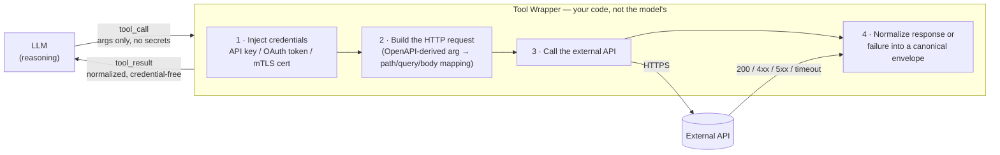
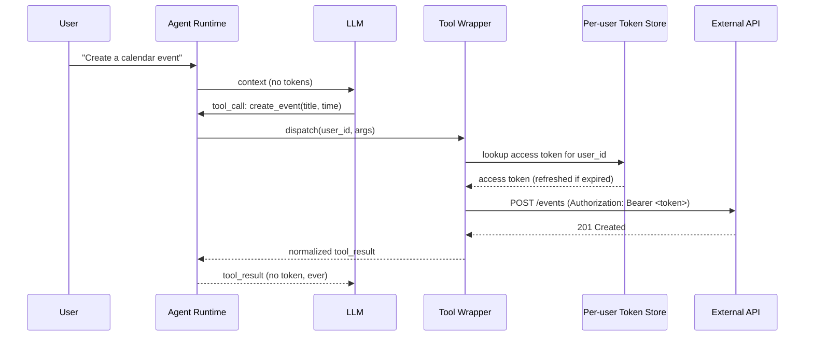

## APIs as Tools

> Chapter of
> [[agentic-ai-engineering/readme#04 — Tools & Environment Interaction|Tools & Environment Interaction]],
> part of [[agentic-ai-engineering/readme|Agentic AI Engineering]].

## What you will understand at the end

- Why "wrapping an API as a tool" is a translation problem at three separate boundaries — auth,
  schema, and error semantics — not one boundary
- Where credentials must live relative to the LLM's context window, and why that placement is a
  security control, not a style preference
- How to turn an OpenAPI/Swagger operation into a tool schema the model can reason about, and the
  gotchas that a naive auto-generator misses
- How to build a canonical error envelope so an agent can recover from a failure instead of just
  reporting it
- Why an agent's retry behavior makes idempotency a first-class design concern, not an edge case
- How GitHub Copilot's own tool-extensibility story (Extensions, then MCP) maps onto every pattern
  in this chapter

---

## The mental model

An "API tool" is not the API. It is a **wrapper process** that sits between the LLM's tool-call
request and the real HTTP call, and that wrapper is where almost all of the engineering in this
chapter happens. The LLM only ever sees two things: the tool's schema (before the call) and the
tool's result (after it). Everything else — the credential, the exact wire format, the raw failure —
is the wrapper's problem to solve, not the model's.



Three things to internalize before the rest of this chapter makes sense:

1. **The wrapper is a trust boundary.** Anything that crosses it into the LLM's context is
   effectively public — logged, cached, replayable, and (per
   [[02-prompt-injection|Prompt Injection]]) potentially attacker-influenced if the API's response
   contains untrusted third-party content. Credentials and raw upstream errors do not cross this
   boundary unfiltered.
2. **The schema the model sees is not the API's schema.** It is a derived, curated projection of it.
   OpenAPI is a good starting point, not a finished tool definition.
3. **The wrapper owns recovery, not the model.** The model can only react to what the wrapper tells
   it. If the wrapper hands back a raw stack trace or a bare `500`, the model has nothing to reason
   with — it will either hallucinate a fix or give up. A well-designed wrapper hands back enough
   structure that the model's next action is obvious.

This chapter builds on the tool-calling mechanics in
[[01-tool-calling-architecture|Tool Calling Architecture]] — read that first if you haven't; this
chapter assumes you already know how a `tool_use` block gets generated and dispatched, and focuses
specifically on what happens when the thing being dispatched to is somebody else's HTTP API.

---

## 1. Authentication — and where the credential actually lives

The question that matters is not "which auth scheme" — it's **"what is the shortest path a
credential can travel before it's used, and does that path ever pass through the LLM?"** The answer
should always be no. The LLM requests an action; the wrapper is the only thing that ever holds a
usable secret.

| Pattern                                       | Credential lifetime                              | Where it lives                                                                             | Good fit for                                                               | Blast radius if it leaks                                                           |
| --------------------------------------------- | ------------------------------------------------ | ------------------------------------------------------------------------------------------ | -------------------------------------------------------------------------- | ---------------------------------------------------------------------------------- |
| Static API key                                | Long-lived, rotated manually or on a schedule    | Vault / secrets manager, injected into the wrapper process at startup or call time         | Simple third-party APIs with one service-level identity                    | High — one key often grants broad, hard-to-scope access until rotated              |
| OAuth2 authorization code (three-legged)      | Access token minutes–hours; refresh token longer | Per-user token store keyed by user identity, refreshed out of band by the wrapper          | Agent acting **on behalf of a specific user** (their calendar, their repo) | Medium — scoped to one user's grants, but the refresh token is a durable liability |
| OAuth2 client credentials                     | Access token minutes–hours, self-refreshed       | Wrapper/service identity, no end user involved                                             | Agent acting **as itself** against an internal or partner API              | Medium — scoped to the service's own permissions, no user data exposure            |
| Service-to-service (mTLS / workload identity) | Short-lived, minted on demand by the platform    | Never stored — proven by the runtime's own identity (SPIFFE/SPIRE, Azure Managed Identity) | Internal APIs where the platform already has an identity fabric            | Low — nothing durable to steal; a stolen cert still expires in minutes             |

Two design rules follow directly from this table:

- **Never let the model populate a credential as a tool argument.** If your tool schema has a field
  called `api_key` or `token`, that is a design defect — it means the credential must appear
  somewhere the model can see it (a prior turn, a config the model was shown, or worse, a value it
  invents). The wrapper should resolve credentials itself, keyed by something safe to expose to the
  model — a `user_id`, a `tenant`, a `connection_name` — never the secret itself.
- **Prefer the pattern with the shortest-lived credential your integration partner supports.** A
  static API key is the easiest to wire up and the worst to have leak, because a leaked static key
  is useful to an attacker until someone notices and rotates it — which, for a third-party
  integration key buried in a wrapper's config, can be a long time. Service-to-service identity has
  the opposite property: even a captured token is close to worthless within minutes.

For the deeper mechanics of storage, rotation, and vault-backed injection at call time, see
[[07-secrets-management|Secrets Management]] — this chapter only covers the decision of _which_
pattern to use for a given wrapped API, not the plumbing that keeps the secret safe at rest.

**Where OAuth's user-delegation case gets subtle for agents:** the agent runtime, not the LLM, is
the one that knows _which_ user it's acting for on a given call — usually threaded through as a
session or conversation identifier, resolved to a token server-side.



Notice the token never appears above the `Wrapper` swimlane. That's the whole point.

---

## 2. Translating OpenAPI/Swagger into a tool schema

OpenAPI is the closest thing the industry has to a machine-readable API contract, and its request
bodies are already defined in JSON Schema — which is exactly what tool-calling APIs (Anthropic,
OpenAI, and everyone else) expect for a tool's `input_schema`. That similarity tempts people into
believing this is a mechanical, fully-automatable transform. It is _mostly_ mechanical — but four
gaps require a human (or at least a deliberate transformation layer) every time:

| OpenAPI construct                                   | Tool schema equivalent                                          | Gotcha                                                                                                                                                                     |
| --------------------------------------------------- | --------------------------------------------------------------- | -------------------------------------------------------------------------------------------------------------------------------------------------------------------------- |
| `$ref` to `components/schemas/...`                  | Fully dereferenced, inlined schema                              | Most tool-calling APIs require a **self-contained** schema — no external refs, and circular refs must be broken or flattened                                               |
| Parameters split across `path` / `query` / `header` | One flat JSON object (the tool call is a single arguments blob) | You need an explicit **arg → request-part mapping** per operation; the model can't know an argument belongs in the URL path vs. the query string                           |
| `summary` / `description` fields                    | Tool `description` field                                        | Written for human API consumers reading docs, not for a model deciding _when_ to call the tool — usually needs rewriting to state triggering conditions, not just behavior |
| HTTP verb (`GET`/`POST`/`PUT`/`DELETE`)             | Nothing — OpenAPI has no explicit idempotency/side-effect flag  | Conventions get violated constantly (a `GET` with side effects, a `POST` used for a pure read) — annotate safety explicitly, don't trust the verb (see § 4)                |

**Worked example.** A GitHub-style OpenAPI operation:

```yaml
/repos/{owner}/{repo}/issues:
  post:
    summary: Create an issue
    parameters:
      - name: owner
        in: path
        required: true
        schema: { type: string }
      - name: repo
        in: path
        required: true
        schema: { type: string }
    requestBody:
      content:
        application/json:
          schema:
            type: object
            required: [title]
            properties:
              title: { type: string }
              body: { type: string }
              labels: { type: array, items: { type: string } }
```

...becomes a flattened tool schema plus a separate mapping the wrapper uses to reconstruct the HTTP
request:

```json
{
  "name": "create_github_issue",
  "description": "Create a new issue in a GitHub repository. Use when the user asks to file a bug, track a task, or open a ticket against a specific repo.",
  "input_schema": {
    "type": "object",
    "required": ["owner", "repo", "title"],
    "properties": {
      "owner": { "type": "string", "description": "Repository owner (user or org)" },
      "repo": { "type": "string", "description": "Repository name" },
      "title": { "type": "string" },
      "body": { "type": "string" },
      "labels": { "type": "array", "items": { "type": "string" } }
    }
  }
}
```

```python
# Wrapper-side mapping — never shown to the model.
ARG_TO_REQUEST = {
    "path": ["owner", "repo"],       # → URL template substitution
    "body": ["title", "body", "labels"],  # → JSON request body
}

def build_request(args: dict) -> Request:
    url = f"/repos/{args['owner']}/{args['repo']}/issues"
    body = {k: args[k] for k in ARG_TO_REQUEST["body"] if k in args}
    return Request(method="POST", url=url, json=body, headers=auth_headers())
```

**The scaling trap.** A real OpenAPI spec for a platform API can have hundreds of operations. Do not
mechanically expose every operation as its own tool — dumping 300 tool definitions into one prompt
degrades tool-selection accuracy badly (the model has to search a much larger space on every turn,
and near-duplicate operations get confused for each other). Curate a subset that matches the agent's
actual job, or reach for the strategies in [[10-tool-discovery|Tool Discovery]] and
[[11-tool-selection-strategies|Tool Selection Strategies]] once the catalog outgrows what fits
comfortably in one prompt.

---

## 3. Normalizing errors into something the agent can act on

Every API you wrap will fail differently, and "differently" is the actual problem. A model that has
learned to handle one API's error shape gains nothing from that experience with the next one, unless
your wrapper hides the difference. In practice, upstream failures show up as any of:

- A `4xx`/`5xx` with a structured JSON error body
- A `200 OK` with `{"success": false, "error": "..."}` buried in the body (more common than it
  should be, especially in older SOAP-descended or gateway-fronted APIs)
- A `429` with rate-limit information either in a `Retry-After` header or in the body, never
  consistently both
- A plain-text or HTML error page from an API gateway or load balancer that never reached the actual
  service (a `502`/`504` with no JSON at all)
- A client-side timeout with **no response at all** — the request may or may not have been applied
  server-side (this case matters enormously for § 4)

The fix is the same one you'd apply to any heterogeneous upstream in a normal backend: define one
canonical failure envelope and make every wrapper emit it, regardless of what actually came back
over the wire.

```json
{
  "ok": false,
  "error": {
    "type": "rate_limited",
    "retryable": true,
    "retry_after_seconds": 30,
    "message": "The upstream service is rate-limiting requests. Retrying after the given delay is safe.",
    "raw_status": 429
  }
}
```

| Upstream symptom                                       | Canonical `type`       | `retryable` | Recommended agent policy                                                |
| ------------------------------------------------------ | ---------------------- | ----------- | ----------------------------------------------------------------------- |
| `429`, or body-encoded rate-limit signal               | `rate_limited`         | true        | Wait `retry_after_seconds`, retry, cap attempts                         |
| `401`/`403`, or an OAuth token refresh failure         | `auth_failed`          | false       | Halt the tool path; escalate to a human or a re-auth flow, don't guess  |
| `404`, or a body-encoded "not found"                   | `not_found`            | false       | Treat as a legitimate negative result — not every miss is a failure     |
| `400`/`422` from a malformed request the wrapper built | `invalid_input`        | false       | Surface the specific validation issue so the model can correct its args |
| `502`/`504`, connection reset, DNS failure             | `upstream_unavailable` | true        | Retry with backoff; after N attempts, degrade and tell the user why     |
| Client-side timeout, no response received              | `ambiguous_outcome`    | conditional | See idempotency (§ 4) — do not blindly retry without a dedup guard      |
| Anything that doesn't map cleanly to the above         | `unknown`              | false       | Surface raw detail to logs/telemetry, not to the model; fail closed     |

Two things worth calling out explicitly, because they're easy to skip under deadline pressure:

- **`retryable` and `type` are policy inputs, not decoration.** The value of normalizing errors is
  that your system prompt or agent harness can encode a _stable_ recovery policy ("if retryable,
  back off and retry up to 3 times; if `auth_failed`, stop and escalate") instead of asking the
  model to parse ad hoc text and infer intent every single time. That inference is exactly where
  agents hallucinate a fix that doesn't apply.
- **Sanitize before you forward.** Raw upstream error bodies can carry things you don't want in the
  model's context at all — internal hostnames, stack traces, or (if the wrapped API is fetching
  third-party content on the agent's behalf) attacker-controlled text that becomes a
  prompt-injection vector the moment it's echoed back as a "helpful" error detail. See
  [[02-prompt-injection|Prompt Injection]]. The `message` field in the canonical envelope should be
  something you wrote or explicitly allow-listed from the upstream body — never a verbatim
  passthrough by default.

---

## 4. Idempotency — because the agent retries at two layers, not one

This is the failure mode that's easy to miss until it costs someone a duplicate charge or a doubled
support ticket. A normal HTTP client retries once, in one place, under one team's control. An agent
system has **two independent retry sources** that don't know about each other:

1. **The harness** retries a tool call on timeout or a `retryable` error, per § 3's policy.
2. **The LLM itself** can independently decide to re-issue what looks like the same tool call — for
   example, if a prior `tool_result` scrolled out of context, was ambiguous, or the model simply
   didn't register that the first call already succeeded.

Neither layer knows the other exists. That's how you get two support tickets, two calendar events,
or two charges from one user request.

**Worked reasoning — a `create_support_ticket` tool wrapping a `POST /tickets` endpoint:**

- The agent harness calls the wrapper with a 30-second timeout.
- The upstream API actually creates the ticket at 29.8 seconds, but the response never makes it back
  before the timeout fires — the wrapper sees a client-side timeout, not a `201`.
- Per § 3, a bare timeout is `ambiguous_outcome`: the wrapper genuinely does not know whether the
  ticket was created.
- The harness, following a naive "timeout → retry" policy, retries. Without protection, this creates
  a second ticket for the same request.

The fix is the same idempotency-key pattern most mature payment and ticketing APIs already support
(Stripe's `Idempotency-Key` header is the canonical example):

```http
POST /tickets HTTP/1.1
Idempotency-Key: agent-plan-step-9f3c2a1b
Content-Type: application/json

{"title": "Printer on 3rd floor is offline", "priority": "P3"}
```

The key must be derived from the **logical intent**, not the HTTP attempt — generate it once per
plan step (or per hash of the normalized arguments) and reuse the identical key across every retry
of that same intent. The upstream API then dedupes server-side: a retried request with the same key
returns the original result instead of creating a second resource.

| HTTP method              | Idempotent by spec?            | Agent double-execution risk                                                                    | Mitigation                                                                                                |
| ------------------------ | ------------------------------ | ---------------------------------------------------------------------------------------------- | --------------------------------------------------------------------------------------------------------- |
| `GET` / `HEAD`           | Yes (safe, no side effects)    | None                                                                                           | None needed                                                                                               |
| `PUT` / `DELETE`         | Yes (by spec)                  | Low — repeating the same PUT/DELETE converges on the same end state                            | Still worth an idempotency key if the API's "same state" definition is fuzzy                              |
| `POST` (create)          | No                             | **High** — the classic double-charge / double-ticket case                                      | Idempotency key required whenever the wrapper's timeout is shorter than the upstream's worst-case latency |
| `PATCH` (partial update) | Depends on the patch semantics | Medium — a relative patch ("increment by 1") is not idempotent even though PATCH "sounds" safe | Prefer absolute-value patches where possible; key-guard the relative ones                                 |

When the upstream API has no idempotency-key support at all, you have to build the guard yourself in
the wrapper: a **check-before-act** query ("does a ticket with this title already exist for this
user in the last 5 minutes?") or a local dedup cache keyed by an intent hash with a short TTL.
Neither is as clean as server-side deduplication, but both beat trusting that the agent's two retry
layers will never overlap — they will, eventually, under exactly the load conditions you can least
afford it.

---

### GitHub Copilot in practice

Microsoft's GH-600 exam content on "Developing in Agentic AI Systems" leans heavily on GitHub
Copilot's own tool-extensibility story, and it maps onto every boundary this chapter just walked
through — Copilot just draws the wrapper boundary in a slightly different place depending on which
extensibility mechanism you use.

- **Copilot Extensions (GitHub App–based agents).** In this model, a Copilot Extension is a GitHub
  App plus an "agent" HTTP endpoint you host. When a user `@mentions` your extension in Copilot
  Chat, GitHub routes the conversation to your endpoint — and critically, **your service, not
  Copilot's own model context, is the tool wrapper.** GitHub's platform handles the identity/auth
  handshake (the requesting user's GitHub identity is exchanged for a token your service can use),
  so the pattern from § 1 holds exactly: the wrapped API's credentials live in your extension's
  backend, never in anything the model generates or sees. Schema translation and error normalization
  are entirely your extension's responsibility, because you're writing the whole agent loop around
  your own tool calls, not handing a schema to Copilot's model.
- **Copilot as an MCP client.** The more general and current path — and the one this book treats as
  the default going forward, see [[09-model-context-protocol-mcp|Model Context Protocol (MCP)]] and
  [[h-mcp-reference-guide|Appendix H — MCP Reference Guide]] — is registering an MCP server (local
  or remote) that Copilot's agent mode connects to. Here the wrapper boundary sits inside the MCP
  server process: the server holds whatever credential pattern from § 1 fits the wrapped API,
  exposes a `tools/list` response whose schemas are frequently generated or hand-curated from that
  API's OpenAPI spec exactly as in § 2, and returns normalized results (or normalized errors, per
  § 3) as MCP tool results. Copilot itself never touches the underlying API directly — it only ever
  talks to the MCP server's tool contract, which is precisely the "wrapper as trust boundary" mental
  model this chapter opened with.
- **What carries over regardless of mechanism:** idempotency is still the developer's problem, not
  Copilot's — if your MCP server or Extension wraps a mutating endpoint, you still need the
  intent-keyed dedup guard from § 4, because Copilot's own agent loop can re-issue a tool call for
  the same reasons any agent loop can (a dropped result, a retried step, a user re-prompting after
  an ambiguous response).

If you're studying GH-600 specifically: expect it to test whether you know _which_ mechanism puts
the credential and the error-handling responsibility on your code versus on GitHub's platform — that
distinction is this chapter's § 1 and § 3, applied to one vendor's product surface.

---

## Concept check

Before moving to the next chapter, you should be able to answer these without notes:

| Question                                                                              | Answer hint                                                                                                                                      |
| ------------------------------------------------------------------------------------- | ------------------------------------------------------------------------------------------------------------------------------------------------ |
| Where should a wrapped API's credential live relative to the LLM's context?           | Never in it — the wrapper resolves credentials by an opaque identifier, the model never sees the secret                                          |
| Why can't you mechanically auto-generate a tool schema from any OpenAPI spec?         | `$ref`s need flattening, path/query/body params need a request-mapping layer, and descriptions need rewriting for tool-selection, not human docs |
| Why does a canonical error envelope matter more than "just returning the real error"? | It turns heterogeneous upstream failures into a stable policy input (`type`, `retryable`) the harness can act on consistently                    |
| Why does an agent need idempotency keys more than a typical HTTP client does?         | Two independent retry sources — the harness and the LLM itself — can each re-issue the same call without knowing the other did                   |
| In a GitHub Copilot Extension, who holds the wrapped API's credential?                | Your extension's own backend service — Copilot's model context never touches it                                                                  |

---

## Vocabulary glossary

| Term                     | Definition                                                                                                                         |
| ------------------------ | ---------------------------------------------------------------------------------------------------------------------------------- |
| Tool wrapper             | The code between a tool call and the real API call — owns auth, schema mapping, and error normalization                            |
| Trust boundary           | The line past which raw secrets and raw upstream failures must not cross into the LLM's context                                    |
| Idempotency key          | A stable identifier tied to a logical intent, sent on every retry so the upstream dedupes duplicate effects                        |
| Canonical error envelope | A wrapper-defined, stable error shape (`type`, `retryable`, `message`) that replaces whatever shape the upstream actually returned |
| Ambiguous outcome        | A failure mode (typically a timeout) where the wrapper cannot determine whether the upstream action actually completed             |
| MCP server               | A process exposing tools over the Model Context Protocol; a common home for the wrapper boundary described in this chapter         |
| Client credentials flow  | An OAuth2 grant where the agent authenticates as itself, with no end user in the loop                                              |
| Three-legged OAuth       | An OAuth2 grant where the agent acts on behalf of a specific user who has delegated access                                         |

## Metadata

|        |                        |
| ------ | ---------------------- |
| Author | Amit Singh             |
| Scope  | agentic-ai-engineering |
