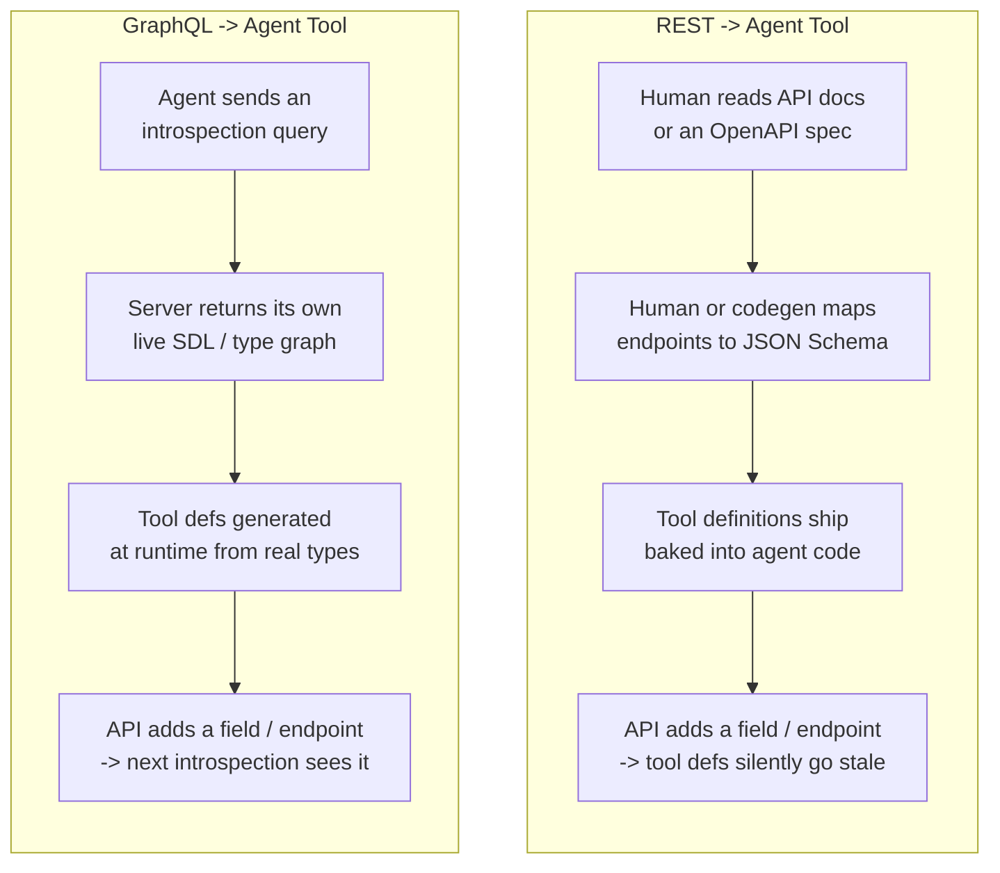
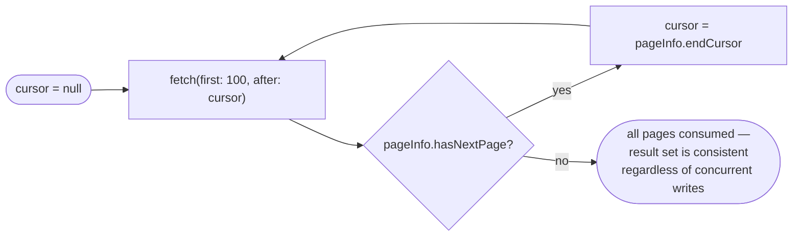

## REST & GraphQL Integration

> Chapter of
> [[agentic-ai-engineering/readme#04 — Tools & Environment Interaction|Tools & Environment Interaction]],
> part of [[agentic-ai-engineering/readme|Agentic AI Engineering]].

## What you will understand at the end

- Why a GraphQL-backed tool can build its own schema at runtime while a REST-backed tool almost
  always needs a human (or a codegen step) to hand-write the contract first
- Why offset pagination is quietly dangerous inside an agent loop, and why cursor-based pagination
  is the safer default for anything an LLM controls the iteration count of
- How to design retry logic that respects a provider's actual rate-limit signals (`Retry-After`,
  reset timestamps) instead of guessing with a fixed backoff
- Why retry logic belongs _below_ the LLM's reasoning loop, not inside it — and what happens to an
  agent's iteration budget when you get this wrong
- How these three concerns — introspection, pagination, and rate limits — show up concretely in
  GitHub's GraphQL API, the surface a Copilot-style coding agent has to operate against

---

## The mental model

[[02-apis-as-tools|APIs as Tools]] covered the general problem: wrapping an arbitrary external API
so an LLM can call it as a tool. REST and GraphQL solve the "what does this API look like" question
completely differently, and that difference cascades into how much work your agent platform has to
do before a tool is even usable.

REST has no machine-readable self-description built into the protocol. An endpoint is a URL, a verb,
and whatever body shape the server happens to expect — none of that is discoverable by calling the
API itself. GraphQL bakes self-description into the protocol: every GraphQL server that hasn't
deliberately disabled it can answer the question "what can I ask you?" by being asked, in GraphQL,
for its own schema.



Neither side is free. REST's hand-wrapping cost is upfront and visible — you feel the pain once,
when you write the OpenAPI spec or the tool schema. GraphQL's cost is deferred and structural — you
still have to solve pagination and rate limiting yourself, and production GraphQL servers routinely
disable introspection for the exact reason it's useful to you: it hands an attacker (or an
over-curious agent) a complete map of the data model. The rest of this chapter treats each of these
three concerns — discovery, pagination, and rate limits — as a separate design decision with its own
failure mode when an _agent_, not a human developer, is the thing driving the calls.

---

## REST vs. GraphQL as agent tool surfaces

| Concern                    | REST                                                                                                      | GraphQL                                                                                                      |
| -------------------------- | --------------------------------------------------------------------------------------------------------- | ------------------------------------------------------------------------------------------------------------ |
| Schema discovery           | No protocol-level introspection; requires an OpenAPI/Swagger doc, hand-maintained or generated separately | Built-in `__schema` introspection query; the live server is its own source of truth (when enabled)           |
| Tool-definition generation | Manual mapping from OpenAPI paths/params to JSON Schema, or a codegen step you own and re-run             | Can be generated at agent-startup time directly from the introspection result                                |
| Pagination convention      | No standard — `page`/`offset`, `Link` headers, and cursor params all coexist across APIs                  | Strong convention (Relay-style connections: `edges`, `pageInfo.hasNextPage`, `endCursor`)                    |
| Rate-limit signaling       | Per-request counting; typically `X-RateLimit-Remaining` / `X-RateLimit-Reset` headers                     | Often cost/point-based — a single query can consume a variable number of points depending on requested depth |
| Versioning story           | URL or header versioning (`/v2/…`, `Accept: application/vnd.api+json;version=2`)                          | Additive, non-breaking evolution is the norm; deprecated fields marked but rarely removed                    |
| Over-fetching risk         | Fixed response shape per endpoint — you get what the endpoint returns, no more, no less                   | Caller-shaped queries — an agent can accidentally request a deeply nested, expensive graph in one call       |
| Failure mode unique to it  | Stale tool defs when the API changes and nobody re-generates the spec                                     | A single query walking too deep into nested connections and burning the whole rate-limit budget in one call  |

Read that last row carefully — it is the crux of this chapter. REST's failure mode is a
**discovery** problem: your tool description silently disagrees with reality. GraphQL's failure mode
is a **cost-control** problem: the query shape itself, not just the call count, determines how fast
you burn through whatever budget the provider gives you. Both are agent-specific risks — a human
developer notices a broken integration test; an autonomous agent just keeps calling a tool that's
wrong, or keeps looping through a query that's expensive, until something external stops it.

---

## Schema introspection: how a GraphQL-backed agent builds its own tools

GraphQL's introspection system is itself a GraphQL query. You ask the server about its own types
using the reserved `__schema` and `__type` meta-fields:

```graphql
query IntrospectSchema {
  __schema {
    queryType { name }
    mutationType { name }
    types {
      name
      kind
      fields {
        name
        description
        args { name type { name kind ofType { name } } }
        type { name kind ofType { name kind } }
      }
    }
  }
}
```

The response is a complete, machine-readable graph of every type, field, argument, and return type
the server exposes — commonly rendered as **SDL** (Schema Definition Language), the human-readable
`type Repository { name: String! issues(first: Int): IssueConnection }`-style syntax GraphQL tooling
generates from the same introspection data.

**What an agent platform does with this:**

1. Run the introspection query once (and periodically re-run it — schemas evolve).
2. Walk the returned type graph and translate each queryable field into a JSON Schema tool
   definition the LLM can reason about: object types become nested parameters, `!` (non-null)
   becomes a required field, scalar types (`String`, `Int`, `ID`) map directly, and enums become
   JSON Schema `enum` constraints.
3. Cache the generated tool definitions — you do not want to introspect on every single agent turn;
   treat the schema like any other slowly-changing config and invalidate on a TTL or a version
   signal.
4. Optionally narrow the exposed surface: a full schema introspection of a large API (GitHub's is a
   good example — hundreds of types) is far more than you want handed to an LLM as tool choices.
   Curate a subset of types/fields into the actual tool catalog rather than exposing the raw graph.

**Why REST cannot do step 1.** There is no REST equivalent of "ask the live server what it looks
like." The closest thing is fetching a checked-in OpenAPI document from a docs site or a well-known
`/openapi.json` path — which is a _file_, not a live introspection of the running service. If that
file drifts from the deployed API (a common failure — someone ships an endpoint change and forgets
to regenerate the spec), your agent's tool definitions are wrong and it has no way to detect that
from the protocol itself. It just gets a validation error, or worse, a seemingly-successful call
that silently omits data it thought it was requesting.

**The introspection tradeoff you should name in a design review:** production GraphQL APIs
frequently _disable_ introspection (it hands out your entire data model, which is a reconnaissance
gift to an attacker). When that's the case, you're back to a checked-in SDL snapshot — the same
staleness risk REST always has, just less common in practice because GraphQL teams tend to publish
their schema as a build artifact specifically so tooling (including agents) can consume it
out-of-band. Don't assume introspection is available in production; confirm it, and have a fallback
snapshot strategy either way.

---

## Pagination handling: cursor-based vs. offset-based

Both pagination styles answer "give me the next chunk of a large result set," but they differ in
what they use as the position marker, and that difference determines whether an agent looping
through pages gets a _consistent_ view of the data or a corrupted one.

| Aspect                           | Offset-based (`?page=3&limit=100` / `OFFSET 200 LIMIT 100`)                                                    | Cursor-based (`after: "Y3Vyc29yOjEwMA==", first: 100`)                                                                              |
| -------------------------------- | -------------------------------------------------------------------------------------------------------------- | ----------------------------------------------------------------------------------------------------------------------------------- |
| Position marker                  | Row count from the start                                                                                       | An opaque, server-issued pointer to a specific record                                                                               |
| Behavior under concurrent writes | Rows inserted/deleted before the current offset shift every row after them — records get skipped or duplicated | Cursor stays anchored to the record it points at; unaffected by inserts/deletes elsewhere in the set                                |
| Performance at depth             | `OFFSET n` typically forces the database to scan and discard the first `n` rows — cost grows with page depth   | Typically an indexed lookup on the cursor key — roughly constant cost regardless of depth                                           |
| Retry safety                     | Retrying "page 5" after a partial failure may now return different rows than the first attempt did             | Retrying "after cursor X" is idempotent — same cursor, same next page, regardless of what else changed                              |
| Jump-to-page support             | Trivial — offsets are just arithmetic                                                                          | Not naturally supported — you can only walk forward (or backward) from a cursor                                                     |
| Standard convention              | None — every API invents its own params                                                                        | Relay-style connections (`edges`, `node`, `pageInfo.hasNextPage`, `pageInfo.endCursor`) are close to a de facto standard in GraphQL |

**Worked reasoning — why this matters specifically for an agent, not just any client:**

Say an agent is iterating over 10,000 open support tickets, 100 per page, to build a summary. It's
on page 23 (offset 2,200) when, mid-loop, 50 tickets get closed and removed from the "open" filter
by other users acting concurrently. Every ticket after position 2,200 in the _original_ ordering
just shifted left by 50. The agent's next request for offset 2,300 now returns tickets that were
previously at offset 2,350 — it silently skips 50 tickets it never saw. Nothing errors. No retry
fires. The agent finishes the loop, reports "processed all open tickets," and the summary is wrong
by construction. This is the failure mode that makes offset pagination dangerous specifically in
**unattended, looping agent code** — a human clicking through a paginated UI would eyeball the count
and might notice; an agent evaluating its own stop condition (`hasNextPage`-equivalent =
`offset < total_count`) has no signal that anything went wrong.

Cursor-based pagination sidesteps this because the cursor doesn't encode a position in a mutable
ordering — it encodes "the record after this specific record." Ticket #4,481 stays anchored to its
cursor whether or not tickets before it get closed. The agent's loop invariant — "keep fetching
`after: cursor` until `hasNextPage` is false" — stays correct under concurrent mutation of the
underlying set.



**The practical rule for tool design:** if the underlying API offers both, wire the agent's
pagination tool to the cursor-based variant, even if it means one extra field in the tool schema. If
the API _only_ offers offset pagination, treat every paginated loop as **non-idempotent on retry** —
cache the page contents you've already processed by content, not by offset, so a retried page
doesn't get silently re-merged as if it were new data, and cap how many pages an agent will walk
unattended before it must checkpoint or hand back a partial result.

---

## Rate-limit-aware retry design

A naive retry loop — "on any error, sleep 1 second and try again" — fails an agent in two specific
ways that don't show up in unit tests: it ignores the provider's own signal about how long to wait,
and it competes with the agent's own iteration/step budget for the same resource (LLM calls,
wall-clock time, or a hard `max_iterations` cap from the execution loop in
[[building-agentic-systems/00-building-single-agent-systems/01-agent-architecture/01-agent-architecture|Agent Architecture]]).

**The three things a production-grade retry wrapper does:**

1. **Exponential backoff with jitter** — double the wait on each consecutive failure
   (`base * 2^attempt`), and add randomized jitter so that many agent instances hitting the same
   rate limit don't all retry in lockstep and re-trigger the limit together (the thundering-herd
   problem).
2. **Respect the server's own signal** — if the response carries a `Retry-After` header (seconds to
   wait) or a reset timestamp (`X-RateLimit-Reset`), use that value instead of your own backoff
   guess whenever it's present and larger than what your backoff would compute. The server knows its
   own recovery time better than your heuristic does.
3. **Budget-aware backoff** — cap total retry time (and total retry _count_) against an explicit
   budget that is separate from, and smaller than, the agent's overall iteration/step budget. A
   single paginated tool call that requires 8 retries at 30-second exponential waits can consume
   four minutes and the agent's entire patience before it even gets to the actual task.

```python
import random
import time
from dataclasses import dataclass


@dataclass
class RetryBudget:
    """Bounds how much time/attempts ONE tool call may spend retrying,
    independent of the agent's own max_iterations counter."""
    max_attempts: int = 5
    max_total_wait_seconds: float = 30.0


class RateLimitAwareClient:
    def __init__(self, budget: RetryBudget | None = None) -> None:
        self.budget = budget or RetryBudget()

    def call_with_retry(self, do_request):
        """do_request() -> Response; raises RateLimited(retry_after) on 429/403 rate-limit errors."""
        total_waited = 0.0

        for attempt in range(self.budget.max_attempts):
            try:
                return do_request()
            except RateLimited as exc:
                if attempt == self.budget.max_attempts - 1:
                    raise BudgetExhausted(
                        f"gave up after {attempt + 1} attempts, "
                        f"{total_waited:.1f}s spent retrying one call"
                    ) from exc

                backoff = min(2 ** attempt, 60) + random.uniform(0, 1)
                wait_seconds = max(backoff, exc.retry_after or 0)

                if total_waited + wait_seconds > self.budget.max_total_wait_seconds:
                    raise BudgetExhausted(
                        f"next wait ({wait_seconds:.1f}s) would exceed the "
                        f"{self.budget.max_total_wait_seconds:.1f}s retry budget for this call"
                    ) from exc

                time.sleep(wait_seconds)
                total_waited += wait_seconds

        raise AssertionError("unreachable")


class RateLimited(Exception):
    def __init__(self, retry_after: float | None = None) -> None:
        super().__init__("rate limited")
        self.retry_after = retry_after


class BudgetExhausted(Exception):
    """Raised when a tool call's retry budget — not the agent's step budget — runs out."""
```

**The architectural point this code is making:** `BudgetExhausted` is a distinct exception from "the
underlying API call failed." It is deliberately raised _before_ the agent's own `max_iterations`
counter would have caught the problem, and it's raised by the client layer, not by agent reasoning.
This is the key design decision: **retry logic for transient/rate-limit errors belongs below the
LLM's reasoning loop, in the tool's client code — not inside the LLM's own turn-by-turn
decision-making.**

If instead you let the LLM "decide" to retry a failed tool call — by feeding it the 429 error as a
tool result and letting it choose to call the tool again — you pay for an extra LLM inference call
per retry, the retry consumes one of the agent's `max_iterations` steps for something that isn't
actually a reasoning problem, and the LLM has no better information than the client layer already
has (the `Retry-After` header) to decide _how long_ to wait. Handle the retryable case entirely in
the tool wrapper; only surface an error up to the LLM when it's genuinely unrecoverable
(`BudgetExhausted`, a 4xx that isn't rate-limiting, a schema validation failure) — something the LLM
might actually reason differently about, like "try a narrower query" or "ask the user for different
input."

---

### GitHub Copilot in practice

GitHub's own GraphQL API (`api.github.com/graphql`) is a working example of all three concerns at
once, and it's directly relevant to this book's GH-600 ("Developing in Agentic AI Systems") scope
because it's the surface a Copilot-style, GitHub-integrated coding agent actually calls when it
needs repository, issue, pull-request, or organization data beyond what's in its local checkout.

**Schema introspection.** GitHub's GraphQL schema is large — hundreds of types spanning
repositories, issues, pull requests, discussions, projects, and organization/enterprise
administration — and it is introspectable in the standard way described above. GitHub also publishes
the schema as a versioned SDL document alongside its API docs, which tooling (including typed
GraphQL clients) can consume without hitting the live introspection endpoint on every build.
Contrast this with GitHub's **REST** API, which is described by a separately maintained OpenAPI
specification (published in its own `github/rest-api-description` repository) — a real-world
instance of exactly the REST-vs-GraphQL discovery gap this chapter opened with: one surface tells
you its own shape on demand, the other ships its shape as a document you have to fetch and trust is
current.

**Pagination.** GitHub's GraphQL connections follow the Relay cursor convention described above —
`first`/`after` arguments, `pageInfo { hasNextPage, endCursor }` on every connection field (a
repository's `issues`, a pull request's `reviews`, an organization's `repositories`, and so on). An
agent walking, say, every open issue on a large repository should be driving that loop off
`endCursor`, not counting pages — for exactly the concurrent-mutation reason worked through above:
issues get opened, closed, and relabeled continuously on an active repository, and an offset-style
walk would be corrupted mid-loop by that churn in a way a cursor walk isn't. GitHub's REST API, by
contrast, paginates primarily via a `Link` response header carrying `rel="next"` URLs — closer in
spirit to cursor pagination than a raw offset, but still a different mechanic your tool wrapper has
to special-case per API style rather than reuse.

**Rate-limit-aware retries.** GitHub distinguishes a **primary rate limit** from **secondary rate
limits**. The primary limit is what you'd expect — a budget per hour tied to your authentication
context, historically on the order of 5,000 units for most authenticated tokens (the exact figure
and how it's counted has shifted over time and varies by token/app type, so treat this as
order-of-magnitude, not a number to hard-code). The REST API counts this simply — one request, one
unit off the budget, reported via `X-RateLimit-Remaining` / `X-RateLimit-Reset` response headers.
The **GraphQL** API instead assigns each query a **point cost** computed from the fields and
connection depths you actually request, drawn against that same style of budget — and, usefully, you
can query your own remaining budget (`rateLimit { limit cost remaining resetAt }`) as a field inside
the very same request. This is the sharpest version of the "budget-aware" principle from above: a
GraphQL-backed coding agent that requests a deeply nested query — say, every pull request, each with
every review, each with every comment, in one call — can burn a large fraction of its hourly point
budget in a single tool invocation, before any rate-limit _error_ ever fires. The defense isn't just
retry logic; it's estimating query cost (or requesting the `rateLimit` cost field alongside real
data) _before_ issuing a broad query, and shaping the tool's exposed parameters (page size,
requested depth) so the LLM can't accidentally request more graph than the budget affords.
Separately, GitHub applies **secondary rate limits** (abuse-detection triggers for request bursts,
excessive compute time, or high concurrency) independent of the primary budget, surfaced as a
403/429 that typically carries a `Retry-After` header — precisely the header the retry wrapper above
is built to prioritize over a self-computed backoff guess.

---

## Putting it together: a paginated, rate-limit-aware GraphQL tool

Combining the two mechanisms — cursor pagination as the loop invariant, budget-aware retry as the
safety net — gives you the shape a production tool wrapper should actually take:

```python
class PaginatedGraphQLTool:
    """One tool call = one page. The agent's own execution loop decides
    whether to call again; this class never loops on its own — that keeps
    pagination visible to (and boundable by) the agent's max_iterations."""

    def __init__(self, client: RateLimitAwareClient, query: str) -> None:
        self.client = client
        self.query = query

    def fetch_page(self, cursor: str | None, page_size: int = 50) -> dict:
        variables = {"after": cursor, "first": page_size}

        def do_request():
            return self._execute(self.query, variables)

        response = self.client.call_with_retry(do_request)
        return {
            "records": [edge["node"] for edge in response["edges"]],
            "next_cursor": response["pageInfo"]["endCursor"],
            "has_more": response["pageInfo"]["hasNextPage"],
        }

    def _execute(self, query: str, variables: dict) -> dict:
        raise NotImplementedError("wire this to your actual GraphQL transport")
```

Note the deliberate design choice: `fetch_page` returns _one page_ and lets the agent's own
execution loop decide whether to call it again, rather than the tool looping internally until
exhaustion. That keeps every page fetch visible as a distinct step the agent's `max_iterations`
counter and observability layer can see, bound, and log — an agent that needs to stop after 1,000
records rather than 10,000 can simply stop calling the tool. If the tool looped internally, that
control point would disappear inside a single opaque call.

---

## Concept check

| Question                                                                                              | Answer hint                                                                                                                                              |
| ----------------------------------------------------------------------------------------------------- | -------------------------------------------------------------------------------------------------------------------------------------------------------- |
| Why can a GraphQL-backed agent generate its own tool definitions but a REST-backed one usually can't? | GraphQL introspection asks the live server for its own schema; REST has no protocol-level equivalent — you need a separately maintained OpenAPI doc      |
| Why is offset pagination risky inside an unattended agent loop specifically?                          | Concurrent inserts/deletes shift every row after them, silently skipping or duplicating records — with no error raised                                   |
| What should a retry wrapper prefer over its own backoff calculation?                                  | The server's own `Retry-After` header or rate-limit reset timestamp, when present                                                                        |
| Why shouldn't the LLM itself decide to retry a rate-limited tool call?                                | It costs an extra inference call and an iteration-budget step for a problem the LLM has no better information to solve than the client layer already has |
| What makes GitHub's GraphQL rate limiting sharper than simple per-request counting?                   | Cost is based on query shape/depth (points), not just call count — a single deep query can burn a large fraction of the budget before any error fires    |

---

## Vocabulary glossary

| Term                      | Definition                                                                                                            |
| ------------------------- | --------------------------------------------------------------------------------------------------------------------- |
| Introspection query       | A GraphQL query against the reserved `__schema`/`__type` fields that returns the server's own type graph              |
| SDL                       | Schema Definition Language — the human-readable syntax GraphQL schemas are typically rendered as                      |
| Relay-style connection    | The `edges` / `node` / `pageInfo { hasNextPage, endCursor }` convention for cursor-based GraphQL pagination           |
| Cursor                    | An opaque, server-issued pointer to a specific record's position, stable under concurrent mutation                    |
| Offset                    | A row-count-based position marker; unstable under concurrent inserts/deletes                                          |
| Retry-After               | An HTTP response header telling the caller how long to wait before retrying                                           |
| Secondary rate limit      | GitHub's abuse-detection limit (request bursts, compute time, concurrency) independent of the primary per-hour budget |
| Point/cost-based limiting | A rate-limit model where each request's cost varies by what it actually requests, not a flat per-call count           |
| Retry budget              | An explicit cap on total retry attempts/time for one tool call, separate from the agent's own iteration budget        |
| Thundering herd           | Many clients retrying in lockstep after a shared failure, re-triggering the same limit together                       |

## Metadata

|        |                        |
| ------ | ---------------------- |
| Author | Amit Singh             |
| Scope  | agentic-ai-engineering |
