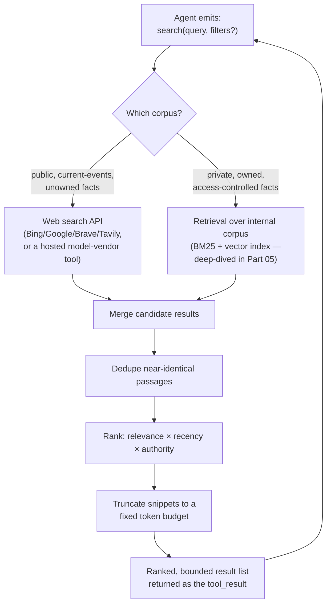

## Search Tools

> Chapter of
> [[agentic-ai-engineering/readme#04 — Tools & Environment Interaction|Tools & Environment Interaction]],
> part of [[agentic-ai-engineering/readme|Agentic AI Engineering]].

## What you will understand at the end

- Why "give the agent a search tool" is really three different design decisions — where the index
  lives, how results get ranked, and how much of each result survives into the context window — not
  one API call
- The tradeoff between web search (fresh, uncontrolled, unlicensed for your data) and
  retrieval-augmented search over a private corpus (stale-if-unmaintained, access-controlled,
  authoritative for _your_ facts) — and why production agents almost always need both, not one
- The three ranking pressures every agent-facing search tool must resolve — relevance, recency, and
  authority — and why naively sorting by relevance alone produces confidently wrong answers
- How to bound the token cost of a search tool call before it happens, instead of discovering the
  problem when a single tool result eats half the context budget
- Where GitHub Copilot's repo-aware retrieval fits this same tool-call model, as the worked example
  a GH-600 ("Developing in Agentic AI Systems") candidate is expected to recognize

---

## The mental model

A search tool is not "the agent Googles something." It is a function call with a narrow contract:
take a query string (and maybe some filters), return a small, ranked, token-bounded list of passages
the model can reason over. Everything interesting about search-tool design lives in how that
contract gets fulfilled — and an agent frequently needs more than one fulfillment strategy behind
the same tool name.



**Reading the diagram:** the query fans out to whichever corpus (or corpora) the tool is scoped to,
candidates get merged into one list, near-duplicates collapse, the survivors get ranked by a
composite score, and — critically — the list gets truncated to a token budget _before_ it goes back
to the model. Skip that last step and a single "helpful" search call can silently consume more
context than the entire rest of the conversation.

---

## Search is a tool-call surface, not a knowledge store

It's easy to conflate "the agent can search" with "the agent has a retrieval pipeline." They are
different layers, and this chapter is deliberately scoped to the shallower one.

- **This chapter (Part 04, Tools & Environment Interaction):** the tool-call contract — what
  function signature the LLM sees, what a well-formed request looks like, what comes back, and how
  the return payload is shaped so it doesn't blow the context budget. This is the same layer as
  [[agentic-ai-engineering/04-tools-and-environment-interaction/04-database-tools/04-database-tools|Database Tools]]
  one chapter back — a different backing system, the same "function the model can call and a result
  it must be able to reason over" problem.
- **Part 05, Retrieval & Knowledge Systems:** the machinery _behind_ the internal-search variant of
  that tool — chunking strategy, embedding models, ANN indexing, hybrid BM25+vector fusion, and
  cross-encoder reranking. See
  [[agentic-ai-engineering/05-retrieval-and-knowledge-systems/01-retrieval-augmented-generation-rag/01-retrieval-augmented-generation-rag|Retrieval-Augmented Generation (RAG)]]
  for the pipeline this chapter's "internal search" tool sits on top of, and
  [[agentic-ai-engineering/05-retrieval-and-knowledge-systems/05-hybrid-search/05-hybrid-search|Hybrid Search]]
  and
  [[agentic-ai-engineering/05-retrieval-and-knowledge-systems/06-reranking/06-reranking|Reranking]]
  for the ranking mechanics this chapter only summarizes at the tool-design level.

If you're building the index, go to Part 05. If you're deciding what the `search` tool's schema
looks like, what it returns, and how an agent should choose between a web call and an internal call,
stay here.

---

## Web search APIs: trading hallucination risk for freshness

The single biggest win from giving an agent a web search tool is **grounding against a training
cutoff**. An LLM's parametric knowledge is frozen at training time; a web search call lets it answer
"what changed since then" without retraining or fine-tuning. The mechanism is exactly the ReAct loop
from
[[building-agentic-systems/00-building-single-agent-systems/01-agent-architecture/01-agent-architecture|Agent Architecture]]:
the model emits a tool call instead of guessing, your code executes the real HTTP request, the
result comes back as a tool_result, and the model's next token is now conditioned on retrieved text
instead of on its own frozen weights.

**What's actually available as a web search tool:**

| Option                                                                                          | What you get                                                                                                 | Where it fits                                                                        |
| ----------------------------------------------------------------------------------------------- | ------------------------------------------------------------------------------------------------------------ | ------------------------------------------------------------------------------------ |
| Hosted model-vendor search tool (e.g. a server-side `web_search` tool exposed by the model API) | The provider runs the search and injects results server-side — no separate API key, no result-parsing code   | Fastest to wire up; least control over ranking, source allow-listing, or rate limits |
| Commercial search API (Bing Web Search, Google Custom Search JSON API, Brave Search API)        | Full JSON result sets — title, URL, snippet, sometimes a relevance score — you parse and shape yourself      | When you need control over which domains are searched, caching, or cost attribution  |
| Agent-oriented search APIs (Tavily, Exa, You.com)                                               | Pre-summarized, LLM-friendly result payloads instead of raw SERP HTML — often with a built-in "answer" field | Purpose-built for the tool-call use case; usually the least glue code                |
| Scrape-your-own (search engine result page parsing)                                             | Full control, zero API cost per call, but brittle to markup changes and often against terms of service       | Rarely the right default; mention it only to rule it out                             |

**The tradeoff that matters:** freshness bought at the cost of a hallucination _floor_ you didn't
have before. Web search reduces one class of hallucination (stale or absent parametric knowledge)
while introducing another (a low-quality, outdated, or outright wrong page ranking highly and the
model treating it as ground truth because it arrived via a tool_result instead of free generation —
tool results carry an implicit trust bump the model doesn't apply evenly to its own priors). This is
why production web-search tools almost always pair with a citation or source-attribution requirement
— covered in
[[ai-foundations/01-language-models-in-practice/08-hallucination-management/08-hallucination-management|Hallucination Management]]
— rather than being trusted as-is.

**Concrete latency/cost numbers to reason with:** a hosted search tool call typically adds 1–3
seconds of round-trip latency and, for commercial APIs, a per-call cost on the order of a fraction
of a cent to a few cents. In a ReAct loop with a 10–25 iteration cap, that is real budget: three
search calls in one task can already be 3–9 seconds of pure I/O wait before the model does anything
with the results, on top of whatever the search API itself charges per call.

---

## Retrieval-augmented search over an internal corpus

The second corpus an agent needs is the one nobody else has: your runbooks, your architecture docs,
your incident postmortems, your ticket history. Structurally, from the tool-call surface this
chapter cares about, it looks identical to web search — `search(query, filters?) -> ranked results`
— but everything behind that signature is different:

| Dimension          | Web search                                             | Internal RAG search                                                                                              |
| ------------------ | ------------------------------------------------------ | ---------------------------------------------------------------------------------------------------------------- |
| Freshness          | As current as the web index — minutes to hours         | Only as current as your last ingestion run                                                                       |
| Authority          | Unverified; PageRank/domain reputation is a weak proxy | High — it's _your_ source of truth, if the corpus is curated                                                     |
| Access control     | None — public web only                                 | Must respect the same RBAC/tenant boundaries as the source system, or you've built a data leak                   |
| Hallucination risk | Model may over-trust a low-quality page                | Lower for facts the corpus actually covers; high (silent) risk for facts it doesn't — see the coverage gap below |
| Cost model         | Per-call API pricing, sometimes per-1000-queries tiers | Embedding + vector-DB infra cost, amortized across all queries                                                   |
| Backing mechanics  | Someone else's search engine                           | Chunking → embeddings → ANN index → (optional) reranking — this is all of Part 05                                |

**The coverage-gap failure mode is the one to actually worry about.** A web search tool fails loudly
— zero results, and the model usually says so. An internal RAG search fails _quietly_: the corpus
returns its three closest chunks even when none of them actually answer the question, because vector
similarity always returns _something_ close in embedding space. The tool contract has to surface a
similarity-score floor (or an explicit "no confident match" signal) rather than always handing back
top-k regardless of how weak the match is — otherwise the agent reasons over
plausible-but-irrelevant context and produces a hallucination that _looks_ grounded because it cites
a real internal document, just the wrong one.

**Why an agent usually needs both tools, not one:** a support or SRE agent asked "is this a known
issue" needs the internal corpus (postmortems, known-issue trackers) for authority, and web search
for "did the upstream vendor just post an advisory about this in the last hour" for freshness.
Exposing both as distinct, separately-scoped tools — rather than one fused "search everything" tool
— lets the model's tool _description_ do the routing: a well-written description ("search internal
runbooks and postmortems" vs. "search the public web") is what steers tool choice, exactly as
[[building-agentic-systems/00-building-single-agent-systems/01-agent-architecture/01-agent-architecture|Agent Architecture]]
covers for tool design generally.

---

## Result-ranking strategies

Once you have candidate results — from one corpus or several — the tool has to decide what to keep,
in what order, and how much of each item survives. Get this wrong and the agent either misses the
right answer buried on page two of a naive relevance sort, or burns its context budget on eight
redundant near-duplicates of the same page.

### Relevance vs. recency vs. authority

Pure relevance ranking (cosine similarity to the query, or BM25 term-overlap score) is the default
and the most common mistake to leave unexamined. Three signals compete for "best result," and a
production search tool has to make the weighting explicit rather than implicit:

| Signal        | What it captures                                                                                      | Where it dominates                                                                                  | Failure if ignored                                                                |
| ------------- | ----------------------------------------------------------------------------------------------------- | --------------------------------------------------------------------------------------------------- | --------------------------------------------------------------------------------- |
| **Relevance** | Semantic/lexical closeness of the passage to the query                                                | Definitional questions, stable facts                                                                | Irrelevant-but-recent results crowd out the actual answer                         |
| **Recency**   | How new the source is                                                                                 | "What changed," incident status, pricing, version numbers                                           | A five-year-old blog post outranks yesterday's advisory on the same topic         |
| **Authority** | Source trustworthiness — domain reputation for web, document owner/review status for internal corpora | Anything where being _wrong confidently_ is costly (security advice, compliance, incident response) | A forum comment with high lexical overlap outranks the vendor's own documentation |

A composite score is typically a weighted blend:

```txt
score = (w_relevance × relevance_score)
      + (w_recency   × recency_decay(age))
      + (w_authority × authority_score)
```

`recency_decay` is usually an exponential or step function — a half-life of days for incident/status
queries, and effectively infinite (no decay) for stable reference material. The failure mode to
avoid is a single global weighting used for every query type: a "how does OAuth work" query should
weight authority and relevance heavily and recency near zero; a "is the payments API degraded right
now" query should weight recency heavily enough to override a much more "relevant-sounding" but
week-old result.

**Reciprocal Rank Fusion (RRF)** is the standard technique for merging _multiple ranked lists_
(e.g., a web result list and an internal RAG result list, or a BM25 list and a vector-similarity
list) into one ranking without having to normalize incompatible raw scores — each item's fused score
is `Σ 1 / (k + rank_in_list)` across the lists it appears in, so an item ranked highly by more than
one method rises to the top even though BM25 scores and cosine similarities aren't on the same
scale. This is the same fusion technique the hybrid retrieval design in
[[agentic-ai-engineering/05-retrieval-and-knowledge-systems/05-hybrid-search/05-hybrid-search|Hybrid Search]]
uses to combine sparse and dense retrieval — the search-tool layer reuses it to combine
_heterogeneous corpora_, not just heterogeneous retrieval methods.

### Deduping near-identical results

Web search in particular returns a lot of near-duplicates: syndicated copies of the same article,
mirrors, and paginated fragments of one long document. Feeding the model five copies of the same
fact wastes context and — worse — can make the model over-confident, since five sources "agreeing"
looks like corroboration when it's actually one source.

Practical dedup layers, cheapest first:

1. **Canonical URL / document-ID collapsing** — strip query params and tracking fragments, resolve
   redirects, and treat known mirrors as one source.
2. **Exact or near-exact text hashing** (e.g. SimHash or MinHash over shingled text) — catches
   byte-for-byte or near-byte-for-byte duplicates cheaply, without an embedding call.
3. **Embedding-similarity clustering** — for anything the cheaper layers miss, cluster returned
   passages by embedding cosine similarity above some threshold (commonly in the 0.92–0.97 range,
   corpus-dependent) and keep one representative per cluster.

Apply these in that order — cheapest first — because a search tool call is already on the request's
critical path; running an embedding model over every candidate before you've even cheaply filtered
out exact duplicates is wasted latency.

### Snippet truncation to control token cost

This is the step most naive search-tool implementations skip, and it's the one with the most direct
effect on cost and on the rest of the agent loop. Work the budget explicitly:

```txt
Assume: 8 candidate results, no truncation, ~600 tokens/snippet average (a full paragraph + metadata)
  → 8 × 600 = 4,800 tokens consumed by ONE tool_result

Against a 200K context window that looks affordable in isolation — but in a ReAct loop
with a 10-call iteration budget, repeated untruncated search calls compound fast, and the
overhead is pure serialization cost (URLs, metadata, whitespace) that the model doesn't need
to reason well.
```

The fix is a fixed per-result truncation budget, tuned deliberately rather than left at whatever the
underlying API defaults to:

| Lever                             | Typical setting                        | Why                                                                                                                                                           |
| --------------------------------- | -------------------------------------- | ------------------------------------------------------------------------------------------------------------------------------------------------------------- |
| Max results returned to the model | 3–8                                    | Beyond ~8, marginal relevance drops off and dedup should have already trimmed the list                                                                        |
| Max tokens per snippet            | 100–300                                | Enough for the model to judge relevance and quote a fact; not enough to substitute for a full-document fetch tool                                             |
| Metadata kept                     | Title, URL/source-ID, timestamp, score | Enough for the model to cite and for you to audit; drop raw HTML, tracking params, boilerplate nav text                                                       |
| Full-document escape hatch        | A separate `fetch_document(id)` tool   | Lets the model deliberately pay for the full text on the _specific_ result it decided matters, instead of the tool front-loading that cost on every candidate |

That last row is the pattern worth internalizing: **search tools should return summaries, not
documents.** Pair the search tool with a narrower, explicit fetch/read tool for the (usually one or
two) results the model actually wants in full. This mirrors the token-optimization principle covered
throughout
[[production-agent-systems/readme#03 — Performance & Cost Engineering|Performance & Cost Engineering]]
— spend context deliberately, on the thing the agent decided it needs, not eagerly on everything
that might be relevant.

---

### GitHub Copilot in practice

GitHub Copilot is a useful worked example precisely because it exposes more than one search-tool
surface behind what looks like a single "ask about my code" experience — and distinguishing them is
close to the kind of scenario Microsoft's GH-600 ("Developing in Agentic AI Systems") exam content
tests for.

- **Repo/workspace-context retrieval.** When Copilot Chat answers a question "about this codebase"
  (its `@workspace`-style context), it is running a local retrieval step over the open repository —
  a mix of lexical/keyword matching and embedding-based semantic search over an index it builds of
  the workspace — to select which files and symbols are relevant, then injects those snippets into
  the model's context before generating an answer. Functionally this is the same "internal RAG
  search" tool-call pattern this chapter describes: query in, ranked relevant chunks out, at a fixed
  token budget, rather than a naive dump of the whole repository.
- **GitHub code search as a broader retrieval surface.** Beyond the single open workspace, GitHub's
  code search (the indexing and query engine behind github.com's code search and Copilot's
  cross-repository awareness in organizational deployments) is a much larger-scale version of the
  same idea — a search index over source code that can be queried by symbol, string, or structural
  pattern rather than embedding similarity alone, giving an agent authoritative "how is this used
  elsewhere" context that a single-repo embedding index can't provide. Access-scoping matters here
  in exactly the way the web-vs-internal comparison table above flags — results are bounded by the
  querying user's actual repository permissions, so the tool's result set is a function of identity,
  not just relevance.
- **Model-agnostic lesson for the exam-level framing:** whichever surface is in play, Copilot is
  still doing the same three things this chapter is about — deciding _which_ corpus to query (open
  file, workspace index, or org-wide code search), _ranking_ the candidates before they reach the
  model, and _bounding_ how much of each candidate gets included as context. The GH-600-relevant
  takeaway is recognizing retrieval-augmented code context as an instance of the general search-tool
  pattern, not a Copilot-specific mechanism — the same reasoning applies whether the backing index
  is GitHub's code search, an internal vector DB, or a public web search API.

---

## Putting it together: designing the tool schema

A search tool's JSON schema should make the ranking and budget decisions above visible as parameters
the model — or your routing code — can actually set, not buried defaults:

```json
{
  "name": "search_internal_docs",
  "description": "Search internal runbooks, architecture docs, and postmortems. Use for questions about how OUR systems work, known issues, or past incidents. Does not search the public web.",
  "input_schema": {
    "type": "object",
    "properties": {
      "query": { "type": "string" },
      "max_results": { "type": "integer", "default": 5, "maximum": 8 },
      "recency_weight": {
        "type": "string",
        "enum": ["low", "balanced", "high"],
        "description": "Set 'high' for incident/status questions, 'low' for stable reference material."
      },
      "min_relevance_score": { "type": "number", "default": 0.6 }
    },
    "required": ["query"]
  }
}
```

Two things in this schema earn their place because of everything above: `min_relevance_score` is the
coverage-gap guard — below that floor, the tool should return "no confident match" instead of
forcing a top-k answer — and `recency_weight` makes the relevance/recency tradeoff a decision the
calling code (or a well-prompted model) makes explicitly per query, instead of one fixed global
weighting silently mis-serving half your query types.

---

## Concept check

| Question                                                                              | Answer hint                                                                                                                                                                                                         |
| ------------------------------------------------------------------------------------- | ------------------------------------------------------------------------------------------------------------------------------------------------------------------------------------------------------------------- |
| What's the actual tradeoff web search buys you over the model's parametric knowledge? | Freshness, at the cost of a new hallucination surface — over-trusting a low-quality or outdated page because it arrived as a tool_result                                                                            |
| Why does an internal RAG search tool fail "quietly" where web search fails "loudly"?  | Vector similarity always returns _something_ close in embedding space, even when nothing in the corpus actually answers the question — there's no natural "zero results" signal without an explicit score floor     |
| Why use Reciprocal Rank Fusion instead of just normalizing and averaging raw scores?  | BM25 scores and cosine similarities aren't on comparable scales; RRF merges by rank position instead, which is scale-invariant                                                                                      |
| What's the cheapest-first dedup ordering, and why does order matter?                  | Canonical URL collapsing → hash-based near-duplicate detection → embedding-similarity clustering — cheapest filters run first so you're not paying for embeddings on results a URL check would have caught for free |
| Why should a search tool return summaries instead of full documents?                  | To bound token cost per call; pair it with a separate fetch/read tool so the model pays full document cost only on the specific result it decided matters                                                           |

---

## Vocabulary glossary

| Term                         | Definition                                                                                                                          |
| ---------------------------- | ----------------------------------------------------------------------------------------------------------------------------------- |
| Grounding                    | Conditioning model output on retrieved external text instead of parametric knowledge alone                                          |
| SERP                         | Search Engine Results Page — the raw result set a commercial web search API returns                                                 |
| Coverage gap                 | A query the corpus has no real answer for, that a similarity-based retriever still returns plausible-looking (wrong) results for    |
| Reciprocal Rank Fusion (RRF) | A rank-based method for merging multiple ranked lists using each item's `1/(k + rank)` score, without needing comparable raw scores |
| Recency decay                | A function that discounts a result's score as its age increases, tuned per query type                                               |
| Near-duplicate               | A result that differs from another only in formatting, syndication, or trivial edits — same underlying content                      |
| Snippet truncation           | Bounding how much text from a single result is returned to the model, to control per-call token cost                                |
| Access-scoped search         | A search tool whose result set is filtered by the querying identity's actual permissions, not just relevance                        |

## Metadata

|        |                        |
| ------ | ---------------------- |
| Author | Amit Singh             |
| Scope  | agentic-ai-engineering |
