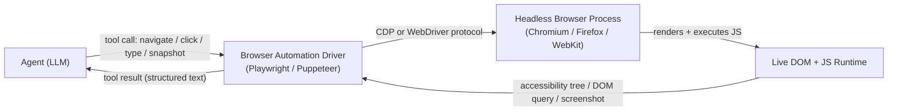
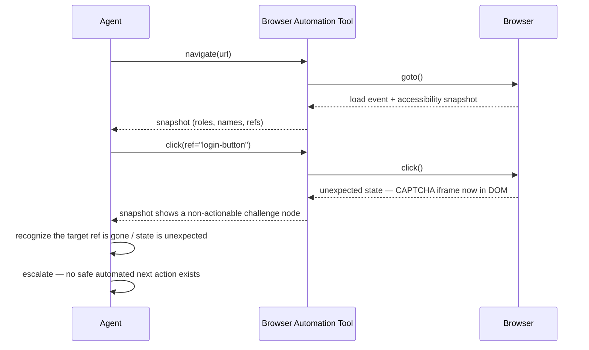

## Browser Automation

> Chapter of
> [[agentic-ai-engineering/readme#04 — Tools & Environment Interaction|Tools & Environment Interaction]],
> part of [[agentic-ai-engineering/readme|Agentic AI Engineering]].

## What you will understand at the end

- Why a plain HTTP `fetch`/`requests.get` tool is not sufficient for a large and growing share of
  the modern web, and exactly where it breaks
- The two competing strategies for letting an agent target elements on a page — CSS/XPath selectors
  vs. semantic, accessibility-tree-based targeting — and why one degrades gracefully under a
  redesign and the other doesn't
- Why the accessibility tree, not raw HTML or a screenshot, is the right observation format to feed
  an LLM-driven agent
- The failure modes that are specific to this tool class — timing races, popups/CAPTCHAs, and
  session/auth state — and the mitigation each one demands
- How this maps onto a real, shipped mechanism: the Playwright MCP server, and concretely how GitHub
  Copilot's agentic tooling (relevant to Microsoft's GH-600 exam objectives) exposes browser control
  to an agent

---

## The mental model

A browser-automation tool is not "give the agent a browser" — it's **giving the agent a narrow,
observable window into a rendering engine it does not otherwise have access to.** An LLM can already
read HTML if you paste it into context. What it cannot do on its own is execute JavaScript, wait for
a network response, or click something and see what changes. The tool exists to close exactly that
gap — nothing more.



Three things to hold onto from this diagram, because they explain almost every design decision in
this chapter:

1. **The agent never touches the browser directly.** It emits a tool call; your code (the driver) is
   what actually drives Chromium/Firefox/WebKit over the Chrome DevTools Protocol (CDP) or
   WebDriver. This is the same "the LLM doesn't execute tools, your code does" boundary from
   [[01-agent-architecture|Agent Architecture]] — browser automation is just a tool with an
   unusually rich observation surface.
2. **The observation that comes back is a choice you make**, not something the browser hands you by
   default. You can return raw HTML, a screenshot, or an accessibility-tree snapshot. That choice
   dominates cost, reliability, and what kind of model you even need — it's the subject of most of
   this chapter.
3. **State lives in the browser process, not in the agent's context window.** Cookies, local
   storage, and the current page are all held by the browser between tool calls. The agent's
   "memory" of what page it's on is really just its belief about that external state — and beliefs
   can go stale, which is where most of the failure modes in this chapter come from.

---

## Why plain HTTP fetch isn't enough

An HTTP GET tool (the kind of tool you'd build for [[02-apis-as-tools|APIs as Tools]] or
[[05-search-tools|Search Tools]]) gives you exactly what the server sent — nothing more. For a
server-rendered page, that's the whole page. For a modern JavaScript-framework SPA, it's often this:

```html
<!-- What requests.get(url) actually returns for a React/Vue/Angular SPA -->
<!DOCTYPE html>
<html>
  <head><title>Dashboard</title></head>
  <body>
    <div id="root"></div>
    <script src="/static/js/bundle.a1b2c3.js"></script>
  </body>
</html>
```

Everything the agent actually wants — the table of orders, the "Approve" button, the error banner —
is injected into `#root` by JavaScript **after** the browser loads and executes that bundle, and
often after one or more API calls the bundle itself makes. A raw fetch tool sees none of that. It
sees a shell.

This is the load-bearing reason browser automation exists as its own tool class rather than a
variant of the HTTP tool:

| Requirement                                               | Plain HTTP fetch                | Headless browser (Playwright/Puppeteer)                |
| --------------------------------------------------------- | ------------------------------- | ------------------------------------------------------ |
| Static/server-rendered HTML                               | Sufficient                      | Overkill — unnecessary cost and latency                |
| Client-rendered SPA content (React/Vue/Angular)           | Fails — empty shell             | Required — executes the JS that builds it              |
| Content behind a login session with client-side redirects | Fragile, hand-rolled            | Native — reuses real cookies/localStorage              |
| Multi-step UI flows (fill form → submit → read result)    | Not expressible                 | Native — click/type/wait are first-class               |
| Content gated by a `fetch()` call the page itself makes   | Fails unless reverse-engineered | Works transparently — the browser makes the same calls |
| Cost per page                                             | Milliseconds, cents             | Seconds, an order of magnitude more compute            |

The last row is the tradeoff a Principal-level design has to own explicitly: a headless browser is a
real process — memory, a render pipeline, a JS engine — not a socket. Reaching for it when a
`GET /api/orders` endpoint would have done the job is a self-inflicted latency and cost tax. The
decision rule that falls out of this table: **use browser automation only when there is no API, and
the content or interaction genuinely requires a rendering engine.** If you can find the underlying
API call the frontend makes, calling it directly is almost always cheaper and more reliable than
driving the UI that wraps it.

---

## DOM parsing and selector strategies

Once the browser has rendered the page, the tool still has to answer: _which element does the agent
mean when it says "click the submit button"?_ This is where most of the brittleness in
browser-automation tooling actually lives — not in rendering, but in **targeting**.

### CSS/XPath selectors — the traditional approach

```python
# Playwright, CSS selector targeting
page.click("button.btn.btn-primary.submit-order-v2")

# XPath targeting
page.click("//div[@class='order-panel']/div[3]/button[1]")
```

Both selectors work — until a designer ships a redesign. Rename the class, reorder the divs, or swap
the button for a styled `<a>` tag, and the selector silently stops matching or (worse) starts
matching the wrong element. Nothing about the selector encodes the _intent_ ("the button that
submits the order") — it encodes an accident of the current markup. This is the same class of
fragility test-automation engineers have fought for a decade; an LLM-driven agent inherits it
unchanged.

### Semantic / accessibility-tree-based targeting — the robust alternative

```python
# Playwright, role + accessible-name targeting (ARIA-based)
page.get_by_role("button", name="Submit order").click()
```

This selector survives a class rename, a div reshuffle, or a CSS framework migration, because it's
anchored to the page's **semantic** structure — the `role` and accessible `name` every interactive
element is required to expose for screen readers — rather than its visual implementation. A redesign
that keeps the button a button and keeps its label "Submit order" doesn't break this selector even
if every class name and DOM position around it changes.

| Targeting strategy                 | Survives a visual redesign? | Survives a markup/DOM restructure? | Human-readable / auditable? | What breaks it                                    |
| ---------------------------------- | --------------------------- | ---------------------------------- | --------------------------- | ------------------------------------------------- |
| CSS selector (class/id)            | No                          | No                                 | Sometimes                   | Any class/id rename, common on every redesign     |
| XPath (structural position)        | No                          | No                                 | Rarely                      | Any change to element nesting/order               |
| Text content match                 | Partial                     | Yes                                | Yes                         | Copy changes, localization, A/B-tested wording    |
| Role + accessible name (a11y tree) | Yes                         | Yes                                | Yes                         | Removing the ARIA role/label itself (rare, a bug) |
| Test-id attribute (`data-testid`)  | Yes                         | Yes                                | Yes                         | Only if the dev team drops the attribute          |

Worked reasoning: a `data-testid` attribute is actually just as robust as the accessibility tree —
but it requires the target site's developers to have added it, which is true for your own app under
test and false for almost every third-party site an agent is asked to operate. **Accessibility
attributes, by contrast, are already present on any reasonably built site**, because they're
required for screen-reader compliance (WCAG) independent of whether anyone ever expected an AI agent
to read them. That's precisely why accessibility-tree targeting became the default for agentic
browser tools rather than test-id targeting: it's the one robust selector strategy that doesn't
require cooperation from the site owner.

This doesn't make semantic targeting bulletproof — a site with broken or absent ARIA semantics (a
`<div onclick="...">` styled to look like a button, with no `role="button"`) degrades back to
needing a CSS selector, a text match, or in the worst case a screenshot-and-coordinates fallback.
Robustness here is a property of _how well the target site implements accessibility_, not a property
the automation tool can manufacture on its own.

---

## The accessibility tree: the agent's actual "eyes"

The accessibility tree is the structured, semantic representation of a page that browsers already
build internally to support screen readers — a tree of nodes each carrying a `role` (button, link,
textbox, heading...), a `name` (the accessible label), and a `state` (checked, expanded, disabled,
focused...), with all layout, styling, and non-semantic markup stripped out.

```
- heading "Dashboard" [level=1]
- navigation
  - link "Orders" [ref=e12]
  - link "Settings" [ref=e13]
- region "Order #4471"
  - text "Status: Pending"
  - button "Approve" [ref=e27]
  - button "Reject" [ref=e28]
```

This is the same structure [[playwright|Playwright]]'s MCP server returns as an **accessibility
snapshot** instead of a screenshot — each actionable node gets a stable `ref` the agent's next tool
call targets directly (`click(ref="e27")`), rather than a pixel coordinate.

### Why this beats the other two observation formats for an LLM agent

| Observation format           | What the agent has to do with it                                    | Token cost (rough order of magnitude, per typical page) | Determinism                                | Model requirement             |
| ---------------------------- | ------------------------------------------------------------------- | ------------------------------------------------------- | ------------------------------------------ | ----------------------------- |
| Raw HTML                     | Parse markup, ignore styling/script noise, infer which nodes matter | High — tens of thousands of tokens on a real SPA page   | Low — full of irrelevant structure         | Text-only, but wasteful       |
| Screenshot (vision + coords) | Visually locate the element, estimate a pixel coordinate to click   | Low as "tokens," but requires an image-capable model    | Low — coordinate estimates drift/miss      | Vision-capable model required |
| Accessibility tree snapshot  | Read role+name+state directly, click a stable element reference     | Low — hundreds to low thousands of tokens               | High — same ref reliably hits same element | Any text-only LLM works       |

The reasoning that makes this table matter, not just a list of facts: an agent's context window is a
shared, finite budget across the system prompt, task history, and every tool result it has
accumulated so far in a multi-step task. Dumping 20–40K tokens of raw HTML into that budget on
_every single page load_ crowds out the agent's own reasoning trace within a handful of steps — and
most of those tokens (inline styles, tracking scripts, SVG paths, deeply nested wrapper `div`s)
carry zero decision-relevant information anyway. A screenshot avoids the token bloat but trades it
for a _harder_ problem: the agent (or a vision sub-model) now has to estimate "where roughly is that
button in this image," and a coordinate click is exactly as brittle as a CSS selector — it silently
targets the wrong thing the moment the layout shifts by a few pixels, and there's no reference to
inspect after the fact to see _why_ it missed.

The accessibility tree is the format that is simultaneously **token-cheap** (only semantically
meaningful nodes survive), **deterministic** (a `ref` either matches the current live node or the
tool call fails loudly — it doesn't silently click the wrong thing at nearby coordinates), and
**model-agnostic** (no vision capability required, which matters when the rest of your agent stack
is built around a text-only model tier for cost reasons — see
[[07-model-selection-and-routing|Model Selection & Routing]]). This is also why
[[07-computer-use-agents|Computer Use Agents]] — the sibling chapter covering agents that operate a
full desktop GUI — are the _harder_, more expensive design point: outside a browser, there usually
is no accessibility tree to fall back on, so a computer-use agent is stuck with the
screenshot-and-coordinates approach browser automation exists specifically to avoid.

---

## Failure modes specific to this tool class

Browser automation fails in ways that are qualitatively different from a REST API call timing out.
The browser is a long-lived, stateful process reacting to a page that is itself asynchronously
changing — which opens failure classes an API-tool designer never has to think about.



| Failure mode                          | Why it happens                                                                                                                                                           | Mitigation                                                                                                                                                                                                                                                                                                               |
| ------------------------------------- | ------------------------------------------------------------------------------------------------------------------------------------------------------------------------ | ------------------------------------------------------------------------------------------------------------------------------------------------------------------------------------------------------------------------------------------------------------------------------------------------------------------------ | ----------------------------------------- | ----------------------------------------------------------------------------------------------------------- |
| Page load timing / race conditions    | The agent (or a naive script) acts before the DOM node it wants has actually mounted or become interactive                                                               | Auto-wait built into the driver (Playwright waits for actionability: visible, enabled, stable) instead of fixed `sleep()`; re-snapshot before every action rather than trusting a stale one                                                                                                                              |
| Popups, cookie banners, CAPTCHAs      | Sites deliberately or incidentally inject UI the agent's plan didn't anticipate                                                                                          | Detect via unexpected accessibility-tree nodes (a challenge `iframe`, a modal `role="dialog"`) and treat as a stop condition, not something to click through blindly; escalate to a human for anything CAPTCHA-shaped — attempting to defeat one programmatically is both unreliable and, on most sites, a ToS violation |
| Session/auth state across steps       | The browser holds cookies/localStorage/tokens; a session can expire, get invalidated by a concurrent login elsewhere, or never have been established for a fresh context | Persist and reuse authenticated browser storage state (Playwright's `storageState`) across steps/runs instead of re-authenticating per call; treat an unexpected redirect to a login page mid-task as a session-expired signal, not a generic error                                                                      |
| Stale element references              | The agent holds a `ref`/selector from a snapshot taken before the page re-rendered (e.g., after an SPA route change)                                                     | Re-snapshot after any action that plausibly changes the DOM before issuing the next targeting call; never chain more than one action off a single stale snapshot                                                                                                                                                         |
| Infinite scroll / lazy-loaded content | Content the task needs hasn't rendered yet because it's below the fold and gated behind a scroll/intersection-observer trigger                                           | Explicit scroll-and-wait-for-network-idle steps as part of the plan, not an assumption that one snapshot captures the whole page                                                                                                                                                                                         |
| Bot/automation detection              | Sites fingerprint headless browsers (missing `navigator.webdriver` overrides, unusual timing patterns) and block or serve degraded content                               | Accept this as a hard boundary, not something to route around covertly — see [[02-prompt-injection                                                                                                                                                                                                                       | Prompt Injection]] and [[12-tool-security | Tool Security]] for the governance angle on agents interacting with sites that don't want automated traffic |

The unifying lesson across this table: almost every failure mode here is a **staleness** problem —
the agent's belief about page state drifting out of sync with the browser's actual state. The single
highest-leverage design decision is _re-observe before every action that depends on current state_,
rather than planning several steps ahead against one snapshot. That costs an extra round-trip per
step; it buys back most of the reliability an agentic browser tool needs to be trusted with anything
beyond a demo.

---

## Browser automation as an MCP tool

Everything above describes the _mechanism_. In a real agent stack, that mechanism is almost never
hand-rolled per project — it's exposed through
[[09-model-context-protocol-mcp|Model Context Protocol (MCP)]] as a standard server any MCP-aware
agent can attach to, the same way [[05-search-tools|Search Tools]] or database tools get exposed.
[[playwright|Playwright]]'s MCP server (`microsoft/playwright-mcp`) is the reference implementation:
it wraps the driver-to-browser plumbing from the mental-model diagram above behind a small, stable
tool surface (`navigate`, `click`, `type`, `snapshot`, `screenshot`) and returns accessibility
snapshots as the default observation format for exactly the token-efficiency and determinism reasons
argued above.

### GitHub Copilot in practice

GitHub Copilot's agentic surfaces — Copilot in agent mode in an IDE, and the Copilot coding agent
that works autonomously against a repository/PR — get browser-automation capability the same way any
other MCP-aware agent does: by having the **Playwright MCP server registered as an available MCP
server** in the agent's configuration, rather than through a bespoke, Copilot-specific browser
integration. Once registered, the agent can call the server's tools (navigate, click, type,
snapshot) exactly as described above, which is what makes a task like "open the deployed preview of
this PR, verify the new settings page renders, and report what you see" achievable by the agent end
to end — it drives a real browser against the real running app rather than only reasoning about
source code.

Architecturally, this matters for two reasons an L6/L7 answer should be able to articulate: first,
it means browser automation is not a Copilot-specific feature to learn separately — it's the same
MCP client/server pattern covered in [[09-model-context-protocol-mcp|Model Context Protocol (MCP)]],
applied to a specific server. Second, it's the concrete illustration of why MCP exists at all:
without it, every agent vendor (Copilot, Claude, an ADK agent) would need its own bespoke
integration against Playwright/Puppeteer; with it, one server implementation is reusable across all
of them. This is also the detail most relevant to Microsoft's GH-600 ("Developing in Agentic AI
Systems") exam framing of Copilot's agentic tooling — the exam-relevant point is the _pattern_ (MCP
server registration granting a new tool capability to an agent), not a specific menu path, since
exact UI/configuration surfaces change release to release.

---

## Design decision: when browser automation is the right tool

| Signal                                                                            | Reach for browser automation?                                              |
| --------------------------------------------------------------------------------- | -------------------------------------------------------------------------- |
| Target content is server-rendered HTML and there's no auth/session involved       | No — plain HTTP fetch is cheaper and more reliable                         |
| You've confirmed the frontend calls a documented or reverse-engineerable API      | No — call that API directly, skip the UI entirely                          |
| Content only exists after client-side JS rendering, and no API is exposed         | Yes                                                                        |
| The task is inherently a multi-step UI interaction (fill form → submit → confirm) | Yes                                                                        |
| The target explicitly disallows automated access (ToS, robots.txt, bot defenses)  | No — this is a governance stop, not an engineering problem to route around |

---

## Concept check

| Question                                                                                              | Answer hint                                                                                                                |
| ----------------------------------------------------------------------------------------------------- | -------------------------------------------------------------------------------------------------------------------------- |
| Why does `requests.get()` fail on a modern SPA?                                                       | The server returns an empty shell; content is injected by JS that only runs inside a real browser/JS engine                |
| Why is a CSS-selector-based click action brittle?                                                     | It targets an accident of current markup (class/position), not the element's semantic role/intent — breaks on any redesign |
| Why does the accessibility tree beat both raw HTML and a screenshot as an agent's observation format? | Cheaper in tokens than raw HTML, deterministic and ref-based unlike coordinate clicks, and needs no vision model           |
| What is the one design decision that fixes most staleness-driven failures?                            | Re-snapshot before every action that depends on current page state, rather than trusting a snapshot from several steps ago |
| How does GitHub Copilot's agent get browser tool access?                                              | Via the Playwright MCP server registered as an MCP tool provider — the same client/server pattern any MCP-aware agent uses |

---

## Vocabulary glossary

| Term               | Definition                                                                                                                                                    |
| ------------------ | ------------------------------------------------------------------------------------------------------------------------------------------------------------- | ----- |
| Headless browser   | A real browser process (Chromium/Firefox/WebKit) run without a visible UI, controlled programmatically                                                        |
| CDP                | Chrome DevTools Protocol — the low-level protocol Playwright/Puppeteer use to drive Chromium                                                                  |
| Accessibility tree | The semantic role/name/state tree browsers expose for screen readers; the token-efficient observation format agents target instead of raw HTML or screenshots |
| Selector           | A query (CSS, XPath, role+name, text) used to identify a specific DOM element to act on                                                                       |
| Auto-wait          | Driver behavior that blocks an action until its target element is actionable, instead of a fixed sleep                                                        |
| Storage state      | Persisted cookies/localStorage from an authenticated browser context, reused across steps to avoid re-login                                                   |
| Stale reference    | An element handle/ref captured from a snapshot that no longer matches the live DOM after a re-render                                                          |
| MCP server         | A standardized process exposing tools (here: browser control) to any MCP-aware agent client — see [[09-model-context-protocol-mcp                             | MCP]] |

## Metadata

|        |                        |
| ------ | ---------------------- |
| Author | Amit Singh             |
| Scope  | agentic-ai-engineering |
