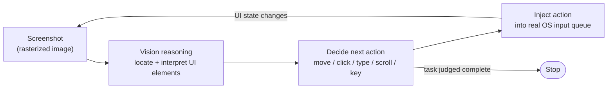
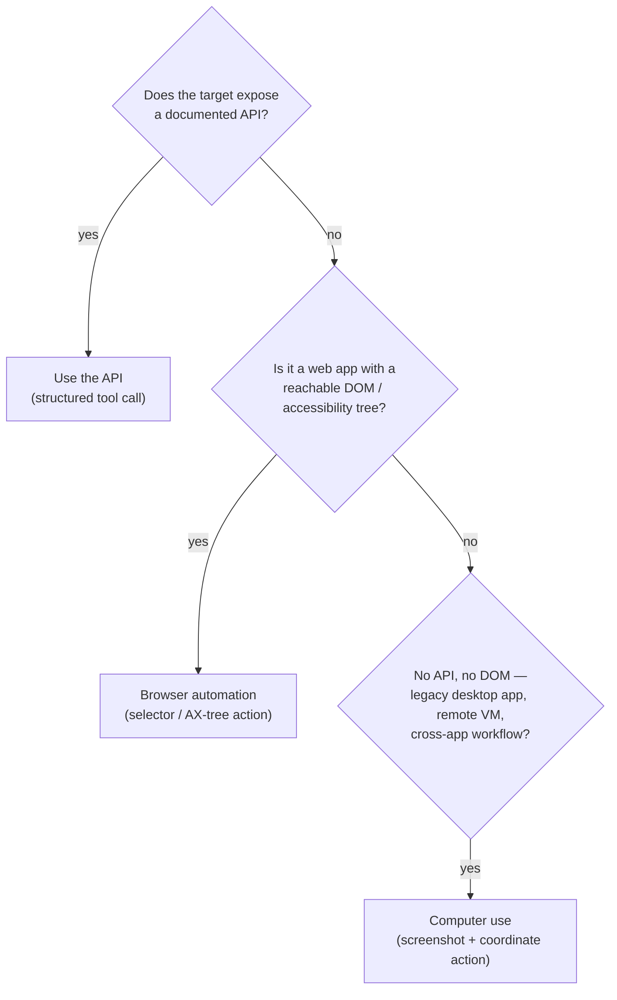

## Computer Use Agents

> Chapter of
> [[agentic-ai-engineering/readme#04 — Tools & Environment Interaction|Tools & Environment Interaction]],
> part of [[agentic-ai-engineering/readme|Agentic AI Engineering]].

## What you will understand at the end

- Why computer-use agents exist: what an agent does when there is no API, no DOM, and no
  accessibility tree to hand it structure for free
- The exact shape of the loop — screenshot in, reasoning over pixels, coordinate-based action out —
  and why that shape is inherently slower and more expensive than any structured tool call
- Why computer use sits at the **bottom** of a tool-selection hierarchy, not the top, and the
  concrete signals that tell you it's the right call anyway
- The grounding problem: how resolution, DPI scaling, theme, and layout drift break the mapping from
  "click the Submit button" to an actual pixel coordinate
- Why letting an agent drive a real desktop has a categorically larger blast radius than a scoped
  API key or a sandboxed browser tab, and what that changes about how you sandbox it
- Where GitHub Copilot's coding agent sits on this spectrum, and why that scoping choice is the
  textbook answer to GH-600's "evaluate the execution context for an agent" skill

---

## The mental model

Every other tool in this Part gives the model **structure for free**. A REST API returns typed JSON.
A browser's accessibility tree
([[agentic-ai-engineering/04-tools-and-environment-interaction/06-browser-automation/06-browser-automation|Browser Automation]])
exposes a labeled tree of interactive elements. Computer use gives the model none of that — it gives
the model a **picture** of a screen and asks it to act the way a human with no keyboard shortcuts
and no view-source would: look, decide, click, look again.

Compare this to a typed tool call: the model emits `{"name": "create_ticket", "input": {...}}`, your
code executes it, and a few hundred tokens of JSON come back. There is no visual parsing step and no
ambiguity about _where_ on a screen an action lands, because there is no screen — there's a function
signature. Computer use collapses that distinction: perception and action both have to go through
pixels, every single turn.

This is the same five-component execution loop from
[[building-agentic-systems/00-building-single-agent-systems/01-agent-architecture/01-agent-architecture|Agent Architecture]]
— LLM, Tools, Memory, Planning, Execution Loop — but with two components under unusual strain.
**Tools** now returns an image instead of text, so every tool result is expensive. **Memory** has to
decide whether to keep prior screenshots in context (accurate but token-hungry) or drop them (cheap
but the model loses its own history of what it already tried).

---

## The tool-selection hierarchy: why computer use is last

Before reaching for computer use, the honest question is: _does something better already exist for
this target?_ There's a strict ordering, and computer use is the bottom rung, not a peer choice:

Each rung down this ladder trades determinism for reach. An API call fails loudly with a typed
status code. A DOM selector fails loudly with "element not found." A mis-grounded computer-use click
fails **silently** — the action executes, something happens, and neither the model nor your harness
has any built-in signal that it was the wrong something. That asymmetry — cheap, typed failure at
the top of the ladder versus expensive, silent failure at the bottom — is the real reason computer
use is a last resort, not just a slower one.

Reach for it when, and only when, all of the following hold:

- The target has no exported API and no scriptable CLI
- The target's UI doesn't expose a usable DOM or accessibility tree (a legacy Win32/Java Swing
  desktop app, a remote VM accessed over VNC/RDP, an app that actively obfuscates its accessibility
  metadata)
- The task genuinely spans multiple such surfaces in a way no single integration would cover
- You've priced in the latency, token cost, and blast radius below and it's still worth it

---

## The perception–action loop, mechanically

Each turn of a computer-use agent does five things:

1. **Capture** — a screenshot of the current display state, typically PNG-encoded
2. **Perceive** — the model reads the image as vision input and has to _re-derive_ structure that a
   DOM would have handed over as text: where is the "Submit" button, is that a text field or a
   disabled label, is a dropdown currently open
3. **Decide** — the model picks one action: `move_mouse(x, y)`, `left_click`, `type("text")`,
   `key("Return")`, `scroll(dx, dy)` — always coordinate-based, never selector-based
4. **Act** — your harness injects that action into the real (or virtualized) input queue: an X11/
   Wayland input driver, a VNC client, a cloud desktop's input API
5. **Observe** — a fresh screenshot is taken and the loop repeats, until the model judges the task
   done or a max-iteration/timeout budget fires

Two things fall out of this shape that don't apply to any other tool in this Part:

- **Every turn is billed in image tokens, not JSON tokens.** A single screenshot at a sensible
  resolution runs from roughly 1,300–1,600 vision tokens on earlier tool versions up to several
  thousand on the higher-resolution variants shipped with recent models — before any reasoning about
  what's _in_ the image. A tool call to a REST endpoint costs a few hundred tokens for the whole
  round trip. At agent-loop scale (tens of turns per task), this difference compounds directly into
  cost and latency.
- **There is no cheap way to skip re-perceiving.** A DOM-based tool can often act off a cached
  selector without re-querying the page. A computer-use agent has almost no way to trust that the
  screen still looks like it did two turns ago — a slow-loading widget, a notification banner, a
  focus change, or the window simply losing focus to another app all invalidate the previous
  screenshot. Re-screenshotting every turn isn't a design choice you can optimize away; it's the
  floor cost of operating blind.

---

## Latency and reliability vs. API-based and DOM-based tools

| Dimension                    | Native API tool                                    | Browser DOM / accessibility tree ([[agentic-ai-engineering/04-tools-and-environment-interaction/06-browser-automation/06-browser-automation | Ch. 6]])                                                                                   | Computer use (screenshot + coordinates) |
| ---------------------------- | -------------------------------------------------- | ------------------------------------------------------------------------------------------------------------------------------------------- | ------------------------------------------------------------------------------------------ | --------------------------------------- |
| What the model receives      | Typed JSON schema                                  | Serialized DOM / AX-tree subset (still text)                                                                                                | A rasterized image — meaning must be visually re-derived every turn                        |
| What the model emits         | A typed function call                              | A selector-scoped action (`click #submit-btn`)                                                                                              | A raw pixel coordinate plus an action verb                                                 |
| Cost per round trip          | Cheap — hundreds of tokens                         | Moderate — depends on DOM size sent                                                                                                         | Expensive — thousands of image tokens per screenshot, every turn                           |
| Latency per turn             | One network call                                   | One network call + DOM query                                                                                                                | Screenshot capture + encode + model vision pass + input injection                          |
| Determinism                  | High — same input, same effect, versioned contract | Medium — markup and selector IDs can shift between page versions                                                                            | Low — resolution, scaling, theme, and layout drift all shift the target                    |
| Failure signal               | Typed error (4xx/5xx) — code can branch on it      | Exception: selector not found                                                                                                               | **Silent miss-click** — the action executes on the wrong element with no error at all      |
| Recovery pattern             | Retry with backoff on a known error class          | Re-query the DOM, retry the selector                                                                                                        | Re-screenshot, re-reason from scratch — no cheaper partial-recovery path exists            |
| Engineering cost to stand up | Low — schema + auth                                | Medium — selector maintenance as pages change                                                                                               | High — screen-capture pipeline, virtualized display, an input-injection driver, sandboxing |

The failure-signal row is the one that matters most in production. A typed API error is a code path
you write once. A silent miss-click is a correctness bug that only shows up when someone notices the
task didn't actually happen — which, for anything not independently verified, can be a long time
later.

---

## The grounding problem: clicking the wrong pixel

**Grounding** is the act of mapping a semantic intent — "click the Submit button" — onto an exact
`(x, y)` pixel pair the harness will actually click. It only works when the model's internal image
representation lines up 1:1 with the real screen the harness is about to act on. Several independent
sources of drift break that alignment, and they compound:

- **Resolution mismatch.** If the harness resizes the screenshot before sending it to the model, the
  model's returned coordinates are in _model image space_, not _real screen space_. Getting the
  scale factor wrong — a common bug when resizing happens on one side of the round trip and not the
  other — shifts every click by a fixed, silent offset. The effect is worse on dense UIs: a 4-pixel
  error is fatal on a small icon, cosmetic on a full-width button.
- **DPI / display scaling.** OS-level scaling (Windows at 125%/150%, macOS Retina at 2x) changes the
  ratio between logical points and physical pixels. A screenshot captured at physical resolution but
  an action injected at logical coordinates (or vice versa) drifts systematically across the entire
  screen, not just at one element.
- **Theme and font-size drift.** An agent that reasons well against a light-theme reference can
  misjudge element boundaries in dark mode. Browser zoom or OS-level font scaling reflows text and
  shifts every element below the reflow point — coordinates computed from one screenshot are stale
  the instant layout changes.
- **Dynamic layout.** A button at `(640, 480)` this turn may not be there next turn — a loading
  spinner resolves, a banner appears, a slightly slower network response reflows the page below it.
  Because each turn's screenshot is a fresh snapshot, the agent can't rely on "it's always been
  there" the way a cached CSS selector implicitly can.
- **Window and focus state.** A window behind another window, or a target application that isn't
  focused, looks identical in a screenshot to a UI element that simply doesn't exist. The model has
  no built-in signal to tell "occluded" apart from "absent" without an explicit extra perception
  step.

**Mitigations that actually help, in practice:** keep screenshot resolution inside the range the
tool was tuned for rather than an arbitrary native resolution — Anthropic's own guidance for its
computer-use tool is that roughly 1080p screenshots balance grounding accuracy against cost, with
1366×768 or 720p as lower-cost options that still perform well for less dense UIs; disable OS-level
display scaling in the target environment so logical pixels equal physical pixels; and re-screenshot
after _every_ action rather than assuming the prior layout still holds. None of this eliminates the
grounding problem — it narrows the window in which drift can sneak in. Newer, higher-resolution tool
variants (shipped alongside the current model generation) raise the pixel ceiling and reduce
downscaling error, but they don't remove the underlying problem: coordinates are a proxy for
meaning, and proxies drift.

---

## Blast radius: a full desktop vs. a scoped API or browser session

This is the tradeoff that actually changes how you're allowed to deploy the thing, not just how well
it performs.

A native API tool is scoped **by construction**. Whatever credential the agent holds grants access
to one service, a specific set of object types, and a specific set of verbs — the model cannot
express an action outside that surface because there is no "click" primitive available to it at all.
A browser- automation tool
([[agentic-ai-engineering/04-tools-and-environment-interaction/06-browser-automation/06-browser-automation|Ch. 6]])
is scoped one level up: it can act only inside a browser context — typically one controlled tab or
profile — and it's straightforward to allowlist domains and to prevent file-system or OS-level side
effects entirely.

Computer use has neither boundary. Once an agent can move a mouse and type on a keyboard, its
_capability surface is the entire visible desktop_, not a curated subset of it. In principle it can
open a terminal and run arbitrary commands, switch to an already-logged-in browser tab for something
unrelated to the task (personal email, an internal admin console, a banking session), read whatever
is on the clipboard, or trigger an OS-level dialog. This is why the tradeoff isn't just "slower and
less accurate than an API call" — it's "the same class of mistake, on a categorically larger surface
for it to happen on."

| Sandboxing concern                | Scoped API tool                                   | Browser-automation tool                       | Computer-use tool                                                                                |
| --------------------------------- | ------------------------------------------------- | --------------------------------------------- | ------------------------------------------------------------------------------------------------ |
| Natural isolation boundary        | Credential scope (org/service/verb)               | Browser profile / tab                         | The entire OS desktop session                                                                    |
| What "least privilege" means here | Narrowest API scope the task needs                | Domain allowlist, no filesystem access        | A disposable, network-restricted VM with its own display                                         |
| Session reuse across tasks        | Usually fine — credential is the boundary         | Fine if cookies/storage are cleared           | **Avoid** — a warm desktop accumulates logged-in sessions and history the agent shouldn't retain |
| Audit trail                       | Structured tool-call log (typed request/response) | Structured action log + optional DOM snapshot | Screenshot + coordinate log — expensive to store, hard to search                                 |
| Human-approval gate               | Gate destructive verbs (delete, pay, send)        | Gate form submissions on sensitive domains    | Gate an entire _action class_ — the model can't self-certify a click was safe before it happens  |

Concretely, this changes what "sandbox it" has to mean for computer use specifically:

- Run it inside an isolated, disposable VM or container with its own virtual display — never against
  a real user's actual desktop session
- Treat that VM as ephemeral: snapshot and destroy per task rather than keeping a warm desktop
  across tasks, precisely because a warm desktop is where stale credentials and logged-in sessions
  accumulate
- Apply network egress control at the VM boundary, since there's no narrower "application layer" to
  gate inside a full desktop the way there is inside a browser profile or an API client
- Add a human-approval gate before any action class you'd call destructive — file deletion, a form
  submission, a purchase confirmation — because the model cannot reliably predict what a click will
  do until after it's already done it
- Log every screenshot and every action as the audit trail, and store the structured metadata
  (timestamp, coordinate, verb) as searchable logs/traces even when the visual evidence itself lives
  in cheaper object storage — "what did the agent actually click" needs to be answerable without
  scanning a folder of screenshots one at a time

### GitHub Copilot in practice

It's worth being precise here because it's a common source of confusion: **GitHub Copilot's coding
agent does not operate a full desktop GUI.** It is deliberately scoped. Given a task — typically a
GitHub issue assigned to it — it works inside a sandboxed, ephemeral compute environment with a
checked-out copy of the repository, a shell, and the ability to run build/test commands, and it
delivers its result as a pull request for human review. Its entire action surface is "read and write
files in a repo checkout, run commands in that sandbox, open a PR" — never "click anywhere visible
on a screen."

That contrast is exactly the tradeoff this chapter has been building toward. Copilot's coding agent
gives up generality — it cannot drive an arbitrary desktop application, cannot fill out a form in a
legacy internal portal with no CLI, cannot operate anything that isn't reachable through a repo and
a shell — in exchange for a dramatically smaller and better-understood blast radius (repo-scoped,
PR-gated, sandbox-contained) and dramatically higher reliability, because it never has the grounding
problem at all: it's acting on exact file paths and shell output, not on rendered pixels it has to
visually reinterpret every turn.

This is the textbook shape of what GH-600's guardrails domain calls "evaluating the execution
context for an agent." Before granting a capability, you scope the agent to the _narrowest_
execution context that gets the job done — and you only widen that context when the task genuinely
has no narrower structured surface available. Computer use is the correct call precisely when there
is no API, no CLI, and no DOM to fall back on; even then, it should run under the same "assume worst
case, scope tightly" posture that Copilot's coding agent gets for free by design, not as an
afterthought bolted on once something has already gone wrong.

One more distinction worth carrying into GH-600 prep: a code-execution sandbox
([[agentic-ai-engineering/04-tools-and-environment-interaction/08-code-execution/08-code-execution|Ch. 8]])
and a computer-use VM are solving the _same_ underlying problem — contain a model-controlled action
— at different layers of the stack. But the isolation computer use needs (network egress control, an
ephemeral VM, no shared browser profile, a locked-down display) is strictly heavier than what a
scoped API-key tool or a repo-checkout sandbox needs, because the action surface it's containing is
strictly larger. Matching the isolation level to the actual capability granted — not applying one
sandboxing policy uniformly across every tool type — is the judgment call the exam's guardrails
domain is testing for.

---

## When computer use is the right call anyway

None of the above is an argument for never using it. It's an argument for using it _deliberately_,
when the alternative is worse, not because it's the most capable-sounding option:

- **Legacy enterprise desktop software with no exported API** — an old ERP or CRM client that only
  ever shipped a GUI, where reverse-engineering an undocumented protocol is more fragile than
  operating the UI the way an employee would
- **RPA-style workflows spanning disconnected internal tools** — when the task genuinely crosses
  several systems that share no common integration surface, and building bespoke connectors for each
  would take longer than the task is worth
- **UI regression testing and QA automation** that must exercise the actual rendered surface a real
  user sees, not a mocked API layer underneath it
- **Accessibility and usability testing** that specifically needs to simulate real
  visual/interaction patterns, where the point of the test is the rendered experience itself

Notice the "last resort" framing still holds in every one of these: you reach for computer use
because the realistic alternative — reverse-engineering a private API, or scraping the accessibility
tree of an app that doesn't reliably expose one — is _more_ brittle, not because computer use is
inherently the better engineering choice.

---

## Concept check

Before moving on, you should be able to answer these without notes:

| Question                                                                                     | Answer hint                                                                                                                |
| -------------------------------------------------------------------------------------------- | -------------------------------------------------------------------------------------------------------------------------- |
| Why is computer use the bottom of the tool-selection hierarchy, not a peer to API/DOM tools? | Its failures are silent (a miss-click executes with no error), while API and DOM failures are typed and catchable          |
| What makes each turn of a computer-use loop expensive?                                       | The model has to re-perceive the entire screen as image tokens every turn — there's no cheap way to skip re-screenshotting |
| Name three independent sources of grounding drift.                                           | Resolution mismatch, DPI/display scaling, theme/font reflow, dynamic layout, window/focus state (any three)                |
| Why is the blast radius of computer use categorically larger than a scoped API tool?         | The capability surface is the entire visible desktop, not a curated set of verbs on one service                            |
| Why doesn't GitHub Copilot's coding agent count as a computer-use agent?                     | It operates on a repo checkout and shell inside a sandbox — never on rendered pixels via mouse/keyboard                    |

---

## Vocabulary glossary

| Term                   | Definition                                                                                                                                                                              |
| ---------------------- | --------------------------------------------------------------------------------------------------------------------------------------------------------------------------------------- |
| Computer use           | A client-side tool class where the model perceives a screenshot and emits coordinate-based mouse/keyboard actions instead of structured tool calls                                      |
| Grounding              | Mapping a semantic intent ("click Submit") onto an exact pixel coordinate the harness will act on                                                                                       |
| Perceive–plan–act loop | The screenshot-in, reason, coordinate-action-out cycle that repeats every turn of a computer-use agent                                                                                  |
| Visual drift           | Any mismatch between the screenshot the model reasoned over and the real screen the action lands on — resolution, DPI, theme, or layout change                                          |
| Blast radius           | The full set of unintended effects an agent's action surface makes possible, not just the intended ones                                                                                 |
| Accessibility tree     | The structured, labeled tree of interactive UI elements an OS or browser exposes to assistive tools — the layer browser automation reads instead of pixels                              |
| Execution context      | The scope of environment, permissions, and action surface granted to an agent for a given task — the thing GH-600's guardrails domain asks you to evaluate before granting a capability |
