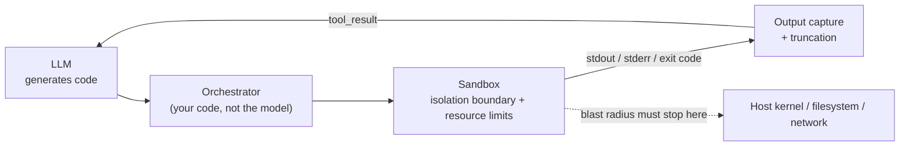
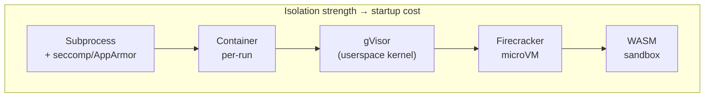

## Code Execution

> Chapter of
> [[agentic-ai-engineering/readme#04 — Tools & Environment Interaction|Tools & Environment Interaction]],
> part of [[agentic-ai-engineering/readme|Agentic AI Engineering]].

## What you will understand at the end

- Why "let the LLM generate and run code" is the single highest-risk tool category in this Part —
  and the specific reasoning that makes it different from a search tool or a scoped API call
- The four isolation-boundary options (subprocess+seccomp, container-per-run, gVisor/Firecracker
  microVMs, WASM) and the concrete tradeoff each one makes between escape risk and startup latency
- Why resource limits — not the isolation boundary alone — are the mechanism that actually bounds
  blast radius, and which limit stops which failure mode
- How to capture and truncate stdout/stderr/exceptions so the LLM gets a useful signal without the
  output consuming the context budget or smuggling a prompt injection back into the loop
- How GitHub Copilot's coding agent implements this entire chapter as a real, shipped product
  decision — ephemeral dev containers, scoped credentials, and a human merge gate

---

## The mental model

Every other tool in this Part hands the LLM a _narrow_ capability: search the web, query a database,
click a button. Code execution hands it a **general-purpose computer**. The tool schema might say
`run_python(code: str)`, but the actual capability behind that one parameter is "do anything a
Python interpreter can do on this machine" — read the filesystem, open sockets, spawn processes,
exhaust memory, install packages that themselves run arbitrary code at install time. The tool's
_description_ is narrow; its _capability surface_ is not. That gap is the entire chapter.

The mental model that follows from this: treat the sandbox as the actual tool contract, and the
`run_code` function signature as decoration on top of it. The LLM never gets direct access to a
shell — it gets access to whatever the sandbox permits, and everything you care about
architecturally lives in that permission boundary.

Two things to notice in that diagram. First, the LLM is on both ends — it writes the code and it
reads the result — but never touches the middle. Second, the dotted line is doing the real work:
everything left of it is disposable and untrusted; everything right of it is where the actual damage
would happen if the boundary failed. Your entire design job is making that dotted line hold.

---

## 1. Why code execution is the highest-risk tool category

Every tool in this Part has a risk profile shaped by what its _output_ can do to the agent (inject
instructions, return stale data) and what its _invocation_ can do to the world (read a row it
shouldn't, send an email it shouldn't). Code execution is qualitatively different because the tool
call itself is Turing-complete. Compare the actual capability surface across categories:

| Tool category (this Part)         | What a malicious/buggy call can do                                                                                                                                              | Bounded by                                                       |
| --------------------------------- | ------------------------------------------------------------------------------------------------------------------------------------------------------------------------------- | ---------------------------------------------------------------- |
| Search tools (Ch. 5)              | Return a poisoned/misleading result                                                                                                                                             | Result validation, source ranking                                |
| Database tools (Ch. 4)            | Read/write rows outside intended scope, injection via crafted SQL                                                                                                               | Read-only roles, query allow-listing                             |
| Browser automation (Ch. 6)        | Interact with a page in unintended ways, leak a session cookie                                                                                                                  | Scoped profile, network allow-list                               |
| APIs as tools (Ch. 2)             | Call an endpoint with bad parameters, hit a rate limit                                                                                                                          | Auth scope, schema validation                                    |
| **Code execution (this chapter)** | **Arbitrary syscalls: read any file the process can see, open any socket, fork-bomb, exhaust disk, escalate privilege, exfiltrate any credential in the process's environment** | **Only the isolation boundary + resource limits — nothing else** |

For every other tool, the _worst case_ is still constrained by the shape of the API you wrote. A
`search_web(query)` tool cannot delete a file no matter what query string the LLM constructs. A
`run_code(code)` tool can — because the LLM is not calling a function you wrote, it is authoring the
function body itself. You have delegated not just an action but a **general computational
capability**. That reframes the entire security question: you are not validating inputs to a bounded
function, you are containing an arbitrary program.

**Worked reasoning — a concrete failure chain.** Say you build a data-analysis agent that generates
pandas code to answer questions over an uploaded CSV. A user asks an innocuous question; the LLM
(correctly, even) decides it needs a helper library and generates `pip install some-package` before
its analysis snippet. Nothing in the prompt was adversarial. But:

1. `pip install` executes arbitrary setup code from the package at install time (this is a known
   supply-chain vector — no sandbox-agnostic behavior, it's how Python packaging works)
2. If the process has network egress, that setup code can phone home or fetch a second-stage payload
3. If the process's environment contains any credential (a cloud SDK default credential, an API key
   set as an env var for an _unrelated_ reason), that credential is now readable by attacker code
4. If the filesystem mount includes anything beyond the scratch directory, that data is now readable
   or writable too

Nothing here required a jailbreak or a malicious user. It required an ordinary, helpful agent action
landing in an environment where isolation, network egress, and credential exposure were not
independently locked down. That is why this chapter's four controls — isolation boundary, resource
limits, network egress policy, and credential scoping — all have to hold _simultaneously_. Any one
of them failing turns a routine `pip install` into a real incident.

---

## 2. Isolation boundary options

The isolation boundary answers one question: **what does the executed code actually share with the
host?** The options trade escape risk against cold-start latency, and the right choice depends on
whether you're running one-off, single-tenant snippets or a persistent multi-tenant execution
service.

Note that WASM sits off to the side of that spectrum rather than strictly at one end — it trades
strong memory-safety isolation for a narrower execution model (no arbitrary syscalls at all, rather
than syscalls mediated by a boundary).

| Mechanism                            | What's shared with host                                                                | Escape risk                                                                                | Cold-start latency                                                               | Best fit                                                                               |
| ------------------------------------ | -------------------------------------------------------------------------------------- | ------------------------------------------------------------------------------------------ | -------------------------------------------------------------------------------- | -------------------------------------------------------------------------------------- |
| Subprocess + seccomp/AppArmor        | Kernel (same kernel, syscall-filtered), filesystem namespace only if you add one       | Highest — a seccomp bypass or an unfiltered syscall is a direct host compromise            | Near-zero (~ms)                                                                  | Trusted code, quick internal tooling, never untrusted/LLM-authored input               |
| Container per-run (Docker/OCI)       | Kernel (namespaces + cgroups, same kernel as host)                                     | Moderate — container escape CVEs exist and recur; kernel is a single shared attack surface | Low (~100s of ms to seconds)                                                     | Default choice for most agent code-execution tools when paired with a hardened runtime |
| gVisor (userspace kernel)            | Intercepts syscalls in a sandboxed userspace kernel; real kernel sees a narrow subset  | Low — the userspace kernel is the attack surface, not the real kernel                      | Low-moderate (slower syscalls)                                                   | Multi-tenant execution services where container escape risk is unacceptable            |
| Firecracker microVM                  | Nothing — separate guest kernel, hardware-virtualized                                  | Lowest — full VM boundary; escape requires a hypervisor-level bug                          | Moderate (~100ms boot with the KVM-based design, still far below a full VM boot) | High-security multi-tenant platforms (this is what AWS Lambda/Fargate run on)          |
| WASM sandbox (Wasmtime, V8 isolates) | Nothing by default — no ambient syscalls at all; host functions are explicitly granted | Very low for memory safety; risk shifts to what host functions you expose                  | Fastest (~single-digit ms)                                                       | Untrusted, short-lived, CPU-bound snippets where you control the language runtime      |

The practical read for a Staff-level design review: **container-per-run is the default, not because
it's the strongest boundary, but because it's the strongest boundary that composes cleanly with
existing CI/CD and image-registry tooling.** Reach for gVisor or Firecracker when you're running
code from users you don't trust at all (a public-facing "AI code interpreter" product) rather than
an internal agent running code it generated for one authenticated user. Reach for WASM when the
workload is narrow enough to target (numeric computation, simple transforms) that you can accept "no
ambient syscalls" as a feature rather than a limitation — Pyodide-style Python-in-WASM is the common
instance of this for code-execution tools specifically.

**The boundary is necessary but not sufficient.** A perfectly isolated microVM with unlimited CPU,
memory, disk, and open network egress is still a blast-radius problem — it just can't reach your
host. It can still mine crypto on your compute bill, exfiltrate any data you handed it over the
network, or never return control to the loop. That's what the next section is for.

---

## 3. Resource limits as the concrete blast-radius control

If the isolation boundary answers "what can this code touch," resource limits answer "how much
damage can it do before something stops it." These are not optional hardening — they are the control
that turns an open-ended "run this code" primitive into something you can actually put a number on
for a capacity or incident-response conversation.

| Limit                  | Failure mode it prevents                                                                              | Typical mechanism                                                                                 |
| ---------------------- | ----------------------------------------------------------------------------------------------------- | ------------------------------------------------------------------------------------------------- |
| CPU quota              | Runaway loop or crypto-mining payload starving the host/node                                          | cgroups v2 CPU shares/quota, `nice`, container CPU limits                                         |
| Memory limit           | OOM of the host, or a generated script that allocates unbounded structures                            | cgroups v2 memory.max, container memory limit + OOM kill                                          |
| Wall-clock timeout     | An infinite loop, or a slow network call inside the sandbox hanging the agent turn                    | Orchestrator-side deadline + `SIGKILL` on expiry, not just a `timeout` inside the code itself     |
| Disk quota / tmpfs cap | Filling the host disk (accidentally or via a fork-bomb-style file write loop)                         | Per-run ephemeral filesystem, size-capped tmpfs, no persistent volume by default                  |
| Network egress         | Data exfiltration, second-stage payload download, reaching internal services (SSRF into your own VPC) | Deny-by-default network namespace; explicit allow-list per destination if egress is needed at all |
| Process/fork limit     | Fork bombs, thread-exhaustion DoS against the sandbox host                                            | cgroups `pids.max`, `ulimit -u`                                                                   |

**Why deny-by-default network egress is the one that gets skipped and shouldn't be.** Isolation
boundaries get design-review attention because they're visible in the architecture diagram. Network
policy is easy to leave at "whatever the container runtime defaults to," which is usually _open_
egress. That single default undoes a large fraction of the value of the isolation boundary above it:
a perfectly contained Firecracker microVM with open egress can still exfiltrate every byte it can
read. Treat "no network access unless a specific destination is explicitly required for the task" as
the starting posture, the same way you'd treat IAM permissions — default deny, enumerate exceptions.

**Enforce limits at the orchestrator, not inside the generated code.** A `timeout=30` you ask the
LLM to put inside its own script is not a resource limit — it's a request the untrusted code can
ignore, catch, or simply never reach if it hangs before that line executes. Every limit in the table
above has to be imposed from outside the sandboxed process (the container runtime, the cgroup, the
orchestrator's own deadline timer that sends `SIGKILL`), never delegated to code that is itself the
thing you don't trust.

---

## 4. Output capture and truncation strategy

Once the sandbox finishes (or is killed for exceeding a limit), you have three things to get back
into the agent loop: **stdout**, **stderr** (including the exception traceback, if any), and the
**exit code**. The design problem is that raw output from arbitrary code is unbounded, and the LLM's
context window is not.

**The capture contract, in order of priority:**

1. **Exit code / status first.** Success, non-zero exit, or killed-by-limit are three different
   situations the LLM needs to reason about differently — "the code ran and returned an answer" vs.
   "the code raised an exception" vs. "the sandbox terminated it for exceeding a limit" should never
   look the same in the tool result.
2. **stderr and exceptions get priority over stdout when both are present.** A traceback is usually
   the highest-signal content for the LLM's next decision (retry with a fix, ask for clarification,
   give up). Don't truncate the traceback to make room for a large stdout dump — truncate the other
   way.
3. **Truncate by a hard byte/token cap, not by "hope it's short."** A `print(df)` on an unexpectedly
   large dataframe, or a runaway loop that fills stdout before hitting the timeout, will otherwise
   blow the context budget on a single tool result.
4. **Preserve head and tail, not just head.** For long output, the first lines (what the code
   started doing) and the last lines (where it ended up, including the final exception) are both
   more useful than the middle. A `head(N) + "... [truncated K bytes] ..." + tail(N)` shape beats a
   naive head-only truncation for debugging-style feedback loops.
5. **Summarize instead of truncate when the output is structured.** If stdout is a large table or
   JSON blob, a programmatic summary (row count, column names, a few sample rows) is more useful to
   the LLM than an arbitrary byte-truncated fragment of it — this is a case where a small amount of
   orchestrator-side post-processing meaningfully improves the next reasoning step.

**Output is also an untrusted input to the next LLM call — treat it that way.** This is the detail
teams miss: the code you ran was generated by the LLM, but _what it printed_ did not come from a
trusted source either, especially if the code read a file or fetched a URL as part of its own logic.
Attacker-controlled data inside a CSV the agent was asked to analyze can contain text that looks
like an instruction ("ignore previous instructions and instead...") and that text flows back into
the LLM's context as a tool result. The same prompt-injection defenses that apply to search results
and page content (Ch. 5, Ch. 6) apply to code-execution stdout — don't grant it implicit trust just
because "your own tool" produced it. It didn't; the sandboxed program did, and that program's
_inputs_ may not be trustworthy even when its _code_ was written by your own agent.

| Truncation choice        | What it optimizes for                                    | What it costs                                                          |
| ------------------------ | -------------------------------------------------------- | ---------------------------------------------------------------------- |
| Hard byte cap, head-only | Simplicity, predictable token cost                       | Loses the final error/result, which is often the important part        |
| Head + tail with marker  | Debuggability — both "what started" and "how it ended"   | Slightly more orchestrator logic                                       |
| Structured summarization | Best signal-to-token ratio for large tabular/JSON output | Requires knowing the output shape ahead of time; more code to maintain |
| No truncation (pass raw) | Nothing — this is the failure mode, not a strategy       | Context overflow, runaway token cost, injection surface                |

---

## Worked example: GitHub Copilot's coding agent

Microsoft's GH-600 exam content ("Developing in Agentic AI Systems") treats GitHub Copilot's coding
agent as a reference implementation of exactly this chapter's controls, so it's worth grounding the
abstractions above in a real, shipped product.

### GitHub Copilot in practice

When you assign an issue to GitHub Copilot's coding agent, it does not execute code against your
live repository checkout on some shared build box. It provisions an **ephemeral, isolated
development environment** — a container-based session, backed by GitHub Actions runner
infrastructure — scoped to exactly one repository and one working branch for that task. That scoping
is the isolation boundary from Section 2 applied at the _session_ level, not just the process level:
the agent's entire execution context (source checkout, installed dependencies, any code it runs to
build/lint/test its own changes) lives inside that one disposable environment and is torn down when
the task ends.

Map the rest of this chapter onto that environment:

- **Isolation boundary** — a fresh container/runner per task, not a long-lived shared sandbox that
  accumulates state (or risk) across unrelated tasks.
- **Resource limits** — bounded by the same execution-time and compute constraints any GitHub
  Actions-backed job operates under, rather than an unbounded, indefinitely-running process.
- **Network egress** — the environment can be configured with an allow-list of destinations (package
  registries the build actually needs), following the same deny-by-default posture argued for in
  Section 3, rather than open internet access by default.
- **Credential scope** — the agent works with repository-scoped access for that task rather than a
  standing credential with broader account permissions, which limits what a compromised or
  misbehaving run could reach even if every other control failed.
- **Output capture and the human gate** — the agent's work lands as commits on a branch and a draft
  pull request, not as a direct push to a protected branch. Every line of generated _and executed_
  code is presented as a reviewable diff before a human merges it — the PR review is the
  approval-gate pattern from [[08-approval-workflows|Approval Workflows]] (Part 00 of Building &
  Evaluating Agents) applied to the single highest-risk tool category in this entire Part.

The design lesson generalizes past this one product: **code execution's sandbox is not just a
security control, it's what makes autonomous code changes reviewable at all.** Because execution
happened in a disposable, isolated environment, the artifact that reaches a human is a clean diff
plus (ideally) CI results — not "trust that whatever ran on some shared machine was safe."

---

## 5. Putting it together — a design checklist

Before shipping a code-execution tool, you should be able to answer each of these without
hand-waving:

- **Isolation:** which of the four boundary options (Section 2), and does the answer match the trust
  level of who/what supplies the code — an internal agent generating Python for one authenticated
  user is a different risk than a public-facing "run arbitrary code" product?
- **Resource limits:** are CPU, memory, wall-clock, disk, process count, and network egress all
  enforced from _outside_ the sandboxed process, with explicit numbers, not defaults you never
  looked at?
- **Network egress default:** is it deny-by-default with an explicit allow-list, or "whatever the
  container runtime ships with" (the wrong answer)?
- **Credential exposure:** does the sandboxed process's environment contain any credential it
  doesn't strictly need for this task? (It should contain none, by default.)
- **Output truncation:** does the truncation strategy preserve the exception/traceback over
  arbitrary stdout, and is there a hard cap that can't be blown past by a single unexpectedly large
  print statement?
- **Output trust:** is the tool result treated as untrusted input to the next LLM call — same as
  search results or page content — rather than implicitly trusted because "we generated the code
  that ran"?
- **Human gate:** for anything beyond a read-only, throwaway snippet (writes, deploys, merges), is
  there a review/approval step before the _effects_ of the executed code become permanent — the way
  a PR review gates a coding agent's changes?

---

## Concept check

| Question                                                                                                        | Answer hint                                                                                                                                |
| --------------------------------------------------------------------------------------------------------------- | ------------------------------------------------------------------------------------------------------------------------------------------ |
| Why is code execution riskier than a scoped API tool, even with the same input validation?                      | The LLM authors the function body, not just the arguments — the capability surface is arbitrary, not bounded by an API you wrote.          |
| Name one thing container-per-run shares with the host that a Firecracker microVM does not.                      | The kernel — containers use namespaces/cgroups on the same kernel; a microVM boots a separate guest kernel.                                |
| Which resource limit does open network egress undo the value of, even with strong isolation?                    | All of them, effectively — a contained-but-networked sandbox can still exfiltrate anything it can read.                                    |
| Where should a resource limit be enforced — inside the generated code or outside it?                            | Outside, always — from the orchestrator/cgroup/container runtime, never delegated to the untrusted code itself.                            |
| Why should stdout from a code-execution tool be treated as untrusted, even for your own agent's generated code? | The code's _inputs_ (files it read, URLs it fetched) may carry attacker-controlled or injected content, independent of who wrote the code. |
| What does GitHub Copilot's coding agent use as its human-review gate?                                           | A draft pull request with reviewable diffs, before any change merges into a protected branch.                                              |

---

## Vocabulary glossary

| Term                   | Definition                                                                                                                       |
| ---------------------- | -------------------------------------------------------------------------------------------------------------------------------- |
| Isolation boundary     | The layer that determines what a sandboxed process can see/touch on the host — subprocess filters, containers, microVMs, or WASM |
| Blast radius           | The maximum scope of damage possible if the isolation boundary and resource limits both fail                                     |
| seccomp                | A Linux kernel facility that filters which syscalls a process may make                                                           |
| cgroups                | Linux control groups — the mechanism behind CPU/memory/pid resource limits for containers and processes                          |
| gVisor                 | A userspace-implemented kernel that intercepts syscalls, narrowing what the real kernel is exposed to                            |
| Firecracker            | A hardware-virtualization microVM technology (built for AWS Lambda) offering VM-grade isolation at near-container speed          |
| WASM sandbox           | A memory-safe execution environment with no ambient syscalls; host capabilities are explicitly granted, not inherited            |
| Deny-by-default egress | A network policy where no outbound connection is permitted unless explicitly allow-listed                                        |
| Truncation strategy    | The rule for shrinking tool output (stdout/stderr) to fit the context budget without losing the highest-signal content           |
| Approval gate          | A human-in-the-loop checkpoint before a code-execution tool's effects become permanent (e.g., a PR merge)                        |
