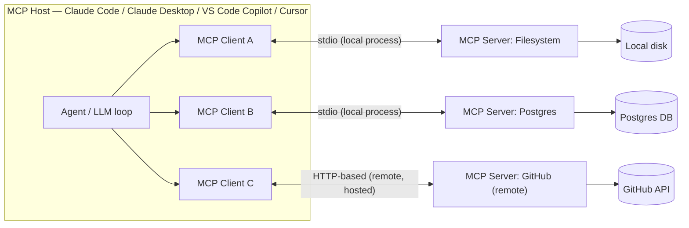
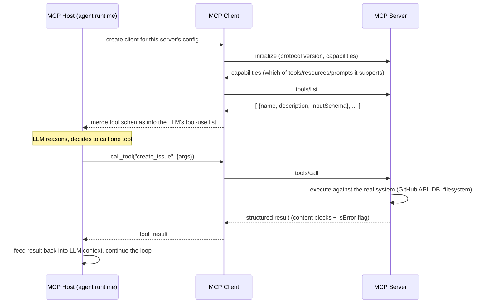

## Model Context Protocol (MCP)

> Chapter of
> [[agentic-ai-engineering/readme#04 — Tools & Environment Interaction|Tools & Environment Interaction]],
> part of [[agentic-ai-engineering/readme|Agentic AI Engineering]].

## What you will understand at the end

- Why MCP exists: the N×M tool-integration problem it replaces, and why "one more framework" or "one
  more SDK" was never going to fix it
- The client-server architecture — **host**, **client**, **server**, and **transport** — and which
  component owns which responsibility
- The three primitives an MCP server exposes (tools, resources, prompts) and who controls each one
  (the model, the application, or the user)
- The discovery-then-invocation lifecycle every MCP interaction follows: `initialize` → `tools/list`
  → `tools/call` → structured result
- GitHub's specific MCP mechanics — the hosted remote server, MCP registries, and MCP allow-lists —
  at the depth the GH-600 "Configure MCP servers" objective expects
- Where MCP's real security surface is, and why "the server is just another tool" understates the
  blast radius

---

## The mental model

Before MCP, "give the agent a tool" meant writing an adapter: a Python function with a docstring for
LangChain, a `BaseTool` subclass for CrewAI, a JSON schema block for the OpenAI SDK, a
`FunctionTool` for Google ADK — one bespoke shim per (framework, external system) pair. MCP replaces
all of those shims with **one wire protocol**. Any MCP-compliant host can talk to any MCP-compliant
server, without either side knowing anything about the other's internals.

The cleanest analogy for a Principal-level audience: MCP is to agent tools what the **Language
Server Protocol (LSP)** is to editor tooling. Before LSP, every editor (VS Code, Vim, Emacs) needed
a custom plugin per language (Python, Go, Rust). LSP factored that into "any editor talks LSP" +
"any language ships one LSP server," and the N×M problem became N+M. MCP does the same factoring for
"any agent talks MCP" + "any tool/data source ships one MCP server."



Three things to notice immediately, because they are the three things interviewers probe:

1. **The host runs one MCP client per server it talks to** — a client is a 1:1 session, not a shared
   bus. If an agent uses five MCP servers, the host is managing five independent client connections.
2. **The transport is a deployment decision, not a protocol decision.** The same JSON-RPC 2.0
   message shapes flow over stdio or over HTTP — only the pipe changes.
3. **The server never talks to the LLM.** It only ever talks to its client. The agent's reasoning
   loop is entirely on the host side of the boundary — the server is a dumb, stateless-per-call
   capability provider.

---

## Why MCP emerged: the N×M tool-integration problem

**Before MCP** (2023–late 2024, roughly): every agent framework defined its own tool interface.
Wiring GitHub into a LangChain agent meant a LangChain-specific `Tool`. Wiring the same GitHub API
into a CrewAI agent meant a different, incompatible wrapper — same underlying REST calls, same auth,
completely separate code, completely separate maintenance burden. Multiply that by every framework
(LangChain, CrewAI, AutoGen, Semantic Kernel, custom harnesses) on one axis and every external
system (GitHub, Slack, Postgres, Jira, a filesystem, a browser) on the other, and the number of
adapters an ecosystem needs to maintain is **N × M** — and it grows multiplicatively as either axis
grows.

**After MCP**: a tool provider (GitHub, Google, your own platform team) writes **one** MCP server.
Any MCP-compliant host — Claude Code, Claude Desktop, VS Code Copilot, Cursor, a hand-rolled agent
runtime — can use it immediately, with zero framework-specific code. The integration surface
collapses to **N + M**: one client implementation per host, one server implementation per tool
provider. This is the same argument that justified ODBC/JDBC for databases and LSP for editors —
it's a boring, proven pattern for exactly this shape of ecosystem problem.

| Dimension                 | Bespoke per-framework integration                                      | MCP                                                                                              |
| ------------------------- | ---------------------------------------------------------------------- | ------------------------------------------------------------------------------------------------ |
| Integration surface       | N hosts × M tools = N·M adapters                                       | N hosts + M servers = N+M implementations                                                        |
| Who maintains the adapter | Every framework re-implements every tool                               | The tool provider ships one server; hosts ship one client                                        |
| Portability               | A LangChain tool doesn't run in CrewAI without a rewrite               | Any MCP server runs unchanged in any MCP host                                                    |
| Discovery                 | Hand-coded into the agent's prompt/tool list at build time             | `tools/list` — the server declares its own catalog at runtime                                    |
| Versioning                | Tool changes require a framework-specific code change                  | Server-side change; clients re-discover via `tools/list`                                         |
| Auth model                | Reinvented per framework, per tool                                     | Standardized at the transport layer (env vars for stdio, OAuth/bearer for remote HTTP)           |
| Security review surface   | Diffuse — auditors must review N·M adapters                            | Concentrated — auditors review M servers + the host's allow-list policy                          |
| Ecosystem network effect  | None — an adapter written for LangChain is dead weight everywhere else | Strong — one GitHub MCP server benefits every MCP host that exists, including ones not yet built |

The tradeoff MCP does **not** eliminate: you are now trusting a third-party process (the server) to
correctly describe and safely execute a capability. Standardizing the interface does not standardize
the trustworthiness of what's behind it — see [[12-tool-security|Tool Security]] and the allow-list
discussion below.

---

## The client-server architecture

MCP defines four roles, and conflating any two of them is the most common mistake when explaining
this to an interviewer or a teammate:

| Component     | What it is                                                                                                                                      | Owned by               | Analogy                  |
| ------------- | ----------------------------------------------------------------------------------------------------------------------------------------------- | ---------------------- | ------------------------ |
| **Host**      | The application the human or agent runtime actually runs — Claude Code, Claude Desktop, an IDE, a custom agent                                  | The product surface    | The web browser          |
| **Client**    | The library inside the host that speaks MCP to exactly one server — handles the handshake, request/response correlation, capability negotiation | The host's MCP SDK     | The browser's HTTP stack |
| **Server**    | A process that exposes tools/resources/prompts for one system (GitHub, a database, a filesystem) over MCP                                       | The tool/data provider | The website's backend    |
| **Transport** | The pipe the client and server exchange JSON-RPC 2.0 messages over                                                                              | Deployment choice      | TCP vs. Unix socket      |

**Transport is the axis that decides local vs. remote, and it is exam-relevant on its own:**

| Transport               | Where the server runs                                                                                      | How the client reaches it                                                                                                                                                                                                                                                              | Typical use                                                                                                   | Auth                                                                                                      |
| ----------------------- | ---------------------------------------------------------------------------------------------------------- | -------------------------------------------------------------------------------------------------------------------------------------------------------------------------------------------------------------------------------------------------------------------------------------- | ------------------------------------------------------------------------------------------------------------- | --------------------------------------------------------------------------------------------------------- |
| **stdio**               | A subprocess spawned by the host on the same machine                                                       | Read/write over the process's stdin/stdout pipes                                                                                                                                                                                                                                       | Local tools: filesystem, git, a local database, a sandboxed shell                                             | Inherits the host process's environment (env vars, local file permissions)                                |
| **HTTP-based (remote)** | A separately-hosted service — could be across the network, could be someone else's infrastructure entirely | The client opens an HTTP connection (the original spec used HTTP+SSE for the server-to-client stream; later spec revisions consolidated this into a single "Streamable HTTP" transport — treat the exact framing as an implementation detail, not something to memorize byte-for-byte) | Remote/hosted tools: GitHub's own MCP server, a SaaS vendor's MCP endpoint, a shared internal platform server | OAuth2 / bearer tokens — this is the transport where identity and least-privilege scoping actually matter |

The decision that falls out of this table: **local stdio servers inherit the trust boundary of the
machine they run on** (whatever the host process can read/write, the server can too, unless you
additionally sandbox it). **Remote HTTP servers must carry their own authentication and
authorization**, because the network path between client and server crosses a real trust boundary.
This is exactly why GitHub's remote server (below) is the one that needs OAuth scopes and
organization-level allow-lists, while a local filesystem MCP server's "authorization" is just
whatever file permissions the host process already has.

---

## The three primitives MCP servers expose

MCP servers don't just expose "tools" — the spec defines three distinct primitives, and the
distinction matters because each one is **controlled by a different party**:

| Primitive     | What it is                                                                                                                                                      | Who decides when it's used                                                                               | Example                                                                  |
| ------------- | --------------------------------------------------------------------------------------------------------------------------------------------------------------- | -------------------------------------------------------------------------------------------------------- | ------------------------------------------------------------------------ | ------------------------------------------------ |
| **Tools**     | Model-invocable functions with a name, description, and JSON Schema input — structurally identical to what you already know from [[01-tool-calling-architecture | Tool Calling Architecture]]                                                                              | The **model** — the LLM decides to call it, same as any native tool call | `create_issue`, `run_query`, `search_repository` |
| **Resources** | Addressable, read-only context — data the server makes available by URI, not by function call                                                                   | The **application/host** — code decides what to attach to context, e.g. "attach the currently open file" | `file:///src/main.py`, `postgres://schema/table`                         |
| **Prompts**   | Reusable, parameterized prompt templates the server ships alongside its tools                                                                                   | The **user** — typically surfaced as a slash command or menu item a human explicitly picks               | `/summarize-pr`, `/triage-issue`                                         |

This three-way split is the part most engineers skip past, and it's worth internalizing because it's
a different design decision than "just add more tools":

- If a capability is something the **model** should decide to invoke mid-reasoning, it's a **tool**.
- If it's context that should be **available** but doesn't need the model to "call" anything to see
  it — a file the user has open, a schema the host wants to pre-load — it's a **resource**.
- If it's a canned interaction a **human** triggers deliberately (not something you want the model
  reaching for on its own), it's a **prompt**.

Later spec revisions add further primitives — `sampling` (letting a server ask the host's LLM to
complete a sub-task) and `roots` (letting a client tell the server which filesystem locations are in
scope) — but tools/resources/prompts are the three that matter for the "standardized interface"
framing this chapter and the GH-600 exam both center on. Treat the rest as extensions of the same
pattern, not a different architecture.

---

## The tool-discovery and invocation lifecycle

Every MCP interaction — regardless of transport — follows the same sequence: negotiate capabilities
once, discover what's available, then invoke by name.



**Why the handshake happens once but discovery can happen repeatedly:** `initialize` establishes
protocol version and capability compatibility for the life of the connection. `tools/list` (and its
`resources/list` / `prompts/list` siblings) can be called again at runtime — servers can emit a
`list_changed` notification if their catalog changes mid-session (a database server that just grew a
new table-specific tool, for instance), and a well-behaved client re-lists rather than caching stale
tool schemas forever.

**Why results are structured, not just strings:** a `tools/call` response returns a list of content
blocks (text, image, or structured JSON, depending on server capability) plus an `isError` flag.
This is a deliberate design choice: a failed tool call is still a **successful protocol
transaction** — the server correctly reported "this failed and here's why" — rather than the
transport itself throwing. That distinction is the same one you already reason about in
[[01-tool-calling-architecture|Tool Calling Architecture]]: a tool-level error is data for the model
to reason about ("the file didn't exist, try a different path"), not a crash for your runtime to
catch.

**Adding an MCP server as a tool, conceptually.** The exact configuration key names differ across
Claude Code, Claude Desktop, VS Code Copilot, and Cursor, but the shape is consistent everywhere —
you declare how to reach the server, and the host does the rest (spawn/connect, `initialize`,
`tools/list`) automatically:

```jsonc
// Representative shape — local stdio server
{
  "mcpServers": {
    "filesystem": {
      "command": "npx",
      "args": ["-y", "@modelcontextprotocol/server-filesystem", "/home/amit/repos"]
    },
    // Representative shape — remote HTTP server
    "github": {
      "url": "https://api.githubcopilot.com/mcp/",
      "type": "http"
    }
  }
}
```

Once that entry exists, the host's client connects, discovers the server's tool catalog, and every
tool the server exposes becomes available to the LLM's tool-use list alongside any native tools —
the model cannot tell the difference between an MCP-sourced tool and a hand-written one at the
schema level. That indistinguishability is precisely why the allow-list controls further down in
this chapter exist: nothing about the tool-selection step itself enforces least privilege.

---

## GitHub's MCP Implementation

GitHub is the single most exam-relevant concrete instance of this whole chapter, because it
exercises every piece of the "Configure MCP servers" objective: a remote hosted server, a
registry-based discovery path, and an allow-list governance control.

### The GitHub remote MCP server

GitHub publishes its own MCP server (open-sourced as `github-mcp-server`) that exposes GitHub's API
surface — issues, pull requests, repositories, Actions workflows, code search, and more — as MCP
tools. It ships in two deployment shapes, and the distinction is the transport table from earlier in
this chapter made concrete:

|                    | Local (self-hosted)                                                                     | Remote (GitHub-hosted)                                                                                |
| ------------------ | --------------------------------------------------------------------------------------- | ----------------------------------------------------------------------------------------------------- |
| Where it runs      | A container/binary you run yourself (`docker run` or a local binary), spawned via stdio | GitHub's own infrastructure — no process for you to manage, patch, or restart                         |
| Transport          | stdio                                                                                   | HTTP-based remote transport                                                                           |
| Auth               | A GitHub Personal Access Token you provision into the local process's environment       | OAuth — the host redirects you through GitHub's own auth flow; no long-lived PAT to store client-side |
| Network dependency | None beyond outbound calls to `api.github.com`                                          | The MCP connection itself is a network call to GitHub, in addition to GitHub's own API calls          |
| Operational burden | You own upgrades, container patching, credential rotation                               | GitHub owns all of it                                                                                 |
| Fit                | Air-gapped/on-prem constraints, or wanting to pin a specific server version             | The default for most teams — it is the lower-friction path precisely because there's no local process |

The "remote, so no local process to manage" framing is the exam's own framing, and it's the correct
mental model: adding GitHub's remote server to a host is a configuration entry (a URL and an OAuth
consent) rather than a deployment task.

### MCP registries

A registry is the discovery layer sitting above individual server configs — a catalog of published
MCP servers (name, description, transport, required auth, publisher) that a host or an organization
can browse and select from, instead of an engineer hand-typing a command or URL they found in a
README. The pattern is deliberately analogous to a package registry (think npm/PyPI, but for MCP
servers rather than libraries): you search or browse, you pick a trusted, published entry, and the
host wires up the connection from the registry's metadata rather than from a manually-authored
config block.

For an organization, a registry is also a **governance chokepoint**: if the only sanctioned way to
add a server is "pick one from our internal registry," you've converted "any developer can point
their agent at any MCP endpoint" into "developers can only add servers we've already vetted." I'm
describing this at the level of the general pattern rather than any one vendor's exact registry UI
or API — treat the specific screens as something to verify against current documentation before an
exam or a real rollout, but the underlying mechanism (a curated catalog as the discovery path,
instead of ad-hoc config) is the durable idea to carry into an interview.

### MCP allow-lists — the least-privilege lever for MCP specifically

An allow-list is the control that answers a different question than the registry does. A registry
answers _"which servers exist and are trustworthy enough to be discoverable?"_ An allow-list answers
_"which of those is this particular agent, user, or organization actually permitted to use, and
which specific tools on that server are they permitted to invoke?"_ You need both, because a server
being trustworthy in the abstract doesn't mean every agent in your org should have unscoped access
to every tool it exposes — a `create_issue` tool and a `delete_repository` tool living on the same
GitHub MCP server are not the same risk, even though discovery treats them identically.

In practice this shows up at two altitudes, and conflating them is the mistake to avoid:

1. **Organization-level policy** — an admin setting that scopes which MCP servers members of an
   organization may connect to at all, and often which categories of tools (read-only vs.
   read-write, for instance) are permitted org-wide. This is the governance control a platform or
   security team owns.
2. **Client-level tool-approval** — inside a single host's configuration for a single server, a list
   of tool names that are auto-approved to run without a human confirmation prompt, versus tools
   that still require an explicit human-in-the-loop approval each time. This is the execution-time
   guardrail an individual developer or team owns.

The reasoning that ties this back to [[12-tool-security|Tool Security]]: MCP's client-server split
means the model sees an undifferentiated list of tool schemas — it has no innate sense that
`list_issues` is safe to auto-run and `delete_repository` is not. The allow-list is where that
distinction actually gets enforced, and it's enforced by the host/organization, never by the model's
own judgment. If you don't configure one, the default posture is effectively "every discovered tool
is equally available," which is the wrong default the moment a server exposes anything destructive.

**Worked example.** A platform team rolling out GitHub's remote MCP server to every engineer's
Claude Code / Copilot setup would reasonably: (a) register GitHub's server as the org's sanctioned
entry in an internal registry so engineers discover the _vetted_ endpoint rather than a self-hosted
fork; (b) set an org-level allow-list scoping OAuth grants to read + issue/PR write, but excluding
Actions-workflow-modifying and repository-deletion scopes; (c) leave client-level tool-approval in
place for the remaining write tools, so a `create_pull_request` call still surfaces a human
confirmation the first time, even though the tool itself is permitted. That's three separate
controls — registry, org allow-list, client approval — each closing a different gap, which is why
the exam treats "configure MCP registries" and "configure MCP allow lists" as two distinct
sub-objectives rather than one.

---

## Security surface and failure modes

Standardizing the interface does not standardize trust. Three failure modes are specific to MCP's
architecture, not just tool-calling in general:

| Failure mode                                  | Mechanism                                                                                                                                                                                                                     | Mitigation                                                                                                                                       |
| --------------------------------------------- | ----------------------------------------------------------------------------------------------------------------------------------------------------------------------------------------------------------------------------- | ------------------------------------------------------------------------------------------------------------------------------------------------ | ------------------ |
| **Tool-description injection**                | A malicious or compromised server writes an adversarial instruction into a tool's _description_ field — the same field the model reads to decide when to call it. The model can be manipulated before it ever calls the tool. | Only add servers from a vetted registry; treat tool/resource descriptions as untrusted input, same as any other model-visible text               |
| **Resource content injection**                | A `resources/read` response embeds prompt-injection payloads inside what looks like inert reference data (a file, a DB row)                                                                                                   | Same trust boundary as RAG-retrieved content — see [[09-ai-failure-modes                                                                         | AI Failure Modes]] |
| **Supply-chain risk in local servers**        | A stdio server is a real subprocess with the same filesystem/network access as the host process — a compromised npm/PyPI package shipped as an MCP server is a compromised agent                                              | Pin server versions, prefer hosted/remote servers from the primary vendor over community forks, sandbox local servers where the host supports it |
| **Over-broad OAuth scopes on remote servers** | A remote server's OAuth consent screen requests more scope than the allow-list actually needs (e.g., full repo admin when only issue-write is required)                                                                       | Org-level allow-lists (above) should pin the _scope_, not just the _server_                                                                      |

None of this is a reason to avoid MCP — it's a reason to treat "which servers are on the allow-list"
as a security review artifact, not a config convenience. This is the connective tissue to
[[12-tool-security|Tool Security]] (Chapter 12 of this Part), which covers least-privilege scoping,
output sanitization, and approval gates as general tool-security principles; this chapter is the
concrete case where those principles have a named, exam-tested implementation (registries,
allow-lists) rather than being left to each team to invent.

---

## Where MCP sits in this book

- [[01-tool-calling-architecture|Tool Calling Architecture]] (Chapter 1 of this Part) is the
  mechanics MCP standardizes the _transport_ for — the tool-call/tool-result shape you already know
  doesn't change; what changes is how the schema got into the model's tool list in the first place.
- [[10-tool-discovery|Tool Discovery]] (Chapter 10) generalizes the `tools/list` mechanism this
  chapter describes into the broader static-registration-vs-dynamic-discovery design space — MCP is
  one concrete, standardized answer to that chapter's question.
- [[12-tool-security|Tool Security]] (Chapter 12) is where allow-lists, approval gates, and
  least-privilege scoping get their general treatment; this chapter is the MCP-specific instance of
  all three.
- [[mcp-toolbox|MCP Toolbox]] is Google's concrete MCP server for databases — read it right after
  this chapter to see the primitives above (mostly tools, in that case) implemented for a real,
  production system, including its own OAuth2 zero-trust gating story that parallels GitHub's
  allow-list discussion here.
- [[02-build-an-mcp-server|Build an MCP Server]] (Part 00 of Agentic AI: Projects & Engineering
  Mastery) is where you stop reading about the protocol and implement one — a schema-validated tool
  server you can point a real host at.
- [[h-mcp-reference-guide|Appendix H — MCP Reference Guide]] is the condensed lookup version of this
  chapter's message types and lifecycle, for interview-day review rather than first-read learning.

---

## Concept check

Before moving on, you should be able to answer these without notes:

| Question                                                                          | Answer hint                                                                                                                  |
| --------------------------------------------------------------------------------- | ---------------------------------------------------------------------------------------------------------------------------- |
| What problem does MCP solve that "just write more framework adapters" doesn't?    | It turns an N×M integration surface into N+M — one client per host, one server per tool provider                             |
| What are the four MCP roles, and which two are easy to conflate?                  | Host, client, server, transport — client and server are the pair people conflate; the client lives inside the host           |
| Which primitive does the _model_ control, and which does the _user_ control?      | Tools = model-invoked; prompts = user-invoked; resources = application-attached                                              |
| Why is a failed tool call not a protocol-level error?                             | `isError` is data in a normal `tools/call` response — the model needs to reason about the failure, not crash on it           |
| Why does GitHub's remote server need OAuth but a local filesystem server doesn't? | Remote crosses a real network trust boundary; local stdio inherits the host process's existing permissions                   |
| What's the difference between an MCP registry and an MCP allow-list?              | Registry = discovery ("what exists and is vetted"); allow-list = authorization ("what is _this_ agent/org permitted to use") |
| Why can prompt-injection happen through a tool's own description field?           | The model reads tool/resource descriptions as text before ever calling anything — that text is untrusted input               |

---

## Vocabulary glossary

| Term           | Definition                                                                                           |
| -------------- | ---------------------------------------------------------------------------------------------------- |
| MCP Host       | The application running the agent that needs tools (Claude Code, an IDE, a custom runtime)           |
| MCP Client     | The host-side library maintaining one connection to one MCP server                                   |
| MCP Server     | A process exposing tools/resources/prompts for one system, over MCP                                  |
| Transport      | The message pipe between client and server — stdio (local) or HTTP-based (remote)                    |
| Tool           | A model-invocable function the server exposes, with a name, description, and JSON Schema             |
| Resource       | Addressable, read-only context the application attaches, not something the model "calls"             |
| Prompt         | A reusable, parameterized template the server ships, typically user-triggered                        |
| `initialize`   | The handshake that negotiates protocol version and capabilities once per connection                  |
| `tools/list`   | The discovery call returning a server's current tool catalog                                         |
| `tools/call`   | The invocation call executing a named tool with arguments                                            |
| `isError`      | A flag on a tool result distinguishing a reported failure from a successful call                     |
| MCP Registry   | A curated, browsable catalog of published MCP servers — the discovery layer above hand-typed config  |
| MCP Allow-list | The authorization control scoping which servers/tools a given agent or organization may actually use |

## Metadata

|        |                        |
| ------ | ---------------------- |
| Author | Amit Singh             |
| Scope  | agentic-ai-engineering |
