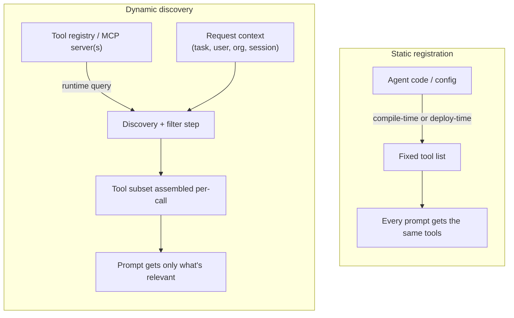
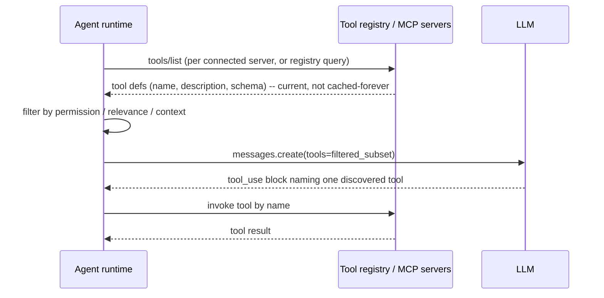

## Tool Discovery

> Chapter of
> [[agentic-ai-engineering/readme#04 — Tools & Environment Interaction|Tools & Environment Interaction]],
> part of [[agentic-ai-engineering/readme|Agentic AI Engineering]].

## What you will understand at the end

- Why static tool registration is correct for most agents, and the specific growth axis that forces
  you off it
- How dynamic discovery shifts tool availability from a code-deploy event to a runtime query, and
  what that costs you in return
- Why tool metadata (name, description, parameter schema) is prompt engineering, not documentation —
  and how to audit it like one
- Why "just add more tools to the prompt" silently degrades tool-selection accuracy well before you
  hit a token limit
- How GitHub Copilot's MCP registry implements dynamic discovery in a shipped product, and what that
  tells you about your own registry design

---

## The mental model

Every agent has to answer one question before it can answer any other: **what can I even do right
now?** That answer is the agent's tool catalog — the set of tool definitions (name, description,
parameter schema) it puts in front of the LLM on a given call.

There are exactly two ways that catalog gets assembled, and the difference is _when_ the binding
between "agent" and "tool" happens:



Static registration binds the agent to its tools when someone writes or deploys code. Dynamic
discovery defers that binding to the moment of the call, resolved against a registry and whatever
context is available (the task, the tenant, the user's permissions, which MCP servers are
connected). Neither is "more advanced" than the other — they are the correct answer to different
scaling problems, and most production agents run _both_ at once for different parts of their
toolset. The engineering judgment this chapter is building is: which tools in your system belong on
which side of that line, and how do you keep the metadata quality high enough that discovery
actually produces good tool selection instead of just more tools.

---

## 1. Static registration — the default, and its ceiling

**What it is:** the tool list is hardcoded — in the system prompt, in a config file loaded at
startup, or in the `tools=[...]` argument passed to every LLM call. The set of available tools is
fixed at deploy time and identical for every request the agent serves (modulo simple flags).

```python
# The entire "discovery mechanism" is a Python list.
TOOLS = [
    search_web_schema,
    read_file_schema,
    execute_sql_schema,
    send_slack_message_schema,
]

response = client.messages.create(
    model="claude-sonnet-4-6",
    tools=TOOLS,          # same four tools, every call, forever
    messages=messages,
)
```

**Why this is the right default, not a shortcut:** for the overwhelming majority of single-purpose
agents — a support-ticket triage bot, a SQL assistant scoped to three tables, an SRE agent with
Grafana/Loki/Tempo tools — the toolset is small, known at design time, and changes only when an
engineer ships a change. Static registration gives you:

| Property                          | Why it matters                                                           |
| --------------------------------- | ------------------------------------------------------------------------ |
| Deterministic prompt content      | You can snapshot-test the exact tool list; no runtime surprise           |
| No discovery latency              | Zero extra round trips before the first LLM call                         |
| Trivial security review           | The full attack surface is enumerable by reading one file                |
| Version-controlled with the agent | A tool change ships in the same PR/deploy as the code that depends on it |

**Where it breaks:** static registration assumes the agent's code and the toolset evolve on the
_same_ release cadence, owned by the _same_ team. Three growth axes break that assumption:

1. **Toolset size** — once you're past roughly 15–20 tools, a flat hardcoded list becomes a
   maintenance liability and (as covered in
   [§4](#4-the-context-budget-problem-why-more-tools-makes-tool-choice-worse)) a selection-accuracy
   liability.
2. **Toolset ownership** — if a platform team adds a new internal API every week and every agent
   team has to redeploy to pick it up, you've coupled unrelated release cycles.
3. **Toolset volatility per-tenant** — if different customers, users, or environments should see
   different tools (a paid-tier-only tool, a region-restricted API, a user's own connected
   third-party accounts), a fixed list can't express that without branching logic that itself
   becomes the discovery layer in disguise.

Any one of these three is a legitimate reason to move to dynamic discovery. None of them is a reason
to skip static registration for the tools that don't have the problem — most systems end up hybrid:
a small static core (the tools every call needs) plus a dynamically discovered long tail.

---

## 2. Dynamic discovery — querying instead of hardcoding

**What it is:** instead of a fixed list baked into the agent, the agent (or the runtime hosting it)
queries a **registry** at or near request time to learn what tools currently exist, then builds the
tool list for _that_ call from the answer.
[Model Context Protocol](../09-model-context-protocol-mcp/09-model-context-protocol-mcp.md) is the
standardized version of this: an MCP client connects to one or more MCP servers and calls
`tools/list` to enumerate what each server currently exposes, rather than the client's code
containing a hardcoded copy of that list.



**What you gain:**

- **Independent deploy cadence.** A team ships a new MCP server or registers a new tool without
  touching agent code. The agent picks it up on its next discovery query.
- **Per-context toolsets.** The same agent code can legitimately expose different tools to different
  users, tenants, or environments, because the filter step after discovery has request context to
  work with.
- **A real ownership boundary.** The registry becomes the place where "what tools exist" is governed
  — versioning, deprecation, access control — separate from any one agent's code.

**What you pay for it:**

| Cost                            | Detail                                                                                                                                                       |
| ------------------------------- | ------------------------------------------------------------------------------------------------------------------------------------------------------------ |
| Discovery latency               | An extra round trip (or a cache with its own staleness risk) before you can even call the LLM                                                                |
| Non-determinism                 | The tool list for "the same" request can differ between two calls if the registry changed in between — harder to test, harder to reason about in an incident |
| A new failure mode              | The registry/MCP server being down or slow is now on your agent's critical path                                                                              |
| Metadata quality control shifts | You no longer author every tool description — a third-party MCP server's description quality is now _your_ tool-selection accuracy problem too               |

The honest framing for a Staff-level design review: dynamic discovery doesn't remove the tool
metadata problem in [§3](#3-tool-metadata-design--this-is-prompt-engineering-not-documentation) — it
_federates_ it. You've traded "I write bad descriptions" for "someone else might write bad
descriptions and I have no edit access." A registry without a metadata quality bar (schema
validation, description linting, an approval gate) just moves the failure mode covered in §4 further
from where you can fix it.

### Static vs. dynamic — the decision table

| Dimension                 | Static registration                                      | Dynamic discovery                                       |
| ------------------------- | -------------------------------------------------------- | ------------------------------------------------------- |
| Binding time              | Deploy time                                              | Request/runtime time                                    |
| Toolset size it suits     | Small, fixed (≲15–20)                                    | Large or growing independently of agent code            |
| Who can add a tool        | Whoever owns the agent's codebase                        | Whoever owns the registry / an MCP server               |
| Latency cost              | None                                                     | One+ discovery round trip (mitigate with caching)       |
| Testability               | High — snapshot the tool list                            | Lower — tool list can vary run to run                   |
| Per-tenant/user variation | Requires branching logic (a discovery layer in disguise) | Native — filter step has context                        |
| Failure mode added        | None new                                                 | Registry/MCP server unavailability on the critical path |
| Governance model          | Code review                                              | Registry-level access control + metadata quality gate   |

---

## 3. Tool metadata design — this is prompt engineering, not documentation

Whether a tool arrived via a hardcoded list or a live registry query, the LLM only ever sees three
fields: **name**, **description**, **parameter schema**. It does not see your code, your docstrings,
or your intent. If those three fields don't fully communicate when and how to use the tool, the
model will guess — and it will guess plausibly enough that the failure often doesn't surface until
production.

**Name.** Should read like a verb-object pair a competent engineer would choose for a function
signature: `search_customer_orders`, not `tool_3` or `helper`. Ambiguous or overloaded names
(`process_request`, `handle_data`) force the LLM to lean entirely on the description to disambiguate
— don't make the description do the name's job.

**Description — the highest-leverage field.** Treat it as a prompt, because to the LLM it _is_ one.
A weak description tells the model _what the tool is_. A strong one tells the model _when to reach
for it, versus what_.

```txt
Weak:
  "Searches orders."

Strong:
  "Search the customer's order history by date range, status, or SKU. Use this
   BEFORE issuing a refund or replacement to confirm the order exists and its
   current status. Does not include orders older than 24 months -- for those,
   use search_archived_orders instead. Returns at most 50 results; narrow the
   date range if the caller needs a complete result set."
```

The strong version does four things a Principal-level review should check for on every tool:

1. States the action and the object, unambiguously
2. States _when_ to call it relative to other tools (the "use this before X" framing that
   disambiguates near-duplicate tools)
3. States a boundary condition (the 24-month cutoff) so the model doesn't silently assume
   completeness it doesn't have
4. Names the sibling tool that handles the case this one doesn't — this is how you prevent the model
   from either hallucinating a capability or giving up

**Parameter schema.** JSON Schema is doing double duty here: it's a runtime contract for your code
and a set of instructions for the model that generates the arguments. Every `description` field
inside the schema is read by the LLM exactly like the tool description is. Common failure patterns:

| Schema smell                                                      | What goes wrong                                                                                                               |
| ----------------------------------------------------------------- | ----------------------------------------------------------------------------------------------------------------------------- |
| No `enum` on a bounded field                                      | Model invents a plausible-but-invalid value (`"status": "in_progress"` when only `"pending"/"shipped"/"delivered"` are valid) |
| Missing `description` on a parameter                              | Model infers meaning from the field name alone — fine for `email`, unreliable for `mode` or `scope`                           |
| Overly permissive types (`string` where a `date` format is meant) | Model produces ISO strings, epoch millis, and `"yesterday"` interchangeably — your code eats the resulting parsing bugs       |
| No `required` array, or everything marked optional                | Model omits parameters your handler actually needs, and you find out at execution time, not selection time                    |
| Deeply nested objects for simple lookups                          | More tokens spent per call, more surface for the model to fill in a field wrong                                               |

The discipline is the same one you already apply to label schemas in Alloy/OTel configs: **the
schema is the interface, and a vague interface produces vague — or wrong — callers.** A tool
description review deserves the same rigor as a public API review, because functionally that's what
it is: an interface consumed by a caller you don't control the internals of.

---

## 4. The context-budget problem: why "more tools" makes tool choice _worse_

Static or dynamic, every tool definition you hand the model consumes two things every single call:
context tokens and selection accuracy. This is the problem that motivates the entire next chapter,
[[agentic-ai-engineering/04-tools-and-environment-interaction/11-tool-selection-strategies|Tool Selection Strategies]],
so it's worth being precise about the mechanism, not just asserting it.

**The token cost is the obvious half.** A tool schema with a name, a paragraph description, and a
handful of parameters easily runs 100–300 tokens. A hundred tools is 10,000–30,000 tokens spent
_before the user's message is even read_ — recurring on every single call in the conversation, not
once.

**The accuracy cost is the less obvious, more dangerous half.** Tool selection is the model
performing a discrimination task over everything in the `tools` array on every call. As the array
grows:

- **Near-duplicate tools compete.** `get_user`, `fetch_user_details`, `lookup_user_profile` sitting
  in the same list is not redundancy the model resolves gracefully — it's ambiguity the model
  resolves by guessing, and the guess is only as good as how sharply your descriptions differentiate
  them (see §3).
- **Relevant signal gets diluted.** The model must weigh a genuinely-needed tool against 99 others
  that share superficial vocabulary. This is the same signal-to-noise problem RAG retrieval has —
  and it's why the eventual fix (§ next chapter: embedding-based retrieval, hierarchical routing) is
  conceptually a retrieval system, not a prompting trick.
- **It degrades quietly.** There is no error, no exception, no log line. The failure mode is the
  model calling a _plausible_ wrong tool, or calling the right tool with subtly wrong arguments
  because it under-attended to a schema buried in a 30,000-token list. You find this in eval
  regressions or user complaints, not in a stack trace — which is exactly why
  [[production-agent-systems/01-observability/06-tool-invocation-metrics/06-tool-invocation-metrics|Tool Invocation Metrics]]
  (per-tool call volume, argument-validation failure rate) is not optional instrumentation once a
  catalog grows past a handful of tools.

**The rule of thumb this motivates:** dumping every tool the agent might ever need into every call
is not "giving the model more capability" — past a fairly low threshold, it is actively spending
context budget to _reduce_ the odds it picks correctly. The fix is not a bigger context window; a
bigger window just delays the point where the same dilution problem recurs at a larger N. The fix is
narrowing what's _in front of the model on this specific call_ to what's actually relevant to it —
which is precisely what dynamic discovery's filter step (§2) and the retrieval-based selection
strategies in the next chapter are for. Tool discovery answers "what exists"; tool selection answers
"what should be in front of the model right now" — and at scale, you need a real answer to the
second question, not just the first.

---

## 5. Scaling a tool catalog beyond one prompt — the shape of the fix

You don't need the full machinery of the next chapter to see the shape of the answer. Once a catalog
outgrows "list every tool, every call," the discovery layer needs to do three things it didn't need
to do at small scale:

1. **Index, don't enumerate.** The registry needs to be queryable by more than "give me everything"
   — by capability tag, by owning team, by the tool's declared domain — so a caller can ask a
   narrower question than "list all tools."
2. **Filter before the prompt is built,** using whatever context is available: the task at hand, the
   caller's permissions, the conversation so far. This is the step dynamic discovery adds that
   static registration structurally cannot, because static registration has no request-time context
   to filter with.
3. **Rank, when filtering alone doesn't narrow enough.** At real scale (hundreds of tools across
   many MCP servers), category filters still leave too many candidates, and you need a relevance
   ranking over descriptions — the embedding-based retrieval this book covers next.

This is also where tool discovery and tool _security_ stop being separable concerns. A registry that
answers "what tools exist" without also answering "what tools is _this caller_ allowed to see" is
handing the LLM — and by extension anyone who can influence its input via prompt injection — a menu
of capabilities that should have been access-controlled before they ever reached a prompt.
[[production-agent-systems/02-reliability-security-and-governance/06-authorization-and-permissions|Authorization & Permissions]]
covers the RBAC/ABAC layer this implies; the point to carry forward here is that discovery-time
filtering is a security control, not just a UX or context-budget optimization.

---

### GitHub Copilot in practice

GitHub Copilot's approach to MCP is a shipped, large-scale example of dynamic discovery replacing
static registration, and it's directly relevant to Microsoft's GH-600 ("Developing in Agentic AI
Systems") exam content on agent tooling.

Copilot does not ship with a fixed, hardcoded set of external tools compiled into the product.
Instead, GitHub operates an **MCP registry** — a catalog of MCP servers (GitHub's own, and
third-party servers published into the registry) that an organization, repository, or individual
developer can browse and _add_ to their Copilot configuration. Once added, Copilot's agent (in
Copilot Chat, Copilot coding agent, or an IDE extension) connects to that MCP server at runtime and
discovers — via the same `tools/list`-style mechanism described in §2 — exactly which tools that
server currently exposes, with their current descriptions and schemas. Add a server, and its tools
become available on the next discovery query, without a Copilot release. Remove or reconfigure it,
and they disappear the same way.

The architectural pattern to take away — regardless of whether the exact registry UX matches what
you've seen in a specific Copilot version — is:

- **Configuration, not code, is the binding mechanism.** Which MCP servers a given org/repo/user has
  enabled is stored as configuration external to the agent's own codebase — the same separation of
  concerns §2 argues for.
- **The registry is the trust boundary.** Because tools arrive from servers an org chooses to enable
  (rather than being compiled in), tool _governance_ — which servers are permitted, at what scope —
  becomes an admin-level, org-wide control point, which is exactly the discovery-as-security-control
  point raised in §5.
- **Metadata quality is now partly out of your hands.** A third-party MCP server's tool descriptions
  and schemas are authored by that server's maintainer, not by GitHub or by the end user. This is
  the clearest real-world instance of the "you've federated the metadata problem, not solved it"
  point from §2 — the exam-relevant takeaway is that evaluating a candidate MCP server's tool
  metadata quality before enabling it org-wide is itself part of operating Copilot safely at scale,
  not an implementation detail you can ignore.

If you're validating specifics for GH-600 against GitHub's own documentation, confirm the current
registry UX and enablement flow directly — this section is intentionally scoped to the architectural
pattern (registry-mediated dynamic discovery, config-as-binding, federated metadata trust) rather
than a version-specific screenshot of menus that will have moved by the time you read this.

---

## Concept check

| Question                                                                     | Answer hint                                                                                                                         |
| ---------------------------------------------------------------------------- | ----------------------------------------------------------------------------------------------------------------------------------- |
| What's the actual trigger for moving off static registration?                | Toolset size, toolset ownership crossing a team boundary, or toolset variation per tenant/user — not "dynamic sounds more advanced" |
| What three fields does the LLM see for any tool, static or discovered?       | Name, description, parameter schema — nothing else about your implementation                                                        |
| Why does a bigger context window not fix the "too many tools" problem?       | It delays dilution to a larger N; the discrimination task over irrelevant tools still degrades selection accuracy                   |
| What does dynamic discovery add that static registration structurally can't? | Request-time context available to filter the toolset per call                                                                       |
| What did GitHub Copilot's MCP registry federate, not eliminate?              | The tool-metadata-quality problem — third-party servers now author descriptions Copilot's model relies on                           |

## Vocabulary glossary

| Term                | Definition                                                                                                                     |
| ------------------- | ------------------------------------------------------------------------------------------------------------------------------ |
| Static registration | Tool list fixed at deploy/config time; identical across requests                                                               |
| Dynamic discovery   | Tool list resolved at or near request time by querying a registry/MCP server                                                   |
| Tool registry       | The system of record for what tools/servers currently exist and who may use them                                               |
| Tool metadata       | The name, description, and parameter schema an LLM uses to select and call a tool                                              |
| Discovery latency   | The round-trip cost of querying a registry before the tool list can be assembled                                               |
| Tool dilution       | Degraded tool-selection accuracy caused by too many competing/near-duplicate tools in one prompt                               |
| MCP registry        | GitHub's (and more generally, the ecosystem's) catalog of MCP servers that can be discovered and enabled rather than hardcoded |

## Metadata

|        |                        |
| ------ | ---------------------- |
| Author | Amit Singh             |
| Scope  | agentic-ai-engineering |
