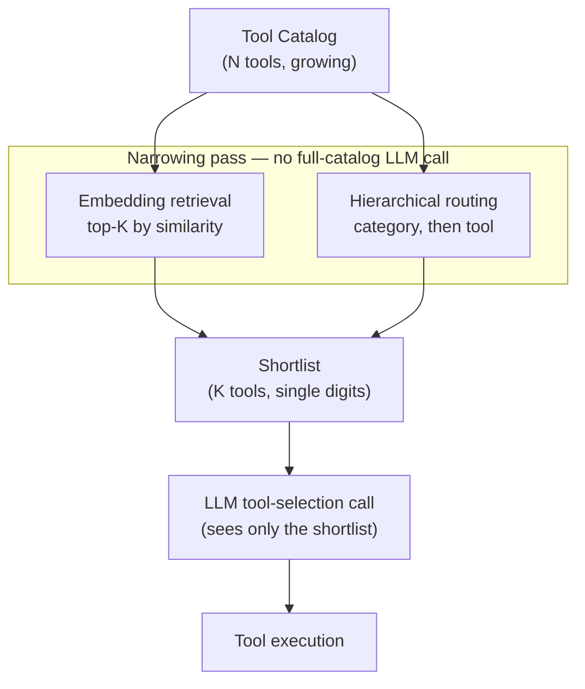
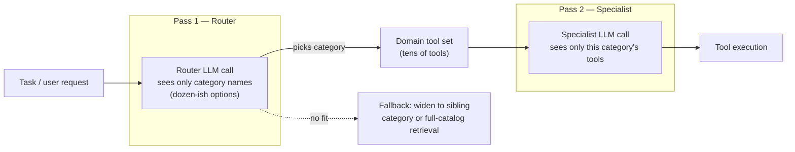
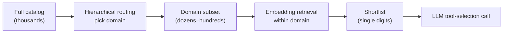

## Tool Selection Strategies

> Chapter of
> [[agentic-ai-engineering/readme#04 — Tools & Environment Interaction|Tools & Environment Interaction]],
> part of [[agentic-ai-engineering/readme|Agentic AI Engineering]].

## What you will understand at the end

- Why stuffing every registered tool into every LLM call stops working long before you reach
  hundreds of tools, and what actually degrades (accuracy, latency, cost — separately, for different
  reasons)
- How to apply embedding-based retrieval — the RAG pattern, applied to tool schemas instead of
  document chunks — to shrink the candidate set before the LLM ever sees a tool list
- How hierarchical tool routing decomposes one hard discrimination problem (1-of-N) into two easy
  ones (1-of-few, then 1-of-few) by exploiting natural clustering in how tools are organized
- Where each strategy wins, where it fails, and how to combine both as a catalog grows from a dozen
  tools to an org-wide registry spanning thousands
- How GitHub Copilot's MCP-server/tool allow-listing maps this same narrowing principle onto a
  governance and security control, not just an accuracy one

---

## The mental model

[[10-tool-discovery|Tool Discovery]] covered how a tool catalog gets built and registered. This
chapter starts where that one ends: assume the catalog exists and keeps growing. The question is no
longer "how does the agent know a tool exists" — it's "how do we stop the agent from having to
personally inspect all of them on every single turn."

Every tool-calling LLM call pays for the tools it's shown twice: once in tokens (every schema you
attach to the `tools` parameter is billed as input, on every call, whether or not it gets used), and
once in attention (the model has to discriminate the right tool out of everything you handed it, and
that discrimination gets harder — not linearly, but in practice much faster than linearly — as
near-duplicate schemas pile up). Tool selection strategy is the discipline of narrowing that set
_before_ the LLM has to choose, so the in-context decision it actually makes is cheap, fast, and
easy to get right.

**Reading the diagram:** the LLM call that actually decides "call `refund_order`, not
`cancel_subscription`" only ever sees a handful of candidates. Everything upstream of that call is
either a non-LLM retrieval step (cheap, deterministic-ish, doesn't compete for the model's
attention) or a much smaller, much easier LLM classification call. The rest of this chapter is the
two ways to build that narrowing pass, and when each one is the right tool for the job.

---

## 1. Why brute force stops working

The naive baseline — pass every registered tool's schema on every call — is not wrong, it's just
scoped to small catalogs. A dozen tools with distinct names and clear descriptions is well inside
what a frontier model discriminates reliably; don't build retrieval infrastructure you don't need
yet.

The failure shows up along three separate axes, and it's worth keeping them separate because each
one has a different fix:

| Axis         | What actually happens as the catalog grows                                                                                                                  | Why it's a distinct problem                                                                                                                   |
| ------------ | ----------------------------------------------------------------------------------------------------------------------------------------------------------- | --------------------------------------------------------------------------------------------------------------------------------------------- | -------------------------------- |
| **Cost**     | Every tool schema (name + description + JSON Schema for parameters) is input tokens, billed on _every_ call, whether or not it's used                       | Purely a function of catalog size × schema verbosity — no discrimination involved                                                             |
| **Latency**  | Time-to-first-token grows with prompt size; a 300-tool `tools` block can dwarf the actual user message in prefill cost                                      | Same mechanism as any large-context prompt — see [[06-context-windows-and-tokenization                                                        | Context Windows & Tokenization]] |
| **Accuracy** | The model has to pick 1 correct tool out of N candidates that increasingly look alike (`search_orders` vs. `search_order_items` vs. `search_order_history`) | This is the one that degrades _faster_ than the other two — near-duplicate descriptions are a discrimination problem, not just a size problem |

A worked estimate makes the cost axis concrete. Say a customer-support agent has 220 tools
registered across billing, shipping, returns, and account management — a plausible size for a
mid-size product with several internal platform teams each contributing a handful of tools. At a
conservative ~150 tokens per schema (name, description, parameter names and types), that's roughly
**33,000 tokens of tool definitions on every single call**, before the user has typed a word and
before the model has done any reasoning. Double the catalog and you double that number — linearly,
forever, on every turn, for every user. This is the concrete reason "just add tools to the list" is
not a strategy that survives contact with a real registry.

The accuracy axis is the one that actually forces the architectural change, though. Once a catalog
has multiple tools that are lexically and semantically close (which is inevitable once more than one
team contributes tools independently), the model's job stops being "read the request and know what
to do" and becomes "read the request, then correctly rank a pile of near-synonyms." That's a
strictly harder task, and it gets harder in proportion to how many near-synonyms exist, not in
proportion to total catalog size — which is why two catalogs of the same size can behave very
differently depending on how much the tools overlap in vocabulary.

---

## 2. Embedding-based tool retrieval

This is RAG, applied to tool schemas instead of document chunks — the exact same pipeline covered in
[[agentic-ai-engineering/readme#05 — Retrieval & Knowledge Systems|Retrieval & Knowledge Systems]],
with "chunk" relabeled "tool description." If you've built a document retrieval pipeline, you
already know how to build this one.

**Offline (indexed once, updated incrementally):**

1. For every tool in the registry, construct a "tool document" — name, description, parameter names
   and types, and ideally a couple of example utterances a user might phrase that map to this tool
   (this is the same enrichment lever as query expansion in document RAG: the closer the tool doc's
   vocabulary is to how users actually talk, the fewer retrieval misses you get).
2. Embed each tool document with an embedding model — reuse whatever embedding model and vector
   index your document-RAG stack already runs on ([[02-embeddings|Embeddings]] covers the
   commercial-vs-open-source tradeoff); there's no reason to run a second embedding pipeline just
   for tools.
3. Store the vectors in the same class of index, keyed by tool ID.

**Online (every turn, or every planning step):**

1. Embed the current task — the user's message, or a rolling summary of agent state if the task has
   evolved over several turns.
2. Run a similarity search (cosine or dot-product, same as any vector search) against the tool
   index. Take the top-K, typically single digits to low teens depending on catalog size and how
   much headroom you want against retrieval misses.
3. Attach only those K schemas to the `tools` parameter of the actual LLM call. The model never sees
   the other N-K tools — they were never candidates.

**Where it breaks — and the fix:**

Embedding retrieval fails the same way document RAG fails: **vocabulary mismatch**. A user says
"cancel the ticket," the tool is named `void_invoice`. If the embedding space doesn't place those
close together, the right tool never makes the top-K, and no amount of prompt engineering in the
downstream LLM call recovers it — the tool simply wasn't offered. Three standard mitigations, all
borrowed directly from document RAG:

- **Richer tool documents** — synonyms, example phrasings, common misnomers — the same enrichment
  you'd do for a poorly-titled document chunk.
- **Hybrid retrieval** — combine dense vector similarity with sparse keyword matching (BM25) so an
  exact name match isn't lost to semantic drift; see
  [[agentic-ai-engineering/readme#05 — Retrieval & Knowledge Systems|Hybrid Search]].
- **Reranking** — retrieve a wider net (top-30, say) with cheap vector search, then rerank down to
  the true top-K with a cross-encoder before the LLM ever sees the list — trading a little extra
  latency for a real accuracy gain at the boundary cases.

**Freshness is the operational win here.** Adding, removing, or editing one tool means re-embedding
one document, not the whole catalog and not a model fine-tune. A registry that changes weekly (new
MCP servers coming online, teams adding tools) stays cheap to keep current — this is the same
incremental-update property that makes vector-index-backed RAG preferable to baking knowledge into
model weights.

---

## 3. Hierarchical tool routing

Where embedding retrieval narrows by semantic similarity, hierarchical routing narrows by
**structure** — it exploits the fact that most real tool catalogs aren't a flat bag of N
interchangeable options; they cluster by team, by domain, or by the system they front (billing
tools, shipping tools, internal-search tools, calendar tools).

The pattern is a first-pass classification followed by a second-pass selection:

The router call is deliberately small: it sees category names and one-line descriptions, not full
tool schemas, so it can be a fast/cheap model — classification is a much easier task than generating
correct tool-call parameters. The specialist call then gets full schemas, but only for the tools
inside the chosen category, so it's back in the "dozen tools, easy discrimination" regime the model
handles well.

**This is the router pattern, recursively applied at the tool-catalog level.** The same
architectural move — classify first with a cheap pass, dispatch to a narrower specialist — is
formalized at the agent level in [[05-router-pattern|Router Pattern]] (Part 00 of AI Architecture &
System Design) and used at the system level in
[[09-supervisor-architectures|Supervisor Architectures]]. Recognizing that "route, then specialize"
is a single reusable idea that applies at the tool level, the agent level, and the whole-system
level is exactly the kind of pattern-recognition an L6/L7 system-design interview is listening for.

**Where hierarchical routing wins over embedding retrieval:** when the clustering is crisp _and_
that clustering already tracks something else you care about — most often an authorization boundary.
If "Finance tools" is both a natural category and the exact set of tools a caller needs to be
authorized for, the routing decision doubles as an access-control gate: you literally cannot route a
caller into a category they aren't scoped for. Embedding retrieval has no equivalent for free — a
semantically-close but unauthorized tool can still land in the top-K unless you separately filter it
out.

**Where it fails:** at fuzzy category boundaries. A tool like "send a calendar invite for the refund
review" genuinely spans Calendar and Support categories. If the router picks the wrong branch, the
specialist call in the second pass simply cannot reach the right tool that turn — there is no
in-context recovery, because the tool was never handed to it. The fix has to be an explicit fallback
path, not a prompt tweak: if the specialist reports "none of these fit," widen to sibling
categories, or fall back to a full-catalog embedding search as a safety net. Design that fallback
before you ship the router — it's the failure mode that shows up in week one of production traffic,
not in the demo.

---

## 4. Choosing between them

| Dimension             | Embedding-based retrieval                            | Hierarchical routing                                            |
| --------------------- | ---------------------------------------------------- | --------------------------------------------------------------- |
| Best when tools...    | Vary continuously, don't cluster cleanly             | Cluster naturally by team/domain/system                         |
| Extra LLM calls       | Zero (retrieval is a vector search, not an LLM call) | +1 per hierarchy level (router pass before the real call)       |
| New infra required    | Vector index + embedding pipeline                    | None beyond prompt/category structure — reuses existing infra   |
| Scales to             | Hundreds to tens of thousands of tools               | Tens of categories × tens of tools each                         |
| Authorization benefit | None inherent — needs a separate filter              | Natural — category boundary can equal access-control boundary   |
| Dominant failure mode | Vocabulary mismatch → right tool never retrieved     | Misrouting at a fuzzy category boundary → tool unreachable      |
| Cold-start cost       | Embed the entire catalog upfront                     | Design the taxonomy upfront (harder to get right retroactively) |

In practice these aren't mutually exclusive — see §6.

---

## 5. The accuracy / latency / cost curve as catalogs grow

These strategies aren't "always on" — they earn their complexity past a threshold. Treat the
following as order-of-magnitude, directional guidance, not a benchmarked number for any specific
model or catalog; the right threshold for your system depends on how much your tools overlap in
vocabulary, not just how many there are.

| Catalog size                  | What actually happens                                                                                                                                                                                                        | Right move                                                                          |
| ----------------------------- | ---------------------------------------------------------------------------------------------------------------------------------------------------------------------------------------------------------------------------- | ----------------------------------------------------------------------------------- |
| ~Dozen tools                  | Brute force works fine. Distinct names, clear descriptions, model discriminates reliably, overhead is negligible.                                                                                                            | Do nothing. Building retrieval infra here is premature optimization.                |
| Tens (roughly 20–50)          | Discrimination starts to wobble specifically where tools overlap in vocabulary (multiple `search_*`, `get_*` variants). Cost/latency overhead still tolerable.                                                               | Curate descriptions first (cheap). Start prototyping retrieval if overlap is heavy. |
| Hundreds                      | Brute force is now both slow (tool-schema tokens can dwarf the user's actual message — recall the ~33K-token estimate above) and measurably less accurate — near-duplicate tools actively compete for the model's attention. | Embedding retrieval or hierarchical routing stops being optional.                   |
| Thousands (org-wide registry) | Neither technique alone is enough — a single flat embedding index over thousands of tools has too many plausible near-neighbors; a single-level taxonomy gets too many tools per leaf category.                              | Combine both — see §6 — and add static allow-list scoping (§7).                     |

The shape of the curve matters more than any specific number in that table: **cost degrades linearly
with catalog size regardless of what you do; accuracy degrades non-linearly and is driven by
overlap, not raw count.** A catalog of 500 tools with almost no vocabulary overlap can out-perform a
catalog of 80 tools that includes ten near-identical search variants. Measure overlap, not just
size, before deciding you need this chapter's machinery.

---

## 6. Combining strategies at scale

At the upper end of the curve — an enterprise-wide tool/MCP-server registry spanning many teams —
the two techniques stack rather than compete:

Routing does the coarse cut along a boundary you already understand and often need for authorization
anyway (which team, which system). Retrieval does the fine cut within that boundary, where tools are
numerous enough that manual categorization into sub-sub-categories stops being worth maintaining.
Neither pass alone would comfortably handle a catalog this size; together, each one only has to
solve an easy version of the problem.

---

### GitHub Copilot in practice

Everything above is a runtime narrowing decision — retrieval or routing computed per-call. Large
organizations running GitHub Copilot's agentic modes (Copilot coding agent, agent mode in the IDE,
and custom Copilot extensions) face the same narrowing problem one layer up, at **configuration
time** rather than inference time: an org can accumulate many MCP servers and custom agent tools
registered across teams, and a naive setup would hand every one of them to every agent invocation,
regardless of what that invocation is actually for.

GitHub's answer is a **selection/allow-list strategy**, not a dynamic retrieval pipeline — org
admins can scope which MCP servers and tools are permitted at the organization level, and
configuration can narrow further at the repository or individual-agent level, so a given invocation
is only ever handed the subset of the registry relevant to its task. (Exact settings surfaces and
policy names shift as the product evolves — verify the current mechanics against GitHub's own
documentation before relying on specifics for an exam or a production rollout. The architectural
principle below is the stable part.)

That allow-list is doing double duty, and it's worth naming both jobs explicitly:

- **Selection accuracy** — the same discrimination problem from §1. An agent scoped to the twenty
  tools its task actually needs picks correctly far more often than one facing the org's entire
  registry. This is functionally the same move as hierarchical routing's category boundary — a
  human-curated, static version of "narrow before the model chooses" instead of a computed one.
- **Security** — this is the concern that doesn't have an equivalent in §2–§3, and it's the reason
  this matters beyond accuracy. An agent that was never handed a deploy tool, a secrets-reading
  tool, or a destructive database tool cannot be redirected into calling one — not by a bad prompt,
  and not by a prompt-injection payload smuggled in through a fetched issue body, PR description, or
  file the agent read as part of its task. **Absence of a capability is a stronger guarantee than an
  instruction not to use it.** This is the same principle [[12-tool-security|Tool Security]] covers
  as least-privilege scoping — Copilot's org/repo/agent-level tool configuration is a concrete,
  governance-layer instance of it.

This is also the shape of question Microsoft's GH-600 ("Developing in Agentic AI Systems") content
area is testing when it covers tool and MCP-server configuration for Copilot: not "which checkbox,"
but _why an org scopes tool availability at all_ — the same accuracy/security dual-motive argument
this section just made, applied to a real, widely-deployed agent platform instead of a hypothetical
one.

---

## 7. A decision table for interview day

| Situation                                                            | Recommended strategy                                                                                                     |
| -------------------------------------------------------------------- | ------------------------------------------------------------------------------------------------------------------------ |
| Fewer than ~20 tools, any clustering                                 | Brute force — send all schemas, don't build infra you don't need                                                         |
| 20–100 tools, weak/no clustering                                     | Embedding-based retrieval                                                                                                |
| 20–100 tools, strong domain/team clustering                          | Hierarchical routing                                                                                                     |
| Hundreds to thousands of tools                                       | Hierarchical routing (coarse) + embedding retrieval (fine), combined                                                     |
| Org-wide registry with many MCP servers / mixed ownership            | Static allow-list scoping first (governance layer), then one of the above _within_ the allowed set                       |
| Tool categories map to authorization boundaries                      | Prefer hierarchical routing — the routing decision doubles as an access-control gate                                     |
| High-privilege or destructive tools present anywhere in the registry | Allow-list scoping is non-negotiable regardless of catalog size — this is a security control, not just a performance one |

---

## Concept check

Before moving to [[12-tool-security|Tool Security]], you should be able to answer these without
notes:

| Question                                                                                        | Answer hint                                                                                                                          |
| ----------------------------------------------------------------------------------------------- | ------------------------------------------------------------------------------------------------------------------------------------ |
| Why does tool-selection accuracy degrade faster than tool-schema token cost as a catalog grows? | Cost is linear in catalog size; accuracy degrades with vocabulary _overlap_ between tools, which compounds faster than raw count     |
| What is embedding-based tool retrieval, in one sentence?                                        | RAG applied to tool descriptions instead of document chunks — embed once, retrieve top-K per task                                    |
| What's the dominant failure mode of embedding retrieval?                                        | Vocabulary mismatch — the right tool doesn't embed close to how the user actually phrased the request                                |
| What's the dominant failure mode of hierarchical routing?                                       | Misrouting at a fuzzy category boundary — the tool becomes unreachable that turn with no in-context recovery                         |
| Why does a routing category boundary sometimes double as a security boundary?                   | If the category maps to a team/domain the caller must be authorized for, routing into it is itself an access decision                |
| Why is a tool allow-list a security control, not just a performance one?                        | A tool the agent was never handed can't be invoked via prompt injection — absence of a capability beats an instruction not to use it |

---

## Vocabulary glossary

| Term                           | Definition                                                                                                              |
| ------------------------------ | ----------------------------------------------------------------------------------------------------------------------- |
| Tool catalog / registry        | The full set of tools an agent platform has registered and could potentially expose to an agent                         |
| Candidate set / shortlist      | The narrowed subset of tools actually attached to a given LLM tool-calling call                                         |
| Embedding-based tool retrieval | Embedding tool descriptions once, embedding the task per-call, and retrieving top-K by similarity before the LLM call   |
| Hierarchical tool routing      | A first-pass LLM call picks a tool category; a second-pass call selects the specific tool within it                     |
| Router pattern                 | The general agent-level version of "classify first, dispatch to a specialist" — see Part 03 of Production Agent Systems |
| Retrieval miss                 | The correct tool exists but wasn't retrieved into the shortlist — usually a vocabulary mismatch                         |
| Misrouting                     | The router picks the wrong category, making the correct tool unreachable for that turn                                  |
| Allow-list scoping             | A static, admin-configured restriction on which tools/MCP servers an agent invocation may access                        |
| Least-privilege tool scoping   | Granting an agent only the tools its task requires, nothing more — an accuracy _and_ security control                   |

## Metadata

|        |                        |
| ------ | ---------------------- |
| Author | Amit Singh             |
| Scope  | agentic-ai-engineering |
