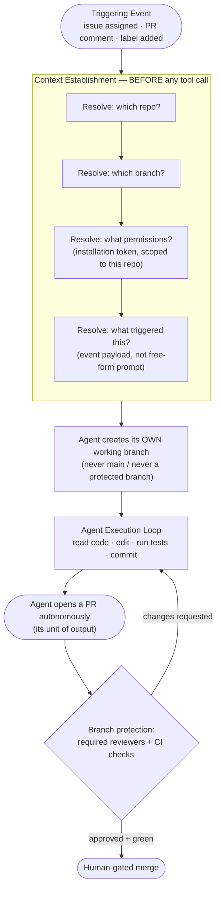
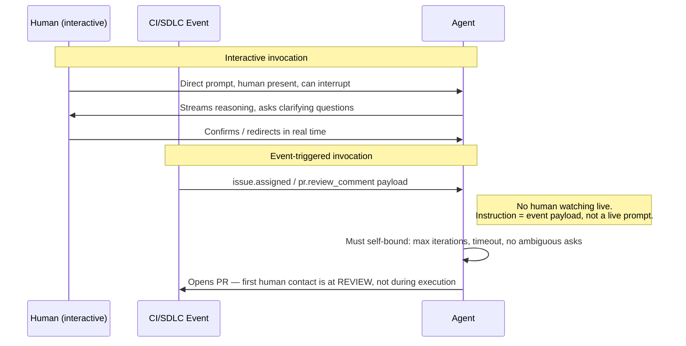
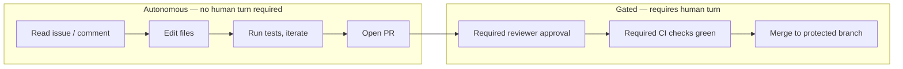

## Agents in CI/CD & SDLC Workflows

> Chapter of
> [[agentic-ai-engineering/readme#04 — Tools & Environment Interaction|Tools & Environment Interaction]],
> part of [[agentic-ai-engineering/readme|Agentic AI Engineering]].

## What you will understand at the end

- Why an agent's execution context — repo, branch, permissions, triggering event — must be
  established _before_ the first tool call, not inferred mid-task
- Why "repo-scoped" is the correct default blast-radius boundary for a coding agent, and what breaks
  when an agent instead holds an org-wide credential
- The different trust assumptions between an agent invoked interactively by a human at a keyboard
  and an agent invoked by a CI/SDLC event (issue opened, label added, PR comment)
- Why branch-based scope — the agent works on its own branch, never on `main` — is the primary
  blast-radius control, and how it composes with repo scoping
- Why the right autonomy line is usually "agent may open a PR autonomously, merge stays gated," not
  "agent may act freely until something looks risky"
- How GitHub Copilot's coding agent implements every one of these controls in a shipped product, and
  where branch protection and required reviewers — not the agent's own judgment — form the actual
  governance layer

---

## The mental model

Every prior chapter in this book has treated "the agent" as a loop that reasons and calls tools.
This chapter is about the layer wrapped _around_ that loop once the agent's tools are `git`,
GitHub's API, and a real, shared source-control system instead of a sandboxed scratch directory. Get
this wrapper wrong and every architectural safeguard from
[[agentic-ai-engineering/04-tools-and-environment-interaction/12-tool-security/12-tool-security|Tool Security]]
still fires correctly — for the wrong repository, on the wrong branch, with the wrong credential.



**Reading the diagram:** context resolution is a distinct phase that completes before the agent runs
a single tool. The agent then never touches a protected branch directly — it works on a branch it
owns, and its entire "autonomous action" surface is opening a PR against that context. The
governance decision is deliberately pushed to branch protection, not to the agent's internal
confidence score.

---

## 1. Evaluating an agent's execution context

"Execution context" is the answer to four questions, and all four must be answered before the
agent's first tool call — not discovered by the agent mid-task through trial and error:

| Question                         | Why it must be pre-resolved, not agent-discovered                                                                               |
| -------------------------------- | ------------------------------------------------------------------------------------------------------------------------------- |
| Which repository?                | An agent that infers "the repo" from a vague prompt can act on the wrong checkout, a fork, or a cached stale clone.             |
| Which branch?                    | Determines blast radius. An agent that assumes `main` by default has no blast-radius control at all.                            |
| What permissions?                | A scoped installation token vs. a long-lived personal access token changes what "worst case" means if the agent is compromised. |
| What triggering event / payload? | The event is the agent's actual instruction envelope — an issue body, a PR review comment thread — not a free-form chat prompt. |

The reason this has to happen up front and not "as the agent figures out what it needs" is the same
reason you don't let a production runbook step improvise its own blast-radius boundary: by the time
an agent has already run a destructive `git` command, discovering that it was scoped to the wrong
repo is too late. This is the coding-agent analogue of evaluating a request's identity and scope
before authorizing it — see
[[production-agent-systems/02-reliability-security-and-governance/06-authorization-and-permissions/06-authorization-and-permissions|Authorization & Permissions]]
for the general authZ framing this chapter specializes for source control.

In practice, context resolution is handled by the platform invoking the agent, not by the agent
itself:

```txt
Event received:  issue #482 assigned to @copilot in org/repo
Resolved context:
  repo:        org/repo                    (exactly this repo, no org-wide scope)
  base branch: main                        (read-only reference point)
  working branch: copilot/fix-482           (created fresh, agent-owned)
  permissions: installation token scoped to org/repo, contents:write, pull_requests:write
  trigger:     issue.assigned event payload (title + body + linked comments)
```

Everything the agent does next is bounded by that resolved context — the agent's own reasoning never
gets a vote on widening it.

---

## 2. Repo-scoped agents: blast radius as a credential design problem

A coding agent's most consequential design decision happens before any prompt engineering: what
credential does it run with? The naive approach — one org-wide PAT (personal access token) shared
across every repo the agent might touch — is a well-understood SRE anti-pattern wearing an AI
costume: a single shared credential whose compromise, misconfiguration, or hallucinated tool call
has org-wide blast radius.

| Credential model              | Blast radius if the agent misbehaves or is compromised                 | Operational cost                                         |
| ----------------------------- | ---------------------------------------------------------------------- | -------------------------------------------------------- |
| Org-wide PAT                  | Every repo the token can reach — including repos unrelated to the task | Low setup cost, but a single point of failure            |
| Per-repo installation token   | Exactly one repository, for the lifetime of one task invocation        | Slightly more setup (GitHub App install), scales cleanly |
| Per-repo token + branch scope | One repository, and within it, only the agent's own working branch     | Same setup cost as above, strictly tighter               |

GitHub's own coding agent uses the GitHub App installation model precisely to get per-repo scoping
"for free" — an installation token is minted per repository the App is installed against, is
short-lived, and carries only the permissions the App declares (`contents`, `pull_requests`,
`issues`, and so on) rather than whatever scopes happen to be baked into a human's PAT. The
generalizable principle for any coding agent you build yourself: **default the credential to one
repository, and treat "this agent needs org-wide reach" as a design smell that needs its own
review**, not a convenience default.

This is the same least-privilege instinct from
[[agentic-ai-engineering/04-tools-and-environment-interaction/12-tool-security/12-tool-security|Tool Security]]
applied to source control specifically: scope first, then decide what the agent is allowed to do
inside that scope — not the reverse.

---

## 3. CI-workflow-invoked agents vs. interactively-invoked agents

An agent triggered by a workflow event carries a fundamentally different trust profile than one a
human invokes interactively at a keyboard, even when it is the exact same underlying model and tool
set.



The trust-relevant differences:

| Dimension                       | Interactively-invoked agent                  | CI/workflow-invoked agent                                                                    |
| ------------------------------- | -------------------------------------------- | -------------------------------------------------------------------------------------------- |
| Instruction source              | Live human prompt, can be clarified in-turn  | Event payload (issue body, comment thread) — fixed at trigger time                           |
| Human availability mid-task     | Present, can interrupt or redirect           | Absent — the run is unattended between trigger and PR                                        |
| Ambiguity handling              | Agent can ask a clarifying question and wait | Agent must either make a documented assumption or fail closed — no one is watching to answer |
| Natural checkpoint              | Any point in the conversation                | The PR itself — first human contact is at code review, not mid-execution                     |
| Failure mode if under-specified | Wasted turn, human notices immediately       | Agent proceeds on a wrong assumption for the entire run before anyone sees it                |

This is why an event-triggered agent needs stricter self-bounding than an interactive one: the same
"I'll just ask" escape hatch that works fine in a chat session is unavailable when the trigger was a
GitHub Actions event, not a person. The agent must either resolve ambiguity from what's in the event
payload and linked context, or stop and hand back a partial result — silently guessing and
continuing is the failure mode that produces a confidently wrong PR nobody asked for.

This chapter's scope is deliberately narrower than
[[building-agentic-systems/00-building-single-agent-systems/06-event-driven-agents/06-event-driven-agents|Event-Driven Agents]],
which covers event-triggered agents generally (webhooks, queues, alerts). Here the event source is
specifically the SDLC surface — issues, PRs, labels, CI runs — and the output is specifically a
branch and a PR, not an arbitrary side effect.

---

## 4. Branch-based scope: the primary blast-radius control

Repo scoping answers "which repository can this agent touch." Branch-based scope answers the
narrower and, in practice, more load-bearing question: "which _ref_ inside that repository can this
agent write to." An agent should default to:

1. Never committing directly to `main`, `master`, `release/*`, or any branch protected in the repo's
   branch protection rules
2. Creating its own working branch per task (`copilot/fix-482`, `agent/issue-482`) as the first
   write action, before any code edit happens
3. Treating every subsequent edit, commit, and test run as scoped to that branch only

Why this is the _primary_ control rather than a secondary one: repo scope bounds "which codebase,"
but branch protection is what actually stops an agent from directly altering the branch that deploys
to production, regardless of how it got its repo access. An agent with full write access to a repo
but writing exclusively to its own branch is safe by construction — nothing it does is visible to
anyone else, let alone deployed, until a human explicitly merges. An agent with narrow repo access
but permission to push straight to `main` is not.

Branch protection rules are enforced by the platform (GitHub), not by the agent's own restraint —
this is the same "gate the outcome, not the actor's judgment" principle this chapter returns to
repeatedly. Concretely, a repo's branch protection for `main` typically requires: no direct pushes,
at least one required reviewer approval, and required CI status checks passing — all of which apply
identically whether the PR came from a human or an agent. The agent doesn't get a bypass, and it
doesn't need one, because it was never trying to write to `main` in the first place.

---

## 5. Autonomous branch/PR creation: the agent's actual action surface

The temptation when designing agent autonomy is to draw the line around _what the agent is allowed
to decide_ — "let it write code and run tests autonomously, but gate anything that touches the
database" and so on, task by task. In SDLC contexts there's a cleaner line available, and it's
usually the right one: **gate merge, not PR creation.**

Reasoning:

- A PR is inert. Opening one changes nothing about what runs in production, staging, or even the
  target branch. It is a proposal, fully reviewable, fully diffable, and trivially discardable.
- Every consequential downstream effect — code landing on a deployable branch, CI running against
  the merged state, a release including the change — happens at merge, not at PR creation.
- Gating PR _creation_ behind human approval defeats the point of an autonomous agent: someone has
  to babysit the agent just to let it start working, which is strictly worse than reviewing a
  finished diff.
- Gating merge behind required reviewers and required CI checks means the human review step is
  identical in shape to reviewing a human contributor's PR — no new review process to design, no new
  muscle memory for the team.

So the agent's autonomy is real and substantial — it can read the issue, plan the change, edit
files, run tests, iterate on failures, and open the PR — entirely unattended. But its **action
surface**, the actual set of state changes it is allowed to cause without a human turn, ends at "PR
exists, branch protection now owns the rest." This is a narrower and more defensible autonomy grant
than "the agent decides what's risky enough to ask about," because it doesn't rely on the agent
correctly self-assessing risk — it relies on a structural fact (a PR can't merge itself) that holds
regardless of how confident or wrong the agent's own risk judgment is.



---

## 6. Environment-specific constraints

The same agent, the same model, the same tool set does not warrant the same autonomy level in every
repository it might be pointed at. The repo's position in the SDLC — dev sandbox vs. staging vs. a
repo that's one merge away from a production deploy — should change the autonomy contract, even
though nothing about the agent's code changed.

| Environment tier                              | Typical autonomy for the same coding agent                                                                                                                      | Rationale                                                                                                                                                                      |
| --------------------------------------------- | --------------------------------------------------------------------------------------------------------------------------------------------------------------- | ------------------------------------------------------------------------------------------------------------------------------------------------------------------------------ |
| Dev / sandbox repo                            | Full loop autonomy, PR auto-opened, low reviewer bar, may auto-merge on green CI for trivial changes                                                            | Blast radius is contained to a throwaway or low-traffic environment; fast iteration has more value than caution                                                                |
| Staging / shared integration repo             | Full loop autonomy, PR required, at least one human reviewer, no auto-merge                                                                                     | Other teams depend on this branch's stability; a bad merge blocks multiple people, not just the agent's own task                                                               |
| Prod-adjacent repo (deploys on merge to main) | Full loop autonomy up to PR creation, mandatory reviewer(s) from an owning team, required CI + required status checks, branch protection with no admin override | Merge is one step from customer-facing impact; the review bar matches what a human's PR would need — often stricter, since the change wasn't authored under direct supervision |

The important framing: this is not "the agent is more trustworthy in dev." The agent's actual
capability and error rate are the same regardless of which repo it's pointed at. What changes is the
**cost of being wrong**, and autonomy should be tuned to that cost, not to a belief about the
agent's competence. This mirrors the phased-autonomy-level pattern covered in
[[agentic-ai-engineering/00-introduction-to-agentic-ai/09-enterprise-adoption-patterns/09-enterprise-adoption-patterns|Enterprise Adoption Patterns]]
— applied here specifically to which repository an SDLC agent is scoped into, rather than to the
task category.

A concrete environmental constraint worth naming explicitly: an agent's working branch and PR both
inherit whatever CI workflow triggers are configured for that repo. A repo whose CI runs integration
tests against a shared staging database needs either a config that isolates the agent's branch runs
from that shared state, or an explicit rule that agent-authored PRs don't auto-trigger the
expensive/stateful pipeline stages until a human has reviewed the diff. This is an
environment-specific constraint that has nothing to do with the agent's own judgment and everything
to do with how the CI system is wired for that repo.

---

## GitHub Copilot Coding Agent as the Reference Implementation

Everything above is the general shape. GitHub's Copilot coding agent is the reference implementation
worth walking through concretely, because it is a shipped product that makes exactly these design
choices rather than a hypothetical architecture.

**Triggering.** The coding agent is invoked in two documented ways: (1) a GitHub issue is assigned
to `@copilot` (or Copilot is otherwise delegated the issue), and (2) Copilot is asked to act via a
comment on an existing pull request — for example, in response to a reviewer's requested change.
Both are SDLC events, not a chat prompt — the "instruction" the agent receives is the issue body
plus its comment thread, or the PR review comment plus the PR's existing diff and history. There is
no ambient chat session the agent is improvising against; the event payload _is_ the task
specification, matching the CI-workflow-invocation trust model from Section 3 above.

**Repo and branch scoping.** Once triggered, the agent operates inside that one repository, using
credentials scoped to it via GitHub's App/installation model rather than a broadly-scoped personal
token — the per-repo credential design from Section 2. Its first meaningful write action is creating
its own branch; it does not commit to the base branch it was triggered from. Everything it does next
— reading the codebase, editing files, running the repo's own test/build tooling, iterating on
failures — happens on that branch, invisible to the rest of the repo until it's ready.

**Autonomous output: the PR.** The agent's unit of output is a pull request opened back against the
repo, summarizing what it changed and why, with the diff attached for review — the "gate merge, not
PR creation" design from Section 5. This is also where the "environment perception" property from
[[agentic-ai-engineering/00-introduction-to-agentic-ai/03-characteristics-of-intelligent-agents/03-characteristics-of-intelligent-agents|Characteristics of Intelligent Agents]]
becomes concrete: the agent's "environment" for this task is literally the repository — its file
tree, its existing tests, its CI configuration — and the PR is how it reports back what it perceived
and did about it.

**Governance is the platform, not the agent.** This is the point this chapter keeps returning to,
and Copilot's coding agent is a clean illustration of it: nothing about whether the agent's PR
merges depends on the agent believing its own change is correct. It depends on the repository's
existing branch protection rules — required reviewers, required status checks, CODEOWNERS routing —
applied identically to that PR as to any human contributor's PR. A team that has, say, two required
approvals and a green CI gate on `main` gets exactly that bar applied to an agent-authored PR,
automatically, with no special-casing needed. The "trust boundary" a team is actually relying on
isn't Copilot's judgment about its own diff — it's the same review discipline they'd apply to any
external contribution, which is precisely why this pattern scales to a coding agent without the team
having to invent new process.

**Where this chapter is generalizing rather than citing an exact documented mechanic:** the precise
internal shape of the installation token (exact scope list, exact TTL), the exact retry/iteration
budget the agent uses internally before giving up and opening a partial PR, and the exact UI
affordances for assigning an issue to Copilot across every GitHub plan tier are implementation
details that can and do change between GitHub releases. Treat the pattern — event-triggered,
repo-and-branch-scoped, PR-as-output, branch-protection-as-governance — as the durable,
architecture-level takeaway, and verify the exact current mechanics against GitHub's own docs before
writing anything that depends on a specific UI flow, API field name, or default reviewer count.

**Why this generalizes beyond GitHub.** The same four-part shape — scoped trigger, scoped
credential, agent-owned branch, PR-as-output — is how you'd design a coding agent against GitLab
merge requests, Bitbucket pull requests, or an internal SCM with no vendor "coding agent" product at
all. None of the load-bearing decisions in Sections 1–6 depend on GitHub specifically; GitHub's
implementation is simply the most complete, most widely available worked example available to study
directly, which is why it earns the centerpiece treatment in this chapter rather than a one-line
mention alongside competitors.

---

## Concept check

Before moving on, you should be able to answer these without notes:

| Question                                                                         | Answer hint                                                                                                                         |
| -------------------------------------------------------------------------------- | ----------------------------------------------------------------------------------------------------------------------------------- |
| Why must execution context be resolved before the agent's first tool call?       | Discovering the wrong repo/branch/permission mid-task is too late — the action may already be irreversible.                         |
| Why is an org-wide PAT the wrong default credential for a coding agent?          | It turns one agent's mistake into an org-wide blast radius instead of a single-repo one.                                            |
| What changes between an interactively-invoked agent and a CI-triggered one?      | No human is present mid-task to resolve ambiguity — the event payload is the fixed instruction, not a live prompt.                  |
| Why gate merge instead of gating PR creation?                                    | A PR is inert; only merge causes a consequential state change. Gating creation just adds a human bottleneck with no safety benefit. |
| Why might the same agent get different autonomy in dev vs. a prod-adjacent repo? | The cost of being wrong differs by environment, even though the agent's own competence doesn't change.                              |
| In GitHub Copilot's coding agent, what actually decides whether a PR merges?     | Branch protection — required reviewers and required status checks — not the agent's own confidence.                                 |

---

## Vocabulary glossary

| Term                       | Definition                                                                                                             |
| -------------------------- | ---------------------------------------------------------------------------------------------------------------------- |
| Execution context          | The resolved repo, branch, permissions, and triggering event an agent operates under — fixed before it acts            |
| Repo scoping               | Bounding an agent's credential to a single repository instead of an org-wide token                                     |
| Branch-based scope         | Restricting an agent's writes to its own working branch, never a protected branch                                      |
| Installation token         | A short-lived, per-repository credential minted for a GitHub App, as opposed to a broadly-scoped personal token        |
| Event-triggered invocation | An agent run started by a platform event (issue assigned, PR comment) rather than a live human prompt                  |
| Blast radius               | The scope of damage possible if an agent misbehaves or is compromised — bounded by credential scope + branch scope     |
| Action surface             | The set of state changes an agent may cause without requiring a human turn                                             |
| Branch protection          | Platform-enforced rules (required reviewers, required checks, no direct push) applied to a branch regardless of author |
| Gated merge                | The pattern of allowing autonomous PR creation while requiring human approval + CI success before merge                |
| Environment tier           | A repo's position in the SDLC (dev/staging/prod-adjacent) used to calibrate agent autonomy, not agent competence       |

## Metadata

|        |                        |
| ------ | ---------------------- |
| Author | Amit Singh             |
| Scope  | agentic-ai-engineering |
