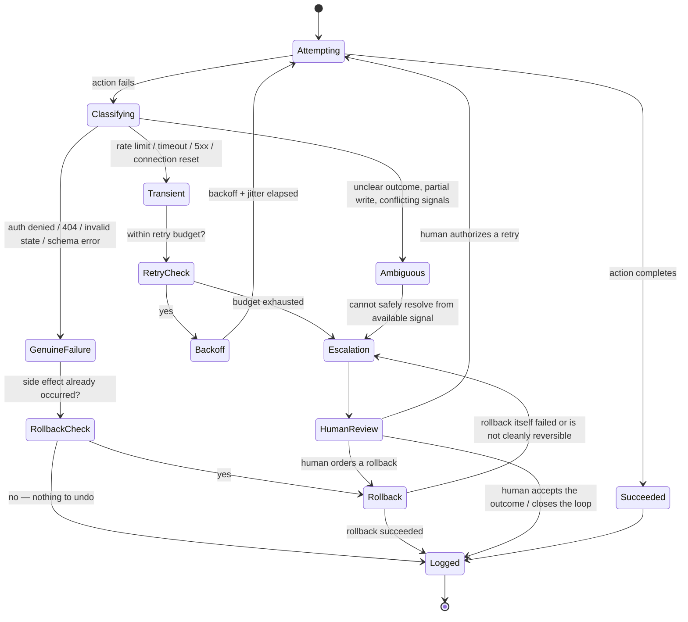
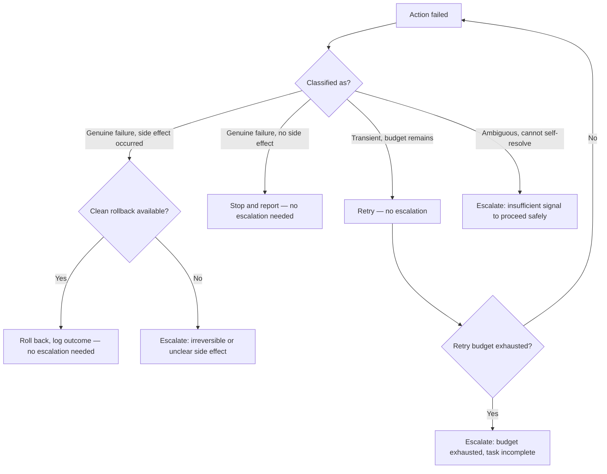

## Safe Execution Paths & Error Handling

> Chapter of
> [[agentic-ai-engineering/readme#04 — Tools & Environment Interaction|Tools & Environment Interaction]],
> part of [[agentic-ai-engineering/readme|Agentic AI Engineering]].

## What you will understand at the end

- Why "the tool call failed" is not one error condition but three, and why collapsing them into a
  single retry-everything policy is the most common way agent systems burn budget or cause damage
- How to design retries for side-effecting tool calls specifically — idempotency, backoff, jitter,
  and a hard retry budget — versus the naive "retry 3 times" pattern that works for read-only APIs
  but actively harms write-heavy ones
- Why rollback has to be designed per action type before an agent is granted write access, not
  bolted on after the first incident
- The decision tree an agent should run before escalating to a human, and what context has to
  survive the handoff for the escalation to be useful rather than a dead end
- Why traceability is the precondition for everything else in this chapter — you cannot roll back,
  escalate meaningfully, or pass a governance review without a durable record of what was attempted
- How GitHub Copilot's coding agent instantiates every one of these ideas today, using git and CI as
  the substrate instead of a bespoke agent framework

---

## The mental model

An agent action is not "did it work: yes/no." It is a state machine with four exits — success,
retry, rollback, and escalation — and the exit you take depends entirely on how you classify the
failure. Get the classification wrong and every downstream decision is wrong too: you retry an auth
failure until the budget is exhausted, or you escalate a plain rate limit and burn a human's
attention on something the agent should have quietly handled itself.

Two things to notice in this diagram before we go section by section:

1. **Every exit — success, rollback, or escalation — terminates at `Logged`.** That is not
   decoration. If the record isn't written, the rollback and escalation paths above it are
   theoretical: nobody can act on a decision nobody can see.
2. **`Classifying` is the load-bearing node.** Everything downstream is conditioned on getting this
   one judgment right, which is why the next section treats it as its own discipline rather than an
   `if/else` you write once and forget.

---

## 1. Error handling taxonomy for agent actions

Treating "tool call failed" as a single bucket is the root cause of most agent reliability bugs. The
fix is a three-way classification made _before_ any retry-or-not decision, because the correct
response is different for each class and mutually exclusive:

| Error class         | Signal examples                                                                                                                                                                                                         | Safe to retry?                                           | Correct agent response                                                                               |
| ------------------- | ----------------------------------------------------------------------------------------------------------------------------------------------------------------------------------------------------------------------- | -------------------------------------------------------- | ---------------------------------------------------------------------------------------------------- |
| **Transient**       | HTTP 429 / 503, connection reset, DNS blip, upstream timeout, "leader election in progress"                                                                                                                             | Yes, almost always                                       | Retry with backoff + jitter under a bounded budget; no human involvement needed                      |
| **Genuine failure** | HTTP 401/403, 404 on a resource the agent expected to exist, schema validation error, precondition failed                                                                                                               | No — retrying wastes budget and can mask the real defect | Stop immediately; surface the specific failure, don't loop                                           |
| **Ambiguous**       | Request timed out but the side effect may or may not have landed; tool returned a malformed or internally inconsistent result; two signals disagree (e.g. HTTP 200 but the expected downstream artifact never appeared) | Not without more information                             | Escalate — resolve the ambiguity (query current state, ask a human) before taking any further action |

The taxonomy is a judgment an agent has to make from the _shape_ of the failure, not from a single
status code lookup table, because the same status code can land in different buckets depending on
context. A 429 from a search API is almost certainly transient. A 429 from a payment API that also
changed the account balance is ambiguous — you don't know if the charge happened before or after the
rate limiter fired, and retrying blind can double-charge.

**The rule that keeps this taxonomy honest under pressure:** classify from the error, not from what
you want to happen next. An agent under time pressure to "just get the task done" will rationalize a
genuine failure as transient so it can keep retrying. That rationalization is exactly the failure
mode a hard retry budget (Section 2) exists to catch even when the classification step gets it
wrong.

---

## 2. Retry design for agent tool calls

Retrying a read is free. Retrying a write is a decision with consequences, and most retry logic
copied from HTTP client libraries was written for reads. Agent tool calls need retry design that
starts from a different question: **is this specific action idempotent, and do I know that, or am I
assuming it?**

### Idempotency first, backoff second

| Action type                                                                               | Idempotent by default?         | Retry-safe strategy                                                                                                                |
| ----------------------------------------------------------------------------------------- | ------------------------------ | ---------------------------------------------------------------------------------------------------------------------------------- |
| Read (GET, search, describe)                                                              | Yes                            | Retry freely on any transient error                                                                                                |
| Create with a client-supplied idempotency key (PUT, or POST + `Idempotency-Key` header)   | Yes, if the same key is reused | Retry safely — the server dedupes on the key                                                                                       |
| Create with a server-generated ID (bare POST)                                             | No                             | Query for the resource before retrying, or synthesize and persist an idempotency key up front                                      |
| Delete                                                                                    | Usually yes                    | Retry safely; treat a 404 on the retry as success, not failure                                                                     |
| Non-idempotent side effect (send email, post a comment, charge a card, trigger a webhook) | No                             | Never blind-retry. Check whether the action already landed (list recent comments, query transaction state) before attempting again |

The agent has to _know_ which row it's in before it retries, not discover it the hard way. In
practice this means: the tool's contract (its description and schema — see
[[agentic-ai-engineering/04-tools-and-environment-interaction/01-tool-calling-architecture/01-tool-calling-architecture|Tool Calling Architecture]])
should state its idempotency guarantee explicitly, the same way an API's OpenAPI spec would. If the
tool doesn't state it, assume non-idempotent and act conservatively — the same default your code
review checklist should apply to any service-to-service call.

### Backoff, jitter, and the retry budget

Three parameters, all mandatory, none optional "nice to haves":

- **Exponential backoff** — each retry waits longer than the last (`base * 2^attempt`), so a
  struggling downstream service isn't hit with the same request rate that broke it in the first
  place.
- **Jitter** — randomize the backoff interval within a range. Without jitter, every agent instance
  that failed at the same moment (a shared dependency blip) retries in lockstep, producing a
  synchronized thundering herd exactly when the dependency is most fragile.
- **Retry budget** — a hard ceiling on both attempt count _and_ elapsed wall-clock time, tied to the
  agent's own
  [[building-agentic-systems/00-building-single-agent-systems/01-agent-architecture|execution loop]]
  stop conditions. An agent without a retry budget is an agent that can loop forever on a single
  tool call, quietly consuming tokens and wall-clock time while never advancing the actual task —
  the single-tool-call analog of the "no max-iteration limit" failure covered in
  [[building-agentic-systems/00-building-single-agent-systems/01-agent-architecture|Agent Architecture]].

A retry budget that's exhausted is not a dead end — it's the trigger for escalation (Section 4), not
silent failure. The two must be wired together: exhausting retries without escalating just changes
an infinite loop into a silent one.

---

## 3. Rollback as a first-class capability

Database transactions gave us `ROLLBACK` as a single word that undoes an arbitrary sequence of
writes atomically. Agent actions almost never have that guarantee, because most of what an agent
touches — a Git repo, a cloud resource, a third-party SaaS API, a Slack channel — isn't
transactional across tool calls. "Undo" has to be designed per action type, and some actions simply
don't have a clean undo at all. That has to be known _before_ the agent is granted write access to
that action, not discovered during an incident.

| Agent action                                           | What "undo" means                      | Reversibility                                                                                 |
| ------------------------------------------------------ | -------------------------------------- | --------------------------------------------------------------------------------------------- |
| Local commit                                           | `git revert` / `git reset`             | Fully reversible while unshared                                                               |
| Open a pull request                                    | Close the PR                           | Fully reversible — nothing downstream depended on it yet                                      |
| Merge a pull request                                   | Revert commit + new PR                 | Reversible, but leaves a trace and may need re-review — not instantaneous                     |
| Create a cloud resource                                | Delete the resource                    | Reversible _if_ it's tracked (IaC state, a tag, a resource ID logged at creation)             |
| Send a Slack message / email                           | Delete or edit, if the platform allows | Partially reversible — recipients may already have read it; the _information_ already escaped |
| Trigger a downstream webhook / third-party side effect | None built in                          | Often irreversible — requires a compensating action, not a true undo                          |

Two design implications fall out of that table directly:

1. **Reversibility is a property of the action, decided at design time, not a property you can add
   after the fact.** If an agent is going to be allowed to call an action in the "often
   irreversible" row, that has to be a deliberate scoping decision — gate it behind human approval
   (see
   [[production-agent-systems/02-reliability-security-and-governance/08-human-approval-systems/08-human-approval-systems|Human Approval Systems]])
   rather than treating rollback as a safety net that will always be there.
2. **"Compensating action" is not the same as "undo."** A refund is not the absence of a charge; a
   correction comment is not the absence of the wrong one. When true reversal isn't possible, the
   agent's rollback path should be explicit about which kind it's executing, because a compensating
   action changes what the audit trail (Section 5) needs to record — it needs to show both the
   original action _and_ the compensation, not a single edited-away event.

Rollback capability and retry-safety are the same underlying property viewed from two directions: an
action's idempotency tells you whether it's safe to retry _forward_; its reversibility tells you
whether it's safe to retry _backward_. Design both at the same time, for the same tool.

---

## 4. Escalation paths: the decision tree

An agent should escalate — stop and hand off to a human — under exactly three conditions, and the
discipline is refusing to escalate for any other reason (alert fatigue on the human side is a real
cost) while never rationalizing past one of these three:

The three genuine escalation triggers, restated as the questions an agent should be asking itself:

1. **The retry budget is exhausted and the task is still incomplete.** Continuing would mean
   silently looping; stopping without telling anyone would mean silently failing. Neither is
   acceptable — escalate.
2. **A side effect occurred that has no clean rollback path.** This is the "often irreversible" row
   from Section 3's table showing up in practice. The agent cannot undo what it did, so it cannot
   make its own judgment call about whether that's acceptable — a human has to.
3. **The failure signal itself is ambiguous** and resolving it would require the agent to guess
   rather than know. Guessing under ambiguity is how a transient-looking situation turns into a
   double-charge or a duplicate resource.

**What has to survive the handoff.** An escalation that arrives without context is worse than no
escalation — it converts an agent's problem into a human's investigation from scratch. At minimum,
the escalation payload needs: the original task/goal, the full sequence of actions attempted so far
(with their classification and outcome), the specific point of failure and its classification, the
retry/rollback state at time of handoff (how many attempts, was anything left half-done), and a
direct link to the durable record from Section 5 rather than a re-narrated summary of it. This is
the same context-preservation requirement covered from the human-in-the-loop side in
[[building-agentic-systems/00-building-single-agent-systems/07-human-in-the-loop-systems|Human-in-the-Loop Systems]]
— this chapter is the failure-path instance of that general pattern.

---

## 5. Traceability and accountability: the audit trail

Everything above — classification, retry, rollback, escalation — is a decision made _in the moment_.
None of it is inspectable after the fact unless the agent also writes down, durably and
attributably, what it did. This is the record a governance review actually asks for, and it's a
harder bar than "we have logs": a log line is not necessarily attributable, replayable, or retained
on a schedule a compliance reviewer will accept.

A durable action record needs, at minimum:

| Field                        | Why it's required                                                                                                                                               |
| ---------------------------- | --------------------------------------------------------------------------------------------------------------------------------------------------------------- |
| **Run / session ID**         | Ties the action back to a specific agent invocation — the correlation ID for everything else                                                                    |
| **Agent identity + version** | Which agent, which prompt/model version — required to attribute behavior to a specific deployed configuration, not "the agent" as an undifferentiated black box |
| **Action attempted**         | The tool name and the exact inputs — not a paraphrase                                                                                                           |
| **Classification**           | Transient / genuine failure / ambiguous, and which rule fired                                                                                                   |
| **Outcome**                  | Success, retried (how many times), rolled back, or escalated                                                                                                    |
| **Timestamp + actor chain**  | When, and whether a human approved or overrode the action at any point                                                                                          |
| **Side effects produced**    | What was actually created/changed/deleted — the input to any later rollback decision                                                                            |

This is not a new concern invented for this chapter — it's the same requirement
[[agentic-ai-engineering/04-tools-and-environment-interaction/12-tool-security/12-tool-security|Tool Security]]
frames as audit logging for approval gates, and the same requirement
[[production-agent-systems/02-reliability-security-and-governance/09-compliance/09-compliance|Compliance]]
frames as audit evidence. The reason it belongs in this chapter specifically is that it is the
_precondition_ for rollback and escalation to work at all: you cannot roll back an action you can't
precisely reconstruct, and you cannot escalate usefully without a record a human can act on.
Traceability isn't a separate concern bolted onto error handling — it's the substrate error handling
runs on.

---

## GitHub Copilot Coding Agent's Safety Net

This chapter exists because of exactly this gap in Microsoft's GH-600 exam objectives, and there is
no better worked example of these five ideas operating together in production than GitHub Copilot's
coding agent — because it doesn't build a bespoke safety net. It inherits one that already existed:
git and CI.

**The documented workflow, as the baseline.** Assigned an issue or a task, Copilot's coding agent
works in an isolated, ephemeral development environment (a GitHub Actions-backed sandbox), pushes
its work as commits to a branch, and opens a **draft pull request**. It does not merge its own work
— the draft-PR mechanism means a human review step is structurally required before anything it
produces reaches a protected branch, which is exactly the approval-gate pattern from
[[production-agent-systems/02-reliability-security-and-governance/08-human-approval-systems/08-human-approval-systems|Human Approval Systems]]
applied for free by the platform. The agent's session — the tool calls and commands it ran to get
there — is visible as a log attached to the PR, so the "what was attempted" half of the traceability
record in Section 5 isn't something you have to build; it's already part of how the platform works.

**CI failure as a structured retry signal.** A failing required status check on the agent's own PR
is not a vague "something's wrong" — it's exactly the kind of concrete, structured signal Section 1
argues an agent needs to classify before acting. A failing lint check or unit test gives the agent
something a human-readable error message and stack trace it can read, reason about, and act on: edit
the code, push a new commit, and let the check re-run — the retry loop from Section 2, except the
"tool call" being retried is "produce a commit that passes CI" and the retry budget is the number of
iterations the agent is willing to spend responding to check failures. Where documented behavior
gets thin, I'll flag it explicitly rather than invent precision: I'm confident Copilot's coding
agent can see failing checks on its own PR and is designed to iterate in response to review feedback
and failure signals; I am _generalizing_, not citing an exact documented mechanic, when it comes to
whether every CI failure triggers a fully autonomous fix attempt without a human nudging it via a PR
comment, and what the platform's internal iteration cap is. Treat that boundary as an open question
to verify against current product docs before asserting it as fact in an interview answer.

**Escalation is the PR itself.** There's no separate escalation channel to design, because the draft
PR already _is_ the handoff artifact: a stuck or failed agent run doesn't vanish, it sits there as
an open draft PR, visibly not-yet-mergeable, with its commit history and session log as context. A
human reviewing their PR queue encounters it the same way they'd encounter a stuck teammate's WIP —
the escalation surfaces through the existing review workflow rather than a bespoke alert. That is a
real strength (no extra infrastructure) and a real limit worth naming: it relies on someone looking
at the PR queue. An agent-authored PR that nobody reviews doesn't escalate — it just sits, silently.
The context-preservation requirement from Section 4 is satisfied by construction (commits + session
log + PR description), but the "did a human actually see it" half of escalation still depends on
team process, not the platform.

**Rollback is `git revert`, and that's not a workaround — it's the correct primitive.** Section 3
asked what "undo" means for an action that isn't a database transaction. For a coding agent, the
answer is the oldest reversibility primitive in the toolchain: a merged agent-authored change is
undone the same way any human-authored change is — revert the commit, or revert the merge. Branch
protection rules, required reviewers, and required status checks apply identically regardless of who
(or what) authored the branch, so the safety envelope isn't agent-specific configuration — it's the
same repo governance already in place for human contributors, which is precisely why it scales
without a parallel "AI governance" system bolted on the side.

**The audit trail was never optional — it's what git already is.** Commit authorship, commit
messages, the PR timeline (comments, review requests, approvals, check runs), and the Actions run
logs together are the durable, attributable record Section 5 describes — who/what attempted what,
with what inputs, and what happened — without the team having to build a bespoke logging pipeline
for "AI actions" as a separate category. This is the detail worth carrying into a governance review:
the accountability record for an agent-authored change is not a new artifact type a compliance
function has to learn to evaluate. It's the same artifact — commit history — they already know how
to audit.

| This chapter's concept        | Copilot coding agent's instantiation                                                       | Confidence                                                                                  |
| ----------------------------- | ------------------------------------------------------------------------------------------ | ------------------------------------------------------------------------------------------- |
| Structured retry signal       | Failing required status check on the agent's own PR                                        | Documented                                                                                  |
| Retry loop / iteration        | Agent pushes a new commit in response to a failing check or review comment                 | Documented behavior; exact autonomy boundary and iteration cap generalized                  |
| Escalation surface            | Stuck/failed run visible as an open draft PR in the normal review queue                    | Documented mechanism; whether it's _seen_ depends on team process (not platform-guaranteed) |
| Rollback                      | `git revert` on a commit or merge; branch protection unchanged for agent-authored branches | Git-native, high confidence                                                                 |
| Traceability / accountability | Commit authorship + PR timeline + required-reviewer approvals + Actions run logs           | Git/GitHub-native, high confidence                                                          |

The through-line for an interview answer: **the safest execution path for an agentic system is often
the one that reuses a battle-tested human safety net instead of designing a new one from scratch.**
Copilot's coding agent didn't need a bespoke rollback engine or a custom audit log schema — it
needed to operate inside a system (git + CI + branch protection) that already solved error handling,
rollback, and accountability for human contributors, and to respect those same constraints itself.

---

## Concept check

| Question                                                                                | Answer hint                                                                                                                                       |
| --------------------------------------------------------------------------------------- | ------------------------------------------------------------------------------------------------------------------------------------------------- |
| Why is retrying a genuine failure worse than doing nothing?                             | It burns retry budget and time while masking the real defect, delaying the escalation that would actually fix it                                  |
| What single property determines whether a tool call is safe to blind-retry?             | Idempotency — whether repeating the call with the same inputs produces the same end state                                                         |
| Why does jitter matter alongside exponential backoff?                                   | Without it, agents that failed simultaneously retry in lockstep, re-creating the load spike that caused the failure                               |
| Name an agent action with no clean rollback.                                            | A fired webhook / third-party side effect with no compensating API — reversal requires a compensating action, not an undo                         |
| What are the three legitimate reasons an agent should escalate?                         | Retry budget exhausted with the task incomplete; an irreversible side effect occurred; the failure signal is ambiguous and can't be self-resolved |
| Why is traceability a precondition for rollback and escalation, not a separate concern? | You can't roll back an action you can't precisely reconstruct, and you can't escalate usefully without a record a human can act on                |
| What does GitHub Copilot's coding agent use as its rollback mechanism?                  | `git revert` on a commit or merge — the same primitive used for human-authored changes                                                            |

---

## Vocabulary glossary

| Term                | Definition                                                                                               |
| ------------------- | -------------------------------------------------------------------------------------------------------- |
| Transient error     | A failure caused by a temporary condition (rate limit, network blip) that is safe to retry               |
| Genuine failure     | A failure caused by an invalid request or state that retrying cannot fix                                 |
| Ambiguous outcome   | A failure whose actual effect on system state is unknown from the available signal                       |
| Idempotency         | The property that repeating an action with the same inputs produces the same end state                   |
| Idempotency key     | A client-supplied identifier that lets a server deduplicate retried requests for the same logical action |
| Exponential backoff | Increasing the wait time between retries geometrically, to reduce load on a struggling dependency        |
| Jitter              | Randomizing retry delay to prevent synchronized retry storms across concurrent callers                   |
| Retry budget        | A hard cap on retry attempts and/or elapsed time for a single action, preventing infinite retry loops    |
| Rollback            | Reverting an action's effects — exact mechanism depends entirely on the action type                      |
| Compensating action | A new action that offsets an earlier one's effect, used when a true undo doesn't exist                   |
| Escalation          | Handing an in-progress task off to a human because the agent cannot safely proceed on its own            |
| Traceability        | A durable, attributable record of what an agent attempted, with what inputs, and what happened           |
| Blast radius        | The scope of systems/data an action could affect if it goes wrong — a key input to reversibility design  |

## Metadata

|        |                        |
| ------ | ---------------------- |
| Author | Amit Singh             |
| Scope  | agentic-ai-engineering |
