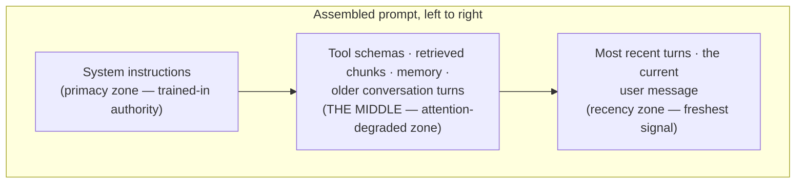

## Context Assembly

> Chapter of [[agentic-ai-engineering/readme#06 — Context Engineering|Context Engineering]], part of
> [[agentic-ai-engineering/readme|Agentic AI Engineering]].

## What you will understand at the end

- What "context assembly" means as a concrete engineering step — not a synonym for prompt
  engineering, but the runtime function that turns five or six unrelated data sources into one
  string of tokens
- Why _where_ a fact sits in the assembled prompt changes how much weight the model gives it,
  independent of whether the fact is true or relevant
- How to trace one real agent turn from raw sources through to the exact prompt sent to the model
- How this chapter hands off to the other six chapters in this Part — each one answers a question
  this chapter deliberately leaves open

---

## The problem this chapter names

Every agent framework tutorial shows you `messages.append(...)` and moves on, as if building the
list of messages sent to the model is a bookkeeping detail. It isn't. By the time a nontrivial agent
turn reaches the model, the final prompt is an assembly of pieces that were computed by entirely
different subsystems, on entirely different schedules, with no shared understanding of each other:

| Source               | Computed by                                                                                                                                                                    | Typical size                                    | Changes                                                                                                                                                                                       |
| -------------------- | ------------------------------------------------------------------------------------------------------------------------------------------------------------------------------ | ----------------------------------------------- | --------------------------------------------------------------------------------------------------------------------------------------------------------------------------------------------- |
| System instructions  | Written once, deployed with the agent                                                                                                                                          | Small, fixed                                    | Rarely — a deploy event                                                                                                                                                                       |
| Tool schemas         | Generated from the tool registry                                                                                                                                               | Grows with the tool catalog                     | Per deploy, or per request if [[agentic-ai-engineering/04-tools-and-environment-interaction/11-tool-selection-strategies/11-tool-selection-strategies\|tool selection]] scopes it dynamically |
| Retrieved chunks     | A [[agentic-ai-engineering/05-retrieval-and-knowledge-systems/01-retrieval-augmented-generation-rag/01-retrieval-augmented-generation-rag\|RAG]] pipeline, run fresh this turn | Variable, often the largest chunk of the budget | Every turn that triggers retrieval                                                                                                                                                            |
| Memory               | A [[agentic-ai-engineering/02-memory-systems/11-memory-retrieval/11-memory-retrieval\|memory retrieval]] call against long-term/episodic stores                                | Variable                                        | Every turn, independently of RAG                                                                                                                                                              |
| Conversation history | The running message list for this session                                                                                                                                      | Grows monotonically within a session            | Every turn                                                                                                                                                                                    |
| The current turn     | The user's message, or the tool result that just came back                                                                                                                     | Small                                           | Every turn                                                                                                                                                                                    |

None of these subsystems knows what the others produced. The RAG pipeline doesn't know how much room
memory retrieval already claimed. Memory retrieval doesn't know the tool catalog just grew.
**Context assembly is the function that sits downstream of all of them and has to make it coherent**
— decide what survives, in what order, formatted how, before a single token goes to the model.

Treat this as a real function with a real signature, because that's what it is in any production
agent runtime:

```python
def assemble_context(
    system_prompt: str,
    tool_schemas: list[ToolSchema],
    retrieved_chunks: list[Chunk],       # from RAG — Part 05
    retrieved_memories: list[Memory],    # from memory retrieval — Part 02
    conversation_history: list[Message],
    current_turn: Message,
    token_budget: int,
) -> list[Message]:
    ...
```

Everything in this chapter is about what has to happen inside that function's body, and everything
in the rest of this Part is about the specific policy decisions this signature glosses over —
ranking candidates, choosing which memories earn their tokens, enforcing the budget, deciding
whether to retrieve at all, compressing what doesn't fit, and eventually treating the whole thing as
a compiled artifact instead of hand-assembled string concatenation. This chapter's job is narrower:
name the sources, and explain why position inside the assembled prompt is not a neutral choice.

---

## The ordering problem

Transformers do not read a prompt the way a person reads a document, weighing each sentence on its
merits regardless of where it sits. Position is itself a signal, for two separable reasons:

**1. Positional and training bias toward the edges.** Instruction-tuned models are trained
overwhelmingly on a `system → user → assistant` shape, with the system block first. That training
pressure means content placed in the system position gets treated as higher-authority instruction
almost regardless of what's physically closest to the generation point — this is a large part of why
system-prompt jailbreak resistance is a real, measurable property and not just "the first thing the
model reads." Content nearest the end of the prompt — right before the model starts generating —
also gets privileged treatment, for a more mechanical reason: it's the freshest signal with the
fewest intervening tokens for attention to spread across.

**2. The middle degrades.** The empirical finding usually called "lost in the middle" (the general
shape is well established in the literature on long-context retrieval; I'm not going to attach a
specific accuracy number to it here since I can't verify a figure precisely enough to state it as
fact) is that retrieval accuracy over a long context tends to follow a U-curve: highest when the
needed fact sits at the very start or very end of the context, and measurably worse when it's buried
in the middle — even though the model's stated context window comfortably contains it. The model
isn't out of room. It's attending unevenly across the room it has.

Put those two effects together and you get a genuinely uncomfortable design constraint: **the
"safest" real estate in a prompt is the two ends, and everything you assemble is competing for space
you don't fully control**, because the system prompt claims one end by convention and the current
turn claims the other by necessity. Retrieved chunks, memory, and — as a session grows — the bulk of
conversation history all land in the middle by default, which is exactly the zone most at risk of
being under-attended.



This is not an argument for cramming everything into the two ends — the system prompt has a job
(instructions, not facts) and the current turn has a job (the immediate ask, not history). It's the
reason the six chapters after this one exist: if position determines attention and the middle is
lossy, then _what_ earns a seat in the middle, and how compactly it's expressed, is not a detail —
it's the whole game.
[[ai-foundations/01-language-models-in-practice/01-prompt-engineering-fundamentals/01-prompt-engineering-fundamentals|Prompt Engineering Fundamentals]]
already flags the same recency bias at the scale of a handful of few-shot examples; this chapter is
that observation applied to a full agent turn with thousands of tokens of retrieved and remembered
content competing for the same effect.

---

## Worked example: assembling one agent turn

Take a concrete case: an SRE-copilot agent mid-investigation on a latency alert for a checkout
service. The user's current message is `"why is checkout p99 spiking again?"`. Here's what the
runtime has on hand before it can call the model, and the assembly decision it has to make for each
piece.

**The raw material, before assembly:**

| Source                 | What's actually available                                                                                                                                                                                                                                       |
| ---------------------- | --------------------------------------------------------------------------------------------------------------------------------------------------------------------------------------------------------------------------------------------------------------- |
| System instructions    | ~400 tokens: role, tone, tool-use rules, escalation policy                                                                                                                                                                                                      |
| Tool schemas           | 3 relevant tools scoped down from a larger catalog by [[agentic-ai-engineering/04-tools-and-environment-interaction/11-tool-selection-strategies/11-tool-selection-strategies\|tool selection]]: `query_metrics`, `query_logs`, `create_incident` — ~350 tokens |
| Retrieved chunks (RAG) | 2 chunks pulled from a runbook corpus, ranked by the Part 05 pipeline: a "checkout latency triage" runbook section and a "connection pool exhaustion" postmortem excerpt — ~900 tokens                                                                          |
| Retrieved memory       | 1 semantic-memory hit: _"This exact alert signature fired 3 weeks ago on this service; root cause was connection pool exhaustion under a traffic spike, resolved by a pool-size bump"_ — ~120 tokens                                                            |
| Conversation history   | 6 prior turns this session (the agent already ran `query_metrics` twice) — ~1,100 tokens                                                                                                                                                                        |
| Current turn           | The user's question — ~15 tokens                                                                                                                                                                                                                                |

That's roughly 2,900 tokens of candidate material. Assume a working budget of 8,000 tokens reserved
for input context (leaving headroom for output and the provider's own overhead) — everything fits
this turn, so this example is deliberately not yet a budget-pressure scenario; see
[[agentic-ai-engineering/06-context-engineering/04-prompt-budgets/04-prompt-budgets|Prompt Budgets (Chapter 4)]]
for what changes once it doesn't. The interesting decision here isn't _what to cut_ — it's _where
each piece goes_.

**The assembled result:**

```text
[SYSTEM]
You are an SRE investigation copilot for checkout-service.
Use query_metrics and query_logs before proposing a root cause.
Only call create_incident after the user confirms severity.
Escalate to a human if evidence is ambiguous after 3 tool calls.

[SYSTEM — tool schemas]
query_metrics(service, metric, window) -> ...
query_logs(service, query, window) -> ...
create_incident(service, severity, summary) -> ...

[SYSTEM — retrieved knowledge, injected as grounding]
[Runbook: Checkout Latency Triage §2]
  "p99 latency spikes on checkout correlate with DB connection pool
   saturation more often than with upstream payment-provider latency..."
[Postmortem excerpt: INC-4471]
  "Root cause: connection pool exhausted at 3x baseline traffic..."

[SYSTEM — relevant memory]
  Note: this alert signature (checkout p99 spike) fired 3 weeks ago
  on this same service. Root cause then: connection pool exhaustion
  under traffic spike. Resolved via pool-size increase.

[USER]   why is checkout p99 spiking right now? investigate.
[ASSISTANT] [tool_call: query_metrics(service=checkout, metric=p99_latency, window=1h)]
[TOOL]   p99=1840ms (baseline 240ms), started 14 minutes ago
[ASSISTANT] [tool_call: query_logs(service=checkout, query="connection pool", window=1h)]
[TOOL]   47 log lines matching "connection pool exhausted" in last 10m
[ASSISTANT] Confirmed: connection pool exhaustion — matches the
  pattern from 3 weeks ago (INC-4471) and the retrieved runbook.
  Recommend the same fix: bump pool size. Escalate for approval?

[USER]   why is checkout p99 spiking again?
```

Three assembly decisions are doing real work here, and each maps to a placement choice, not a
content choice:

1. **Retrieved chunks and memory are placed together, right after tool schemas, before conversation
   history — not scattered, not appended at the very end.** They're grounding material the model
   needs available _before_ it reasons about the live conversation, but they're not instructions, so
   they don't belong inside the system block's authority zone either. This chapter's assembler
   treats them as a distinct zone with a clear boundary, which matters for
   [[agentic-ai-engineering/06-context-engineering/06-context-compression/06-context-compression|Chapter 6]]'s
   compression policy later — you can't selectively compress a zone you never gave a boundary to.
2. **Retrieved memory sits closer to the current turn than the older tool-call turns do, even though
   it's fresher information the runtime just fetched, not something that happened earlier in this
   conversation.** That's a deliberate exploitation of the recency effect: the single
   highest-leverage fact for this turn — "this happened before, here's the fix" — earns a position
   near the generation point, not buried where a stale early-session tool call sits.
3. **The repeated final user message ("why is checkout p99 spiking again?") is the very last thing
   before generation.** Even though it's nearly identical to the first user turn, its position — not
   its content — is what makes it the strongest signal the model is currently weighing. This is the
   mechanical reason "restate what you actually need right now" as a technique works at all: it's
   not that the model forgot, it's that recency re-weights it.

Notice what this example does _not_ resolve: it doesn't say how the two retrieved chunks were scored
against a larger candidate set, whether the memory hit deserved to beat out other candidate
memories, what happens the turn this session hits token pressure, or whether retrieval should have
fired again on this second identical-looking question instead of reusing memory. Those are exactly
the next six chapters.

---

## How this chapter hands off to the rest of Part 06

This chapter answers "how do the pieces get combined and ordered." It deliberately leaves six
adjacent questions open — each one is a full chapter because the design space is real, not because
the topic needed padding:

| Open question this chapter doesn't answer                                                                               | Where it's answered                                                                                                              |
| ----------------------------------------------------------------------------------------------------------------------- | -------------------------------------------------------------------------------------------------------------------------------- |
| Given more candidate chunks and memories than fit, which ones actually win a seat?                                      | [[agentic-ai-engineering/06-context-engineering/02-context-ranking/02-context-ranking\|Chapter 2 — Context Ranking]]             |
| Of what memory retrieval (Part 02) hands back, which items are worth this turn's tokens?                                | [[agentic-ai-engineering/06-context-engineering/03-memory-selection/03-memory-selection\|Chapter 3 — Memory Selection]]          |
| How is the token budget split across system, tools, retrieval, memory, and history — and what gives when it's exceeded? | [[agentic-ai-engineering/06-context-engineering/04-prompt-budgets/04-prompt-budgets\|Chapter 4 — Prompt Budgets]]                |
| Should the agent have retrieved at all on the repeated question, or reused what it already had?                         | [[agentic-ai-engineering/06-context-engineering/05-retrieval-policies/05-retrieval-policies\|Chapter 5 — Retrieval Policies]]    |
| How do you shrink what's assembled without silently dropping the fact the model actually needed?                        | [[agentic-ai-engineering/06-context-engineering/06-context-compression/06-context-compression\|Chapter 6 — Context Compression]] |
| Can this whole procedure be declared once, as a spec, instead of hand-assembled per call site?                          | [[agentic-ai-engineering/06-context-engineering/07-prompt-compilers/07-prompt-compilers\|Chapter 7 — Prompt Compilers]]          |

Read in order, Part 06 goes from "here's the assembly problem and why position matters" (this
chapter) to "here's how you score and select what's worth assembling" (Chapters 2–3) to "here's how
you enforce limits and decide when to even bother retrieving" (Chapters 4–5) to "here's how you
compress what survives" (Chapter 6) to "here's how you stop doing all of this by hand" (Chapter 7).
Each chapter assumes this one's vocabulary — sources, zones, the primacy/recency asymmetry — without
re-deriving it.

---

## Concept check

| Question                                                                                                                         | Answer hint                                                                                                                                                                                     |
| -------------------------------------------------------------------------------------------------------------------------------- | ----------------------------------------------------------------------------------------------------------------------------------------------------------------------------------------------- |
| What are the five-to-six distinct sources a context assembler has to reconcile?                                                  | System instructions, tool schemas, retrieved chunks (RAG), retrieved memory, conversation history, and the current turn                                                                         |
| Why do the two ends of a prompt get more effective attention than the middle?                                                    | The system position carries trained-in instruction authority (primacy); the position nearest generation carries the freshest, least-diluted signal (recency) — the middle has neither advantage |
| Why does "lost in the middle" matter even when the content technically fits inside the context window?                           | Fitting inside the window guarantees the tokens are present, not that they're attended to evenly — retrieval accuracy over long contexts measurably degrades for facts placed mid-prompt        |
| In the worked example, why was the relevant memory placed near the current turn instead of chronologically where it was fetched? | To deliberately exploit the recency effect for the single highest-leverage fact this turn needs, rather than let position be an accident of fetch order                                         |
| What does this chapter leave for Chapter 2 (Context Ranking) to solve?                                                           | Which candidate chunks/memories win a limited number of slots when there are more candidates than room — this chapter assumes that selection already happened                                   |

---

## Vocabulary glossary

| Term               | Definition                                                                                                                                                                             |
| ------------------ | -------------------------------------------------------------------------------------------------------------------------------------------------------------------------------------- |
| Context assembly   | The runtime step that combines system instructions, tool schemas, retrieved chunks, memory, conversation history, and the current turn into one ordered prompt                         |
| Primacy effect     | The tendency of instruction-tuned models to treat content in the system/first position as higher-authority, reinforced by training convention                                          |
| Recency effect     | The tendency for content nearest the generation point to carry the strongest, least-diluted signal                                                                                     |
| Lost in the middle | The empirical pattern where retrieval accuracy over a long context degrades for facts placed mid-prompt, even though they're within the context window                                 |
| Assembly zone      | A deliberately bounded region of the assembled prompt (e.g. "retrieved knowledge") that downstream policies like ranking or compression can target independently                       |
| Token budget       | The fixed ceiling of input tokens an assembler must fit all sources within — see [[agentic-ai-engineering/06-context-engineering/04-prompt-budgets/04-prompt-budgets\|Prompt Budgets]] |
