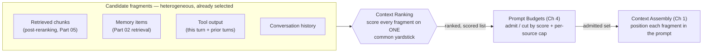

## Context Ranking

> Chapter of [[agentic-ai-engineering/readme#06 — Context Engineering|Context Engineering]], part of
> [[agentic-ai-engineering/readme|Agentic AI Engineering]].

## What you will understand at the end

- Why context ranking is a distinct, later-stage problem from retrieval reranking — and exactly
  where the boundary between the two falls
- The four signals — semantic similarity, recency, source authority, prior usefulness — that let you
  score heterogeneous fragment types (retrieval hits, memory items, tool output, prior turns)
  against one common yardstick
- Why a composite score, not any single signal, has to gate admission into the token budget, and the
  normalization pitfall that breaks a composite score if you skip it
- The near-duplicate crowding failure mode that pure-similarity ranking produces, worked through a
  concrete incident-triage example, and the standard fix (maximal marginal relevance)
- Where this chapter's ranked output flows next in Part 06 — budgets, assembly, memory selection,
  compression — without re-solving what those chapters own

---

## The mental model

By the time context ranking runs, retrieval has already happened. Reranking
([[agentic-ai-engineering/05-retrieval-and-knowledge-systems/06-reranking/06-reranking|Part 05]])
has already happened. Memory retrieval has already happened. Whatever tools the agent called earlier
this turn, or in prior turns, have already returned their output. What arrives at this stage is not
a query against a corpus — it's a pile of **already-selected candidate fragments**, pulled from
subsystems that have never been compared against each other, all now competing for the same fixed
number of tokens in one prompt.



The job this chapter owns is narrow and specific: **produce a single ordered, scored list across
fragment types that were never ranked against each other before.** It does not decide how many
tokens survive (that's
[[agentic-ai-engineering/06-context-engineering/04-prompt-budgets/04-prompt-budgets|Prompt Budgets]]),
and it does not decide where in the prompt an admitted fragment lands (that's
[[agentic-ai-engineering/06-context-engineering/01-context-assembly/01-context-assembly|Context Assembly]]).
It decides which fragments deserve to be in the running at all, and in what priority order.

---

## 1. Why this is a different problem than reranking

It's tempting to read "context ranking" as just reranking under a different name — both produce an
ordered list, both use relevance as an input. The two operate at genuinely different altitudes, and
conflating them is how a context-engineering pipeline ends up with either a redundant ranking pass
or a missing one.

| Dimension                     | Reranking (Part 05, Ch 6)                                                                                          | Context ranking (this chapter)                                                                                                                                                          |
| ----------------------------- | ------------------------------------------------------------------------------------------------------------------ | --------------------------------------------------------------------------------------------------------------------------------------------------------------------------------------- |
| Input population              | Candidates from one retrieval call over one corpus                                                                 | The mixed, already-selected set: reranked retrieval hits + memory hits + tool output + prior turns                                                                                      |
| Scoring mechanism             | Cross-encoder — a joint `(query, doc)` forward pass per candidate; accurate, but only meaningful within one corpus | A cheap composite/heuristic score across heterogeneous types — a cross-encoder can't jointly score a memory item against a live tool result the same model scored a document chunk with |
| What it's competing against   | Other passages retrieved by the same call, from the same corpus                                                    | Fragments from different subsystems that have never been compared to each other before now                                                                                              |
| Where it runs in the pipeline | Inside the retrieval step, before candidates are even considered for context inclusion                             | After retrieval and reranking are already done — this is the context-assembly step for the current turn                                                                                 |
| Failure it exists to prevent  | A relevant passage buried at rank 40 of a 200-candidate ANN search                                                 | A high-relevance-but-redundant chunk crowding out a low-relevance-but-critical fragment from a different source (Section 3)                                                             |

There's a third, adjacent altitude worth naming so the triangle is complete:
[[agentic-ai-engineering/04-tools-and-environment-interaction/05-search-tools/05-search-tools|Search Tools]]
(Part 04, Ch 5) covers ranking **within one tool call's own result set** — relevance, recency, and
authority weighted together before a single search tool even returns to the agent loop. That's the
same altitude as reranking, just implemented ad hoc inside one tool instead of as a dedicated
retrieval-pipeline stage. Context ranking is one level further downstream than either: it doesn't
care which subsystem produced a fragment, or how that subsystem ranked its own internal candidates —
it only cares how that fragment compares to every _other_ admitted fragment, regardless of source.

The practical consequence: if you only rerank within retrieval and never rank across sources, a
production agent with retrieval + memory + tool output all feeding one prompt will silently favor
whichever source happens to run last and get appended, not whichever fragment actually matters most
this turn.

---

## 2. Scoring signals

Four signals do most of the work. Each one answers a different question about a fragment, and none
of them alone is sufficient — a fragment that's semantically perfect but three months stale, or
maximally recent but from an untrusted source, is exactly the kind of thing a single-signal ranking
gets wrong.

| Signal                  | What it captures                                                                                           | Concrete implementation                                                                                                                                                     | Where it dominates                                                                 |
| ----------------------- | ---------------------------------------------------------------------------------------------------------- | --------------------------------------------------------------------------------------------------------------------------------------------------------------------------- | ---------------------------------------------------------------------------------- |
| **Semantic similarity** | Closeness of the fragment to the _current_ turn's query, not the query it was originally retrieved against | Re-embed the fragment against the live turn and take cosine similarity — a memory item pulled three turns ago was scored against a different query and needs re-scoring now | Direct factual lookups, definitional questions                                     |
| **Recency**             | How fresh the fragment, or the data underneath it, actually is                                             | Exponential (or step) decay on fragment age — write time for a memory item, fetch time for tool output, publish/last-verified time for a retrieved doc                      | Live incident state, "what changed," anything with a shelf life                    |
| **Source authority**    | How much the fragment's origin should be trusted, independent of how well-worded it is                     | A static per-source-type weight table — a live tool call to the system of record typically outranks a retrieved wiki page, which outranks a memory-derived inference        | Anything where being confidently wrong is expensive                                |
| **Prior usefulness**    | Whether this fragment, or ones structurally like it, actually got used or cited in past responses          | A running score attached to a fragment/memory id, incremented (as an exponential moving average) when a downstream response cites or acts on it, decayed otherwise          | Long-running sessions, repeat-user agents, anything with feedback signal available |

Prior usefulness is the signal that doesn't show up in a one-shot retrieval or search-tool ranking
at all — it only exists because context ranking runs inside a session with a history to learn from.
A memory item that's been pulled into context ten times and cited zero times should rank lower than
one pulled twice and cited both times, even if their embedding similarity to the current query is
identical.

A composite score combines them:

```txt
score(fragment) = w_sim        × sim(fragment, current_turn)
                 + w_recency   × recency_decay(fragment.age)
                 + w_authority × authority[fragment.source_type]
                 + w_usefulness × usefulness_ema(fragment.id)
```

**The pitfall that breaks this formula if you skip it: the four terms are not on the same scale.**
Cosine similarity clusters densely between roughly 0.7 and 0.95 for anything topically related.
Authority is a small set of discrete tiers. A usefulness EMA might range from 0 to 1 over a
completely different distribution depending on session length. Summing raw values lets whichever
signal happens to have the widest numeric range dominate the score by accident, not by design.
Rescale each signal — min-max or z-score, computed over the current candidate set, not a fixed
global range — _before_ applying weights, and treat the weights themselves as an explicit per-agent
tuning decision, not a default left at whatever a tutorial used.

---

## 3. The failure mode: ranking purely by similarity

This is the mistake that survives code review because each piece looks reasonable in isolation:
retrieve top-k by cosine similarity, sort by score, truncate at the budget. It works fine on toy
examples where the right answer and the query share vocabulary. It fails predictably in production
whenever the fragment that actually matters is worded differently from the query that's asking for
it — which is exactly when an agent needs it most.

**Worked example.** An SRE-triage agent is investigating repeated 500s on `payment-service`. Its
candidate fragment set for this turn:

| #   | Fragment                                                                                                    | Source        | Raw similarity to "payment-service returning 500s" |
| --- | ----------------------------------------------------------------------------------------------------------- | ------------- | -------------------------------------------------- |
| 1   | Runbook: "Troubleshooting 5xx errors on payment-service" (generic checklist)                                | Retrieved doc | 0.91                                               |
| 2   | Runbook: "payment-service error rate playbook" (near-duplicate of #1, different revision)                   | Retrieved doc | 0.90                                               |
| 3   | Runbook: "500 error triage steps, payment-service" (near-duplicate mirror in an older space)                | Retrieved doc | 0.89                                               |
| 4   | Runbook: "General 5xx debugging guide" (broader, less specific version of the same checklist)               | Retrieved doc | 0.87                                               |
| 5   | Runbook: "payment-service on-call quick reference" (overlaps heavily with #1)                               | Retrieved doc | 0.85                                               |
| 6   | Memory: "payment-service 500 spike, Q1 cert rotation — root cause: expired mTLS cert, fix: rotate + reload" | Memory item   | 0.62                                               |

Fragments 1–5 are five variations on the same generic troubleshooting content, all scoring high
because they share vocabulary with the query ("500," "payment-service," "error"). Fragment 6 is a
specific, load-bearing memory of the actual root cause from a past incident — but it scores lower
because it's worded around "mTLS cert" and "cert rotation," not "500 error." If the current incident
is happening during this quarter's cert rotation window and the budget only admits the top five by
raw similarity, fragment 6 — the fragment most likely to actually resolve the incident — gets cut,
and five near-identical restatements of "check the logs and retry" get in instead.

**The fix: maximal marginal relevance (MMR).** Instead of ranking by similarity to the query alone,
MMR ranks by similarity to the query _minus_ similarity to whatever has already been selected:

```txt
MMR_score(fragment) = λ × sim(fragment, query) − (1 − λ) × max_sim(fragment, already_selected)
```

Walking the example with λ = 0.7: fragment 1 gets picked first (highest raw similarity, nothing
selected yet to penalize against). For every fragment considered next,
`max_sim(fragment, already_selected)` is now high for fragments 2–5 — they're near-duplicates of
fragment 1 — so their MMR score drops sharply even though their raw similarity barely changed.
Fragment 6's `max_sim` to the selected set stays low (different vocabulary, different structure), so
its MMR score holds up relative to the remaining near-duplicates. By the third or fourth pick,
fragment 6 outranks fragments 3–5 on MMR score even though it never would have on raw similarity —
and it survives the budget cut.

This is the same problem the dedup layers in
[[agentic-ai-engineering/04-tools-and-environment-interaction/05-search-tools/05-search-tools|Search Tools]]
solve, one level up. That chapter's canonical-URL collapsing and embedding-clustering dedup remove
redundancy **within one source** before its results even leave the tool call. MMR at the context-
ranking stage handles the redundancy that survives _across_ multiple independently-deduped sources —
five different runbook revisions that each passed their own source's dedup pass cleanly, because no
single source's dedup logic can see what the other sources are about to contribute.

**The tuning tradeoff to be explicit about:** λ trades relevance for diversity. Too high, and MMR
degrades to plain similarity ranking with none of the crowding fix. Too low, and the ranker starts
admitting genuinely irrelevant fragments purely for variety's sake, which burns budget on noise
instead of redundancy. In practice, apply MMR's diversity penalty primarily _within_
same-source-type clusters (retrieved docs against other retrieved docs) rather than globally —
fragments from genuinely different subsystems (a tool output vs. a memory item) are usually already
diverse by construction, so penalizing across them wastes the diversity term on pairs that were
never going to collide.

---

## 4. Where the ranked list goes next

Context ranking's output — one scored, ordered list spanning every fragment type — feeds directly
into the rest of Part 06 without re-solving what those chapters own:

- [[agentic-ai-engineering/06-context-engineering/04-prompt-budgets/04-prompt-budgets|Prompt Budgets]]
  (Ch 4) takes this ranked list and decides where the admit/cut line actually falls, plus any
  per-source minimum or maximum caps. Ranking sets the priority order; the budget chapter
  administers the cutoff against a real token count.
- [[agentic-ai-engineering/06-context-engineering/01-context-assembly/01-context-assembly|Context Assembly]]
  (Ch 1) takes the _admitted_ set and decides layout — where each fragment lands in the actual
  prompt sequence, independent of its rank score, since position in the prompt has its own attention
  effects separate from relevance.
- [[agentic-ai-engineering/06-context-engineering/03-memory-selection/03-memory-selection|Memory Selection]]
  (Ch 3) is this chapter's scoring mechanism applied specifically, and only, to memory-sourced
  fragments — with memory-specific policy layered on top, like an explicit user pin or deletion
  request overriding whatever the composite score would otherwise say.
- Retrieval Policies (Ch 5, Part 06) is upstream of this chapter, not downstream: it decides how
  many candidates even enter the pool this chapter ranks, before ranking ever runs.
- Context Compression (Ch 6, Part 06) is the escape hatch when even the correctly top-ranked set
  still doesn't fit the budget — compress the admitted fragments instead of dropping more of them.

---

## Concept check

| Question                                                                                        | Answer hint                                                                                                                                                                            |
| ----------------------------------------------------------------------------------------------- | -------------------------------------------------------------------------------------------------------------------------------------------------------------------------------------- |
| What's the population difference between reranking and context ranking?                         | Reranking scores candidates from one retrieval call over one corpus; context ranking scores an already-mixed set spanning retrieval, memory, tool output, and prior turns              |
| Why can't a cross-encoder just do context ranking's job?                                        | Cross-encoders jointly score `(query, doc)` pairs within one corpus's representation — there's no single joint model for scoring a memory item against a live tool result the same way |
| Which signal exists only because context ranking runs inside a session, not a one-shot search?  | Prior usefulness — an EMA of whether a fragment actually got cited or acted on in past turns                                                                                           |
| Why does summing the four raw signal values break the composite score?                          | They're on incompatible scales (dense cosine similarity vs. discrete authority tiers vs. an EMA) — normalize before weighting                                                          |
| What causes the near-duplicate crowding failure mode?                                           | Ranking purely by similarity to the query lets several near-identical high-scoring fragments from one source push out a lower-similarity fragment from a different source              |
| What does MMR change about the scoring function?                                                | It subtracts each candidate's similarity to the _already-selected_ set, not just its similarity to the query                                                                           |
| Where does search-tool result-ranking dedup differ from MMR at the context-ranking stage?       | Source-level dedup removes redundancy within one source's own results; MMR handles redundancy that survives across multiple independently-deduped sources                              |
| What does context ranking hand off to Prompt Budgets, and what does it deliberately not decide? | It hands off a scored, ordered list; it does not decide the actual token cutoff or per-source caps — that's Prompt Budgets' job                                                        |

---

## Vocabulary glossary

| Term                             | Definition                                                                                                                                                                   |
| -------------------------------- | ---------------------------------------------------------------------------------------------------------------------------------------------------------------------------- |
| Context fragment                 | Any candidate unit competing for admission into the prompt — a retrieved chunk, memory item, tool output, or prior turn                                                      |
| Composite score                  | A weighted combination of multiple ranking signals, normalized to a common scale before weighting                                                                            |
| Semantic similarity (re-scored)  | A fragment's cosine similarity to the _current_ turn's query, distinct from whatever score it was originally retrieved with                                                  |
| Recency decay                    | A function discounting a fragment's score as its age (write time, fetch time, or publish time) increases                                                                     |
| Source authority weight          | A static per-source-type trust weight — e.g., live tool output outranking a memory-derived inference                                                                         |
| Prior usefulness                 | An exponential-moving-average score tracking whether a fragment actually got cited or acted on in past turns                                                                 |
| Near-duplicate crowding          | The failure mode where several high-similarity, low-diversity fragments from one source consume the budget a critical low-similarity fragment needed                         |
| Maximal marginal relevance (MMR) | A re-ranking function that discounts a candidate's score by its similarity to already-selected fragments, trading relevance for diversity                                    |
| Normalization pitfall            | Combining raw signals of incompatible scale (similarity vs. authority tier vs. usefulness EMA) without rescaling first, letting the widest-range signal dominate by accident |
