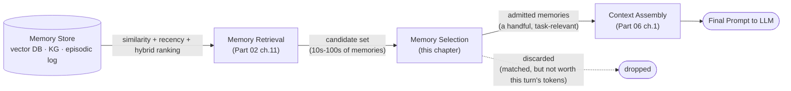

## Memory Selection

> Chapter of [[agentic-ai-engineering/readme#06 — Context Engineering|Context Engineering]], part of
> [[agentic-ai-engineering/readme|Agentic AI Engineering]].

## What you will understand at the end

- Why "retrieval found it" and "this turn should see it" are two different questions, answered by
  two different layers — and why collapsing them into one step is where most memory-augmented agents
  go wrong
- Selection criteria that actually predict usefulness for the current turn, versus the "this seems
  interesting" recall that similarity search alone tends to surface
- Why over-including memory is not a free safety margin — it has a real cost in crowded-out fresh
  context and model confusion from stale precedent, not just wasted spend
- A worked contrast between a turn that needs deep memory recall and one that needs almost none, and
  what a selection policy should do differently in each case

---

## The mental model

[[agentic-ai-engineering/02-memory-systems/11-memory-retrieval|Memory Retrieval]] answers "what's
out there that might be relevant" — similarity search, recency scoring, hybrid ranking against a
store that might hold thousands of past turns, facts, or episodes. It returns a candidate set. That
candidate set is not the context. Between retrieval's output and
[[agentic-ai-engineering/06-context-engineering/01-context-assembly|Context Assembly]]'s job of
building the actual prompt sits a policy decision this chapter is about: of the memories retrieval
surfaced, which ones earn a place in _this_ turn's token budget, and which get discarded even though
they matched.

Retrieval optimizes for **recall against the store** — did the search find things that are plausibly
related to the query. Selection optimizes for **precision against the turn** — of what was found,
does spending tokens on it actually change the quality of this specific response. A retrieval system
can be working exactly as designed — high recall, sensible ranking — and still hand selection a
candidate set that's 80% noise for the task at hand, because "semantically similar to the query" and
"useful for answering it" are correlated, not identical. Selection is the layer that closes that
gap.

Get this boundary wrong and one of two failure modes shows up. Fold selection into retrieval (just
take the top-k by similarity score and inject all of it) and you get exactly the over-inclusion
problem this chapter spends most of its time on. Skip selection entirely and push the decision into
assembly (assembly just concatenates whatever retrieval handed it, in ranking order, until the
budget runs out) and you've made a token-budget problem do double duty as a relevance-judgment
problem — the memory that gets cut isn't the least relevant one, it's whichever one happened to sort
last.

---

## 1. Selection criteria: relevance to the task, not "this seems interesting"

The failure mode worth naming explicitly: a memory can be **topically related** to the current
conversation without being **useful for completing the current task**. Similarity search is very
good at finding the former and has no mechanism for distinguishing it from the latter — cosine
similarity between an embedding of the current query and an embedding of a stored memory tells you
they're near each other in vector space, not that the stored memory changes what the model should do
next.

Concretely, four criteria that separate "relevant to the task" from "generically interesting":

| Criterion                                     | What it asks                                                                                       | Why similarity search alone misses it                                                                                                                                                           |
| --------------------------------------------- | -------------------------------------------------------------------------------------------------- | ----------------------------------------------------------------------------------------------------------------------------------------------------------------------------------------------- |
| **Task relevance**                            | Does this memory bear on what the user is asking _right now_, not just on the general subject area | A memory about "the user's preferred Python style" is topically near a Python debugging question but doesn't help debug this specific traceback                                                 |
| **Actionability**                             | Does admitting this memory change what the agent would otherwise say or do                         | A memory that merely confirms what's already obvious from the current turn's input adds tokens with zero marginal information                                                                   |
| **Provenance / confidence**                   | Was this memory explicitly stated by the user, or inferred/summarized by an earlier agent turn     | An inferred memory ("user seems to prefer synchronous APIs based on past code") is weaker evidence than an explicit statement, and should lose ties against fresher, directly-stated context    |
| **Recency-with-relevance, not recency alone** | Is this the _current_ state of the thing it describes, or a snapshot that's since been superseded  | A three-week-old memory that a service "was on v1.2" is actively wrong once the version has moved on — recency scoring by itself will still surface it if nothing more recent matched the query |

The provenance criterion deserves the most weight in practice, because it's the one similarity
ranking is structurally blind to. A vector index doesn't know that one stored memory was a direct
user correction ("no, always use the `glc_` token, not `glsa_`") and another was the agent's own
earlier guess that turned out to be wrong. Both can score equally well against a query about Grafana
Cloud tokens. Selection is where that distinction has to get made — by tagging memories with
provenance at write time (see
[[agentic-ai-engineering/02-memory-systems/05-long-term-memory|Long-Term Memory]] for the
write/consolidation side of that decision) and weighting on it at selection time, not by hoping the
ranking function picks it up implicitly.

**The general test that ties these together:** ask "would this turn's answer actually be worse
without this memory" — not "is this memory about the same topic." A candidate that fails that test
is a distractor, however well it scored on similarity.

---

## 2. The cost of over-inclusion

Treating memory injection as a pure safety margin — "when in doubt, include it, more context can
only help" — is the single most common selection mistake, and it's wrong for two independent reasons
that compound.

**It crowds out fresher, more load-bearing context.** Every model has a finite context window and,
practically, an even smaller window of content it attends to _well_ — content buried in the middle
of a long context competes for attention with content near the boundaries. Every token spent on a
marginally-relevant memory is a token not spent on the current tool result, the user's latest
clarification, or the system instructions that actually govern this turn. This is the same budget
tension
[[production-agent-systems/02-reliability-security-and-governance/11-failure-recovery|Failure Recovery]]
raises about run-level retry cost, applied to tokens instead of dollars: an "acceptable-looking"
per-memory cost becomes a real problem once you're injecting a dozen marginally-relevant memories on
every turn of a long-running agent.

**It introduces stale precedent that actively misleads the model, not just clutters it.** This is
the sharper failure.
[[building-agentic-systems/00-building-single-agent-systems/01-agent-architecture|Agent Architecture]]
names context poisoning as one of the primary production bugs of agent memory systems — stale or
incorrect data in the message list contaminating reasoning. Over-inclusive selection is a direct
pipeline into that failure: a memory that was true when it was written and is false now doesn't just
waste tokens, it gives the model a plausible-sounding, confidently-stated premise to reason from. An
agent debugging a live incident that gets handed a two-week-old memory saying "this alert was a
known false positive last time" will anchor on that framing even when the current firing is a
genuine regression — the memory isn't neutral filler, it actively argues for the wrong conclusion.

| Failure mode       | Mechanism                                                                                           | Concrete symptom                                                                                                              |
| ------------------ | --------------------------------------------------------------------------------------------------- | ----------------------------------------------------------------------------------------------------------------------------- |
| Attention dilution | Fresh, load-bearing context competes with marginal memory for a finite attention budget             | The model under-weights the current tool result because it's one signal among many injected memories                          |
| Stale precedent    | An outdated memory is presented with the same confidence as current fact                            | The agent repeats a conclusion that was true in a past session but has since been invalidated                                 |
| Contradiction      | Two admitted memories disagree with each other (recorded at different times, never reconciled)      | The model has to arbitrate between conflicting "facts" mid-reasoning, with no signal for which one wins                       |
| False confidence   | Volume of matching memories reads as corroboration even when each one is weak evidence individually | Five weakly-relevant memories get treated as stronger evidence than one directly relevant one, because there are more of them |

None of these show up in a token-cost dashboard. They show up as degraded answer quality that's hard
to attribute to memory at all, because the failure looks like "the model reasoned poorly this turn"
rather than "the model was fed bad input." That's exactly why selection has to be a deliberate
policy layer instead of "just inject whatever retrieval ranked highest" — the cost of getting it
wrong is invisible until you go looking for it.

---

## 3. Worked example: deep recall versus almost none

The same agent, same memory store, two different turns — the selection policy's job is to produce
very different admitted sets for each.

### Turn A — multi-session debugging investigation

_Setup:_ An SRE agent has been investigating an intermittent 5xx spike on a checkout service across
three sessions over two days. Session 1 ruled out a bad deploy (rollback didn't fix it). Session 2
found the spike correlates with a specific upstream dependency's p99 latency, but not with its error
rate. Session 3's user turn: _"Check if the same correlation holds for yesterday's spike too."_

This turn is **structurally dependent on memory** — it cannot be answered correctly from the current
message alone, because "the same correlation" only means something with Sessions 1 and 2's findings
in scope. What selection should admit:

- The ruled-out hypothesis from Session 1 (prevents the agent from re-proposing "maybe it's the
  deploy" as a fresh idea)
- The specific correlation finding from Session 2, verbatim enough to reuse the exact metric names
  and thresholds
- The current state of the investigation (what's confirmed vs. still suspected) — an accumulating
  summary, not the raw transcript of either prior session

What selection should _not_ admit, even though it might match the query: unrelated past incidents on
the same service from months earlier, the user's general dashboard preferences, or a memory from
Session 1 about a different, already-resolved alert on the same checkout service. All three would
plausibly rank in a similarity search against "checkout service incident" — none of them changes
what this turn's answer should be.

### Turn B — fresh, self-contained request

_Setup:_ Same agent, same session history available. New user turn: _"Write a PromQL query for p99
latency on `checkout_request_duration_seconds` over the last 6 hours."_

This turn is **fully self-contained**. Everything needed to answer it correctly is in the message
itself: the metric name, the percentile, the window. Memory has almost nothing to contribute — and
critically, most of what it _could_ contribute is a distraction, not a neutral no-op:

- Injecting the multi-session debugging context from Turn A risks the agent editorializing ("this
  might relate to the ongoing checkout incident...") when the user asked for a query, not an
  incident update
- Injecting a stale memory about a past PromQL preference risks silently overriding an explicit,
  current instruction with an inferred, past one
- The only memory genuinely worth a look is something narrowly scoped and durable — e.g., a stored
  correction that this environment's histogram buckets require `le="+Inf"` handling — and even that
  should be admitted because it's directly actionable for _this_ query, not because it's about
  Prometheus in general

The selection policy's job on Turn B is closer to "actively suppress" than "rank and cut" — the
right admitted set size for a fully self-contained request is often zero to one memories, not
whatever the token budget happens to allow.

|                                                    | Turn A: multi-session debugging                                             | Turn B: fresh self-contained request                                                                |
| -------------------------------------------------- | --------------------------------------------------------------------------- | --------------------------------------------------------------------------------------------------- |
| Task dependency on memory                          | High — the question is meaningless without prior sessions                   | Near-zero — all needed info is in the current message                                               |
| Right admitted-set size                            | Several memories, summarized, not raw                                       | Zero to one, narrowly scoped                                                                        |
| Dominant risk if selection is wrong                | Under-inclusion — losing the thread, re-deriving ruled-out hypotheses       | Over-inclusion — injecting irrelevant history that skews or pads the answer                         |
| What a naive "top-k by similarity" policy would do | Roughly right by luck — the investigation _is_ the topic being searched for | Wrong by default — anything semantically near "checkout service" scores well regardless of task fit |

The contrast is the point: a fixed top-k or fixed token-budget-for-memory rule gets Turn A right
mostly by accident and gets Turn B wrong by construction, because it has no signal for how
memory-dependent the current turn actually is. A selection policy that works has to estimate that
dependency first — is this task self-contained or does it presuppose prior state — and let the
admitted-set size follow from the answer, rather than pinning it to a constant.

---

## 4. What a selection policy actually does, mechanically

None of the above requires a novel retrieval mechanism — it's a filtering and scoring pass applied
_after_ [[agentic-ai-engineering/02-memory-systems/11-memory-retrieval|Memory Retrieval]] returns
its candidate set and _before_
[[agentic-ai-engineering/06-context-engineering/01-context-assembly|Context Assembly]] builds the
prompt. Three mechanisms do most of the real work, usually layered:

1. **Task-dependency estimation.** A cheap, upfront classification of the current turn — does it
   reference prior state ("the same," "like before," "continue"), or is it self-contained (a direct
   question with all inputs present)? This single signal should gate how aggressively selection
   pulls from the candidate set at all, per the Turn A / Turn B contrast above.
2. **Relevance scoring against the task, not the query.** Re-score each retrieved candidate against
   a representation of _what the agent needs to accomplish this turn_, which is narrower than the
   raw query string retrieval searched against. This is commonly done with a second, cheaper LLM
   call or classifier acting as a relevance judge on the candidate set — expensive to do over the
   whole store, cheap over the handful of candidates retrieval already narrowed down to.
3. **Provenance and recency weighting, applied as a tie-breaker and a hard filter, not just a score
   adjustment.** An explicit user correction should outrank an inferred summary at equal relevance
   scores. A memory whose subject has a known-fresher record elsewhere in the candidate set should
   be dropped outright, not merely down-weighted — two admitted memories that contradict each other
   are worse than one.

The output of all three is a small, deliberately curated admitted set — not the largest set that
fits inside the token budget. Fitting the budget is
[[agentic-ai-engineering/06-context-engineering/01-context-assembly|Context Assembly]]'s constraint
to enforce; selection's job finishes one step earlier, at deciding what _deserves_ a place in that
budget in the first place.

---

## Concept check

| Question                                                                                    | Answer hint                                                                                                                                         |
| ------------------------------------------------------------------------------------------- | --------------------------------------------------------------------------------------------------------------------------------------------------- |
| What question does memory retrieval answer, and what question does memory selection answer? | Retrieval: what's plausibly related in the store. Selection: of that, what's worth this turn's tokens.                                              |
| Why can a memory be topically relevant and still be the wrong thing to include?             | Topical similarity doesn't imply the memory changes what the agent should say or do this turn — it can be true, on-topic, and non-actionable.       |
| Why is over-inclusion more than a cost problem?                                             | A stale or contradictory admitted memory can actively mislead the model's reasoning (context poisoning), not just add tokens.                       |
| What's the single upfront signal that should gate how much memory a turn pulls in?          | Whether the task is dependent on prior state (references "the same," "continue," etc.) or fully self-contained.                                     |
| Why does provenance matter more than a similarity score alone can capture?                  | An explicit user correction and an agent's own inferred guess can score equally on similarity but should not be weighted equally at selection time. |

---

## Vocabulary glossary

| Term               | Definition                                                                                                                                                                                                        |
| ------------------ | ----------------------------------------------------------------------------------------------------------------------------------------------------------------------------------------------------------------- |
| Memory selection   | The policy layer that filters and scores a retrieved candidate set down to what's worth admitting into this turn's context, distinct from retrieval (finding candidates) and assembly (building the final prompt) |
| Candidate set      | The memories a retrieval pass returns as plausibly relevant — the input to selection, not the output                                                                                                              |
| Admitted set       | The (usually much smaller) set of memories selection decides actually belong in this turn's prompt                                                                                                                |
| Task dependency    | Whether the current turn's correct answer requires prior session state to make sense, versus being fully self-contained                                                                                           |
| Provenance         | Whether a stored memory originated from an explicit user statement or was inferred/summarized by the agent — a weighting signal selection should use and similarity search cannot see                             |
| Context poisoning  | Stale or incorrect data in the context contaminating the model's reasoning — the sharper of the two over-inclusion failure modes, distinct from simple token waste                                                |
| Attention dilution | Fresh, load-bearing context losing effective weight because it competes with marginally-relevant injected memory for the model's limited attention                                                                |

## Metadata

|        |                        |
| ------ | ---------------------- |
| Author | Amit Singh             |
| Scope  | agentic-ai-engineering |
