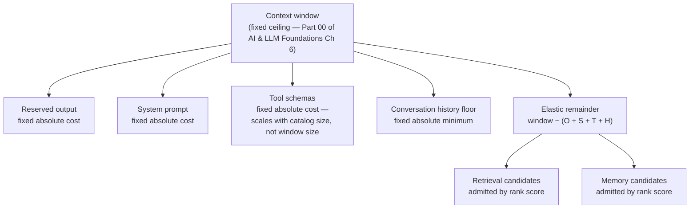

## Prompt Budgets

> Chapter of [[agentic-ai-engineering/readme#06 — Context Engineering|Context Engineering]], part of
> [[agentic-ai-engineering/readme|Agentic AI Engineering]].

## What you will understand at the end

- Why a prompt budget is not "how much fits" but "how much of what fits, in what priority order" —
  and why treating every category of context as equally negotiable is the mistake that produces
  silent tool-loss and mid-task amnesia in production agents
- A concrete allocation policy — reserved output, system prompt, tool schemas, and a history floor
  computed in absolute tokens first, with the remainder split between retrieval and memory by rank
- The three real strategies for handling budget overflow — hard truncation, summarization, and
  rank-based eviction — their cost/latency/fidelity tradeoffs, and which category each one actually
  fits
- Why percentage-of-window budgets look portable and aren't: two concrete worked failures, one on a
  small context window and one on a large one, from the exact same percentage rule
- Where prompt-budget pressure shows up as a stop condition inside the agent execution loop itself,
  not just as a one-time allocation problem solved before the first LLM call

---

## The mental model

A prompt budget is a fixed number of tokens divided among categories that do not compete on equal
terms. Some of that space is a **fixed cost** you pay regardless of the task — the model cannot call
a tool whose schema you didn't include, no matter how relevant that tool is this turn. Some of it is
a **floor** below which the agent's behavior degrades in a specific, recognizable way — starve
conversation history and the agent re-asks questions it already answered, or reverses a decision it
already made two turns ago. And some of it is genuinely **elastic** — more retrieved evidence or
more recalled memory is better, right up until it isn't, and deciding how much of it to admit is a
ranking problem, not an allocation problem.



Two things worth noticing before going category by category. First, four of the six boxes in that
diagram are **fixed**, not proportional — they cost what they cost regardless of how big the window
is, which is the entire argument Section 4 builds on. Second, the elastic remainder isn't split by a
second percentage rule either — it's admitted candidate by candidate, in rank order, which is
exactly what
[[agentic-ai-engineering/06-context-engineering/02-context-ranking/02-context-ranking|Context Ranking]]
exists to produce: a trustworthy per-fragment score this chapter can spend against. This chapter is
the allocation policy; that one is the scoring function the policy depends on.

---

## 1. The categories, and why they aren't interchangeable

| Category                     | What determines its cost                                                  | Negotiability                                                         | Failure mode if starved                                                                                           |
| ---------------------------- | ------------------------------------------------------------------------- | --------------------------------------------------------------------- | ----------------------------------------------------------------------------------------------------------------- |
| Reserved output              | How long a response (and any follow-up tool call) you allow the model     | Fixed — subtract it before allocating anything else                   | The model's response gets cut off mid-generation, or a tool-calling loop has no room left for its next turn       |
| System prompt                | How much instruction/persona/policy text you wrote                        | Fixed — same cost on every turn, every task                           | Safety rules, persona constraints, or output-format instructions silently drop off the end                        |
| Tool schemas                 | How many tools are registered and how verbose each schema is              | Fixed per registered tool — non-negotiable per tool, not per catalog  | The model cannot call a tool it never saw this turn — not "worse at using it," genuinely blind to it              |
| Conversation history (floor) | How many recent turns you guarantee survive regardless of everything else | Has a hard floor, elastic above it                                    | The agent repeats a question it already asked, or contradicts a decision it made two turns ago — mid-task amnesia |
| Retrieved context            | How many candidate chunks scored well enough to include                   | Elastic, rank-ordered                                                 | Lower recall — the model answers from a thinner evidence set, but the run doesn't break                           |
| Memory                       | How many candidate memories scored well enough to include                 | Elastic, rank-ordered, competes with retrieval for the same remainder | The agent loses personalization/precedent, but again — degraded, not broken                                       |

The line that matters most in that table: **starving a fixed category breaks something specific and
diagnosable; starving an elastic category degrades quality gradually.** A tool the model never saw
is a capability gap you'll find in an eval run as a mysteriously-never-called tool, not an
exception. That's why tool schemas and system prompt get reserved first, at their real measured
cost, before anything else is even considered — treating them as "just another input to rank" is the
mistake this chapter exists to head off.

Memory competes with retrieval for the same elastic pool rather than getting its own separate
reservation, because both are answering the same underlying question — "which candidate fragments
are worth spending this turn's remaining tokens on" — just drawn from different sources. Deciding
how much of the elastic pool memory should actually claim, versus retrieval, is
[[agentic-ai-engineering/06-context-engineering/03-memory-selection/03-memory-selection|Memory Selection]]'s
job, sitting between raw memory retrieval and this chapter's admission step.

---

## 2. A concrete allocation policy

The rule that makes the rest of this chapter work: **compute every fixed category in real, measured
tokens first — never as a percentage of the window — then hand whatever's left to the ranked,
elastic pool.** Worked example against an illustrative 200,000-token window:

| Category                   | Reserved (tokens) | Basis                                                                                                                             |
| -------------------------- | ----------------- | --------------------------------------------------------------------------------------------------------------------------------- | ------------------------------------------------------------------------------------------ |
| Reserved output            | 8,000             | Provider-side max response length allowed for this endpoint                                                                       |
| System prompt              | 1,200             | Actual tokenized length of the instruction text, measured at build time                                                           |
| Tool schemas (15 tools)    | 3,000             | 15 tools × ~200 tokens/schema — [[agentic-ai-engineering/04-tools-and-environment-interaction/10-tool-discovery/10-tool-discovery | Tool Discovery]] puts a single well-written schema at 100–300 tokens; this is the midpoint |
| Conversation history floor | 6,000             | Minimum tokens guaranteed for the most recent turns, regardless of anything else pending                                          |
| **Fixed total**            | **18,200**        | Subtracted from the window before ranking runs at all                                                                             |
| **Elastic remainder**      | **181,800**       | `200,000 − 18,200` — admitted candidate-by-candidate, retrieval and memory ranked together                                        |

Two things to flag about this table before it gets misread as a universal ratio. The absolute
figures are illustrative — your system prompt's real token count and your tool catalog's real schema
cost are things you measure with the actual tokenizer, not numbers you assume. And the 181,800-token
remainder is a **ceiling**, not a target — Section 4's second failure mode is exactly the mistake of
treating a large elastic pool as something you're obligated to fill.

---

## 3. What happens when the budget is exceeded

Three real strategies, and they are not interchangeable — each one fits a specific category, not any
category you happen to be over budget on.

| Strategy                  | Mechanism                                                                      | Cost / latency                                              | Information-loss profile                                                                                 | Fits best                                                                                                                                                                                     |
| ------------------------- | ------------------------------------------------------------------------------ | ----------------------------------------------------------- | -------------------------------------------------------------------------------------------------------- | --------------------------------------------------------------------------------------------------------------------------------------------------------------------------------------------- | ---------------------------------------------------------------------------------------------------------------------------------------------- | -------------------------------- |
| Hard truncation           | Drop tokens from one end (oldest turns, tail of a document) until under budget | Free — no extra model call                                  | Blind — no signal about what's being cut; can sever a fact or a decision mid-sentence                    | The non-floor tail of conversation history, where recency is already the right prior                                                                                                          |
| Summarization-on-overflow | Replace a discarded span with a compressed summary from an extra LLM call      | An extra model call's tokens + latency, every time it fires | Lossy but directed — preserves gist, not detail; the summarizing pass is a bet on what will matter later | A long span you can't discard outright but don't need verbatim — see [[agentic-ai-engineering/06-context-engineering/06-context-compression/06-context-compression                            | Context Compression]] and [[ai-foundations/00-foundations-of-modern-ai/06-context-windows-and-tokenization/06-context-windows-and-tokenization | Context Windows & Tokenization]] |
| Drop lowest-ranked        | Evict candidate fragments one at a time by ascending score until under budget  | Cheap — a sort against an existing score, not a model call  | Full fidelity for survivors, total loss for the dropped — nothing that stays is degraded                 | The elastic retrieval/memory pool, where each candidate already carries a per-item relevance score from [[agentic-ai-engineering/06-context-engineering/02-context-ranking/02-context-ranking | Context Ranking]]                                                                                                                              |

**The category you're evicting from decides the strategy, not the other way around.** Conversation
history is inherently ordered and recency-biased, so truncating (or summarizing) its oldest end is
correct — there's no "rank" to sort recent turns by, they're already ordered by the thing that
matters. The retrieval/memory pool has the opposite shape: no inherent order, but a real per-item
score, so rank-based eviction is strictly better than truncation there — truncating a ranked list by
position instead of score just means you're implicitly trusting retrieval order as relevance order,
which it usually isn't.

**Never truncate tool schemas or the system prompt.** A truncated schema isn't "the model has less
information about the tool" — it's a syntactically broken tool definition, and what the model does
when it tries to call a tool against a malformed schema is provider-dependent and untested by
definition, because nobody ships that path on purpose. If a fixed category doesn't fit, that's a
configuration error to surface loudly — reduce the tool catalog, shorten the system prompt, or raise
the ceiling — not something to silently truncate and hope the model copes.

---

## 4. Percentage of window vs. absolute token count — and why the percentage breaks

This is the failure mode that only shows up once you swap models, which is exactly why it survives
code review: it works fine on the model you built and tested against.

A percentage-based budget — "system prompt gets 1%, tool schemas get 5%, history floor gets 3%,
remainder split retrieval/memory" — looks clean and model-portable. It isn't, because the fixed
categories from Section 1 don't scale with window size at all: they scale with completely different
variables. Your system prompt's token count scales with how much instruction text you wrote. Your
tool catalog's token count scales with how many tools are registered and how verbose each schema is.
Neither of those numbers has anything to do with how large the underlying model's context window
happens to be — a 15-tool catalog costs the same ~3,000 tokens whether it's sitting inside an 8K
window or a 1M window. A percentage rule pretends it should scale with the window anyway, and breaks
in both directions depending on which way you swap.

**Worked example, same 15-tool catalog (~3,000 tokens, per Section 2), one "tool schemas = 5% of
window" rule, three window sizes:**

| Context window   | 5% rule reserves | Actual catalog cost | What happens                                                                                                                                    |
| ---------------- | ---------------- | ------------------- | ----------------------------------------------------------------------------------------------------------------------------------------------- |
| 8,000 tokens     | 400              | 3,000               | Under-allocated 7.5× — schemas near the tail of the catalog get truncated or dropped; the agent loses access to tools it was never told it lost |
| 200,000 tokens   | 10,000           | 3,000               | Over-allocated 3.3× — 7,000 tokens sit idle, unavailable to the retrieval/memory pool for no reason tied to any real constraint                 |
| 1,000,000 tokens | 50,000           | 3,000               | Over-allocated 16.7× — 47,000 tokens idle, same failure at a larger scale                                                                       |

The small-window direction is the dangerous one — it's a silent capability loss, not an error. The
large-window direction isn't dangerous in the same way, but it's real waste: tokens reserved for a
fixed-cost category that will never need them are tokens the ranked elastic pool never gets a chance
to spend on the next-best retrieval or memory candidate.

**The fix is the rule from Section 2, stated as a principle: reserve every fixed category at its
real, measured absolute token cost — computed at runtime from what's actually registered or written
— and only ever express the remainder as "the rest."** A ratio is legitimate exactly once in this
whole policy: splitting the elastic remainder between retrieval and memory, because both of those
genuinely are proportional to whatever's left, and both are competing for the same pool by
construction. Every other category in Section 1's table has its own independent cost driver, and
pretending otherwise is solving for the wrong variable.

**One more trap in the large-window direction, and it isn't fixed by absolute budgeting alone.** A
bigger elastic remainder is an opportunity, not an obligation to spend it all. Filling 181,800
tokens of retrieval and memory just because the pool is that large runs straight into
[[ai-foundations/00-foundations-of-modern-ai/06-context-windows-and-tokenization/06-context-windows-and-tokenization|Context Windows & Tokenization]]'s
two cost curves — attention compute scaling quadratically with sequence length, and "lost in the
middle" degrading recall for anything not near the edges of the prompt — long before the token
budget itself runs out. The elastic pool's ceiling is the window; the elastic pool's actual target
is whatever
[[agentic-ai-engineering/06-context-engineering/02-context-ranking/02-context-ranking|Context Ranking]]'s
scores say is worth including, which is very often a small fraction of what would technically fit.

---

## 5. Sketch: computing the elastic pool

The Section 2/4 rule as a function — fixed costs measured first, remainder handed to the ranked
admission step:

```python
def elastic_pool_size(
    window_tokens: int,
    system_prompt_tokens: int,   # measured, not estimated
    tool_schema_tokens: int,     # sum of the actual registered catalog
    output_reserve_tokens: int,  # provider max-response cap for this call
    history_floor_tokens: int,   # minimum guaranteed for recent turns
) -> int:
    """Elastic budget left for ranked retrieval + memory admission, in tokens."""
    fixed = (
        system_prompt_tokens
        + tool_schema_tokens
        + output_reserve_tokens
        + history_floor_tokens
    )
    remainder = window_tokens - fixed

    if remainder <= 0:
        # Fixed costs alone exceed the window -- a configuration error,
        # not something to silently truncate away. Surface it.
        raise BudgetExhaustedError(
            f"Fixed reservations ({fixed} tokens) leave no elastic pool "
            f"in a {window_tokens}-token window."
        )
    return remainder


def admit_by_rank(candidates: list, pool_tokens: int) -> list:
    """Greedy admission: highest-ranked candidate first, until the pool runs out.
    `candidates` is pre-sorted descending by the score Context Ranking produces."""
    admitted, spent = [], 0
    for c in candidates:
        if spent + c.token_count > pool_tokens:
            continue  # skip, don't truncate the fragment itself
        admitted.append(c)
        spent += c.token_count
    return admitted
```

The `continue` rather than `break` in `admit_by_rank` matters: a lower-ranked candidate that happens
to be small enough to fit in leftover space after a bigger one was skipped is still worth admitting
— this is a knapsack-shaped problem, and a strict break-on-first-miss policy leaves easy wins on the
table for no reason.

---

## 6. Budget pressure across an agent run, not just at the first call

Everything above reads as a one-time allocation problem — compute the fixed costs, hand the rest to
ranking, done. In a real multi-turn agent loop it isn't one-time: conversation history grows every
iteration of the
[[building-agentic-systems/00-building-single-agent-systems/01-agent-architecture/01-agent-architecture|execution loop]],
which means the elastic remainder shrinks on every iteration too, even though tool schemas, system
prompt, and the output reserve stay flat. Eventually growth eats the elastic pool entirely and
starts pressing on the history floor itself — which is exactly the **"token budget exceeded"** stop
condition that chapter names alongside max iterations and error state: at that point the loop has to
force a summarization pass or stop, not silently keep appending.

This also means every failed step that gets retried inside
[[production-agent-systems/02-reliability-security-and-governance/11-failure-recovery/11-failure-recovery|Failure Recovery]]'s
workflow-level retry policy is spending prompt budget as well as dollar budget — a retried step's
failed attempt and its error message both land in history, competing for the same shrinking
remainder as everything else. A run-level retry budget expressed only in dollars or wall-clock time,
with no accounting for the token cost of the trajectory itself, will hit this chapter's budget wall
before it hits that one's.

---

## Concept check

| Question                                                                                              | Answer hint                                                                                                                                                                                                   |
| ----------------------------------------------------------------------------------------------------- | ------------------------------------------------------------------------------------------------------------------------------------------------------------------------------------------------------------- |
| Why are tool schemas "fixed cost," not "elastic," even though there could be a lot of them?           | The model can't call a tool whose schema wasn't included this turn — that's a capability gap, not a quality degradation, so it isn't a candidate for rank-based competition                                   |
| Why compute fixed categories in absolute tokens instead of a percentage of the window?                | Their real cost driver (instruction length, tool catalog size, output cap) has nothing to do with window size — a percentage rule solves for the wrong variable                                               |
| What breaks on a small context window under a percentage-based tool-schema budget?                    | The percentage under-allocates against the catalog's real cost, so schemas near the tail get truncated or dropped — the agent silently loses tool access                                                      |
| What's wasted on a large context window under the same rule?                                          | Tokens reserved for a fixed-cost category that never needed them — idle headroom the elastic retrieval/memory pool could have used instead                                                                    |
| Why is rank-based eviction preferred over hard truncation for the retrieval/memory pool specifically? | That pool has a real per-item relevance score and no inherent order; truncating by position instead of score implicitly trusts retrieval order as relevance order, which it usually isn't                     |
| Why should you never truncate a tool schema or the system prompt when over budget?                    | A truncated schema is a malformed tool definition, not "less information" — behavior against it is provider-dependent and untested; surface the overflow as a config error instead                            |
| Why does a large elastic remainder not mean you should fill it?                                       | Attention cost scales quadratically with sequence length and "lost in the middle" degrades recall for buried content — the target is what Context Ranking scores as worth including, not the window's ceiling |

---

## Vocabulary glossary

| Term                          | Definition                                                                                                                                                                    |
| ----------------------------- | ----------------------------------------------------------------------------------------------------------------------------------------------------------------------------- |
| Fixed category                | A context category whose token cost is driven by something other than window size — system prompt, tool schemas, reserved output                                              |
| History floor                 | The minimum tokens guaranteed for the most recent conversation turns, regardless of pressure from any other category                                                          |
| Elastic pool / remainder      | `window − (sum of fixed reservations)` — the space competed for by ranked retrieval and memory candidates                                                                     |
| Hard truncation               | Dropping tokens from one end of a span until under budget, with no signal about what's being cut                                                                              |
| Summarization-on-overflow     | Replacing a discarded span with a compressed summary from an extra LLM call, trading fidelity for a bounded footprint                                                         |
| Rank-based eviction           | Dropping the lowest-scored candidate fragments first until under budget, preserving full fidelity for survivors                                                               |
| Percentage-of-window budget   | A budget expressed as a fraction of the model's context window — breaks whenever the fixed categories' real cost drivers don't scale with window size                         |
| Budget exhaustion (run-level) | The point in a multi-turn agent loop where accumulated history consumes the elastic pool and presses on the history floor itself — the "token budget exceeded" stop condition |
