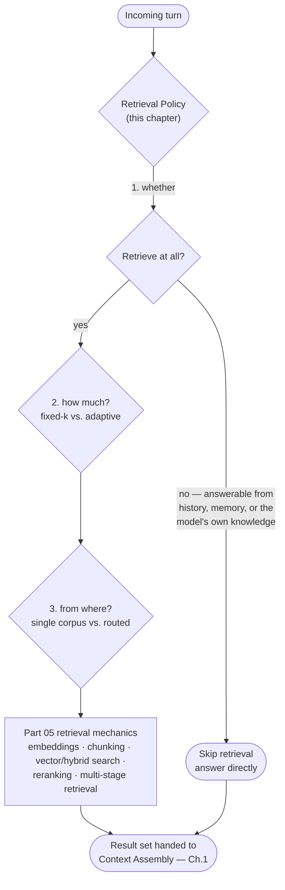
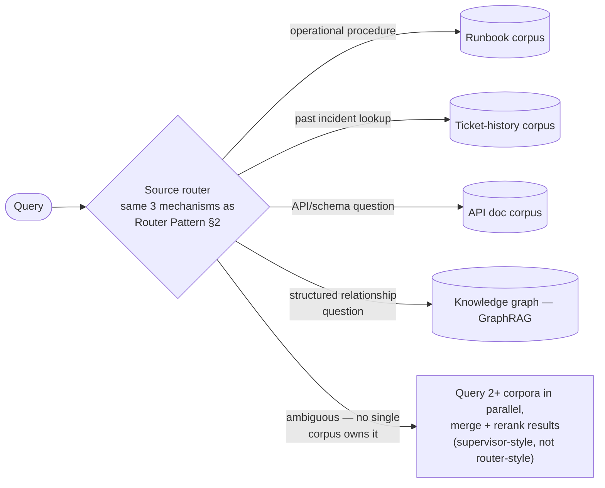

## Retrieval Policies

> Chapter of [[agentic-ai-engineering/readme#06 — Context Engineering|Context Engineering]], part of
> [[agentic-ai-engineering/readme|Agentic AI Engineering]].

## What you will understand at the end

- Why "when to retrieve" is a separate decision from "how retrieval works," and why collapsing them
  produces an agent that fires a retrieval pipeline on every turn regardless of whether the turn
  needs one
- The fixed-k vs. adaptive-k tradeoff, and how "how much to retrieve" is really a special case of
  the token-budget allocation problem, not an independent hyperparameter tuned once in a notebook
- The asymmetric cost of getting this wrong in either direction — noise diluting the context budget
  on one side, a confidently wrong, ungrounded answer on the other
- How choosing _which_ corpus to retrieve from is the [[05-router-pattern|Router Pattern]] applied
  one layer upstream of context assembly, including when a router's single dispatch isn't enough and
  you need a supervisor-style fan-out across corpora instead
- How Agentic RAG doesn't eliminate this policy — it relocates all three decisions (whether, how
  much, from where) from a fixed pipeline choice made at design time into the model's own iterative
  reasoning loop, and what that relocation costs in exchange for what it buys

---

## The mental model

Part 05 answers _how_ retrieval works once you've decided to do it: how text becomes a vector
([[02-embeddings|Embeddings]]), how a corpus gets split into retrievable units
([[03-chunking-strategies|Chunking Strategies]]), how a query finds nearby vectors
([[04-vector-search|Vector Search]]), how dense and sparse signals combine
([[05-hybrid-search|Hybrid Search]]), and how a candidate set gets reordered for precision
([[06-reranking|Reranking]]). None of those chapters ask whether retrieval should run this turn, how
many results are worth pulling, or which of several corpora the query even belongs to. Those are
policy questions, decided _before_ any of that machinery activates, and they're this chapter's job.

Three decisions, one per section below, each with a fixed-upfront-policy version (Sections 1–4) and
a model-decides-at-runtime alternative (Section 5). The fixed version is a pipeline classifier or a
static rule, applied the same way regardless of how the conversation is actually unfolding. The
runtime version — Agentic RAG — is the same three questions, asked and answered by the model itself,
turn by turn, as part of its own execution loop. Neither is strictly better; Section 5 works through
what each buys and costs.

---

## 1. Whether to retrieve at all

[[01-context-assembly|Context Assembly]]'s worked example built an SRE investigation copilot
handling a checkout-service latency alert. The first turn — _"why is checkout p99 spiking again?"_ —
triggered a RAG pull that returned a runbook section and a postmortem excerpt, both correctly
grounding the investigation. That chapter closed by naming a question it deliberately left open: the
session's final turn is a near-identical repeat of the same question — _"why is checkout p99 spiking
again?"_ — and nothing in that example says whether retrieval should fire a second time. This
chapter picks up exactly there.

The naive policy — retrieve on every turn, unconditionally — treats retrieval as free. It isn't.
Each call is a real round trip (embed the query, search the index, often rerank the candidates)
added to the turn's latency, and a real set of tokens competing for the context budget whether or
not they earn their place. On the repeated question, the runbook and postmortem chunks the first
pull already surfaced are still sitting in conversation history from the earlier turn — a second
identical retrieval either returns the same chunks again (pure waste: latency and tokens spent to
re-derive something already in context) or, worse, returns a _slightly different_ top-k due to index
or ranking nondeterminism, handing the model two near-duplicate-but-not-identical framings of the
same fact to reconcile.

### Signals that predict retrieve vs. skip

| Signal                    | Points toward retrieving                                                                                                                 | Points toward skipping                                                                                                                 |
| ------------------------- | ---------------------------------------------------------------------------------------------------------------------------------------- | -------------------------------------------------------------------------------------------------------------------------------------- |
| **Self-containment**      | The query needs a fact, procedure, or document not present anywhere in the current context                                               | The query is answerable purely from conversation history, working memory, or the model's own reasoning over what's already present     |
| **Coverage**              | This specific information need hasn't been grounded yet this session                                                                     | The same need was already retrieved and grounded earlier in this session — the answer is reuse, not re-fetch                           |
| **Freshness requirement** | The answer depends on state that may have changed since the last retrieval (a live metric, a ticket status, "check the _current_ value") | The underlying fact is stable enough that an earlier retrieval is still valid                                                          |
| **Query type**            | A lookup, factual, or procedural question                                                                                                | A conversational, summarization, or reasoning-only request over what the agent has already gathered ("summarize what we found so far") |

Notice the parallel to, and the difference from, [[03-memory-selection|Memory Selection]]'s Turn A /
Turn B contrast. That chapter asks a _post_-retrieval question — of what memory retrieval already
surfaced, what's worth admitting this turn. This section asks the _pre_-retrieval question — should
a retrieval call happen at all. They compound: even a turn that correctly triggers retrieval can
still over-admit what comes back, which is exactly why both policy layers exist as separate
decisions instead of one merged "just grab everything plausibly relevant" step.

### Mechanisms for the gate

Structurally, this is the same three-way menu [[05-router-pattern|Router Pattern]] §2 builds for
N-way dispatch, collapsed to a binary decision instead of a category choice — worth reusing rather
than re-deriving:

- **A cheap heuristic or embedding-similarity floor.** Embed the query, compare against a "this
  needs grounding" reference set (or simply check whether anything in the existing context already
  scores above a similarity floor against the query) — no LLM call, fast, but inherits the same
  vocabulary-mismatch weakness Router Pattern §2a names for embedding-based classification.
- **A trained gate classifier.** A small model predicting retrieve/skip from the query and a
  representation of current context — cheap at inference time, needs a labeled training set and a
  retraining cycle as query patterns drift, same tradeoff profile as Router Pattern §2b.
- **An LLM self-assessment.** Ask the model to attempt an answer, or explicitly emit a
  retrieve/no-retrieve judgment, before committing to a retrieval call — the general shape the
  Self-RAG line of work formalizes with explicit "retrieve" reflection tokens the model emits as
  part of its own decoding. I'm deliberately not attaching a specific accuracy or latency number to
  that technique here — the mechanism (the model decides, inline, whether it needs external
  grounding) is well established; the precise numbers are benchmark- and implementation-specific
  enough that citing one without the source in front of me would be false precision. Section 5
  returns to this mechanism in more depth, because it's the seed of the fully agentic version of
  this whole chapter.

### The cost of skipping the gate

An agent that retrieves unconditionally on every turn pays three costs whether or not the turn
needed grounding: latency (a round trip added to the critical path of every response, including ones
that didn't need it), token spend competing for the same budget [[04-prompt-budgets|Prompt Budgets]]
allocates across every other source, and — the sharper failure — a fresh,
correctly-retrieved-but-task-irrelevant chunk can still drag the model's framing off course, the
same way [[03-memory-selection|Memory Selection]] §2 describes stale memory doing it. "Correctly
retrieved" and "correctly relevant to _this_ turn's task" are not the same property, and a policy
that never asks whether to retrieve at all has no mechanism for telling them apart.

---

## 2. How much to retrieve — fixed-k vs. adaptive

Deciding to retrieve doesn't settle how much. A fixed `top_k = 5` (or any constant) is the default
in most RAG tutorials, and it's wrong in both directions for a nontrivial fraction of real queries:
a trivial single-fact lookup ("what's the timeout value in this config?") wastes budget pulling five
chunks when one answers it completely, while a genuinely multi-hop question ("did yesterday's spike
correlate the same way the one three weeks ago did?") may need evidence from more than five chunks
to answer correctly at all — no amount of reranking quality fixes a `k` that's structurally too
small for the question.

|                            | Fixed-k                                                                                                  | Adaptive-k                                                                                                |
| -------------------------- | -------------------------------------------------------------------------------------------------------- | --------------------------------------------------------------------------------------------------------- |
| Predictability             | High — cost and latency per retrieval call are constant and known at design time                         | Lower — cost varies per query, harder to budget for at the p99                                            |
| Engineering overhead       | Low — one constant, tuned once                                                                           | Higher — needs a complexity signal and a policy for turning it into a count or a cutoff                   |
| Quality on simple queries  | Wastes budget — pulls more than needed, diluting context for no benefit                                  | Right-sized — a self-contained factoid query gets a small k                                               |
| Quality on complex queries | Under-serves — caps evidence below what a multi-hop question needs                                       | Right-sized — a complex query can pull more without a hardcoded ceiling stopping it short                 |
| Failure mode               | Silent and constant — the same wrong-sized k on every query, invisible until someone audits a bad answer | The complexity estimator itself can misjudge — same class of error as the retrieve/skip gate in Section 1 |

Three real ways to make `k` adaptive, none requiring new retrieval infrastructure — they're a policy
layered on top of what Part 05 already builds:

1. **Query-complexity estimation upfront.** A cheap heuristic (question length, number of distinct
   entities, presence of comparison/temporal language like "compared to," "before/after"), a trained
   regressor predicting evidence count from historical query→answer-length pairs, or an LLM call
   estimating "how many independent facts does answering this require" — again the same
   heuristic/classifier/LLM menu as Section 1's gate and Router Pattern §2, now predicting a count
   instead of a binary.
2. **A relevance-score cutoff instead of a fixed count.** Keep pulling ranked candidates until the
   [[06-reranking|Reranking]] stage's marginal relevance score drops below a floor, rather than
   stopping at a hardcoded position in the ranked list. This reframes "how much" as a quality
   threshold the retrieval pipeline enforces on itself, and it's the mechanism
   [[09-multi-stage-retrieval|Multi-Stage Retrieval]]'s coarse-to-fine pipelines use to decide when
   a later, more expensive stage has stopped earning its cost.
3. **Budget-driven allocation.** Don't give retrieval a chunk count at all — give it a token
   allowance carved out of [[04-prompt-budgets|Prompt Budgets]]'s overall split, and let it fill
   that allowance with the highest-ranked candidates up to the cutoff. This makes "how much" an
   _output_ of the budget chapter's allocation decision rather than an independent knob retrieval
   owns on its own, which is the more honest framing once retrieval is competing with memory, tool
   schemas, and conversation history for the same finite space.

None of these three is a replacement for the others — a production pipeline commonly stacks a cheap
complexity estimate (mechanism 1) to set an upper bound, then a relevance cutoff (mechanism 2) to
stop early when the upper bound is more than the query actually needs, inside a hard ceiling
mechanism 3 enforces regardless of what the first two decide.

---

## 3. The two failure directions, and why they're not symmetric

Sections 1 and 2 matter because getting either wrong has a real, distinct failure signature — not a
vague "quality degrades" but two separate, recognizable mechanisms.

|                      | Over-retrieving                                                                                                                                                    | Under-retrieving                                                                                                                          |
| -------------------- | ------------------------------------------------------------------------------------------------------------------------------------------------------------------ | ----------------------------------------------------------------------------------------------------------------------------------------- | ---------------------------------------------------------------------------------------------------------- |
| **Mechanism**        | More chunks admitted than the task needs, competing for the same middle-of-prompt real estate [[01-context-assembly                                                | Context Assembly]] already flags as attention-degraded                                                                                    | Retrieval returns too little, the wrong chunks, or nothing — the model has a gap where grounding should be |
| **Concrete symptom** | The genuinely relevant chunk is present but diluted among noise, or two marginally-relevant chunks quietly contradict each other with no signal for which one wins | The model fills the gap with parametric knowledge — plausible-sounding, fluently stated, and not sourced from anything actually retrieved |
| **Cost profile**     | Extra latency and token spend on every affected turn — visible in a cost dashboard if anyone looks                                                                 | No extra spend at all — the failure is free to produce and expensive to trace                                                             |
| **Detectability**    | Comparatively easy — the noisy chunks are sitting right there in the assembled context, inspectable                                                                | Hard — the output reads exactly like a grounded answer; nothing in the response itself flags that the grounding was thin or absent        |
| **Typical fix**      | Tighten k, add a relevance cutoff, deduplicate near-identical chunks                                                                                               | Widen k, add a second retrieval pass, or force the model to abstain/flag low confidence when evidence is thin                             |

The asymmetry is the point worth carrying into design reviews: over-retrieval is a quality-and-cost
tax that leaves a trace — a human or an eval harness can look at the assembled prompt and see the
noise. Under-retrieval produces a _confidently wrong_ answer with no visible seam between "this came
from the runbook" and "this is the model's best guess" — unless the system is explicit about
provenance (citing which chunk supported which claim), the two are indistinguishable from the output
alone. That's a stronger claim than "both are bad" — it argues that for anything audit-sensitive (an
incident report, a compliance answer, anything a human will act on without re-verifying), the
default should lean toward retrieving _more_ than the confidence interval strictly requires, because
the cost of that lean is visible and cheap to correct, while the cost of the opposite lean is
invisible until someone downstream acts on a wrong answer that looked exactly like a right one.

---

## 4. From which source — routing across knowledge sources

The third policy question assumes there's more than one place to look. A production agent's
grounding material rarely lives in one homogeneous corpus. The SRE copilot from Sections 1–2
plausibly draws on at least: a runbook corpus (prose, operational procedures), a ticket-history
corpus (structured, timestamped, incident-specific), and an API/service documentation corpus
(structured, schema-heavy, a completely different chunk shape than runbook prose). Embedding all
three into one shared vector index doesn't just under-perform — it actively degrades retrieval,
because a chunk's nearest neighbors in that shared space are no longer guaranteed to be topically
comparable, and a chunking strategy tuned for prose ([[03-chunking-strategies|Chunking Strategies]])
is the wrong shape for structured API docs even when both happen to embed into the same space.

This is the [[05-router-pattern|Router Pattern]], applied one layer upstream of context assembly:
classify the query, dispatch to the corpus (or corpora) whose retriever actually owns that kind of
question, and only then run Part 05's retrieval mechanics against the chosen source.

The reuse is direct: the same embedding-similarity / trained-classifier / LLM-with-structured-output
menu from [[05-router-pattern|Router Pattern]] §2 decides which corpus a query belongs to, and the
same confidence-and-fallback logic from that chapter's §3 applies when the classification is
ambiguous. Misrouting here has the identical _structurally silent_ failure shape that chapter's §6
names: if the query gets sent to the wrong corpus, the right corpus is never queried at all for that
turn — there's no in-context recovery, only a retrieval that returns confidently-ranked, entirely
wrong-domain results. That failure composes with Section 3 above in the worst possible way: a
misrouted query doesn't fail loudly with an empty result set, it fails by handing the model
well-formed, well-ranked chunks from the _wrong_ corpus, which reads exactly like a legitimate
under-retrieval failure from the model's side.

**Router-style dispatch isn't always the right shape here, though — and this is where the retrieval
case is a genuine extension of the Router Pattern chapter's own reasoning, not just a copy of it.**
[[05-router-pattern|Router Pattern]] §4 draws the line between a router's terminal, single-handler
dispatch and a supervisor's fan-out-and-reconcile shape. Retrieval-source selection routinely needs
the fan-out version: a genuinely ambiguous query — "what's changed about checkout's retry behavior
since the last incident" — plausibly needs _both_ the runbook corpus (current retry policy) and the
ticket-history corpus (what the last incident actually found), queried in parallel with results
merged and reranked together, not dispatched to whichever single corpus wins the classification.
Treating every retrieval-source decision as router-style forced-single-choice is a real design
mistake in the same shape that chapter warns against for handler dispatch generally — some queries
are supervisor questions wearing a retrieval hat.

---

## 5. Where Agentic RAG pushes this policy into the model

Everything in Sections 1–4 is a **fixed, upfront policy** — a classifier, a heuristic, or a static
rule, evaluated once per turn by the pipeline, before the model ever starts generating. That's a
legitimate and common architecture. [[07-agentic-rag|Agentic RAG]] is the alternative stance:
instead of a pipeline deciding whether/how much/where to retrieve on the model's behalf, the model
makes all three decisions itself, iteratively, as part of its own reasoning — the same
execution-loop shape [[01-agent-architecture|Agent Architecture]] describes generally (read context,
decide, act, observe, repeat), specialized to retrieval as the action being decided on each
iteration.

Concretely, the loop looks like this: the model issues its own retrieval query — often a
reformulation of the user's original question shaped by what it's already learned from an earlier
retrieval round, not a verbatim pass-through — evaluates whether what came back is sufficient to
answer (a self-critique or reflection step; the Self-RAG line of work formalizes this with explicit
reflection tokens the model emits alongside its generation, deciding to retrieve, to critique
retrieved evidence as relevant/irrelevant, or to proceed), and either retrieves again — a different
source, a refined query, a deeper k — or stops and answers. Every question this chapter asks as a
fixed pipeline decision is being asked _again_, per iteration, by the model itself: should I
retrieve at all this round (maybe the last round already answered it), how much do I need this
round, and does the evidence I have suggest a different source entirely (the ticket history instead
of the runbook I just checked).

|              | Fixed upfront policy (Sections 1–4)                                                         | Agentic RAG (iterative, model-decided)                                                                                                  |
| ------------ | ------------------------------------------------------------------------------------------- | --------------------------------------------------------------------------------------------------------------------------------------- |
| Decided when | Design time — a classifier or rule, same for every query of that shape                      | Runtime — per iteration, adapted to what the model has already learned this turn                                                        |
| Adapts to    | Whatever signal the classifier was built to read (query complexity, corpus category)        | The actual, unfolding state of the investigation — including evidence the pipeline couldn't have anticipated                            |
| Cost profile | Bounded and known at design time — one retrieval call (or a fixed few), predictable latency | Variable per request — cost and latency scale with however many iterations the query actually needs                                     |
| Auditability | High — the policy is a fixed, inspectable rule, easy to test against a labeled eval set     | Lower — the trajectory of queries and stop/continue decisions is per-request and has to be logged to reconstruct after the fact         |
| Failure mode | The same mistake, consistently, for every query the classifier misjudges                    | A per-iteration version of Sections 1–3's mistakes (bad retrieve/skip call, bad source pick) compounding across iterations if unchecked |

**The relocation doesn't eliminate the policy — it just moves who's accountable for it, and that
shift has a real cost this book has already priced once, at the run level.**
[[11-failure-recovery|Failure Recovery]] §2's math on nested retry budgets applies here almost
unchanged: swap "step retry" for "retrieval iteration" and the same worked arithmetic holds. An
agentic retrieval loop with no absolute ceiling — only "keep iterating until the model decides it
has enough" — is functionally an unbounded retry budget wearing a retrieval-quality justification,
and it needs the same fix that chapter argues for: a hard, absolute cap (iteration count, wall-clock
time, or token spend) the loop cannot exceed regardless of how confident the model's own stopping
judgment seems, plus a fallback that surfaces the unresolved query to a human rather than looping
silently — the same escalate exit [[05-router-pattern|Router Pattern]] §3 and Failure Recovery §3
both name for their respective domains.

The honest framing for an interview answer: a fixed retrieval policy trades adaptability for
predictability — it makes the same mistake consistently on queries its classifier misjudges, but its
worst-case cost is known before a single request ships. Agentic RAG trades predictability for
adaptability — it can recover mid-turn from a bad first retrieval the way no fixed policy can, but
its worst-case cost is bounded only by whatever iteration ceiling you set, and a generous ceiling is
a cost incident waiting to be discovered on a billing dashboard, not a free upgrade. Neither one is
the "more agentic, therefore better" default; the choice is a real engineering tradeoff between a
bounded, auditable mistake and an adaptive, harder-to-bound one.

---

## Concept check

| Question                                                                                                    | Answer hint                                                                                                                                                                                                                                                   |
| ----------------------------------------------------------------------------------------------------------- | ------------------------------------------------------------------------------------------------------------------------------------------------------------------------------------------------------------------------------------------------------------- |
| Why is "whether to retrieve" a separate decision from "how retrieval works"?                                | Part 05's mechanics assume retrieval should happen; this chapter decides whether it should happen at all, before any of that machinery runs                                                                                                                   |
| What's the risk of retrieving unconditionally on every turn?                                                | Latency and token cost on turns that didn't need grounding, plus the risk that a fresh-but-irrelevant chunk drags the model's framing off course                                                                                                              |
| Why is a fixed `top_k` wrong for both simple and complex queries?                                           | It wastes budget on simple factoid queries and under-serves genuinely multi-hop ones — the right k depends on the query, not a constant                                                                                                                       |
| Why is under-retrieval a worse failure than over-retrieval, even though both are bad?                       | Over-retrieval leaves a visible trace (noisy chunks sitting in the assembled context); under-retrieval produces a confidently wrong answer indistinguishable from a correctly grounded one                                                                    |
| How does retrieval-source selection map onto the Router Pattern?                                            | Classify the query, dispatch to the corpus whose retriever owns that kind of question — same classification menu, same confidence/fallback logic, same silent-misrouting failure                                                                              |
| When does retrieval-source selection need supervisor-style fan-out instead of router-style single dispatch? | When a query genuinely needs evidence from more than one corpus at once — forcing a single-corpus choice on a multi-corpus question is the same mistake Router Pattern §4 warns against for handler dispatch                                                  |
| What does Agentic RAG change about this chapter's three policy questions, and what does it leave unchanged? | It moves whether/how-much/from-where from a fixed pipeline decision to a per-iteration model decision — but the loop still needs a hard iteration/cost ceiling, or it becomes the same unbounded-retry-budget problem Failure Recovery names at the run level |

---

## Vocabulary glossary

| Term                     | Definition                                                                                                                                                             |
| ------------------------ | ---------------------------------------------------------------------------------------------------------------------------------------------------------------------- |
| Retrieval policy         | The decision layer — whether to retrieve, how much, from which source — that sits upstream of Part 05's retrieval mechanics                                            |
| Retrieval gate           | The whether-to-retrieve-at-all decision, built with the same heuristic/classifier/LLM menu as router classification, collapsed to a binary                             |
| Fixed-k                  | A constant number of retrieved candidates admitted regardless of query complexity                                                                                      |
| Adaptive-k               | The admitted count set per query, via a complexity estimate, a relevance-score cutoff, or a token-budget allocation                                                    |
| Over-retrieval           | Admitting more retrieved content than the task needs, diluting the context budget and risking chunk-to-chunk contradiction                                             |
| Under-retrieval          | Retrieving too little or the wrong material, producing a confidently stated answer grounded in the model's parametric knowledge instead of what was actually retrieved |
| Retrieval-source routing | Classifying a query and dispatching it to the specific corpus (or corpora) whose retriever owns that kind of question, rather than querying one undifferentiated index |
| Corpus fan-out           | Querying more than one knowledge source in parallel and merging/reranking the combined results, used when a query doesn't cleanly belong to a single corpus            |
| Agentic RAG              | Retrieval architecture where the model itself decides, iteratively and per-turn, whether/how much/where to retrieve, instead of a fixed upfront pipeline policy        |
| Reflection token         | A Self-RAG-style mechanism where the model emits an explicit retrieve/critique decision as part of its own output, rather than an external classifier making that call |
