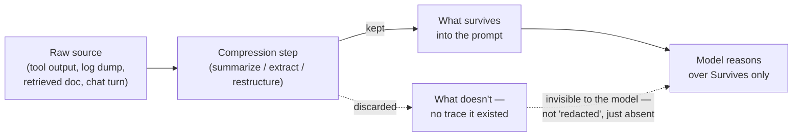
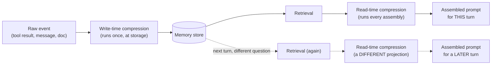

## Context Compression

> Chapter of [[agentic-ai-engineering/readme#06 — Context Engineering|Context Engineering]], part of
> [[agentic-ai-engineering/readme|Agentic AI Engineering]].

## What you will understand at the end

- The three mechanically different ways to shrink what goes into a prompt — summarization,
  extractive pruning, structured compression — and what each one actually risks losing, not just how
  each one works
- Why every compression technique makes the same bet: that it can guess, before seeing the next
  question, which details are safe to throw away — and what happens when that bet is wrong
- The difference between compressing **at write-time** (when something is committed to memory) and
  **at read-time** (when it's pulled into this turn's live prompt) — and why read-time compression
  can afford to be more aggressive than write-time compression, not less
- How this chapter's scope differs from
  [[agentic-ai-engineering/02-memory-systems/12-memory-compression/12-memory-compression|Memory Compression]]
  in Part 02 — same word, two different operations, done at two different points in the pipeline for
  two different reasons

---

## The mental model

[[agentic-ai-engineering/06-context-engineering/01-context-assembly/01-context-assembly|Context Assembly]]
left one question open in its handoff table: how do you shrink what's assembled without silently
dropping the fact the model actually needed? That question is this chapter's entire subject, and
it's worth sitting with why it's hard before looking at techniques.

Compression is a bet made under uncertainty. At the moment you compress something — a tool result, a
retrieved chunk, a slice of conversation history — you do not yet know what the next question will
ask about it. You are deciding, in advance and usually algorithmically, which parts of the source
are "signal" and which parts are safe to discard. Every compression technique is a different
strategy for making that bet, and every one of them can lose it. The failure is never loud. A
token-budget overflow throws an error. A dropped detail just produces a wrong or incomplete answer
that reads as confident — the model has no way to know it was reasoning over an amputated version of
the source, because the missing piece isn't a gap in the prompt, it's an absence with nothing
marking where it used to be.



This chapter covers the three mechanically distinct ways teams implement that compression step, the
shared risk underneath all three, and the pipeline question of _when_ — write-time versus read-time
— that changes how aggressive you can safely be.

---

## Three techniques, three different bets

### 1. Summarization

The most familiar form: run the source through an LLM (often a smaller, cheaper one than the one
doing the main task) and keep its natural-language paraphrase instead of the original text. A 4,000
token incident transcript becomes a 150 token summary. A day's worth of tool calls becomes three
sentences of "what happened."

**What you're actually trading:** summarization is _generative_ compression — the surviving text
wasn't in the source verbatim, it was produced by a model deciding what the source meant. That
carries two distinct failure modes, not one:

- **Omission** — the summarizing model judged a detail unimportant and dropped it. This is the core
  risk in its plainest form.
- **Fabrication** — the summarizing model smoothed over a gap in its own understanding with a
  plausible-sounding but invented detail. This is worse than omission, because the resulting text
  looks _more_ authoritative than the truth, not less.

**Recursive summarization compounds both.** A common pattern for long-running sessions is
summarize-of-summary: as a conversation grows, periodically replace the oldest chunk of history with
a summary, and once that gets long too, summarize the summary. Each pass is a second bet layered on
top of the first bet's already-lossy output — errors introduced at pass one aren't just preserved
into pass two, they become the _input_ pass two reasons from, with no way to distinguish "this was
in the original" from "this drifted in during compression." Treat recursive summarization depth as a
number you track and cap, the same way you'd track a retry budget — see the nested-budget reasoning
in
[[production-agent-systems/02-reliability-security-and-governance/11-failure-recovery/11-failure-recovery|Failure Recovery]]
§2 for the general shape of why layered lossy operations compound rather than average out.

### 2. Extractive pruning

Instead of paraphrasing, keep exact spans of the original and drop the rest verbatim — no rewriting.
Common implementations: keep the top-N highest-scoring sentences against a relevance query, keep
lines matching a pattern (`grep -i "error\|timeout\|5xx"` over a log dump before it goes in the
prompt), or keep a structural slice (first/last K lines of a long tool output).

**What you're actually trading:** extractive pruning removes summarization's fabrication risk
entirely — whatever survives is byte-identical to the source, so the model can't be misled by a
paraphrase that drifted from the truth. What it doesn't remove is the omission risk, and it makes
that risk _binary_ rather than graded: a kept line is fully present, a dropped line is fully gone,
with no partial signal in between the way a summary might at least gesture at "and some other errors
occurred."

**The structural-heuristic version of pruning has a specific, well-documented failure mode.**
Keeping "the first and last K lines" of a log dump is cheap and often adequate, but it silently
assumes the interesting line is near an edge. When it isn't — the one `WARN` that explains the
eventual `FATAL` sits in the middle of a 2,000-line dump — structural pruning throws it away with
the same confidence it throws away genuinely irrelevant middle lines. This is the same shape of
failure
[[agentic-ai-engineering/06-context-engineering/01-context-assembly/01-context-assembly|Context Assembly]]
describes as "lost in the middle," except pruning doesn't just under-attend to the middle — it
deletes it before the model ever gets a chance to attend to anything.

### 3. Structured compression

The third technique doesn't compress text into shorter text at all — it projects the source into a
predefined schema and keeps only the fields that schema names. This is the right technique for tool
output specifically, because most tool output is already semi-structured and most of its verbosity
is formatting, not information.

A worked example, grounded in the kind of tool call an SRE agent actually makes:

```text
# Raw tool output — kubectl describe pod, ~2.1 KB, most of it boilerplate
Name:             checkout-svc-7d9f4b8c6-x2kqp
Namespace:        prod
Priority:         0
Node:             aks-nodepool2-31048329-vmss00001a/10.244.3.17
Start Time:       Sun, 10 Aug 2026 14:02:11 +0530
Labels:           app=checkout-svc, pod-template-hash=7d9f4b8c6, version=v2.14.3
Annotations:      kubernetes.io/psp: eks.privileged
Status:           Running
IP:               10.244.3.42
Controlled By:    ReplicaSet/checkout-svc-7d9f4b8c6
Containers:
  checkout-svc:
    Container ID:  containerd://8f2a1c...
    Image:         registry.internal/checkout-svc:v2.14.3
    State:         Running
      Started:     Sun, 10 Aug 2026 14:02:14 +0530
    Last State:    Terminated
      Reason:      OOMKilled
      Exit Code:   137
      Started:     Sun, 10 Aug 2026 13:41:02 +0530
      Finished:    Sun, 10 Aug 2026 14:02:09 +0530
    Ready:         True
    Restart Count: 3
    Limits:
      cpu:      500m
      memory:   256Mi
    Requests:
      cpu:      250m
      memory:   256Mi
Events:
  Type     Reason     Age    From     Message
  ----     ------     ----   ----     -------
  Warning  BackOff    22m    kubelet  Back-off restarting failed container
  Normal   Pulled     20m    kubelet  Successfully pulled image
  Warning  OOMKilling 20m    kernel   Memory cgroup out of memory: Killed process
```

```json
// Structured compression — ~180 bytes, schema-driven
{
  "pod": "checkout-svc-7d9f4b8c6-x2kqp",
  "phase": "Running",
  "restart_count": 3,
  "last_termination_reason": "OOMKilled",
  "exit_code": 137,
  "memory_limit_mi": 256,
  "memory_request_mi": 256
}
```

That's a good compression _for the question "why is this pod restarting."_ The schema names exactly
the fields an OOM-triage prompt needs, at roughly a twelfth of the raw token count, and every field
is exact — no paraphrase risk, no fabrication risk. But look at what the schema doesn't name:
`Node`, and specifically that the node is `aks-nodepool2-31048329-vmss00001a`. If the actual
question this turn is "why is this pod scheduled on a memory-pressured node instead of being evicted
to a healthier one" — a node-affinity or taint question, not a container-limits question — the
structured summary has nothing for the model to reason over. The raw text had the node name sitting
right there. The schema simply never had a field for it, because whoever designed the schema was
optimizing for the OOM-triage question, not this one.

**This is structured compression's defining risk, and it's sharper than the other two techniques'
risk in one specific way: it's decided at design time, not run time.** A summarization model at
least sees the full source at compression time and makes a per-instance judgment call that might, by
luck, catch an unusual detail. A structured compressor enforces the same schema on every instance —
if the schema has no `node` field, it has no `node` field for pod #1 today or pod #10,000 next
quarter. The failure isn't random; it's systematic and silent until someone asks the one question
the schema wasn't built for.

---

## The risk every technique shares, compared side by side

| Technique              | What survives                    | Failure signature                                                                   | How detectable this failure is                                                                                                                               |
| ---------------------- | -------------------------------- | ----------------------------------------------------------------------------------- | ------------------------------------------------------------------------------------------------------------------------------------------------------------ |
| Summarization          | A paraphrase of the source       | Omission (silent) or fabrication (worse — looks authoritative)                      | Hard — a fabricated detail reads as fluently as a true one; nothing in the output flags it as synthetic                                                      |
| Extractive pruning     | Verbatim spans of the source     | A dropped span is fully absent, no partial signal                                   | Moderate — if you keep a pointer back to the full source, a human can check; without one, indistinguishable from "it wasn't there"                           |
| Structured compression | Only the fields the schema names | An unmodeled field is permanently unavailable for every instance, not just this one | Low per-instance, but systematic — the same class of question will fail the same way every time, which makes it findable in aggregate (unlike the other two) |

The mitigations converge on the same three ideas regardless of which technique you're using:

1. **Keep a provenance pointer back to the uncompressed source**, even when you don't keep the
   source itself in the prompt. If the compressed form turns out to be insufficient mid-turn, an
   agent that can re-fetch and re-expand the original is recovering from a wrong bet instead of
   being stuck with it — this is the mechanism
   [[agentic-ai-engineering/05-retrieval-and-knowledge-systems/07-agentic-rag/07-agentic-rag|Agentic RAG]]
   formalizes as query refinement, applied here to compression instead of initial retrieval.
2. **Make compression query-aware, not generic**, wherever the current turn's intent is known before
   compression runs. A compressor that knows this turn is about memory limits can afford to drop the
   node name; a compressor that doesn't know the question yet has to guess broadly, and broad
   guesses are exactly where the schema-doesn't-have-a-field-for-it failure lives. This is why
   compression sits downstream of, and should take input from,
   [[agentic-ai-engineering/06-context-engineering/02-context-ranking/02-context-ranking|Context Ranking]]
   and
   [[agentic-ai-engineering/06-context-engineering/05-retrieval-policies/05-retrieval-policies|Retrieval Policies]]
   rather than running as a blind, uniform pass over everything.
3. **Widen the schema before you need it, not after.** Every structured-compression incident has the
   same postmortem shape: "the schema didn't have a field for X, so we added it." That's a
   legitimate fix, but it's reactive by construction — you only learn the schema was too narrow
   after it already failed someone. Treat schema coverage the same way you'd treat a cardinality
   budget on a metric label set: reviewed deliberately against known failure classes, not grown
   organically one incident at a time.

---

## Where compression happens: write-time versus read-time

Everything above described the _mechanism_ of compression. This section is about _when_ it runs, and
that turns out to change how aggressive you're allowed to be.



**Write-time compression** runs once, at the moment something is committed to a durable store —
condensing a finished conversation into a summary before it's persisted, or collapsing a batch of
tool results into a digest before it's written to episodic memory. This is squarely
[[agentic-ai-engineering/02-memory-systems/12-memory-compression/12-memory-compression|Memory Compression]]'s
territory in Part 02: the operation of keeping what's _stored_ from growing unbounded, done once per
item, amortized over however many times that item gets read back in the future.

**Read-time compression** runs every time a stored (or freshly retrieved) item gets pulled into a
live prompt for a specific turn — the operation this chapter is about. It can run on raw sources or
on already-write-time-compressed ones, and it runs fresh, per assembly, informed by whatever this
specific turn is actually asking.

| Dimension                          | Write-time (storage)                                                                        | Read-time (assembly)                                                                                                                                                                         |
| ---------------------------------- | ------------------------------------------------------------------------------------------- | -------------------------------------------------------------------------------------------------------------------------------------------------------------------------------------------- |
| Runs                               | Once, when the item is committed                                                            | Every time the item is assembled into a prompt                                                                                                                                               |
| Optimizes for                      | Recall across _all_ future, unknown questions                                               | Precision for _this_ turn's specific, known question                                                                                                                                         |
| How aggressive it can afford to be | Conservative — must not destroy something a future, different question will need            | Can be aggressive — informed by exactly what's being asked right now                                                                                                                         |
| Cost profile                       | Paid once, amortized over every future read                                                 | Paid repeatedly, per turn — can dominate latency/cost for a chatty, high-turn-count agent                                                                                                    |
| What "lossy" means here            | **Lossy-once** — whatever's discarded is discarded permanently for every future turn        | **Lossy-per-turn** — this turn's compressed view is a disposable projection; the underlying source (or its write-time-compressed form) still exists for the next turn to project differently |
| Reversibility                      | Effectively irreversible in practice — the raw pre-compression form is usually not retained | Reversible in principle — re-assembly next turn can choose a different compression strategy over the same source                                                                             |

The lossy-once versus lossy-per-turn distinction is the whole reason read-time compression is
allowed to take more risk than write-time compression, not less — the intuition runs backward from
what you'd guess on first read. A write-time compressor that drops the node name has removed it for
every future turn that will ever ask about this pod, forever, because nothing else retains the raw
source. A read-time compressor that drops the same node name has only failed _this_ turn — the
underlying item is untouched in the store, and if the next question turns out to need the node name,
that turn's read-time compression pass is free to keep it. Aggressive write-time compression is a
standing, compounding liability; aggressive read-time compression is a retryable mistake. That
asymmetry is why Memory Compression (Part 02) is written to be conservative and durability-focused,
and why this chapter can afford to lean on query-aware, sometimes near-total compression at assembly
time — same underlying technique family (summarization, pruning, restructuring), applied at a point
in the pipeline where being wrong costs one turn instead of costing every turn from now on.

One practical trap worth naming: **double compression.** If write-time compression already condensed
a tool result down near the floor of what's useful, and read-time compression runs on top of that
already-thin representation expecting to find more to cut, it has nothing left to safely remove and
will start cutting into the surviving signal instead of the redundancy. Know which stage already did
the conservative pass before deciding how hard the aggressive pass gets to squeeze — a
[[agentic-ai-engineering/06-context-engineering/07-prompt-compilers/07-prompt-compilers|Prompt Compiler]]
that declares both stages explicitly, instead of leaving read-time compression to guess how much
headroom is left, is the pattern that avoids this by construction.

---

## Concept check

| Question                                                                                     | Answer hint                                                                                                                                                   |
| -------------------------------------------------------------------------------------------- | ------------------------------------------------------------------------------------------------------------------------------------------------------------- |
| What's the core risk every compression technique shares?                                     | Compression is a bet about what's important, made before the next question is known — the wrong bet produces a silent absence, not a visible error            |
| Why is structured compression's failure mode described as "systematic" rather than "random"? | The schema is fixed at design time; if a field is missing, it's missing for every instance that class of question touches, not just one unlucky case          |
| Why doesn't extractive pruning have summarization's fabrication risk?                        | Whatever survives is verbatim from the source — there's no paraphrase step that could drift from the truth                                                    |
| What's the "lost in the middle" failure applied to pruning, specifically?                    | Structural heuristics (first/last K lines) assume the interesting detail sits near an edge; when it's in the middle, it's deleted, not just under-attended to |
| Why can read-time compression afford to be more aggressive than write-time compression?      | It's lossy-per-turn, not lossy-once — the source persists, so a bad compression choice this turn is retryable next turn with a different projection           |
| What does write-time compression optimize for that read-time compression doesn't have to?    | Recall across all future, unknown questions — it has to be conservative because it doesn't know what will be asked of the stored item later                   |
| What is "double compression" and why is it a trap?                                           | Running an aggressive read-time pass on top of an already-thin write-time-compressed item, with no redundancy left to cut except real signal                  |

---

## Vocabulary glossary

| Term                   | Definition                                                                                                                                                                                                   |
| ---------------------- | ------------------------------------------------------------------------------------------------------------------------------------------------------------------------------------------------------------ |
| Summarization          | Generative compression — an LLM paraphrases a source into fewer tokens; risks omission and fabrication                                                                                                       |
| Extractive pruning     | Non-generative compression — verbatim spans are kept and the rest discarded; no fabrication risk, but coverage is binary (kept or fully gone)                                                                |
| Structured compression | Projecting a source into a predefined schema of named fields, discarding everything the schema doesn't name — the right fit for semi-structured tool output                                                  |
| Write-time compression | Compression applied once, when an item is committed to a durable store — the scope of [[agentic-ai-engineering/02-memory-systems/12-memory-compression/12-memory-compression\|Memory Compression]] (Part 02) |
| Read-time compression  | Compression applied fresh every time an item is assembled into a live prompt for a specific turn — this chapter's scope                                                                                      |
| Lossy-once             | The write-time property that whatever's discarded is discarded permanently, for every future turn                                                                                                            |
| Lossy-per-turn         | The read-time property that a compressed projection is disposable — the source persists and a later turn can compress it differently                                                                         |
| Double compression     | Running an aggressive compression pass on top of an already-compressed representation with no redundancy left, cutting into real signal                                                                      |
| Provenance pointer     | A reference back to the uncompressed source kept alongside a compressed representation, enabling re-expansion if the compressed form proves insufficient                                                     |
