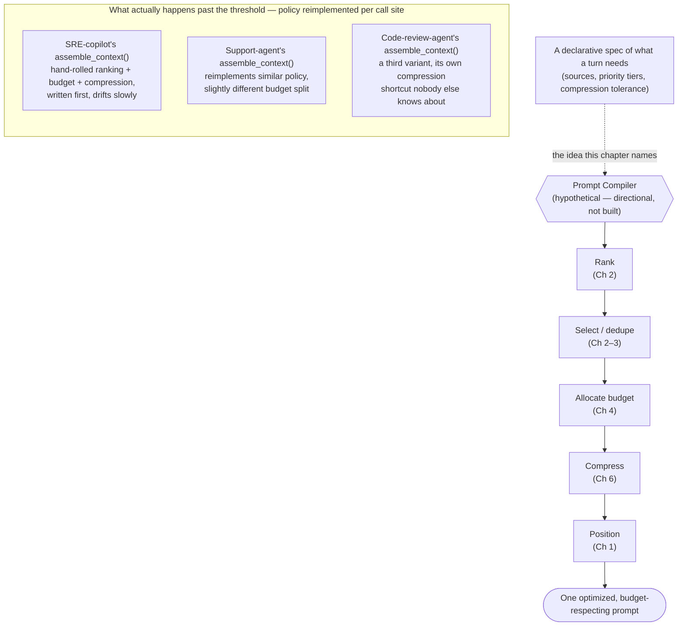

## Prompt Compilers

> Chapter of [[agentic-ai-engineering/readme#06 — Context Engineering|Context Engineering]], part of
> [[agentic-ai-engineering/readme|Agentic AI Engineering]]. Closing chapter of the Part.

## What you will understand at the end

- Why `assemble_context()` — the function
  [[agentic-ai-engineering/06-context-engineering/01-context-assembly/01-context-assembly|Chapter 1]]
  introduced as a clean signature — degrades into an unmaintainable pile of string concatenation and
  conditionals once you have more than a handful of context sources and call sites, and the concrete
  shape that degradation takes
- The reframing a "prompt compiler" proposes: context assembly as a declarative spec compiled
  through a coherent set of passes, instead of an imperative sequence of source-specific special
  cases
- How the passes such a compiler would need — rank, select, allocate budget, compress, position —
  map directly onto
  [[agentic-ai-engineering/06-context-engineering/02-context-ranking/02-context-ranking|Chapter 2]],
  [[agentic-ai-engineering/06-context-engineering/04-prompt-budgets/04-prompt-budgets|Chapter 4]],
  and
  [[agentic-ai-engineering/06-context-engineering/06-context-compression/06-context-compression|Chapter 6]]
  — this is a synthesis chapter, not a new policy layer
- Where the compiler analogy is genuinely load-bearing, and where it breaks — no settled
  optimization theory, no compile-time correctness proof, and a "target" (a model's attention
  behavior) that shifts under you in a way a real compiler's instruction set architecture doesn't
- Why this is directional, not established practice — no canonical implementation exists yet, and
  what to actually do about that this week rather than waiting for one to arrive

---

## The mental model

Six chapters into this Part, you have six independent policy layers:
[[agentic-ai-engineering/06-context-engineering/01-context-assembly/01-context-assembly|assembly and positioning]]
(Ch 1),
[[agentic-ai-engineering/06-context-engineering/02-context-ranking/02-context-ranking|ranking]] (Ch
2),
[[agentic-ai-engineering/06-context-engineering/03-memory-selection/03-memory-selection|memory selection]]
(Ch 3),
[[agentic-ai-engineering/06-context-engineering/04-prompt-budgets/04-prompt-budgets|budget allocation]]
(Ch 4), retrieval policy (Ch 5), and
[[agentic-ai-engineering/06-context-engineering/06-context-compression/06-context-compression|compression]]
(Ch 6). Each one, read on its own, is a well-scoped decision with a clear owner. The question this
chapter exists to ask is what happens when you actually have to _wire them together_ — not in a
diagram, in a real codebase, called on every turn, by more than one agent.

The unexamined assumption is that wiring is trivial: call retrieval, call ranking, call the budget
enforcer, call compression, call the assembler, return the prompt. In a codebase with one agent and
three context sources, that assumption holds and the imperative version is the _correct_ engineering
choice — building an abstraction layer for three sources and one call site is over-engineering, full
stop. The assumption stops holding at a specific, recognizable threshold: more context sources than
you can hold in your head at once, more than one agent (or more than one call site within an agent)
needing the same policies, and enough elapsed time for "just add a special case here" to have
happened a dozen times without anyone revisiting the whole function.



Two things to notice before going section by section:

1. **The left side of the diagram is not a strawman — it's the default outcome of building agents
   the way this Part's own Chapter 1 signature invites you to.** `assemble_context()` is a perfectly
   honest function signature for one agent. It says nothing about what happens when a second, third,
   and eighth agent each need a slightly different version of the same policy decisions.
2. **The right side is not a product that exists.** No framework in this book's ecosystem ships a
   general-purpose "declarative spec in, optimized prompt out" compiler today. This chapter names
   the idea and is explicit, in Section 4, about exactly how far the analogy and the current tooling
   actually go.

---

## 1. The hand-assembled pile, concretely

Take Chapter 1's clean signature and watch it evolve the way real call sites do — not through one
bad decision, but through a sequence of individually reasonable ones:

```python
def assemble_context(agent_type, user_tier, retrieved_chunks, memories,
                      tool_schemas, history, turn):
    # v1 — two sources, no conditionals. This is fine. Ship it.
    context = system_prompt() + format(tool_schemas) + format(history) + turn

    # v2 — memory arrives. Someone adds a cap because token pressure showed
    # up in an incident, not because this is memory selection's real policy
    # (Ch 3) — it's a truncation, not a selection.
    if len(memories) > MEMORY_CAP:
        memories = memories[:MEMORY_CAP]

    # v3 — a second agent type starts calling this function. Its tool
    # catalog is bigger, so it needs more of the budget. The fix lands as
    # a branch, not a parameter the budget policy (Ch 4) actually owns.
    if agent_type == "sre-copilot":
        tool_budget = 600
    elif agent_type == "support-agent":
        tool_budget = 200

    # v4 — an enterprise-tier customer complains about slow responses on
    # long retrieval sets. Someone adds an inline summarization call —
    # not the compression policy from Ch 6, a bespoke one, untested
    # against the rest of the pipeline.
    if user_tier == "enterprise" and len(retrieved_chunks) > 5:
        retrieved_chunks = [summarize(c) for c in retrieved_chunks]

    # v5 — a postmortem finds retrieval firing redundantly when a tool
    # result is already cached. The fix is another branch, discovered and
    # patched in isolation from every other retrieval-skip decision this
    # or any other agent has ever needed.
    if history and history[-1].get("tool_result_cache_hit"):
        retrieved_chunks = []

    # ... 300 lines later, this function is half agent-specific carve-outs.
    # Every branch above IS a policy decision — ranking, budget, compression,
    # retrieval-skip — that Ch 2/4/5/6 already have a real, reusable answer
    # for. None of those answers got reused here. Each was reinvented,
    # locally, under incident pressure, with no test coverage of its own.
```

Nothing in that evolution is a bad individual decision. Each diff shipped to fix a real problem,
under real time pressure, and each one was small. The failure is not in any single commit — it's
that **every branch is a duplicate of a policy this Part already gives a name and an owner to**,
reinvented inline instead of called as a shared function. Three concrete costs compound from this
pattern, and they're the reason this stops being a style complaint and becomes an
engineering-management problem:

| Cost                                                                        | What it looks like in practice                                                                                                                                                                                                    |
| --------------------------------------------------------------------------- | --------------------------------------------------------------------------------------------------------------------------------------------------------------------------------------------------------------------------------- |
| **Policy drift across call sites**                                          | Agent A's inline MMR-flavored dedup and Agent B's inline dedup started identical and diverged over eighteen months of independent patches — nobody can now say with confidence whether they behave the same on a shared edge case |
| **Untestable coupling**                                                     | Budget logic is entangled with formatting logic inside one function body — you cannot unit-test "does this respect the token budget" without also exercising every branch's string formatting                                     |
| **New-source cost scales with call-site count, not with the source itself** | Adding one new memory type means finding and patching every agent's `assemble_context()` that should honor it — the cost is `O(call sites)`, not `O(1)`                                                                           |

That third row is the one worth sitting with. A real compiler exists precisely so that adding a new
language feature, or retargeting a new CPU, doesn't require patching every program ever written in
that language — the compiler absorbs the change once, at the compiler layer, and every program that
compiles against it benefits without being touched. Hand-assembled context-building code has no
equivalent absorption point. Every improvement to ranking, budgeting, or compression policy has to
be manually propagated to every place that duplicated it.

---

## 2. What "compiling" a prompt would actually mean

The core reframing: stop writing the _sequence of steps_ that builds a prompt, and instead write a
_declarative spec of what the turn needs_, then hand that spec to a dedicated layer that knows how
to turn it into an optimized prompt. The shift is the same one that separates writing hand-tuned
assembly from writing C and trusting a compiler's optimization passes to produce comparable — often
better — machine code, consistently, across every program that compiles against it.

Contrast the two input shapes directly:

```python
# Imperative — what assemble_context() asks for today: a sequence of
# concrete objects, with no room to express priority or tolerance.
assemble_context(system_prompt, tool_schemas, retrieved_chunks,
                  retrieved_memories, conversation_history, current_turn,
                  token_budget)

# Declarative — what a compiled context spec would ask for instead:
# intent and constraint, not the already-resolved objects.
ContextSpec(
    sources=[
        Source("system", required=True, position="primacy"),
        Source("tool_schemas", scope="dynamic", position="primacy"),
        Source("retrieval", corpus="runbooks", priority_tier=2,
               compression_tolerance="lossy_ok"),
        Source("memory", namespace="episodic", priority_tier=1,
               compression_tolerance="lossless_only"),
        Source("history", window="session", position="recency"),
    ],
    token_budget=8000,
    target_model="claude-sonnet-4-6",
)
```

The declarative version says nothing about _how_ ranking runs, _how much_ budget each source
actually gets, or _whether_ something gets compressed — it says what matters, at what priority, with
what tolerance for lossy treatment. Everything about _how_ is the compiler's job, and it's exactly
this Part's own chapters, run as passes instead of hand-copied logic:

| Compiler concept                 | Context-engineering equivalent                                                                                                                        | Owned by                                                                                                                    |
| -------------------------------- | ----------------------------------------------------------------------------------------------------------------------------------------------------- | --------------------------------------------------------------------------------------------------------------------------- |
| Source / AST parsing             | Gathering raw candidate fragments from retrieval, memory, tools, history                                                                              | [[agentic-ai-engineering/06-context-engineering/01-context-assembly/01-context-assembly\|Ch 1 — Context Assembly]]          |
| Dependency / priority analysis   | Scoring candidate fragments on one common yardstick across heterogeneous sources                                                                      | [[agentic-ai-engineering/06-context-engineering/02-context-ranking/02-context-ranking\|Ch 2 — Context Ranking]]             |
| Dead-code elimination            | Dropping near-duplicate fragments (MMR) and non-actionable memories                                                                                   | Ch 2, [[agentic-ai-engineering/06-context-engineering/03-memory-selection/03-memory-selection\|Ch 3 — Memory Selection]]    |
| Register allocation              | Allocating a fixed, scarce resource (tokens, not registers) across competing demands, deciding what spills                                            | [[agentic-ai-engineering/06-context-engineering/04-prompt-budgets/04-prompt-budgets\|Ch 4 — Prompt Budgets]]                |
| Code-size optimization           | Compressing the admitted set to fit without silently dropping needed signal                                                                           | [[agentic-ai-engineering/06-context-engineering/06-context-compression/06-context-compression\|Ch 6 — Context Compression]] |
| Instruction scheduling / codegen | Positioning the admitted, compressed fragments — primacy and recency zones matter for attention the way instruction order matters for pipeline stalls | Ch 1                                                                                                                        |

Read the table as the actual claim of this chapter: **a prompt compiler is not a seventh policy
layer**. It's a coherent, ordered execution of the six that already exist, run as reusable passes
against a declared spec instead of copy-pasted per agent. This chapter introduces no new ranking
signal, no new budget algorithm, no new compression technique — it's the wiring problem those five
chapters leave open, named honestly as a wiring problem.

---

## 3. Why this matters at scale — the platform framing

The single-agent version of this problem is a maintenance annoyance. It becomes a
platform-engineering problem the moment a second team starts building agents on top of the same
context sources. Picture what
[[production-agent-systems/04-ai-platform-engineering/01-designing-internal-ai-platforms/01-designing-internal-ai-platforms|an internal AI platform team]]
actually faces at, say, eight agents deep: an SRE copilot, a support agent, a code-review agent, a
few more — each with its own hand-rolled `assemble_context()`, each independently reimplementing
MMR-flavored dedup, its own budget carve-outs, its own inline compression shortcut.

Two ordinary platform events turn that duplication from an annoyance into an incident:

- **A pricing or context-window change on the provider side.** The budget math baked into eight
  separate functions all needs to change, roughly simultaneously, and there is no single place to
  verify all eight got updated correctly — because there's no single place the policy lived in the
  first place.
- **A compression technique gets found that measurably improves recall at the same token cost.**
  Rolling it out means finding and patching every agent's bespoke compression branch, several of
  which — like the `v4` carve-out in Section 1 — were written under incident pressure by whoever was
  on call that week, with no test coverage guaranteeing the patch behaves the same way twice.

This is precisely the argument
[[production-agent-systems/04-ai-platform-engineering/01-designing-internal-ai-platforms/01-designing-internal-ai-platforms|Part 04 of Production Agent Systems]]
makes for a shared inference layer and paved-road SDKs generally, applied here to one specific slice
of agent behavior: context assembly is exactly the kind of cross-cutting policy a platform team
should own once, centrally, rather than let drift across every team building on top of it. A prompt
compiler, in this framing, isn't a novel AI capability — it's the same "centralize the thing every
consumer would otherwise reimplement" argument that justifies an internal platform team's existence
at all, aimed at Part 06's specific policy surface.

---

## 4. Where the analogy holds, and where it genuinely breaks

Taking the compiler metaphor seriously means being honest about where it stops paying rent —
treating it as a slogan past this point would be exactly the kind of unearned precision this book
avoids.

**Where it holds:**

- **Separation of intent from execution.** The spec declares what matters; the compiler decides how.
  This is real, valuable decoupling — it's what makes the ranking/budget/compression logic testable
  in isolation, independent of any one agent's call site.
- **Reusable, ordered passes.** A stable pipeline (rank → select → allocate → compress → position)
  that every consuming agent runs through, instead of each agent inventing its own ordering and
  discovering the hard way that running compression before budget allocation produces different
  results than the reverse.
- **A real absorption point for improvement.** Ship a better ranking signal once, at the compiler
  layer, and every agent compiling against it benefits without anyone touching agent-specific code —
  the exact property Section 1 showed hand-assembled code lacks.

**Where it breaks:**

- **No settled optimization theory.** Register allocation has decades of provably-good algorithms
  behind it. Context ranking's weights (Ch 2's `w_sim`, `w_recency`, `w_authority`, `w_usefulness`)
  are heuristic, tuned per agent, with no equivalent proof of optimality — "good compression" and
  "good ranking" are empirically validated per use case, not derived from first principles the way a
  register allocator's correctness is.
- **No compile-time correctness proof.** A type-checker proves a program is well-typed before it
  ever runs. Nothing in this stack proves a compiled prompt is "correct" before the model sees it —
  the closest available substitute is eval-gated regression testing after the fact
  ([[building-agentic-systems/02-evaluation/04-offline-evaluation/04-offline-evaluation|offline evaluation]]
  against a golden set,
  [[building-agentic-systems/02-evaluation/03-online-evaluation/03-online-evaluation|online evaluation]]
  against live traffic), which catches regressions statistically, not a guarantee checked once at
  build time.
- **An unstable target.** A real compiler backend targets a stable instruction set architecture —
  x86 behaves like x86 regardless of which compiler produced the binary. A "compiled" prompt's
  optimal layout is tuned against one model's positional attention behavior
  ([[agentic-ai-engineering/06-context-engineering/01-context-assembly/01-context-assembly|Ch 1's]]
  primacy/recency asymmetry), and that behavior is not guaranteed stable across model versions, let
  alone model families. A layout optimized against `claude-sonnet-4-6`'s attention shape can
  mis-target `claude-opus-4-8`'s in a way no ISA-abstraction layer protects you from — this is a
  genuinely unsolved asymmetry, not a detail the ecosystem has already worked around.

That target-instability point is worth sitting with longer than the others, because it's the one
most likely to bite a team that takes the analogy too literally: a real compiler's backend is a
solved, swappable abstraction over the target; a prompt compiler's "backend" is closer to a moving
target that happens to accept the same input format.

---

## 5. Honest state of the art: directional, not established

Name this plainly: **treating context assembly as compilation is an emerging way of thinking about
the problem, not a practice with an agreed-on canonical implementation.** No framework in wide use
today ships a general-purpose "declarative spec in, optimized prompt out" compiler that runs Section
2's full pass sequence — ranking, selection, budget allocation, compression, and layout — as one
coherent, swappable layer across arbitrary context sources.

The closest widely known reference point is **DSPy**, and it's worth being precise about exactly how
close: DSPy compiles a declarative _signature and module structure_ into an optimized prompt (and
optionally few-shot examples) by running an optimizer against a metric and a training set. That's
real compilation, in the sense this chapter means it — a declarative spec going in, an optimized
prompt coming out through an automated pass rather than hand-tuning. But it's solving a narrower,
different-shaped problem than the one this chapter describes: DSPy's optimization target is prompt
_wording and few-shot selection_ for a given task signature, tuned offline against a training set —
not the multi-source, per-turn problem of ranking and budgeting _retrieval, memory, tool schemas,
and history against each other_ at runtime, which is what Chapters 2, 4, and 6 of this Part are
actually about. Related idea, adjacent motivation, genuinely not the same compiler. Treat any claim
that DSPy (or anything else) is _the_ prompt compiler for context assembly as more confident than
the current state of the field supports.

Beyond that, what exists is a landscape of frameworks — LangChain, LlamaIndex, various platform
teams' internal layers — each with its own configurable-but-bespoke context-building logic, none of
them exposing the general compiler this chapter describes as a first-class product concept. That may
change; the pressure described in Section 3 is real and growing as more teams hit the same
duplication problem independently. But as of this writing, this is a direction worth designing
toward, not a dependency worth blocking on.

**The practical takeaway that doesn't require waiting for a standard:** you don't need someone
else's compiler to get most of the value. Extract your own ranking, budget, and compression logic
out of each agent's `assemble_context()` and into small, independently testable, reusable modules
with a consistent input surface — even if you hand-write the orchestration that calls them in order.
That gets you Section 1's real cost fixed (policy drift, untestable coupling, `O(call sites)` change
cost) without needing a general-purpose declarative spec language or an external framework. It's not
a full compiler. It's the 80% of the value that doesn't require solving the target-instability
problem from Section 4 first.

---

### A naming collision worth flagging explicitly

[[agentic-ai-engineering/03-planning-and-reasoning-algorithms/09-llm-compiler/09-llm-compiler|LLM Compiler]]
(Part 03, Chapter 9) borrows the same metaphor for a genuinely different axis of the system: it
compiles an _execution plan_ — a DAG of tool calls, planned upfront so independent branches can run
in parallel instead of sequentially the way ReAct does. This chapter's prompt compiler compiles a
_context spec_ into an optimized _prompt string_. Both are real, independent applications of
"compilation" borrowed from programming-language theory to a different layer of the agent stack —
one optimizes what the agent _does_, the other optimizes what the agent _sees_ before it decides
what to do. Don't conflate them when the word "compiler" shows up in either context; check which
layer of the stack is actually being compiled.

---

## Concept check

| Question                                                                                                   | Answer hint                                                                                                                                                                                                                                                   |
| ---------------------------------------------------------------------------------------------------------- | ------------------------------------------------------------------------------------------------------------------------------------------------------------------------------------------------------------------------------------------------------------- |
| Why does `assemble_context()` degrade specifically as sources multiply, not just get longer over time?     | Every new source or special case is a ranking/budget/compression policy decision reimplemented ad hoc at the call site instead of reused from a shared layer — complexity compounds with each duplicated decision, not just with line count                   |
| What's the core reframing a prompt compiler proposes?                                                      | Treat context assembly as compiling a declarative spec of what a turn needs through a coherent, reusable set of passes, instead of imperatively concatenating strings with source-specific conditionals at each call site                                     |
| Does a prompt compiler introduce any new context-engineering policy this Part hasn't already covered?      | No — it's the wiring of Ch 2 (ranking), Ch 3 (selection), Ch 4 (budget), and Ch 6 (compression) into one ordered pass, not a seventh policy layer                                                                                                             |
| Why does hand-assembled duplication become a platform problem, not just a per-agent maintenance annoyance? | Past a handful of agents sharing context sources, a provider pricing change or a compression improvement has to be manually propagated to every duplicated call site instead of updated once at a shared layer                                                |
| Name one place the compiler analogy genuinely breaks, not just "AI is different."                          | No compile-time correctness proof equivalent to type-checking — the closest substitute is eval-gated regression testing after the fact, which catches regressions statistically, not a guarantee verified once at build time                                  |
| Why is a compiled prompt's "target" less stable than a real compiler's ISA target?                         | Optimal layout is tuned against one model's positional attention behavior, which isn't guaranteed stable across model versions or families — unlike x86 behaving like x86 regardless of compiler                                                              |
| How does DSPy relate to the idea in this chapter, precisely?                                               | DSPy compiles a declarative task signature into an optimized prompt/few-shot set via an offline optimizer against a metric — real compilation, but of prompt wording for one task, not the runtime multi-source ranking/budget problem this chapter describes |
| What should an engineer actually do this week, without waiting for a standard compiler to exist?           | Extract ranking/budget/compression logic into small, independently testable, reusable modules with a consistent input surface — hand-written orchestration still captures most of the value                                                                   |
| How does this chapter's compiler differ from Part 03's LLM Compiler?                                       | LLM Compiler (Part 03) compiles an execution plan — a DAG of tool calls for parallel execution; this chapter's compiler compiles a context spec into an optimized prompt string. Same metaphor, different layer of the stack                                  |

---

## Vocabulary glossary

| Term                          | Definition                                                                                                                                                                                                                                                                            |
| ----------------------------- | ------------------------------------------------------------------------------------------------------------------------------------------------------------------------------------------------------------------------------------------------------------------------------------- |
| Prompt compiler (directional) | A hypothetical, not-yet-standardized layer that compiles a declarative context spec into an optimized, budget-respecting prompt via reusable passes — ranking, selection, budget allocation, compression, layout                                                                      |
| Declarative context spec      | A description of what a turn needs — sources, priority tiers, compression tolerance — as input to a compiler, rather than the imperative sequence of steps that assembles a prompt today                                                                                              |
| Compiler pass                 | One coherent transformation stage (rank, select, allocate, compress, position) applied uniformly through a shared layer instead of reimplemented per call site                                                                                                                        |
| Policy duplication            | The failure mode where the same ranking, budget, or compression logic is reimplemented — and drifts — independently at each agent's own context-assembly call site                                                                                                                    |
| Target instability            | The way a compiled prompt's optimal layout is tuned against one model's attention behavior and can mis-target a different model or model version, unlike a real compiler's stable ISA target                                                                                          |
| DSPy                          | A framework that compiles a declarative task signature and module structure into an optimized prompt via an offline optimizer against a metric — the closest widely known reference point, but scoped to prompt wording for one task, not this chapter's multi-source runtime problem |
