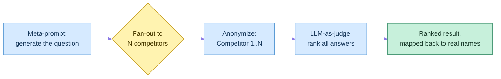
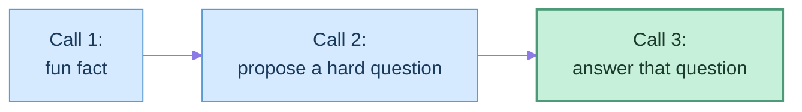

## Agent Design Pattern Catalog

This page covers two related pattern sets. First, Anthropic's five-pattern **workflow taxonomy**
from ["Building Effective Agents"](https://www.anthropic.com/engineering/building-effective-agents)
(chaining, routing, parallelization, orchestrator-workers, evaluator-optimizer) plus one adjacent
technique (meta-prompting), worked through against a runnable arena lab —
[[c-2-llm-arena-reference-implementation|Appendix C.2 — LLM Arena Reference Implementation]].
Second, this book's own eleven-pattern
[[ai-architecture-and-system-design/readme#00 — AI Architecture Patterns|Part 00 architecture-pattern catalog]],
condensed in the second half of this page. Where the two overlap (routing, orchestrator-workers),
this page cross-links rather than repeating itself — see the Sources section below.

### Pattern: Meta-Prompting

One LLM call generates the task/question for a later call, instead of a human authoring it — removes
human bias from task selection and demonstrates that an LLM call's _output_ can become the next
stage's _input_. Common constraint: force the generator to answer with _only_ the task/question, no
preamble, so the output is directly usable downstream.

### Pattern: Fan-Out / Parallelization

The same prompt is sent independently to N models — each produces an answer with zero awareness of
the others, no shared state, no turn-taking. Increases resilience and answer quality by sampling
diverse "opinions" before committing to one. Anthropic's official taxonomy calls this the **voting
variant of Parallelization** (same task, many attempts, aggregate for confidence).

### Pattern: LLM-as-a-Judge (Evaluator)

A separate LLM call ranks or scores the fan-out stage's outputs, replacing a human reviewer or a
hard-coded rule.

| Bias-control technique | What it does                                                                                                                               |
| ---------------------- | ------------------------------------------------------------------------------------------------------------------------------------------ |
| Anonymization          | Strip identifying labels before judging ("Competitor 1…N") — a blind wine-tasting analogy: judges score what's in the glass, not the label |
| Structured output      | Force strict JSON (a rank-ordered list) so the result parses programmatically                                                              |
| Judge selection        | Never use a competitor model as judge — avoids any appearance of self-preference bias                                                      |

**Exam trap:** Anthropic's real **Evaluator-Optimizer** pattern is a _loop_ — the evaluator's
feedback goes back to the generator for another attempt, repeating until satisfied. A judge that
only ranks once, with no feedback sent back for a re-attempt, borrows the generator/evaluator
_shape_ without the _loop_ — closer to a one-shot evaluator than the full pattern. If asked to name
the textbook pattern for "one LLM checks another's work," Evaluator-Optimizer is the expected
answer, but a complete implementation needs the feedback loop back to the generator to fully
qualify. See the dedicated **Evaluator-Optimizer** entry below for the loop this reference
implementation doesn't close.



**Reference implementation** — an arena that generates one question (OpenAI), fans it out across up
to 8 OpenAI-compatible providers (Anthropic, Gemini, DeepSeek, Groq, OpenRouter, local Ollama
models...), then has a fresh judge model (xAI's Grok — never one of the competitors) rank every
answer that came back:

```python
@dataclass(frozen=True)
class Provider:           # where: base_url, api_key, required?
    name: str
    base_url: str | None
    api_key: str | None
    required: bool = False  # True only for the question-asker and the judge

@dataclass(frozen=True)
class Competitor:          # what: model + provider + optional reasoning_effort
    provider: str
    model: str
    reasoning_effort: str | None = None
```

Design lessons from hardening this against a notebook-export original (`!ollama pull …` shell magic,
`IPython.display` calls, and one failed call aborting 8+ paid calls' worth of partial results):

- **Validate required keys before any network call.** Fail fast if the question-asker's or judge's
  key is missing — don't discover it only after every (paid) competitor call has already run.
- **A missing key or a failing call skips one competitor, not the whole run.** Every other
  provider's key was already documented "(optional)" in the diagnostics; the code has to actually
  honor that instead of crashing on the first one that's absent.
- **Guard the judge's JSON parse and the rank→name lookup.** An unparseable judge reply or an
  out-of-range/non-numeric rank should print and exit cleanly, not raise after every paid call
  already succeeded.
- **Keep side effects inside functions reachable from `main()`.** Client construction and network
  calls stay out of module scope, so importing the module does nothing and each function is testable
  with mocked clients.

→ Full source:
[[c-2-llm-arena-reference-implementation|Appendix C.2 — LLM Arena Reference Implementation]].

### Pattern: Evaluator-Optimizer (a.k.a. LLM-as-Judge, the loop version)

The fourth of Anthropic's five workflow patterns, and the one the LLM-as-a-Judge section above is
_adjacent to_ but doesn't fully implement.
[[agentic-ai-engineering/03-planning-and-reasoning-algorithms/10-debate-and-critic-agents/10-debate-and-critic-agents|Debate & Critic Agents]]
calls it **critic agents** and treats "evaluator-optimizer" and "LLM-as-judge" as the same mechanism
under two names — default to "LLM-as-judge" in conversation, since that's the term production
systems and papers actually use.

- **The shape:** a **generator** produces a candidate. An **evaluator** accepts or rejects it, with
  feedback on what to fix. Rejection loops back to the generator — bounded, not open-ended: the loop
  lives inside a fixed generate → evaluate → repeat-or-exit shape, with a hard cap on iterations.
- **What makes it a loop, not a one-shot rank:** the evaluator's feedback has to reach the generator
  as input to a _new_ attempt. The arena implementation above never does this — it ranks N
  independent, already-finished answers once and stops. That's this page's Fan-Out + LLM-as-a-Judge
  combination, not Evaluator-Optimizer — closer to the "independent voting" shape of **Debate** (the
  sibling pattern the same source chapter covers) than to a generator/evaluator loop.
- **Fits when** the quality bar is checkable and articulable — the evaluator needs something
  concrete to check against, not a vague sense of quality — and iterative refinement measurably
  beats a single pass: literary translation, multi-round search where "did this actually answer the
  question" gates another round, or LLM-as-judge production evals.
- **Biggest failure mode:** the evaluator is itself an LLM call, and its calibration fails in both
  directions — too lenient lets bad output through and silently defeats the loop; too strict burns
  extra rounds rejecting good output. Treat a self-reported evaluator judgment the same way any
  other model confidence claim: verify against a held-out labeled set before trusting it as a
  quality gate, not by construction.

→ Full treatment:
[[agentic-ai-engineering/03-planning-and-reasoning-algorithms/10-debate-and-critic-agents/10-debate-and-critic-agents|Debate & Critic Agents]]

### Pattern: Prompt Chaining

Sequential LLM calls where each call's output is explicitly passed as the next call's input — plain
dependency injection, no hidden conversation state. Each call is a fresh, single-turn request; the
chain lives entirely in the calling code, not in message history.



**Reference implementation** — three sequential `chat.completions.create` calls (fun fact →
model-generated hard question → the model's own answer to that question), fail-fast whenever a
response's `content` comes back `None`.

**Lesson learned the hard way:** the reference script imports `httpx2` (a typo for `httpx`), and its
`requirements.txt` pins neither package — so client construction fails before the chain ever runs. A
chain is only as trustworthy as its first import; one smoke-test run (`python script.py`) before
calling a chain "done" would have caught this immediately.

### Python/API mechanics used across these patterns

| Mechanic              | Shape                                                                             | Notes                                                               |
| --------------------- | --------------------------------------------------------------------------------- | ------------------------------------------------------------------- |
| Chat call             | `client.chat.completions.create(model=..., messages=[...], reasoning_effort=...)` | Identical shape across every OpenAI-compatible provider             |
| Extract answer        | `response.choices[0].message.content`                                             | `choices` is a list — always index `[0]` for a single-response call |
| `zip(list_a, list_b)` | pairs elements from two lists in lockstep                                         | iterate competitors and answers together without manual indexing    |
| `enumerate(list)`     | yields `(index, value)` pairs                                                     | label each answer "response from competitor N"                      |

### Glossary

| Term                                  | Definition                                                                                                                                                                                                                                                                                            |
| ------------------------------------- | ----------------------------------------------------------------------------------------------------------------------------------------------------------------------------------------------------------------------------------------------------------------------------------------------------- |
| **Fan-out / parallelization pattern** | Sending one prompt to many models/agents independently and collecting all results                                                                                                                                                                                                                     |
| **Meta-prompting**                    | Using one LLM call to generate the prompt/task for a later LLM call                                                                                                                                                                                                                                   |
| **LLM-as-a-judge**                    | Using an LLM call to evaluate or rank the outputs of other LLM calls, instead of a human or fixed rule                                                                                                                                                                                                |
| **Anonymization (bias control)**      | Stripping identifying labels from candidates before an evaluator sees them                                                                                                                                                                                                                            |
| **Structured output / JSON mode**     | Constraining a model's response to a strict, parseable format so downstream code can consume it directly                                                                                                                                                                                              |
| **Prompt chaining**                   | Sequential LLM calls where each call's output is explicit dependency-injected as the next call's input                                                                                                                                                                                                |
| **Routing**                           | Classifying an incoming request and dispatching it to exactly one specialized handler — formalized in this book as the [[ai-architecture-and-system-design/00-ai-architecture-patterns/05-router-pattern/05-router-pattern\|Router Pattern]]                                                          |
| **Orchestrator-workers**              | An orchestrator LLM decomposes a task into subtasks at runtime, workers execute them, a synthesizer combines results — formalized as the [[ai-architecture-and-system-design/00-ai-architecture-patterns/04-orchestrator-worker-pattern/04-orchestrator-worker-pattern\|Orchestrator–Worker Pattern]] |
| **Evaluator-optimizer**               | A generator/evaluator feedback loop where rejection sends the candidate back for another attempt, repeating until accepted — the loop form of LLM-as-a-judge; see the dedicated entry above                                                                                                           |

### Sources

- Anthropic,
  ["Building Effective Agents"](https://www.anthropic.com/engineering/building-effective-agents) —
  official five-pattern workflow taxonomy (prompt chaining, routing, parallelization,
  orchestrator-workers, evaluator-optimizer). Of the five, prompt chaining, parallelization, and
  evaluator-optimizer are worked through above; **routing** and **orchestrator-workers** get the
  fuller architectural treatment in the Part 00 catalog below —
  [[ai-architecture-and-system-design/00-ai-architecture-patterns/05-router-pattern/05-router-pattern|Router Pattern]]
  and
  [[ai-architecture-and-system-design/00-ai-architecture-patterns/04-orchestrator-worker-pattern/04-orchestrator-worker-pattern|Orchestrator–Worker Pattern]]
  respectively — rather than repeated here.
- [[agentic-ai-engineering/03-planning-and-reasoning-algorithms/10-debate-and-critic-agents/10-debate-and-critic-agents|Debate & Critic Agents]]
  — source for the Evaluator-Optimizer / critic-agent-loop distinction above.

## Part 00 Architecture Patterns — AI Architecture & System Design

The eleven patterns from
[[ai-architecture-and-system-design/readme#00 — AI Architecture Patterns|Part 00 of AI Architecture & System Design]],
condensed to applicability criteria, key trade-off, top differentiator, and top failure mode. Five
of the eleven have a real, worked chapter in this repo to condense from — those five link to it. The
other six (their own Part 00 chapter is still a `[stub: ...]` placeholder) are summarized here from
standard usage rather than from a written chapter — flagged explicitly per entry, not silently
passed off as sourced.

| #   | Pattern                     | One-line definition                                                                                                                  |
| --- | --------------------------- | ------------------------------------------------------------------------------------------------------------------------------------ |
| 1   | Architectural Thinking      | The meta-framework for judging any pattern below against determinism, cost, latency, and blast radius — not itself a runtime pattern |
| 2   | Planner–Executor            | A planner commits to a full plan upfront; a separate executor carries out each step and never re-plans                               |
| 3   | Supervisor                  | One coordinator delegates to several specialists on the _same_ question, then aggregates and reconciles their conflicting findings   |
| 4   | Orchestrator–Worker         | An orchestrator LLM decomposes a task into subtasks _at runtime_; workers execute them; a synthesizer combines results               |
| 5   | Router                      | Classify a request, dispatch to exactly one handler, stop — no fan-out, no aggregation                                               |
| 6   | Blackboard                  | Agents read/write one shared workspace and act on local triggers, with no central coordinator                                        |
| 7   | Event-Driven                | Agents subscribe to and react to events on a bus, decoupled from producers and from each other                                       |
| 8   | Memory-Centric              | The memory store, not the prompt, is the primary component — retrieval shapes behavior across sessions                               |
| 9   | Human-Approval              | A synchronous human gate before a destructive, financial, or irreversible action executes                                            |
| 10  | Agent Mesh                  | Service-mesh control-plane/data-plane split applied to agent discovery, routing, and observability at dozens-of-agents scale         |
| 11  | Pattern Selection Framework | The decision procedure for picking among patterns 2–10 for a given task                                                              |

### Pattern: Architectural Thinking

Not a runtime pattern — the lens the rest of this catalog is judged through: determinism, cost,
latency, and blast radius, rather than whichever pattern a framework defaults to.

- **Applicability:** Apply it _before_ picking any pattern below, not as an architecture in its own
  right.
- **Differentiator:** vs. Pattern Selection Framework (#11) — this is the _criteria_; #11 is the
  _procedure_ that applies those criteria to a specific task.
- **Failure mode:** Picking a pattern because it's the framework default or the newest option,
  rather than because the task's structure calls for it.

→ Source chapter
([[ai-architecture-and-system-design/00-ai-architecture-patterns/01-architectural-thinking/01-architectural-thinking|Architectural Thinking]])
is still a stub — condensed here from the chapter's own stated framing, not a full treatment.

### Pattern: Planner–Executor

A planner decomposes a goal into a full, ordered plan upfront; a separate executor carries out each
step against accumulated state and never re-plans on its own.

- **Applicability:** Environment structure is knowable before execution starts, and a human or
  policy engine needs to review the full plan before any step fires.
- **Key trade-off:** Failure isolation, cost separation (expensive planner model, cheap executor
  model), and auditability — bought at the risk of a **stale plan**: a later step silently executed
  against an assumption an earlier step already invalidated.
- **Differentiator:** vs. ReAct — this pattern commits to the plan upfront (static); ReAct decides
  the next action from the last observation (interleaved). vs. Orchestrator–Worker — the subtask
  graph is fixed before any step runs (static decomposition) vs. generated incrementally from
  results (dynamic decomposition).
- **Failure mode:** Stale plan. Fix is per-step preconditions the executor checks, plus a replan
  path back to the planner — not a smarter prompt.

→ Full treatment:
[[ai-architecture-and-system-design/00-ai-architecture-patterns/02-planner-executor-pattern/02-planner-executor-pattern|Planner–Executor Pattern]]

### Pattern: Supervisor

A coordinating LLM call delegates a task to several specialists investigating the _same_ question,
aggregates their independent findings, and resolves conflicts between them into one answer.

- **Applicability:** No single specialist's signal is trustworthy enough alone to close the
  investigation — the classic case is incident RCA across metrics/logs/traces.
- **Key trade-off:** Centralized accountability and one auditable reasoning trace, at the cost of
  centralizing risk — the supervisor is a latency, availability, _and_ correctness single point of
  failure.
- **Differentiator:** vs. Router — a router dispatches to exactly one handler and is done; a
  supervisor fans out to several specialists on the _same_ task and must reconcile them. vs.
  Orchestrator–Worker — supervisor reconciles _conflicting opinions_ from named specialists
  (vertical); orchestrator-worker combines _disjoint pieces_ of one task from interchangeable
  workers (horizontal).
- **Failure mode:** Hallucinated synthesis — a confident-sounding conclusion that silently drops a
  specialist's contradicting finding. Fix: a required output schema with non-optional fields for
  every specialist's finding and for open conflicts, not a politer prompt. Breaks down structurally
  past roughly 5–7 specialists (arbitration overload) — fix is a router pre-filter or a
  supervisor-of-supervisors tier, not a longer prompt.

→ Full worked treatment:
[[building-agentic-systems/01-multi-agent-systems/09-supervisor-architectures/09-supervisor-architectures|Supervisor Architectures]]
(this pattern's own Part 00 chapter is still a stub; the fuller treatment lives in that chapter
instead).

### Pattern: Orchestrator–Worker

An orchestrator LLM decomposes a task into subtasks _at runtime_, worker LLMs execute them, and a
synthesizer LLM combines the results — every role in the chain is an LLM call, not fixed code.

- **Applicability:** The right decomposition is genuinely input-dependent (one request touches two
  files, another touches ten) and can't be enumerated in advance.
- **Key trade-off:** Flexibility for input-dependent decomposition, at strictly higher cost than a
  fixed split — an extra planning call and an extra synthesis call on top of every worker call.
- **Differentiator:** vs. Parallel Execution — the one structural fact that decides it: are the
  decompose/aggregate steps LLM calls (orchestrator-worker) or fixed code (parallel execution)? Not
  how the diagram looks. vs. Supervisor — horizontal decomposition of one task into interchangeable
  pieces, vs. vertical consultation of named, non-interchangeable specialists.
- **Failure mode:** Silent partial-result aggregation — a worker times out or errors, the dispatch
  layer drops it instead of surfacing the gap, and the synthesizer produces a confident-looking
  complete answer from incomplete inputs.

→ Full treatment:
[[ai-architecture-and-system-design/00-ai-architecture-patterns/04-orchestrator-worker-pattern/04-orchestrator-worker-pattern|Orchestrator–Worker Pattern]]

### Pattern: Router

Classify an incoming request and dispatch it to exactly one specialized handler, tool, or sub-agent,
then stop — no fan-out, no aggregation, no synthesis.

- **Applicability:** Requests genuinely belong to one domain, mutually exclusive by construction,
  and the latency budget is tight.
- **Key trade-off:** The cheapest, fastest dispatch of any pattern here — bought at the cost of zero
  in-context recovery if the classification is wrong for that turn.
- **Differentiator:** vs. Supervisor — a router's dispatch is terminal and mutually exclusive by
  construction; a supervisor's is neither. The two compose: a router as a cheap pre-filter in front
  of a supervisor is the fix for supervisor arbitration overload (see above).
- **Failure mode:** Misrouting is structurally silent — the correct handler never sees the request,
  no recovery for that turn. Mitigate with a confidence-gated fallback (escalate to a human / ask
  for clarification / route to a generalist default), tuned before it happens in production.

→ Full treatment:
[[ai-architecture-and-system-design/00-ai-architecture-patterns/05-router-pattern/05-router-pattern|Router Pattern]]

### Pattern: Blackboard

Multiple agents read and write to one shared workspace instead of talking to each other directly;
each agent watches the shared state and acts when it sees something matching its own trigger
condition, with no central coordinator deciding who does what.

- **Applicability:** The set of contributors and the order they should act in isn't knowable
  upfront, but a cheap local check ("is this unclaimed and tagged X?") is enough for each agent to
  know when to act.
- **Key trade-off:** No central bottleneck and no fixed turn order, at the cost of no accountable
  owner for the overall trace — behavior is an emergent property of many independent local
  decisions. This is what
  [[building-agentic-systems/01-multi-agent-systems/07-swarm-intelligence/07-swarm-intelligence|Swarm Intelligence]]
  calls **stigmergy** (indirect, environment-mediated coordination) when it cites this pattern as
  the formalized version of that same idea.
- **Differentiator:** vs. Supervisor — no component ever holds the full picture or arbitrates
  conflicts; coordination is entirely indirect, through the shared state, not through a synthesis
  step.
- **Failure mode:** Two agents racing on the same blackboard entry with no locking/claim discipline
  — a double-claim or lost-update race condition, structurally a distributed-systems problem wearing
  an agentic-AI costume.

→ Source chapter
([[ai-architecture-and-system-design/00-ai-architecture-patterns/06-blackboard-pattern/06-blackboard-pattern|Blackboard Pattern]])
is still a stub; condensed here from standard usage and the stigmergy cross-reference in Swarm
Intelligence, not from a written chapter.

### Pattern: Event-Driven

Agents don't poll or run on a fixed schedule — they subscribe to events on a bus/queue and react
when a matching event arrives, decoupling producers from consumers entirely.

- **Applicability:** Work arrives asynchronously and unpredictably (a webhook, a metric crossing a
  threshold, another agent's completion signal), and agents shouldn't need to know who else exists
  or is listening.
- **Key trade-off:** Loose coupling and natural horizontal scaling (more consumers, same event
  stream), at the cost of harder end-to-end tracing — one logical workflow's steps are scattered
  across independently-triggered handlers instead of one visible call stack.
- **Differentiator:** vs. Orchestrator–Worker — nothing decomposes a task upfront; there is no
  orchestrator, only independent reactions to events as they occur. Closer in spirit to Blackboard's
  decoupling, but coordinated through a typed event stream instead of shared mutable state.
- **Failure mode:** Duplicate or out-of-order event delivery causing an agent to act twice, or on
  stale state — needs idempotency keys and ordering guarantees designed in from the start, not
  bolted on after a duplicate-processing incident.

→ Source chapter
([[ai-architecture-and-system-design/00-ai-architecture-patterns/07-event-driven-pattern/07-event-driven-pattern|Event-Driven Pattern]])
is still a stub; condensed here from standard event-driven-architecture usage, not from a written
chapter.

### Pattern: Memory-Centric

The agent's memory store — not its prompt or its tool set — is the primary architectural component;
retrieval from long-term or episodic memory shapes what the agent does on each turn more than the
immediate conversation does.

- **Applicability:** Tasks that span sessions, need personalization across interactions, or require
  recalling a specific past decision or precedent rather than re-deriving it every time.
- **Key trade-off:** Continuity and personalization across long horizons, at the cost of the memory
  store itself becoming a data system with its own lifecycle — versioning, staleness management, and
  access control — not a free side effect of adding a vector DB.
- **Differentiator:** vs. Planner–Executor's "accumulated state" — that state is scoped to one run
  and discarded after; memory-centric persists across runs by design.
- **Failure mode:** Retrieved memory that's stale, or was true only in a different context, gets
  treated as current fact — the memory-system analog of Planner–Executor's stale-plan failure, one
  layer up.

→ Source chapter
([[ai-architecture-and-system-design/00-ai-architecture-patterns/08-memory-centric-pattern/08-memory-centric-pattern|Memory-Centric Pattern]])
is still a stub; condensed here from standard usage, not from a written chapter.

### Pattern: Human-Approval

The agent proposes an action, but a human must explicitly approve it before it executes — a
synchronous gate at a specific, chosen point in the workflow, not a general logging afterthought.

- **Applicability:** The action is destructive, financial, or irreversible, or its blast radius is
  high enough that a wrong autonomous decision costs more than the latency of waiting for a human.
- **Key trade-off:** Bounds the worst-case blast radius of any single agent decision, at the direct
  cost of latency and human attention — every gate is a queue someone has to actually clear, or it
  becomes the de facto bottleneck the same way an overloaded Supervisor does.
- **Differentiator:** vs. a Router's low-confidence fallback — routing escalates _only when
  uncertain_; a human-approval gate fires _every time_, regardless of the agent's confidence,
  because the decision class itself — not the agent's certainty about it — is what's gated.
- **Failure mode:** Approval fatigue — humans start rubber-stamping a high-volume gate without
  really reviewing it, quietly turning a designed safety control into a no-op with worse latency
  than not having it at all. Mitigate by gating narrowly (only the genuinely risky action class),
  not broadly.

→ Source chapter
([[ai-architecture-and-system-design/00-ai-architecture-patterns/09-human-approval-pattern/09-human-approval-pattern|Human-Approval Pattern]])
is still a stub — as are the two related single-agent chapters,
[[building-agentic-systems/00-building-single-agent-systems/07-human-in-the-loop-systems/07-human-in-the-loop-systems|Human-in-the-Loop Systems]]
and
[[building-agentic-systems/00-building-single-agent-systems/08-approval-workflows/08-approval-workflows|Approval Workflows]];
condensed here from standard usage, not from a written chapter.

### Pattern: Agent Mesh

Service-mesh's control-plane/data-plane split, applied to agent-to-agent discovery, routing, and
observability — a control plane (registry, routing/retry policy, an observability collector) that
every agent's sidecar talks to, instead of each agent hardcoding who else exists.

- **Applicability:** More agents than fit in one person's head or one hardcoded routing table —
  dozens, owned by different teams, shipping on independent release cadences, running multiple
  versions side by side.
- **Key trade-off:** Discovery, failover, and uniform observability across agents nobody centrally
  wrote, at the cost of real control-plane infrastructure overhead that isn't worth paying at 3–5
  agents.
- **Differentiator:** vs. Supervisor — a supervisor's routing table fits in one prompt because the
  agent count is small and known; a mesh exists precisely because that stopped being true.
  "Equivalent agent" failover is also a weaker guarantee here than for stateless service replicas —
  two agent versions are rarely drop-in interchangeable the way two stateless pods are.
- **Failure mode:** Treating agent failover like service failover — routing a retry to a "standby"
  agent version that behaves differently enough from the failed instance that the retry silently
  changes the answer, not just the latency.

→ Full treatment:
[[building-agentic-systems/01-multi-agent-systems/10-agent-meshes/10-agent-meshes|Agent Meshes]]
(this pattern's own Part 00 chapter is still a stub; the fuller treatment lives in that chapter
instead).

### Pattern: Pattern Selection Framework

Not a runtime pattern — the decision procedure for choosing among patterns 2–10 above for a given
task, applying Architectural Thinking's criteria concretely rather than defaulting to whichever
pattern was used last.

- **Applicability:** Every time, before committing an agent's architecture — the pattern the other
  ten point back to when each says "if X doesn't hold, reach for something else."
- **Differentiator — a first cut across this catalog's own applicability sections:** Is the
  decomposition knowable upfront (Planner–Executor) or only at runtime (Orchestrator–Worker)? Does
  one request need exactly one owner (Router) or multiple corroborating opinions reconciled
  (Supervisor)? Is coordination centralized (Supervisor, Orchestrator–Worker, Router) or emergent
  through shared state (Blackboard) or events (Event-Driven)? Is the interesting state scoped to one
  run (Planner–Executor's accumulated state) or persistent across runs (Memory-Centric)? Does a
  decision need a synchronous human gate regardless of confidence (Human-Approval), and does the
  agent population exceed what one hardcoded routing table can hold (Agent Mesh)?
- **Failure mode:** Picking a pattern because a framework defaults to it, then discovering mid-
  incident that the task actually needed a different one — the exact anti-pattern Architectural
  Thinking opens the catalog by naming.

→ Source chapter
([[ai-architecture-and-system-design/00-ai-architecture-patterns/11-pattern-selection-framework/11-pattern-selection-framework|Pattern Selection Framework]])
is still a stub; the differentiator list above is condensed directly from the applicability-criteria
language already written in this catalog's own sourced entries, not from a written chapter.

### Glossary — Part 00 architecture patterns

| Term                                | Definition                                                                                                                                                     |
| ----------------------------------- | -------------------------------------------------------------------------------------------------------------------------------------------------------------- |
| Planner / Executor                  | The component that commits to a full plan upfront (planner) vs. the component that carries out one step and never re-plans (executor)                          |
| Stale plan                          | A step executed against an assumption an earlier step already invalidated, with no mechanism to revisit it                                                     |
| Orchestrator / Worker / Synthesizer | The runtime-decomposition role (orchestrator), the interchangeable execution role (worker), and the result-combining role (synthesizer) in Orchestrator–Worker |
| Supervisor                          | A coordinating LLM call that delegates to several specialists, aggregates their outputs, and resolves conflicts between them                                   |
| Hallucinated synthesis              | A supervisor output that reads as resolved and confident but was never actually reasoned through against all the evidence                                      |
| Terminal dispatch                   | A router's defining property — the chosen handler's output is the final response; nothing loops back through the router                                        |
| Stigmergy                           | Indirect, environment-mediated coordination — agents act on shared state without communicating directly; the Blackboard Pattern formalizes it                  |
| Idempotency key                     | A unique identifier used to detect and ignore a duplicate event delivery in an event-driven system                                                             |
| Control plane / data plane          | The central coordination layer (registry, routing policy, telemetry collection) vs. the per-agent sidecars that carry actual traffic, in an Agent Mesh         |

## Metadata

|        |                                 |
| ------ | ------------------------------- |
| Author | Amit Singh                      |
| Scope  | agentic-ai-projects-and-mastery |
