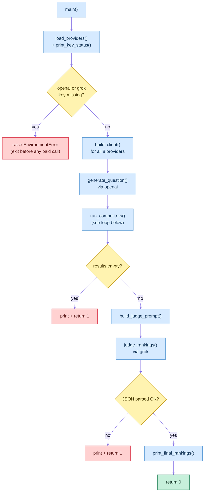
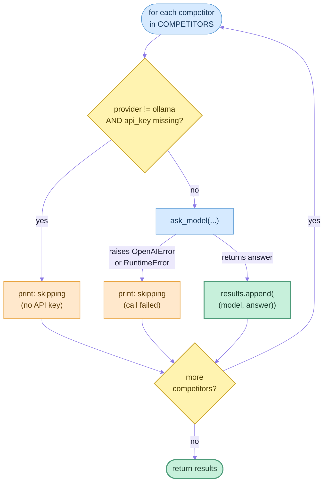

## LLM Arena Reference Implementation

← Part of [[c-1-agent-design-pattern-catalog|Appendix C.1 — Agent Design Pattern Catalog]], backing
that page's **Fan-Out / Parallelization** and **LLM-as-a-Judge** patterns: an arena that generates
one question, fans it out across up to 8 OpenAI-compatible providers (Anthropic, Gemini, DeepSeek,
Groq, OpenRouter, local Ollama models...), then has a fresh judge model (xAI's Grok — never one of
the competitors) rank every answer that came back.

Before the source itself, two diagrams of the two trickiest control-flow paths: `main()`'s
fail-fast/exit-early branches, and the per-competitor error handling inside `run_competitors()` that
lets one failing provider skip instead of aborting the whole run.

### Fail-fast branches



### Failed call skips respective competitor



### llm_arena - LLM arena: cross-provider "battle of the models" with an LLM judge

```py
"""
LLM arena: cross-provider "battle of the models" with an LLM judge.

Generates one challenging, short-answer question, asks it to every configured
model across the OpenAI-compatible providers below (OpenAI, Anthropic, Gemini,
DeepSeek, Groq, OpenRouter, xAI, and a local Ollama daemon), then has a judge
model rank every answer that came back.

OpenAI (question generation, first competitor) and xAI (the judge) are the
only required providers. Every other provider is optional: a missing key, or
a call that fails, just skips that one competitor instead of aborting the run.

Run directly: python labs/llm-arena/llm_arena.py
"""

from competitors import run_competitors
from judge import build_judge_prompt, judge_rankings, print_final_rankings
from providers import build_client, load_providers, print_key_status
from question import generate_question


def main() -> int:
    # Step 1: know what we have to work with before spending anything on API calls.
    providers = {provider.name: provider for provider in load_providers()}
    print_key_status(list(providers.values()))

    # Step 2: fail fast if a hard dependency (the question-asker or the judge) isn't
    # configured -- no point paying for competitor calls if judging can't happen anyway.
    missing_required = [name for name, p in providers.items() if p.required and not p.api_key]
    if missing_required:
        raise EnvironmentError(
            f"Required API key(s) not set: {', '.join(missing_required)}. "
            "Copy .env.example to .env and fill them in."
        )

    # Step 3: build all 8 clients up front -- construction is free, no network call happens here.
    clients = {name: build_client(provider) for name, provider in providers.items()}

    # Step 4: one model writes tonight's question.
    question = generate_question(clients["openai"])
    print(f"\nQuestion:\n{question}")

    # Step 5: everyone else answers it, skipping anyone unavailable along the way.
    results = run_competitors(clients, providers, question)
    if not results:
        print("No competitor produced an answer -- nothing to judge.")
        return 1

    # Step 6: one model (xAI's Grok) ranks every answer that came back.
    judge_prompt = build_judge_prompt(question, results)
    ranks = judge_rankings(clients["grok"], judge_prompt)
    if ranks is None:
        # judge output didn't parse -- bail without pretending we have a ranking
        return 1

    # Step 7: turn the judge's numbering back into competitor names and show it.
    print()
    print_final_rankings(ranks, results)
    return 0


if __name__ == "__main__":
    # exit code: 0 = ranked successfully, 1 = no competitors answered or judge output didn't parse
    raise SystemExit(main())
```

### providers - Provider configuration: which OpenAI-compatible endpoints exist, and how to reach them

```py
"""Provider configuration: which OpenAI-compatible endpoints exist, and how to reach them.

Loads `.env` as a side effect of import -- every other module in this lab is expected to
import `providers` (directly or transitively) before touching an API key from the environment.
"""

import os

import httpx2
from dotenv import load_dotenv
from openai import OpenAI

from models import Provider

load_dotenv(override=True)  # override=True: .env values win over already-exported shell env vars

# Corporate TLS-inspecting proxies (e.g. Zscaler) commonly issue intermediate
# certs whose Basic Constraints extension isn't marked critical, which modern
# OpenSSL rejects outright. Opt in explicitly rather than defaulting insecure.
_ALLOW_INSECURE_TLS = os.getenv("OPENAI_ALLOW_INSECURE_TLS") == "1"


def load_providers() -> list[Provider]:
    # One entry per provider this script can talk to. All 8 clients get built later
    # regardless of whether a key is present -- a provider is only skipped once it's
    # actually about to be used (see run_competitors below), not at setup time.
    return [
        Provider("openai", None, os.getenv("OPENAI_API_KEY"), required=True),
        Provider("anthropic", "https://api.anthropic.com/v1/", os.getenv("ANTHROPIC_API_KEY")),
        Provider("gemini", "https://generativelanguage.googleapis.com/v1beta/openai/", os.getenv("GOOGLE_API_KEY")),
        Provider("deepseek", "https://api.deepseek.com/v1", os.getenv("DEEPSEEK_API_KEY")),
        Provider("groq", "https://api.groq.com/openai/v1", os.getenv("GROQ_API_KEY")),
        Provider("grok", "https://api.x.ai/v1", os.getenv("GROK_API_KEY"), required=True),  # judge
        Provider("openrouter", "https://openrouter.ai/api/v1", os.getenv("OPENROUTER_API_KEY")),
        Provider("ollama", "http://localhost:11434/v1", "ollama"),  # local daemon; key is unused
    ]


def print_key_status(providers: list[Provider]) -> None:
    """Startup diagnostics: which keys actually loaded from .env, without ever printing a full key."""
    for provider in providers:
        if provider.name == "ollama":
            continue  # local daemon, not an API key; reachability is checked at call time
        if provider.api_key:
            # first 8 chars only: enough to sanity-check .env loaded the right key, never enough to leak it
            print(f"{provider.name} API key exists and begins {provider.api_key[:8]}")
        else:
            suffix = "" if provider.required else " (and this is optional)"
            print(f"{provider.name} API key not set{suffix}")


def build_client(provider: Provider) -> OpenAI:
    """Construct an OpenAI() client aimed at this provider. No network call happens here."""
    http_client = httpx2.Client(verify=not _ALLOW_INSECURE_TLS)
    return OpenAI(api_key=provider.api_key, base_url=provider.base_url, http_client=http_client)
```

### question - Step 1 of the arena: one model writes tonight's question

```py
"""Step 1 of the arena: one model writes tonight's question."""

from openai import OpenAI
from openai.types.chat import ChatCompletionMessageParam

from chat import ask_model

QUESTION_MODEL = "gpt-5.4-mini"  # writes tonight's arena question

# Sent verbatim as the one and only message to QUESTION_MODEL.
QUESTION_PROMPT = (
    "Please come up with a challenging, nuanced question with a succinct answer, "
    "that I can ask a number of LLMs to evaluate their intelligence. "
    "Not a mathematical puzzle, but more of a thought-provoking question that requires "
    "intelligent insight. Include in your question that the answer must be short.\n"
    "Answer only with the question, no explanation."
)


def generate_question(client: OpenAI) -> str:
    """Ask QUESTION_MODEL to invent tonight's arena question. Single-turn, no conversation history."""
    messages: list[ChatCompletionMessageParam] = [{"role": "user", "content": QUESTION_PROMPT}]
    return ask_model(client, QUESTION_MODEL, messages)
```

### competitors - Step 2 of the arena: the roster of models being compared, and running them all

```py
"""Step 2 of the arena: the roster of models being compared, and running them all."""

from openai import OpenAI, OpenAIError
from openai.types.chat import ChatCompletionMessageParam

from chat import ask_model
from models import Competitor, Provider

# reasoning_effort (OpenAI-only): none, low, medium, high, or xhigh
# Order here doubles as the print order in run_competitors() and the number-to-name
# lookup order in judge.print_final_rankings() -- competitor 1 below is judge-rank "1", etc.
COMPETITORS = [
    Competitor("openai", "gpt-5.4-nano", reasoning_effort="none"),
    Competitor("anthropic", "claude-sonnet-4-6"),
    Competitor("gemini", "gemini-3.1-flash-lite"),
    Competitor("deepseek", "deepseek-v4-flash"),
    Competitor("groq", "openai/gpt-oss-120b"),
    Competitor("openrouter", "moonshotai/kimi-k2.6"),
    Competitor("ollama", "llama3.2:1b"),
    Competitor("ollama", "gpt-oss:latest"),
    Competitor("ollama", "gemma4:latest"),
]


def run_competitors(
    clients: dict[str, OpenAI], providers: dict[str, Provider], question: str
) -> list[tuple[str, str]]:
    """Ask every competitor the question. A missing key or a failing call skips that competitor."""
    # Built once and reused for every competitor -- they're all being asked the literal same question.
    messages: list[ChatCompletionMessageParam] = [{"role": "user", "content": question}]
    results: list[tuple[str, str]] = []
    for competitor in COMPETITORS:
        # Resolve which Provider backs this competitor -- e.g. the three Ollama
        # competitors above all resolve to the one shared "ollama" Provider.
        provider = providers[competitor.provider]
        if provider.name != "ollama" and not provider.api_key:
            # ollama has no real key requirement (it's a local daemon); every other provider does
            print(f"Skipping {competitor.model} ({provider.name}: no API key configured)")
            continue
        try:
            answer = ask_model(
                clients[competitor.provider],
                competitor.model,
                messages,
                reasoning_effort=competitor.reasoning_effort,
            )
        except (OpenAIError, RuntimeError) as exc:
            # network/auth/rate-limit errors (OpenAIError) and empty replies (RuntimeError,
            # raised by ask_model above) both just knock this one competitor out of the run
            print(f"Skipping {competitor.model} ({provider.name}: {exc})")
            continue
        print(f"\n--- {competitor.model} ---\n{answer}")
        results.append((competitor.model, answer))  # model name doubles as this competitor's label
    return results
```

### judge - Step 3 of the arena: one model ranks every answer that came back

```py
"""Step 3 of the arena: one model ranks every answer that came back."""

import json

from openai import OpenAI
from openai.types.chat import ChatCompletionMessageParam

from chat import ask_model

JUDGE_MODEL = "grok-4.3"  # scores every competitor's answer


def build_judge_prompt(question: str, results: list[tuple[str, str]]) -> str:
    """Assemble the judge's prompt: the question plus every surviving competitor's answer."""
    # 1-indexed competitor numbers here are what the judge is asked to rank by number below --
    # print_final_rankings() later maps those same numbers back to competitor names.
    transcript = "".join(
        f"# Response from competitor {i + 1}\n\n{answer}\n\n" for i, (_, answer) in enumerate(results)
    )
    # Wording here is deliberately strict about "JSON only" -- judge_rankings() does a raw
    # json.loads() on whatever comes back, so a chatty judge reply would fail to parse.
    return f"""You are judging a competition between {len(results)} competitors.
Each model has been given this question:

{question}

Your job is to evaluate each response for clarity and strength of argument, and rank them in order of best to worst.
Respond with JSON, and only JSON, with the following format:
{{"results": ["best competitor number", "second best competitor number", "third best competitor number", ...]}}

Here are the responses from each competitor:

{transcript}

Now respond with the JSON with the ranked order of the competitors, nothing else. Do not include markdown formatting or code blocks."""


def judge_rankings(client: OpenAI, prompt: str) -> list[str] | None:
    """Ask the judge model to rank competitors; returns None if the reply isn't parseable JSON."""
    judge_messages: list[ChatCompletionMessageParam] = [{"role": "user", "content": prompt}]
    raw = ask_model(client, JUDGE_MODEL, judge_messages)
    try:
        # The judge is a free-text model at heart -- treat anything that isn't valid
        # {"results": [...]} JSON as a soft failure here, not an uncaught crash.
        ranks = json.loads(raw)["results"]
    except (json.JSONDecodeError, KeyError, TypeError) as exc:
        print(f"Judge did not return parseable JSON ({exc}); raw output:\n{raw}")
        return None
    return ranks


def print_final_rankings(ranks: list[str], results: list[tuple[str, str]]) -> None:
    """Resolve the judge's 1-indexed competitor numbers (as strings) back to competitor names."""
    competitor_names = [name for name, _ in results]
    for position, rank in enumerate(ranks, start=1):
        try:
            competitor = competitor_names[int(rank) - 1]  # e.g. rank "3" -> competitor_names[2]
        except (ValueError, IndexError):
            print(f"Rank {position}: unresolvable judge entry {rank!r}")
            continue
        print(f"Rank {position}: {competitor}")
```

### chat - Lowest-level building block: send one message to one model, get text back

```py
"""Lowest-level building block: send one message to one model, get text back."""

from openai import OpenAI
from openai.types.chat import ChatCompletionMessageParam


def ask_model(
    client: OpenAI,
    model: str,
    messages: list[ChatCompletionMessageParam],
    *,
    reasoning_effort: str | None = None,
) -> str:
    """Send a single-turn request; raises RuntimeError if the reply has no text."""
    kwargs = {"model": model, "messages": messages}
    if reasoning_effort is not None:
        # not every provider's endpoint accepts this param -- only send it when asked to
        kwargs["reasoning_effort"] = reasoning_effort
    response = client.chat.completions.create(**kwargs)
    content = response.choices[0].message.content
    if content is None:
        # some providers return an empty message instead of raising when something goes wrong upstream
        raise RuntimeError(f"Model {model!r} returned no text content")
    return content
```

### models - Data shapes shared across the arena: providers to call and competitors to run

```py
"""Data shapes shared across the arena: providers to call and competitors to run."""

from dataclasses import dataclass


@dataclass(frozen=True)
class Provider:
    """One OpenAI-compatible endpoint. A `required` provider aborts the run if unconfigured."""

    name: str
    base_url: str | None  # None means "use OpenAI's own default base_url"
    api_key: str | None
    required: bool = False  # True only for openai (question-asker) and grok (judge)


@dataclass(frozen=True)
class Competitor:
    """One model entry in the arena, resolved against a `Provider.name` at call time."""

    provider: str
    model: str
    reasoning_effort: str | None = None  # OpenAI-only param; None means "omit it from the request"
```

## Metadata

|        |                                 |
| ------ | ------------------------------- |
| Author | Amit Singh                      |
| Scope  | agentic-ai-projects-and-mastery |
