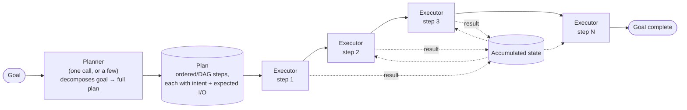

## Planner–Executor Pattern

> Chapter of
> [[ai-architecture-and-system-design/readme#00 — AI Architecture Patterns|AI Architecture Patterns]],
> part of [[ai-architecture-and-system-design/readme|AI Architecture & System Design]].

## What you will understand at the end

- The precise component boundary: a **planner** decomposes a goal into a full plan before any step
  runs; a separate **executor** carries out each step, and does not re-plan on its own when a step
  fails
- Why this is a cost and auditability bet on the environment being stable and observable upfront —
  and the concrete signal that tells you the bet is wrong before you've paid for it
- The failure mode this pattern is named for: a **stale plan**, where a later step is silently
  executed against an assumption an earlier step already invalidated
- How this pattern composes with [[04-orchestrator-worker-pattern|Orchestrator–Worker Pattern]] and
  [[03-supervisor-pattern|Supervisor Pattern]] — where the boundaries blur and where they stay sharp
- A short applicability checklist you can run before committing an agent to this architecture

---

## The mental model

Two components, two jobs, and — this is the part worth holding onto — one of them stops working once
the plan is committed.



Read the diagram for what it does _not_ show: no arrow runs from any executor step back into the
planner box. That absence is the pattern. Once the plan exists, the executor's contract is "carry
out step N using the accumulated state," not "decide whether step N still makes sense given what
step 2 just taught us." Whether that absence is a feature or a landmine is this chapter's real
subject — the answer depends entirely on whether the environment the plan describes is stable enough
to trust ahead of time.

---

## 1. What the pattern actually is

**The planner's job:** look at the goal once (or in a short planning phase — a handful of calls, not
one per action) and produce a complete, ordered decomposition into steps. Each step should carry
enough structure that an executor can act on it without further interpretation of the _goal_ —
typically an intent, the tool or capability it needs, and what inputs it expects to have available
by the time it runs. The planner's output is a durable artifact, not a running process: you can
print it, review it, diff it against a previous run, or hand it to a human before a single step
executes.

**The executor's job:** given one step and the state accumulated from prior steps, carry it out.
"Carry it out" can mean a single tool call, or it can mean a full sub-agent invocation with its own
internal reasoning loop — the pattern doesn't constrain how much intelligence lives inside one step,
only that the executor's scope is bounded to _this_ step. It reports success, failure, or a result;
it does not unilaterally decide to skip step 4 or reorder step 6 ahead of step 5, even if the result
it just produced makes that reordering obviously correct to a human reading the trace.

That asymmetry — the planner reasons about the _shape of the whole task_, the executor reasons about
_how to accomplish exactly one step_ — is the entire value proposition, and it pays off in three
concrete ways:

| Payoff                | Why it's real                                                                                                                                                                                                                                                                                                                          |
| --------------------- | -------------------------------------------------------------------------------------------------------------------------------------------------------------------------------------------------------------------------------------------------------------------------------------------------------------------------------------- |
| **Failure isolation** | A bad executor decision on step 4 is contained to step 4's blast radius. It cannot corrupt the planner's reasoning about steps 1–3 or 5–N, because the executor never touches the plan, only the state one step operates on.                                                                                                           |
| **Cost separation**   | The planner can run on your most expensive, highest-reasoning model — it runs once (or a handful of times if the plan is large enough to chunk). Executors can run on a cheaper, faster model per step, since each one is solving a narrower, more constrained problem than "produce a correct multi-step plan for an ambiguous goal." |
| **Auditability**      | The plan is inspectable _before_ any tool call fires, any file gets written, or any dollar gets spent. A human — or a policy engine — can approve, reject, or edit the plan wholesale, which is a fundamentally easier review surface than approving N independent in-flight decisions one at a time.                                  |

**How this differs from ReAct's interleaved loop.**
[[building-agentic-systems/00-building-single-agent-systems/01-agent-architecture/01-agent-architecture|Agent Architecture]]
already introduced this contrast at the single-agent level: ReAct's thought → action → observation
loop makes the planning decision and the acting decision in the _same_ call, every iteration — there
is no separately inspectable plan artifact, because the plan is implicit in the sequence of thoughts
the model happened to produce. Planner–Executor pulls those two decisions apart into two components
with different lifecycles: the planner runs to completion and stops; the executor tier then runs
however many times the plan has steps. [[03-planning|Planning]] (Part 01 of Agentic AI Engineering)
frames this as the central design axis for agent cognition generally — "when is the plan produced,
all at once or one step at a time" — and this chapter is the architectural, component-boundary
answer to that question when the answer is "all at once."

**Where this chapter's boundary sits against [[07-plan-and-execute|Plan-and-Execute]] (Part 03 of
Agentic AI Engineering).** That chapter treats plan-and-execute as a _reasoning algorithm_ — the
prompting and control-flow mechanics of getting a model to emit a full plan before acting, and how
that compares to ReAct at the level of one agent's reasoning loop. This chapter treats it as an
_architecture pattern_ — the component boundary between the planner and executor as separately
reasoned-about, separately scaled, separately failure-isolated pieces of a system; the applicability
criteria for choosing it over the alternatives in this catalog; and how it composes with
orchestrator-worker and supervisor topologies once the executor tier stops being "one agent's next
tool call" and starts being its own set of agents. If you're deciding what to prompt, read Part 03
of Agentic AI Engineering. If you're deciding what to _build_ — one component or two, one model tier
or two, where the retry and audit boundaries sit — read this one.

---

## 2. When it beats ReAct — and when it doesn't

The single sentence that decides it: **planner–executor wins when the environment's structure is
knowable before you start; ReAct wins when each step's outcome changes what the next step should
even be.**

| Task property                 | Favors Planner–Executor                                                                              | Favors ReAct (interleaved)                                                                         |
| ----------------------------- | ---------------------------------------------------------------------------------------------------- | -------------------------------------------------------------------------------------------------- |
| Environment stability         | Deterministic API, known file set, fixed schema — few surprises between plan time and execution time | Search results of unknown quality, a flaky external system, another agent's unpredictable output   |
| Structural observability      | The full shape of "what needs doing" is derivable from the goal alone, upfront                       | What step 4 should even _be_ depends on what step 2 returns — you can't name step 4 in advance     |
| Cost predictability           | You need to price and approve the whole run before spending a token                                  | Cost is inherently unknown until the run completes — acceptable if the run is cheap or exploratory |
| Auditability / approval gates | A human or policy engine needs to review the full plan before any action fires                       | No single artifact to review; only a trace, after the fact                                         |
| Parallelism                   | Independent steps can fan out immediately once the plan is a DAG, not a strict sequence              | Interleaving is inherently sequential — each step waits on the last one's observation              |
| Failure recovery cost         | A wrong upfront assumption can invalidate multiple downstream steps at once (Section 3)              | A bad step is caught within one hop, before it propagates further than that step                   |
| Latency shape                 | One planning pass upfront, then execution — the first _action_ is delayed by planning time           | The first action can fire immediately; total latency compounds per-step across the whole run       |

Two worked contrasts, since the table alone underclaims how sharp the line is in practice:

- **A known-shape migration** — "rename this config key across every service that references it" —
  is planner–executor territory. The full list of affected files is knowable upfront by grepping the
  codebase once; nothing about file 40's rename depends on what happened to file 12. Plan it, review
  it, dispatch it.
- **"Why did checkout p99 spike at 14:02 UTC"** is ReAct (or the hierarchical middle ground,
  Section 4) territory precisely because you cannot write step 3 correctly until you know what step
  2 found. A planner that commits upfront to "check deploys, then check infra metrics, then pull the
  specific slow-query log for the window infra metrics identified" has silently assumed the _third_
  step's target before the second step has run — which only works if you got lucky, not because the
  architecture earned it.

The failure mode of misapplying this pattern in the wrong direction is not symmetric. Using ReAct
where planner–executor would have worked mostly costs you extra reasoning-pass latency and token
spend — wasteful, not dangerous. Using planner–executor where the task actually needed interleaved
discovery produces a plan built on assumptions the environment will falsify partway through, which
is Section 3's subject and the more expensive mistake of the two.

---

## 3. The failure mode this pattern is named for: a stale plan

Because the executor's contract is "carry out step N," not "revalidate step N against what we've
learned since planning," nothing in the pure architecture catches a plan whose assumptions have
already been falsified by the time execution reaches the step built on them.

**Worked example — "migrate this codebase's HTTP client from library A v1 to v2."** A planner, given
this goal and a grep of the codebase, produces a clean six-step plan:

```txt
1. List every file importing library A.
2. Read each file to confirm the import is a direct usage (not re-exported or wrapped).
3. Read the v1→v2 migration guide; confirm the API surface change is a straightforward
   signature rename (no behavioral change).
4. For each file, rewrite the import statement and call sites to the v2 signature.
5. Run the test suite.
6. Open a PR summarizing the change.
```

Step 3 is where reality diverges from the plan's premise, but the plan has no mechanism for that
divergence to matter yet — it just keeps going. Say step 3's actual finding, on closer reading, is:
v2 changed the retry-on-timeout default from `true` to `false`, which is a _behavioral_ change, not
just a signature rename. Step 1 already assumed "this is a mechanical find-and-replace across every
importing file" — that assumption is what made steps 4 through 6 look safe to write as pure text
substitution in the first place. Step 3 just proved that assumption wrong, but step 3's _contract_
is "read the migration guide and report," not "halt the plan and force a reconsideration of step 4."
The executor faithfully proceeds to step 4, and the mechanical rewrite ships a change that silently
drops retry behavior in every file that depended on the v1 default — code that compiles, tests that
may not catch it if the test suite doesn't specifically exercise timeout-retry behavior, and a
regression that surfaces in production as a new class of unretried timeout errors, weeks after the
PR merged.

**Naming the mechanism precisely:** a plan step is not just an instruction, it is an instruction
plus an _implicit assumption set_ baked in at planning time — here, "this is a pure rename with no
behavioral delta." Nothing about the planner–executor architecture, as bare as described in Section
1, ever revisits that assumption once the plan is committed. The bug isn't that step 3 was wrong —
step 3 did its job and surfaced the real finding. The bug is that the architecture gave that finding
nowhere to go except into a report that steps 4 through 6 never read.

**Two structural fixes**, not prompt-level pleading:

1. **Explicit per-step preconditions the executor checks before acting**, not just the action
   itself. Step 4's real contract should be "rewrite this call site _if the API change for this file
   is a pure rename_; otherwise halt and report the mismatch" — a guard, in the vocabulary
   [[08-agent-state-machines|Agent State Machines]] (Part 01 of Agentic AI Engineering) uses for
   exactly this idea: a condition that must hold before a transition fires, enforced structurally
   rather than left to the model's discretion to remember.
2. **A replan path, not just a fail-fast path, when a precondition fails.** Halting step 4 and
   surfacing "step 3 found a behavioral change the plan didn't account for" to a human is _better_
   than silently proceeding, but it still throws away five steps' worth of planning investment for a
   problem that's local to how step 4 handles this one finding.
   [[production-agent-systems/02-reliability-security-and-governance/11-failure-recovery/11-failure-recovery|Failure Recovery]]
   (Part 02 of Production Agent Systems) formalizes exactly this as a third option beyond
   retry-or-fail-fast: return the failure — or here, the invalidated assumption — to the planner as
   new context, and get back a _revised_ step or sub-plan (e.g., "add an explicit retry-preserving
   wrapper for files using the v1 default"), rather than either blindly continuing or discarding the
   whole plan.

Neither fix is free. Preconditions require the planner to have anticipated _which_ assumptions are
worth checking — you cannot guard against a divergence you didn't think to name. A replan path
requires the planner to remain callable mid-run, which is architecturally a small step toward the
hierarchical composition Section 4 describes, not a pure plan-and-execute system anymore. That's the
honest tradeoff: the more failure-resistant you make this pattern, the more it starts to resemble
the patterns it was chosen instead of.

---

## 4. How it composes with the rest of the catalog

Planner–Executor is rarely the _only_ pattern in a real system — it's more often one tier of a
larger architecture, and knowing exactly where its boundary sits against its neighbors is what keeps
a design legible instead of becoming an unnamed hybrid nobody can reason about.

**With ReAct — nesting, not competing.** The sharp line in Section 2's table gets softer once you
allow the executor for a single step to be its own agent with its own internal loop. A planner
commits to the _outer_ shape upfront (steps 1 through N, fixed), while each executor internally runs
a ReAct loop to actually accomplish its one step (interleaved, locally adaptive). This is exactly
the "practical middle ground" [[03-planning|Planning]] (Part 01 of Agentic AI Engineering) names as
hierarchical planning: upfront at the top level, interleaved within each sub-plan, which bounds the
blast radius of "the upfront plan was wrong" to whichever single step's executor has to improvise,
rather than invalidating the whole plan the way Section 3's stale-plan example did.
[[11-hierarchical-planning|Hierarchical Planning]] (Part 03 of Agentic AI Engineering) is the deeper
algorithmic treatment of this nesting.

**With Orchestrator–Worker — the line is _static versus dynamic_ decomposition, not fan-out
itself.** [[04-orchestrator-worker-pattern|Orchestrator–Worker Pattern]] and Planner–Executor look
alike the moment a plan's steps are independent enough to dispatch in parallel — both end up with
one coordinating component and several execution units doing the actual work.
[[04-task-decomposition|Task Decomposition]] (Part 01 of Building & Evaluating Agents) draws the
distinction precisely: _static_ decomposition commits to the full subtask graph before any worker
runs — that's this chapter's planner, producing a DAG instead of a strict sequence. _Dynamic_
decomposition generates the next subtask from the previous one's result, with no complete graph
existing until after the run finishes — that's the orchestrator half of Orchestrator–Worker. Read
literally: a planner–executor system whose plan happens to be a parallel DAG _is_ one specific,
static-decomposition instance of orchestrator-worker: The pattern you're actually looking at is
named by _when the graph was decided_, not by whether steps happen to run in parallel.

**With Supervisor — the line is _reconciling conflicting views_ versus _dividing non-overlapping
work_.** [[03-supervisor-pattern|Supervisor Pattern]] and
[[09-supervisor-architectures|Supervisor Architectures]] (Part 01 of Building & Evaluating Agents)
exist because several specialists investigate the _same_ question from different angles and can
legitimately disagree — a supervisor's job is delegate, aggregate, and arbitrate that disagreement.
A planner–executor's steps are not answering the same question from different angles; they're
disjoint pieces of one procedure, and a well-formed plan shouldn't produce two steps whose outputs
contradict each other, because they were never investigating the same thing. If you find yourself
needing an arbitration step between two of your plan's outputs — "step 4 says X, step 6 says not-X,
which one wins" — that's a signal the task actually needed peer specialists reconciled by a
supervisor, not sequential steps executed in order. Don't bolt arbitration logic onto an executor;
recognize the pattern has changed and reach for the right one.

**With Workflow Engines — the plan _is_ the DAG definition.** A planner–executor plan, once it's a
DAG of typed steps with dependency edges, is structurally identical to what a durable execution
engine — Temporal, AWS Step Functions, LangGraph's `StateGraph` — is built to run.
[[06-workflow-engines|Workflow Engines]] (Part 00 of Production Agent Systems) covers the
infrastructure that turns "resume from the last good step after a crash" from something you
hand-roll into a platform primitive; the checkpoint discipline that makes Section 3's replan path
affordable rather than a full-plan redo is the same partial-completion checkpointing
[[production-agent-systems/02-reliability-security-and-governance/11-failure-recovery/11-failure-recovery|Failure Recovery]]
covers in depth. Planner–Executor is the _reasoning_ pattern; a workflow engine is one substrate you
can run it on, not a requirement of the pattern itself — plenty of planner–executor systems run on
nothing more durable than an in-memory loop, which is fine until Section 3's failure mode meets a
process crash on the same bad day.

---

## 5. Applicability checklist

Run these before committing an agent's architecture to planner–executor rather than defaulting to
ReAct:

- **Can you write the full list of steps right now**, using only information available before
  execution starts — not information you expect a step to surface?
- **Would a plan reviewed before execution actually catch a wrong plan?** If a domain expert reading
  the plan couldn't tell a correct one from a subtly wrong one without watching it run, the
  auditability payoff (Section 1) isn't real for this task.
- **Are most steps independent, or does step N+1 need step N's actual output to even be specified?**
  If you can't name step 4 until step 2 returns, you don't have a plan — you have a ReAct loop
  wearing a plan's clothing.
- **Can you afford a wrong upfront assumption, or do you need it caught within one step's blast
  radius?** Section 3's stale-plan failure mode is the cost of being wrong; know that cost before
  you accept it.
- **Do you have — or will you build — a replan path**, or is any deviation from the plan going to be
  treated as a hard failure? A planner–executor system with no replan path is betting the entire run
  on the plan being right, not just mostly right.
- **Does an individual step need its own reasoning loop**, or is it a single tool call? If steps
  need internal adaptivity, you're building the hierarchical composition from Section 4, not pure
  plan-and-execute — which is a legitimate design, as long as you name it as such rather than
  discovering it by accident mid-incident.

If most of these point toward "no" or "it depends on what happens mid-run," the honest answer is
ReAct, not a planner–executor system with an apologetic amount of replanning bolted on.

---

## Concept check

| Question                                                                       | Answer hint                                                                                                                                                                                                |
| ------------------------------------------------------------------------------ | ---------------------------------------------------------------------------------------------------------------------------------------------------------------------------------------------------------- |
| What's the one thing the executor never does in the pure form of this pattern? | Re-plan — it carries out the step it was given and reports the result; it doesn't decide to skip, reorder, or revise steps on its own                                                                      |
| What three payoffs does separating planner and executor buy you?               | Failure isolation (a bad step doesn't corrupt the plan), cost separation (expensive planner model, cheap executor model), auditability (the plan is reviewable before any action fires)                    |
| What's the single sentence that decides planner–executor vs. ReAct?            | Planner–executor wins when the environment's structure is knowable upfront; ReAct wins when each step's outcome changes what the next step should even be                                                  |
| What is a "stale plan," precisely?                                             | A later step executed against an assumption an earlier step already proved false — because nothing in the bare architecture revisits a step's implicit assumptions once the plan is committed              |
| What are the two structural fixes for a stale plan, and why isn't either free? | Explicit per-step preconditions (require the planner to have anticipated what to guard) and a replan path (requires the planner to stay callable mid-run, pulling the system toward a hierarchical design) |
| How do you tell a planner–executor DAG apart from Orchestrator–Worker?         | By when the subtask graph was decided — upfront and fixed (planner–executor, static decomposition) versus generated incrementally from each result (orchestrator-worker, dynamic decomposition)            |
| How do you tell when a "plan" actually needed a Supervisor instead?            | If two steps' outputs need arbitration because they investigated the same question from different angles, that's peer specialists needing reconciliation — not sequential, non-overlapping steps           |

---

## Vocabulary glossary

| Term                     | Definition                                                                                                                                                                             |
| ------------------------ | -------------------------------------------------------------------------------------------------------------------------------------------------------------------------------------- |
| Planner                  | The component that decomposes a goal into a full plan before any step executes — a durable, inspectable artifact, not a running process                                                |
| Executor                 | The component that carries out one plan step given the accumulated state; reports success, failure, or a result, but does not re-plan                                                  |
| Plan                     | The ordered (or DAG) list of typed steps the planner produces — each step carrying an intent, a tool/capability binding, and expected inputs/outputs                                   |
| Stale plan               | A step executed against an assumption an earlier step already invalidated, because the architecture has no mechanism to revisit committed steps                                        |
| Precondition / guard     | A condition an executor checks before acting on a step, so a divergence between the plan's assumption and reality halts the step instead of silently proceeding                        |
| Replan                   | Returning an invalidated assumption or a failed step to the planner as new context, producing a revised step or sub-plan instead of blindly continuing or discarding the whole plan    |
| Static decomposition     | The full subtask graph is committed before any execution starts — the defining property of this pattern's plan                                                                         |
| Dynamic decomposition    | The subtask graph is generated incrementally from each step's result — the defining property of Orchestrator–Worker instead                                                            |
| Hierarchical composition | Planner–executor at the outer level, with each step's executor running its own interleaved (ReAct) loop internally — bounds the blast radius of a wrong upfront assumption to one step |

## Metadata

|        |                                   |
| ------ | --------------------------------- |
| Author | Amit Singh                        |
| Scope  | ai-architecture-and-system-design |
