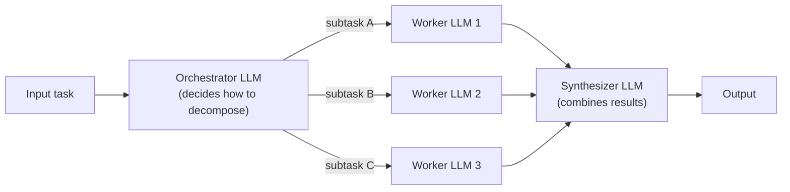

## Orchestrator–Worker Pattern

> Chapter of
> [[ai-architecture-and-system-design/readme#00 — AI Architecture Patterns|AI Architecture Patterns]],
> part of [[ai-architecture-and-system-design/readme|AI Architecture & System Design]].

## What you will understand at the end

- The orchestrator-worker pattern stated precisely enough to test against: an orchestrator LLM
  decomposes a task into subtasks **at runtime**, worker LLMs execute them, and a synthesizer LLM
  combines the results — and why every one of those three roles is an LLM call, not code
- The single structural fact that separates this pattern from
  [[production-agent-systems/03-performance-and-cost-engineering/02-parallel-execution/02-parallel-execution|Parallel Execution]]
  even though their diagrams look almost identical: whether the decompose/aggregate steps are
  decided by a model or fixed by code before the run starts
- Why this is still a bounded, testable **workflow** and not an open-ended agent, despite an LLM
  steering the decomposition
- Worker failure isolation and partial-result aggregation — what the synthesizer can and cannot
  paper over when one worker comes back wrong, empty, or not at all
- When the extra planning and synthesis calls this pattern adds are worth paying for, and when a
  fixed
  [[production-agent-systems/03-performance-and-cost-engineering/02-parallel-execution/02-parallel-execution|Parallel Execution]]
  split or a [[03-supervisor-pattern|Supervisor]] would do the same job for less

---

## The mental model

An orchestrator receives a task it cannot fully pre-plan and asks an LLM to figure out how to break
it apart. That decomposition — how many subtasks, what each one covers — is not knowable in advance
the way a fixed pipeline's steps are; it depends on the specific input. Worker LLMs then execute the
subtasks the orchestrator named, and a synthesizer LLM reconciles their outputs into one result.

Every box between input and output here is an LLM call, including the orchestrator and the
synthesizer. That is the entire distinction from the sibling pattern next door: in
[[production-agent-systems/03-performance-and-cost-engineering/02-parallel-execution/02-parallel-execution|Parallel Execution]]
the equivalent split/aggregate steps are ordinary code, because the fan-out shape is known before
the run starts. Here, "an LLM decides" means the orchestrator is prompted with the larger problem
and asked to describe how to break it into smaller pieces — your code then parses that description
and dispatches the workers it names. Two diagrams that look identical at a glance hide a completely
different cost and testability profile underneath.

This is still a **workflow**, not an open-ended agent, even though an LLM is steering it. The
orchestrator's decisions run inside a predefined code path — decompose, dispatch, synthesize — so
the overall shape is bounded and testable even though the exact number and content of subtasks vary
per run. See
[[agentic-ai-engineering/00-introduction-to-agentic-ai/02-agent-vs-workflow-vs-automation/02-agent-vs-workflow-vs-automation|Agent vs Workflow vs Automation]]
for the axis this distinction sits on: the sequence of steps here is decided at runtime, but by a
fixed number of predefined roles (orchestrator, worker, synthesizer), never by an LLM that can also
decide to add a fourth role or loop back on itself — that open-endedness is what would make it an
agent instead.

---

## 1. Orchestrator-workers vs. Parallel Execution — the distinction that matters most

The two patterns are the ones most often confused, because the shape of the diagram is nearly
identical: something fans a task out to several LLM calls, then something combines the results. What
differs is _what_ does the fanning out and combining.

| Axis                             | Orchestrator-Workers                                                                              | [[production-agent-systems/03-performance-and-cost-engineering/02-parallel-execution/02-parallel-execution\|Parallel Execution]] |
| -------------------------------- | ------------------------------------------------------------------------------------------------- | -------------------------------------------------------------------------------------------------------------------------------- |
| Who decides the decomposition    | An orchestrator **LLM call**, at runtime                                                          | **Code**, written in advance                                                                                                     |
| Is the subtask count known ahead | No — genuinely input-dependent                                                                    | Yes — fixed by the code path                                                                                                     |
| Who combines the results         | A synthesizer **LLM call**                                                                        | **Code** (aggregation logic, majority vote)                                                                                      |
| Cost profile                     | Orchestrator call + N worker calls + synthesizer call                                             | N worker calls only — no planning or synthesis LLM overhead                                                                      |
| Testability                      | You validate a _policy_ for decomposing, not one fixed decomposition                              | Every subtask and the merge logic can be unit-tested directly                                                                    |
| Fits when                        | The right split is genuinely input-dependent (one request touches two files, another touches ten) | The set of subtasks is knowable ahead of time for every input the system will see                                                |

The practical tell in a design review: ask whether the split and combine steps could be replaced by
a plain function without losing anything. If yes, the system is (or should be) Parallel Execution —
the LLM calls doing the actual decomposition and synthesis are pure overhead being paid for no
benefit. If no — if the number and shape of subtasks is something only the specific input can tell
you — the orchestrator's planning call is buying something a fixed split cannot.

## 2. Orchestrator-workers vs. Supervisor

The other pattern this one gets folded into casually is [[03-supervisor-pattern|Supervisor]]. Both
dispatch work to more than one downstream LLM and reconcile the results, and both are legitimate
answers to "how do I get several specialized calls to cooperate on one task." They differ in what
the dispatch decision is actually deciding:

| Axis                        | Orchestrator-Workers                                                                                                     | Supervisor                                                                                      |
| --------------------------- | ------------------------------------------------------------------------------------------------------------------------ | ----------------------------------------------------------------------------------------------- |
| What the fan-out step picks | **How many pieces to split the task into, and what each piece covers** — subtasks of one task                            | **Which specialists** (each with a distinct, pre-existing skill) should look at the same task   |
| Worker/specialist identity  | Interchangeable — any worker instance could run any subtask; the orchestrator invents the subtask, not the worker's role | Fixed and named in advance — a metrics specialist is not interchangeable with a logs specialist |
| Synthesis is combining      | Disjoint pieces of one answer into a whole                                                                               | Possibly conflicting opinions from several experts into one verdict                             |

A useful shorthand: orchestrator-workers decomposes a task **horizontally** (this piece, that piece,
another piece, all contributing to one whole); a supervisor consults specialists **vertically**
(each one bringing a different kind of expertise to the same question). A coding orchestrator
splitting "add this feature" into "edit file A," "edit file B," "update the tests" is horizontal
decomposition. A supervisor investigating "why did checkout latency spike" by consulting a metrics
agent, a logs agent, and a traces agent at once is vertical consultation — the three specialists are
not interchangeable pieces of the same task, they are different lenses on the same question.

---

## 3. When to use it

- The subtasks genuinely cannot be enumerated ahead of time — they depend on what the specific input
  requires, not just on which branch of a fixed set the input falls into
- Different inputs of the same general task type need genuinely different decompositions (one
  request touches two files, another touches ten; one query needs three sources, another needs none)
- The task benefits from centralized planning before parallel execution, rather than a
  one-size-fits-all fixed split — and that planning step is cheap relative to the work it's
  coordinating

## Examples

Anthropic's own post names two concrete shapes this fits in practice, cited here rather than
independently verified against any single vendor's current architecture:

- **Coding products that make complex changes across multiple files** — the orchestrator determines
  which files need changes and what the change in each should be; worker LLMs make the actual edits
  to each file, and a synthesizer (or the orchestrator itself, on a second pass) reconciles them
  into one coherent change set.
- **Search tasks gathering and analyzing information from multiple sources** — the orchestrator
  decides which sources or sub-questions are relevant for a given query, dispatches a worker per
  source, and a synthesizer reconciles what each one found into a single answer.

## Benefits

- Flexibility for tasks where the right decomposition is genuinely input-dependent, unlike
  [[production-agent-systems/03-performance-and-cost-engineering/02-parallel-execution/02-parallel-execution|Parallel Execution]]'s
  fixed, known-in-advance split
- Centralized planning keeps individual worker prompts narrow and specialized — the same
  separation-of-concerns benefit [[05-router-pattern|Router Pattern]] gets from dispatching to a
  narrow specialist instead of one generalist prompt
- Still bounded by a predefined code path (decompose → dispatch → synthesize), so it stays testable
  as a workflow rather than becoming fully open-ended

---

## 4. Failure modes specific to this pattern

**Worker failure is not uniform, and the synthesizer's ability to paper over it depends entirely on
which kind occurred.** Three distinct worker failure shapes need three different handling
strategies:

| Failure shape                                      | What the synthesizer sees                        | What it can do about it                                                                                                                                                |
| -------------------------------------------------- | ------------------------------------------------ | ---------------------------------------------------------------------------------------------------------------------------------------------------------------------- |
| A worker returns a wrong-but-plausible answer      | Nothing distinguishes it from a correct one      | Nothing, structurally — this is the dangerous case; the synthesizer has no signal that anything is wrong                                                               |
| A worker returns an explicit error or empty result | A clear gap in the inputs it's synthesizing from | Can flag the gap, retry that one subtask, or proceed with a caveat — but only if the orchestrator's dispatch code surfaces the failure instead of silently dropping it |
| A worker times out or never returns                | Nothing at all, unless a timeout is enforced     | Requires the dispatch layer to enforce a bound and treat "no response" as its own failure signal, not block indefinitely                                               |

The pattern's aggregation step (the synthesizer) is only as good as the failure information it's
given. A dispatch layer that swallows worker exceptions and passes the synthesizer only the workers
that succeeded — silently, with no record that a worker failed at all — turns worker failure into
silent partial-result aggregation: the synthesizer confidently produces a complete-looking answer
from an incomplete set of inputs, and nothing downstream can tell the difference between "three
workers covered everything" and "three workers ran, a fourth silently failed, and nobody found out."
The fix is structural, not a smarter synthesizer prompt: the dispatch code must pass worker failures
through to the synthesizer as explicit signals (a `status: failed` entry, not an absent one), so the
synthesizer's own prompt can be written to treat missing coverage as a gap to flag rather than a
piece that was never part of the task.

**A poor orchestrator plan propagates downstream to every worker before the synthesizer ever runs.**
Wrong subtasks, missed subtasks, or redundant subtasks are all committed at the first LLM call in
the chain, and nothing downstream — not the workers, not the synthesizer — has visibility into the
original task to notice the plan itself was wrong. This is why the orchestrator's decomposition is
usually the highest-value place to add human review or automated validation for a high-stakes
deployment of this pattern: catching a bad plan before dispatch is far cheaper than catching it
after three workers have already run against it.

**This pattern is strictly more expensive than Parallel Execution for the same task** — there's an
extra planning LLM call (orchestrator) and an extra combining LLM call (synthesizer) on top of every
worker call. Reaching for orchestrator-workers when the subtasks were actually knowable in advance
pays that overhead for zero benefit; Section 1's test (could the split/combine steps be plain code?)
is the check that catches this before it ships.

---

## Concept check

| Question                                                                                                                             | Answer hint                                                                                                                                                                                     |
| ------------------------------------------------------------------------------------------------------------------------------------ | ----------------------------------------------------------------------------------------------------------------------------------------------------------------------------------------------- |
| What is the one structural fact that separates orchestrator-workers from Parallel Execution?                                         | Whether the decompose/aggregate steps are LLM calls (orchestrator-workers) or fixed code (Parallel Execution) — not how the diagram looks                                                       |
| Why is orchestrator-workers still a workflow and not an agent, even though an LLM is deciding the decomposition?                     | The roles (orchestrator, worker, synthesizer) and the code path between them are fixed in advance; only the _content_ of the decomposition varies per run, not the shape itself                 |
| A worker silently times out and the dispatch code just omits it from the synthesizer's input. What's the failure mode this produces? | Silent partial-result aggregation — the synthesizer produces a confident, complete-looking answer from incomplete inputs, with no signal anything was missing                                   |
| How does orchestrator-workers differ from a Supervisor dispatching to specialists?                                                   | Orchestrator-workers splits one task into interchangeable pieces (horizontal decomposition); a supervisor consults distinct, named specialists with different expertise (vertical consultation) |
| What's the concrete test for whether a system should be Parallel Execution instead of orchestrator-workers?                          | Could the split and combine steps be replaced by a plain function without losing anything? If yes, the orchestrator/synthesizer LLM calls are pure overhead                                     |

---

## Vocabulary glossary

| Term                              | Definition                                                                                                                                        |
| --------------------------------- | ------------------------------------------------------------------------------------------------------------------------------------------------- |
| Orchestrator                      | The LLM call that decomposes a task into subtasks at runtime, deciding how many there are and what each covers                                    |
| Worker                            | An LLM call that executes one subtask the orchestrator named; interchangeable with any other worker instance                                      |
| Synthesizer                       | The LLM call that combines worker outputs into one final result                                                                                   |
| Horizontal decomposition          | Splitting one task into disjoint pieces of the same whole (orchestrator-workers), as opposed to consulting distinct specialists (supervisor)      |
| Silent partial-result aggregation | A worker failure that the dispatch layer drops instead of surfacing, so the synthesizer produces a complete-looking answer from incomplete inputs |

## Metadata

|        |                                   |
| ------ | --------------------------------- |
| Author | Amit Singh                        |
| Scope  | ai-architecture-and-system-design |
