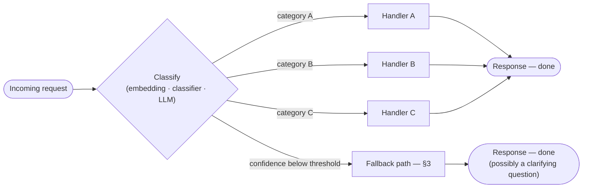
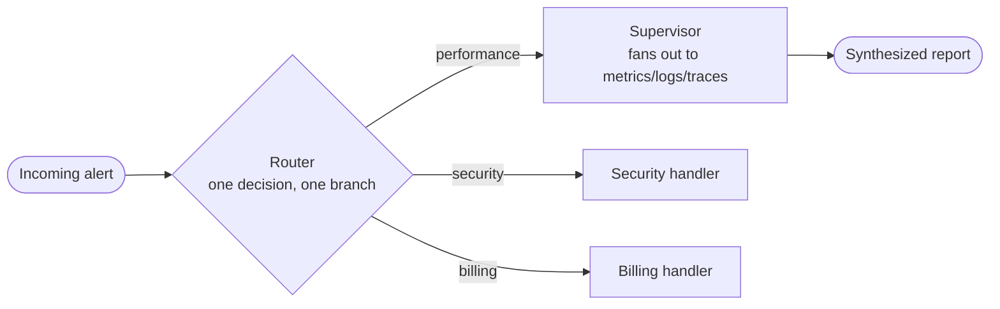

## Router Pattern

> Chapter of
> [[ai-architecture-and-system-design/readme#00 — AI Architecture Patterns|AI Architecture Patterns]],
> part of [[ai-architecture-and-system-design/readme|AI Architecture & System Design]].

## What you will understand at the end

- The router pattern stated precisely enough to test against: classify an incoming request or task,
  dispatch it to exactly one specialized handler, tool, or sub-agent, and stop — no fan-out, no
  aggregation, no synthesis step
- The three real ways to build the classification step — embedding similarity, a small trained
  classifier, an LLM call with structured output — and the setup-cost/per-request-cost/maintenance
  tradeoffs that decide between them
- Why "confidence" means a different thing depending on which mechanism produced it, and the three
  legitimate fallback moves when it's low: escalate, ask for clarification, or fall back to a
  generalist default
- The one structural fact that separates a router from a supervisor — a router's dispatch decision
  is terminal and mutually exclusive by construction; a supervisor's is neither — and how the two
  patterns compose cleanly once you stop treating them as competitors
- Where this exact pattern already showed up earlier in the book at a narrower scope (tool selection
  within one agent) and a wider one (agent selection across a mesh), and why recognizing it as one
  pattern at three altitudes is worth more than memorizing three separate mechanisms

---

## The mental model

A router is a classification step wired directly to a dispatch table. One request comes in, one
classifier decides which of N registered handlers owns it, that handler runs, its output is the
response. Nothing loops back through the router, nothing waits on a second opinion, and nothing
downstream of the dispatch decision knows or cares that a router made it.

Read the diagram for what's _absent_, not just what's present. There is no arrow feeding two
handlers' outputs back into a shared context. There is no "resolve conflicting conclusions" box.
There is no loop that lets the router reconsider once a handler starts working. That absence isn't a
missing feature — it's the entire architectural bet the pattern makes: routing is cheap and fast
_because_ it refuses to do anything except decide which one handler owns this request. The moment a
system needs to dispatch the same request to more than one handler and reconcile their outputs, it
has left the router pattern and become the supervisor pattern — Section 4 draws that line precisely,
because the two get confused constantly in casual usage of "the agent routes to X."

This chapter formalizes a pattern the book has already used twice without stopping to name its full
shape:
[[agentic-ai-engineering/04-tools-and-environment-interaction/11-tool-selection-strategies/11-tool-selection-strategies|Tool Selection Strategies]]
(Part 04 of Agentic AI Engineering) applies it at tool-catalog granularity — a router LLM call picks
a category of tools before a specialist call selects the specific one — and
[[building-agentic-systems/01-multi-agent-systems/09-supervisor-architectures/09-supervisor-architectures|Supervisor Architectures]]
(Part 01 of Building & Evaluating Agents) contrasts a supervisor's fan-out delegation against it
directly. Both chapters point back here for the general mechanism. This is that mechanism.

Anthropic's 2024 engineering post
["Building Effective Agents"](https://www.anthropic.com/engineering/building-effective-agents) names
this pattern — under the plainer name "routing" — as the second of five workflow patterns,
explicitly presented as indicative shapes to recognize rather than a catalog to pick one from. The
other four have chapters of their own in this book:
[[agentic-ai-engineering/00-introduction-to-agentic-ai/02-agent-vs-workflow-vs-automation/02-agent-vs-workflow-vs-automation|prompt chaining]]
sits one step down in complexity (a fixed sequence rather than a branch point);
[[production-agent-systems/03-performance-and-cost-engineering/02-parallel-execution/02-parallel-execution|Parallel Execution]]
and
[[ai-architecture-and-system-design/00-ai-architecture-patterns/04-orchestrator-worker-pattern/04-orchestrator-worker-pattern|Orchestrator-Workers]]
sit one and two steps up; and
[[agentic-ai-engineering/03-planning-and-reasoning-algorithms/10-debate-and-critic-agents/10-debate-and-critic-agents|Debate & Critic Agents]]
covers the fifth, evaluator-optimizer (commonly called LLM-as-judge).

---

## 1. What "router" means here — and what it doesn't

Three things get called "routing" in agentic systems, and conflating them is a real source of design
mistakes, not just vocabulary sloppiness:

|                            | **Router pattern** (this chapter)                                    | **Model selection & routing** (Part 01 of AI & LLM Foundations)                    | **Hierarchical tool routing** (Part 04 of Agentic AI Engineering)    |
| -------------------------- | -------------------------------------------------------------------- | ---------------------------------------------------------------------------------- | -------------------------------------------------------------------- |
| Classifies on              | intent / task domain                                                 | task complexity, latency budget, cost ceiling                                      | which sub-catalog of tools is relevant                               |
| Dispatches to              | a specialized handler, tool, or sub-agent — a different _capability_ | a model tier or provider — the _same_ capability at a different cost/quality point | a narrower tool shortlist, not a final handler                       |
| Downstream work differs by | logic, tools, system prompt                                          | nothing except which model executes the same logic                                 | nothing — it's a narrowing pass, not a terminal decision             |
| Terminal?                  | Yes — the chosen handler produces the response                       | Yes — the chosen model produces the response                                       | No — a second, specialist LLM call still has to pick the actual tool |

[[ai-foundations/01-language-models-in-practice/07-model-selection-and-routing/07-model-selection-and-routing|Model Selection & Routing]]
answers "how good a model do we need for this," which is orthogonal to "which capability handles
this" — you can (and in production usually do) run both: a request router picks the handler, and
that handler independently runs its own model-tier router to pick cheap-vs-expensive for its own
call. Treating them as the same decision is how teams end up with one bloated router prompt trying
to reason about domain _and_ cost simultaneously — the same instruction-budget dilution
[[building-agentic-systems/01-multi-agent-systems/02-collaboration-models/02-collaboration-models|Collaboration Models]]
diagnosed for a monolithic agent holding three tool vocabularies at once, recurring here at the
routing layer.

Hierarchical tool routing is the closer relative — it's this pattern's mechanism, reused — but it's
not terminal. Its router call narrows a tool catalog down to a domain's worth of candidates; a
_second_ LLM call still has to pick the specific tool from that shortlist. The router pattern proper
is what that first pass would look like if the destination were a full handler instead of a narrower
candidate list. This chapter is the general form; that chapter's Section 3 is the worked instance at
tool-catalog granularity, and it's worth reading in either order.

---

## 2. Intent classification approaches

Three real ways to build the classify step. All three answer the same question — "which registered
handler does this request belong to" — with different cost, latency, and maintenance profiles.

### a) Embedding similarity

Embed a canonical description of each route (or a centroid of several example utterances that map to
it), embed the incoming request with the same model, and dispatch to the nearest route by cosine
similarity — usually with a minimum-similarity floor below which nothing is close enough to trust.
This is exactly the retrieval mechanism
[[agentic-ai-engineering/04-tools-and-environment-interaction/11-tool-selection-strategies/11-tool-selection-strategies|Tool Selection Strategies]]
built for narrowing a tool catalog — the same
[[agentic-ai-engineering/05-retrieval-and-knowledge-systems/02-embeddings/02-embeddings|embedding]]
and vector index infrastructure applies — with one difference: a router doesn't retrieve a top-K
shortlist, it resolves all the way down to K=1, because the destination is a terminal handler, not
another classification pass.

Zero LLM calls at dispatch time — purely a vector operation, so it's the cheapest and fastest of the
three per request. Its dominant failure mode is the same vocabulary mismatch that chapter names for
tool retrieval: a request phrased in words that don't share the embedding neighborhood of any
route's example utterances doesn't land near the right category, and there's no recovery once the
wrong handler is picked — Section 6 covers why that failure is structurally silent.

### b) A small classifier model

A model trained specifically for this N-way classification — a fine-tuned transformer, or something
lighter (logistic regression or gradient-boosted trees over embedding or engineered features) —
learned from a labeled set of historical `request → category` pairs. This is the only one of the
three that needs a training set before it can run at all, and the only one that needs a retraining
cycle when the category taxonomy changes or the request distribution drifts.

The payoff for that upfront cost is inference-time cost: once trained, a classification is a few
milliseconds of compute with no LLM token spend, which matters at genuinely high volume — a routing
decision made thousands of times a second is a place where "no LLM call" is a real infrastructure
win, not a micro-optimization. The honest engineering framing: past a certain volume and taxonomy
stability, this stops being an "AI routing" problem and becomes a traditional ML classification
problem wearing agentic-AI clothing — and that's the right call to make, not a compromise.

### c) An LLM call with structured output

Pass the request plus a description of every candidate route to an LLM and force a
schema-constrained decision — a required `route` enum field, a `confidence` field, ideally a
`reasoning` field for auditability — using the mechanisms
[[ai-foundations/01-language-models-in-practice/03-structured-outputs/03-structured-outputs|Structured Outputs]]
covers: prompted JSON is a request the model can still violate, tool-schema coercion and
grammar-constrained decoding make the shape of the output — not just its likelihood — guaranteed.
That same "cannot versus told not to" argument matters here specifically because a router without a
guaranteed schema can return free text that fails to parse into any known route at all, which is a
different and worse failure than picking the wrong route.

This is the highest per-request cost and latency of the three — a real LLM call, same latency class
as any other classification call in Part 04 of Agentic AI Engineering — but it needs no training set
and no retraining cycle: editing the route descriptions in the prompt is the entire maintenance
surface. It also handles nuance a fixed embedding space or a frozen classifier can't: negation,
multi-clause requests, phrasing the training data never saw. Most net-new router deployments start
here and only drop to a classifier model once volume and taxonomy stability justify the training
investment.

| Dimension                                   | Embedding similarity                                          | Small classifier model                                      | LLM + structured output                              |
| ------------------------------------------- | ------------------------------------------------------------- | ----------------------------------------------------------- | ---------------------------------------------------- |
| Setup cost                                  | Low — embed route descriptions once                           | High — needs a labeled training set + eval pipeline         | Low — write route descriptions into a prompt         |
| Per-request cost/latency                    | Lowest — one vector search                                    | Lowest — a few ms, no token spend                           | Highest — a full LLM call                            |
| Handles category-set changes                | Re-embed the new/changed route — cheap                        | Requires retraining — the expensive path                    | Edit the prompt — cheapest of the three              |
| Accuracy on ambiguous/multi-clause requests | Weak — a single vector can't represent competing intents well | Depends entirely on training data coverage                  | Strongest — genuine reasoning over the request       |
| Needs a labeled training set                | No                                                            | Yes                                                         | No                                                   |
| Where it wins                               | High volume, stable taxonomy, latency-critical                | Very high volume, stable taxonomy, enough historical labels | Ambiguous free text, evolving taxonomy, lower volume |

In practice these aren't exclusive: a common production shape is embedding similarity as a fast
first pass, with an LLM classification call reserved for requests that land below the similarity
floor — paying the expensive mechanism only for the hard cases the cheap one couldn't resolve.

---

## 3. Confidence-based fallback

"Confidence" isn't one number with one meaning — it's whatever signal the chosen classification
mechanism happens to produce, and each one is trustworthy in a different way:

| Mechanism               | What "confidence" actually is                                            | How trustworthy it is                                                                                                                                                                                                 |
| ----------------------- | ------------------------------------------------------------------------ | --------------------------------------------------------------------------------------------------------------------------------------------------------------------------------------------------------------------- |
| Embedding similarity    | Cosine similarity score, or the margin between the top-1 and top-2 match | Reasonably well-calibrated if route descriptions are well-written — degrades under vocabulary mismatch                                                                                                                |
| Small classifier        | Softmax probability of the predicted class                               | Well-calibrated _if_ validated against a held-out set — raw softmax output on its own is a known overconfidence trap in ML generally                                                                                  |
| LLM + structured output | A self-reported `confidence` field the model emits                       | The weakest of the three at face value — an LLM's stated confidence correlates loosely with its actual accuracy; treat it as a starting point to calibrate against a labeled eval set, not a number to trust directly |

That last row matters enough to say plainly: don't ship an LLM router's self-reported confidence
field as a threshold without first measuring, on a held-out labeled set, whether requests it scores
low actually have lower routing accuracy. If they don't, the field is decorative, and the fallback
logic built on top of it is gated on noise.

Once you have a confidence signal you trust, three exits are legitimate — not two, and not "keep
lowering the threshold until it stops firing":

| Exit                              | When it's the right call                                                                                                                                                       | What happens                                                                                      |
| --------------------------------- | ------------------------------------------------------------------------------------------------------------------------------------------------------------------------------ | ------------------------------------------------------------------------------------------------- |
| **Escalate to a human**           | The blast radius of a wrong dispatch is high — a destructive, financial, or irreversible downstream action — or confidence is below floor with no safe default to fall back to | Stop, surface the request and the full classification trace to a human queue                      |
| **Ask for clarification**         | A conversational, user-facing context where a follow-up turn is cheap and the ambiguity is plausibly resolvable with one more piece of information                             | Return a clarifying question instead of dispatching; re-run the router once the reply arrives     |
| **Route to a generalist default** | The cost of a wrong-ish answer is low, and a "handles a bit of everything, badly beats nothing" handler already exists                                                         | Dispatch to the default handler; log the low-confidence event for taxonomy review — see Section 6 |

A worked case makes the third row's edge concrete. A customer-support router with categories
`billing`, `technical`, `returns`, `general` sees "the charge on my card doesn't match what I was
quoted, and now the app won't let me log in." Two things can be true here that a single top-1 score
doesn't distinguish: a genuinely low top score (the router isn't confident about _any_ category), or
a genuine near-tie between `billing` and `technical` (the router is quite confident about two
mutually exclusive answers at once). Those are different problems needing different handling — a low
top-1 score is well served by asking a clarifying question; a near-tie between two high-confidence
categories is a multi-intent request the taxonomy itself doesn't cleanly cover, and the tempting fix
("dispatch to both, reconcile after") is not a router-pattern fix at all. Doing that is leaving this
pattern and building the fan-out-and-reconcile machinery Section 4 describes next — which may well
be the right call, but it's a different architecture, not a router with an extra branch.

---

## 4. Router vs. Supervisor

This is the distinction most worth getting precise, because "the agent routes the request to a
specialist" gets said about both patterns in casual conversation, and they fail, scale, and get
audited in genuinely different ways. The table below contrasts this pattern against the one
[[building-agentic-systems/01-multi-agent-systems/09-supervisor-architectures/09-supervisor-architectures|Supervisor Architectures]]
works through in full.

| Axis                    | Router                                                                                | Supervisor                                                                                                         |
| ----------------------- | ------------------------------------------------------------------------------------- | ------------------------------------------------------------------------------------------------------------------ |
| Cardinality of dispatch | Exactly one handler, always                                                           | One to several specialists, task-dependent                                                                         |
| Decision type           | Mutually exclusive classification                                                     | Non-exclusive delegation — the same task can go to multiple specialists at once                                    |
| Aggregation step        | None — the chosen handler's output _is_ the response                                  | Required — collects every dispatched specialist's output                                                           |
| Conflict resolution     | Not applicable — only one opinion is ever produced                                    | Required — reconciles disagreement between specialists' findings                                                   |
| Iteration               | Terminal — one classify-and-dispatch decision, done                                   | Can iterate — re-delegate, ask a specialist to redo work, replan                                                   |
| Latency shape           | One classification decision + one handler call                                        | Fan-out wait (bounded by the slowest specialist) + a synthesis call                                                |
| Failure when wrong      | Misrouting — the handler never sees the request, no in-context recovery for that turn | A specialist can be wrong without the whole system being wrong — the supervisor may catch it during reconciliation |
| Failure isolation       | Total for that request — one wrong branch, no partial credit                          | Partial — synthesis can surface a conflict instead of silently propagating one bad specialist                      |

The single sentence that separates them: **a router decides who owns the answer; a supervisor
decides who owns the answer _after_ seeing what several specialists each think it is.** A supervisor
is the right tool exactly when no single signal is trustworthy enough to close the investigation
alone — that's why
[[building-agentic-systems/01-multi-agent-systems/09-supervisor-architectures/09-supervisor-architectures|Supervisor Architectures]]
dispatches an incident to metrics, logs, _and_ traces agents simultaneously rather than routing it
to just one of them. A router is the right tool exactly when the opposite is true: the request
genuinely belongs to one domain, and asking a second specialist would add latency and cost without
adding signal.

**The two compose, and this is where the pattern earns its keep at scale.** A supervisor with too
many specialists degrades the same way a monolithic agent with too many tools does —
[[building-agentic-systems/01-multi-agent-systems/09-supervisor-architectures/09-supervisor-architectures|Supervisor Architectures]]
§5a names the fix as "a pre-filter step decides which specialists are even relevant before fan-out."
That pre-filter _is_ a router. Extend the checkout-latency example both sibling chapters build on:
put a router in front of the whole investigation system, classifying an incoming alert as a
performance issue, a security issue, or a billing anomaly — one decision, one branch, done — and
only the performance branch fans out into the metrics/logs/traces supervisor underneath it.

Neither pattern alone comfortably covers both jobs. The router can't reconcile three specialists'
conflicting findings — it has no aggregation step by design. The supervisor, run directly against
every incoming alert regardless of category, pays fan-out latency and specialist-arbitration cost on
requests that never needed more than one signal in the first place. Stacked, each pattern only has
to solve the problem it's actually good at — the identical compositional move
[[agentic-ai-engineering/04-tools-and-environment-interaction/11-tool-selection-strategies/11-tool-selection-strategies|Tool Selection Strategies]]
§6 makes for hierarchical routing plus embedding retrieval at the tool-catalog layer, one level
down.

---

## 5. Applicability criteria

| Signal                           | Router fits                                                                         | Router doesn't fit — reach for something else                                                                                     |
| -------------------------------- | ----------------------------------------------------------------------------------- | --------------------------------------------------------------------------------------------------------------------------------- |
| Category structure               | Requests genuinely belong to exactly one domain, mutually exclusive by construction | Requests routinely need corroboration from more than one domain → supervisor                                                      |
| Latency budget                   | Tight — one classification plus one handler call is the whole cost the caller pays  | Slack exists and correctness from multiple signals matters more than speed → fan-out is affordable                                |
| Category boundaries              | Crisp, well-separated in vocabulary and scope                                       | Fuzzy, frequently overlapping → high misrouting risk; needs a strong fallback design or a taxonomy rework before shipping         |
| Blast radius of a wrong dispatch | Low to moderate, or a cheap, safe fallback exists (Section 3)                       | High or irreversible with no confident classification available → gate behind human approval regardless of which pattern you pick |
| Ownership                        | Categories map cleanly to distinct teams or handlers                                | Ownership is shared or unclear across categories → a router adds a coordination step without a coordination payoff                |

Concrete shapes this fits well in practice: customer-support ticket triage across billing,
technical, returns, and general queues; a front door in front of a larger multi-agent investigation
system, as composed in Section 4; an AI gateway's request-type dispatch that runs _before_ a
model-tier router ever sees the request; a coding assistant's intent detection deciding whether a
free-text prompt should route to a test-writing flow, a documentation flow, or a general chat flow —
the GitHub Copilot section below grounds that last one concretely.

---

## 6. Failure modes specific to this pattern

**Misrouting is the dominant one, and it's structurally silent.** Once the classify step commits to
the wrong handler, that handler never sees the request in its correct context — there is no
in-context recovery for that turn, because the right handler was never invoked at all. This is the
same failure
[[agentic-ai-engineering/04-tools-and-environment-interaction/11-tool-selection-strategies/11-tool-selection-strategies|Tool Selection Strategies]]
names for hierarchical tool routing, one layer up: the fix isn't a better prompt after the fact,
it's the fallback design from Section 3, chosen and tuned _before_ the failure happens in
production.

**Category drift is the slow-burning version of the same problem.** Production traffic starts
including requests that don't map cleanly onto any registered category — new product surfaces, new
user phrasing, a feature launch that creates a genuinely new intent. This is the router-pattern
analog of the schema drift
[[ai-foundations/01-language-models-in-practice/03-structured-outputs/03-structured-outputs|Structured Outputs]]
names for a fixed output schema meeting a changing world. The fix is operational, not architectural:
every low-confidence or fallback-triggered request from Section 3 is a labeled data point about
where the taxonomy is straining, and reviewing that queue on a cadence — not just when someone
notices wrong answers — is what keeps the categories matching the traffic they're actually
classifying.

**The router itself is a single point of failure for dispatch, not just for one wrong answer.** If
the classify step is unavailable — the LLM API is down, the embedding service is unreachable, the
classifier's serving endpoint is unhealthy — _nothing_ gets dispatched, which is a different and
worse failure than one request landing in the wrong handler. This mirrors the SPOF argument
[[building-agentic-systems/01-multi-agent-systems/09-supervisor-architectures/09-supervisor-architectures|Supervisor Architectures]]
§5b makes for a supervisor's synthesis step, and the mitigation is the same shape: a circuit breaker
that bypasses classification entirely and routes straight to the generalist default handler when the
classify step itself is degraded — a distinct, upstream failure from the low-confidence case in
Section 3, because here there's no confidence signal to threshold against at all.

---

### GitHub Copilot in practice

VS Code's Copilot Chat is a concrete, product-shipped instance of this pattern operating on
free-text developer input. Chat has named participants (`@workspace`, `@vscode`, custom participants
a repo or extension registers) and slash commands (`/fix`, `/tests`, `/doc`, `/explain`) that a
developer can invoke explicitly — each one an explicit, zero-ambiguity dispatch to a specific
handler, the cleanest possible case in Section 3's confidence table because there's nothing left to
classify. When a developer types a free-text question with no `@` or `/` prefix, Chat's own
documentation describes an automatic intent-detection step that identifies which participant or
built-in capability is best suited to answer it — a router, in this chapter's exact sense: classify
the free-text request, dispatch to exactly one handler, and the developer never sees the
classification step happen.

**Flagging the generalization, in the style this book uses throughout:** the two building blocks
above — explicit slash commands/participants as a manual override, and an automatic best-participant
detection step for unprefixed queries — are the parts I'm confident describe Copilot Chat's real,
documented behavior. I am _not_ asserting the exact current mechanism (embedding similarity, a
trained classifier, an LLM call, or some blend) behind that automatic detection, nor its precise
confidence-and-fallback behavior when the intent is genuinely ambiguous — that's product-internal
detail that shifts as VS Code iterates and isn't something this book should assert precisely without
verifying against current docs. The durable, architecturally interesting part is the shape: an
explicit command is a router bypass with certainty confidence by construction, and free-text input
without one falls through to an automatic classify-and-dispatch step — exactly Section 3's two
extremes (explicit selection, and confidence-gated automatic routing) showing up in a tool most of
this book's audience already uses daily.

---

## Concept check

| Question                                                                                                                    | Answer hint                                                                                                                                                                                                                                                           |
| --------------------------------------------------------------------------------------------------------------------------- | --------------------------------------------------------------------------------------------------------------------------------------------------------------------------------------------------------------------------------------------------------------------- |
| What makes a dispatch decision a router decision rather than a supervisor decision?                                         | Cardinality and terminality — a router picks exactly one handler and is done; a supervisor can dispatch to several and has an aggregation/conflict-resolution step the router never has                                                                               |
| Why can't an LLM router's self-reported confidence field be trusted at face value?                                          | It correlates only loosely with actual accuracy — calibrate the threshold against a held-out labeled eval set before gating fallback logic on it                                                                                                                      |
| A router sees a near-tie between two high-confidence categories for one request. What's the router-pattern-correct move?    | Not "dispatch to both and reconcile" — that's leaving the router pattern and building supervisor machinery. The router-pattern move is one of Section 3's three fallback exits: clarify, escalate, or default                                                         |
| Why is embedding-similarity routing the cheapest of the three approaches per request, and what does it trade away for that? | No LLM call — a vector search only — but it inherits the same vocabulary-mismatch failure mode as embedding-based tool retrieval, with no in-context way to recover once the wrong route is picked                                                                    |
| Why does a router in front of a supervisor solve a real scaling problem rather than just adding a layer?                    | It's the "pre-filter" fix Supervisor Architectures names for arbitration overload past ~5-7 specialists — narrowing which specialists even get dispatched before the supervisor has to reason about any of them                                                       |
| Why is a degraded classify step a worse failure than a single misrouted request?                                            | Misrouting sends one request to the wrong handler; a degraded classify step means nothing gets dispatched at all — the mitigation is a circuit breaker to a generalist default, not a confidence threshold, because there's no confidence signal to threshold against |

---

## Vocabulary glossary

| Term                       | Definition                                                                                                                                             |
| -------------------------- | ------------------------------------------------------------------------------------------------------------------------------------------------------ |
| Router                     | A component that classifies an incoming request and dispatches it to exactly one specialized handler, tool, or sub-agent, then stops                   |
| Intent classification      | The step that decides which registered category or handler a request belongs to — built via embedding similarity, a trained classifier, or an LLM call |
| Confidence threshold       | The minimum classification confidence required before a router commits to a dispatch instead of triggering a fallback                                  |
| Fallback path              | What a router does when confidence is below threshold — escalate to a human, ask for clarification, or route to a generalist default                   |
| Misrouting                 | The router picks the wrong handler; the correct handler never sees the request for that turn, with no in-context recovery                              |
| Category drift             | Production traffic increasingly includes requests that don't map cleanly onto the router's existing category set                                       |
| Terminal dispatch          | A router's defining property — the chosen handler's output is the final response; nothing loops back through the router                                |
| Generalist default handler | A fallback handler broad enough to give a "good enough" answer when no specific category confidently matches                                           |
