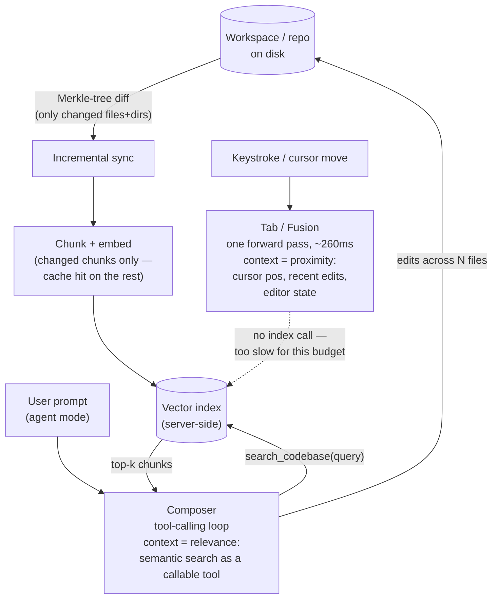

## Cursor: Architecture Case Study

> Chapter of
> [[ai-architecture-and-system-design/readme#01 — Enterprise AI System Design|Enterprise AI System Design]],
> part of [[ai-architecture-and-system-design/readme|AI Architecture & System Design]].

> **Read this as public inference, not disclosed internals.** Cursor (built by Anysphere) hasn't
> published a system-design doc. What follows is reconstructed from Cursor's own engineering blog —
> which is unusually detailed on two specific subsystems, codebase indexing and the Tab model — plus
> directly observable product behavior (what Cursor 2.0's release notes say agent mode does) and, in
> a few places I flag explicitly, third-party technical write-ups that reverse-engineered behavior
> Cursor itself hasn't documented. Where a claim is Cursor's own words, I say so; where it's a third
> party's inference or mine, I say that too. This is the same discipline the
> [[production-agent-systems/02-reliability-security-and-governance/11-failure-recovery/11-failure-recovery|Failure Recovery]]
> chapter applies to its GitHub Copilot section — read that section's closing caveat if you want the
> calibration for how much weight to put on an "externally grounded" case study versus this book's
> chapters on documented framework internals.

## What you will understand at the end

- How Cursor keeps a semantic index of a codebase consistent with a repo that keeps changing under
  it, without re-embedding the whole tree on every keystroke — the concrete, production answer to a
  RAG-freshness question that's usually discussed in the abstract
- Why Cursor ships two structurally different systems — Tab and Agent mode — instead of routing
  every completion and every multi-file edit through one general-purpose agent loop, and what each
  one's context actually consists of
- Why a coding agent's context-assembly problem is a harder instance of the general one Part 06 of
  Agentic AI Engineering covers: a wrong file selection here doesn't just read oddly, it compiles
  into a bug
- What Cursor's own writing discloses in detail versus what it stays quiet on, and why the pattern
  of disclosure is itself a signal worth reading

---

## The mental model

Cursor is not one system with one context strategy — it's two consumer-facing subsystems sharing one
backend index, built for two different latency budgets:

Two things worth noticing before the sections below unpack each box:

1. **The index is shared; the access pattern is not.** Tab never calls the vector index — a search
   round trip doesn't fit inside a sub-300ms completion budget, so Tab's context is whatever's
   physically near the cursor. Agent mode calls the index as a tool, on demand, mid-trajectory,
   because a multi-file task might touch code nowhere near where the developer is currently looking.
2. **The index itself has to stay cheap to update**, or neither consumer benefits. That's what
   Section 1 is actually about — not "how do you compute embeddings" but "how do you avoid
   recomputing them for the 99% of the repo that didn't change since the last index run."

---

## 1. Codebase indexing: embeddings kept incrementally fresh, not batch-recomputed

Cursor's January 2026 blog post, "Securely indexing large codebases," is the primary source for this
section, and it's specific enough to quote mechanics from directly.

**Change detection via Merkle tree, not a full re-scan.** On opening a workspace, the client builds
a Merkle tree — a hash per file, rolled up into a hash per directory, rolled up into one root hash
for the whole tree. A small edit changes exactly one file's hash and the hashes of that file's
parent directories on the way up to the root — everything else in the tree is untouched. The client
diffs its current tree against the last-synced tree and uploads only the divergent branches. Cursor
states this cuts a 50,000-file workspace's sync payload from what would otherwise be several
megabytes down to just the bytes covering what actually changed.

**Re-chunking and re-embedding follow the same diff.** Only files whose hash changed get re-split
into chunks and re-embedded; embeddings are cached by chunk content, so if an edit doesn't change a
chunk's actual text (a comment tweak two functions away, say), the cached embedding is reused
instead of recomputed. This is the mechanism the task in this chapter cares about most: the index
doesn't fall behind because staying current is cheap by construction, not because of a scheduled
batch re-index job that's "good enough" between runs.

**What Cursor's post doesn't specify, and what third-party analyses claim instead.** The official
post describes "syntactic chunks" without naming the parsing method. Independent technical write-ups
(Engineer's Codex, and a Towards Data Science reverse-engineering piece) describe tree-sitter-based
AST chunking — walking each file's parse tree and merging sibling nodes into chunk-sized units — and
name Turbopuffer as the vector store. I'm including both because they're plausible and specific, not
because Cursor has confirmed either; treat the Merkle-diff mechanism above as documented, and the
tree-sitter/Turbopuffer detail as informed inference from outside the company.

**The part worth having ready for an interview: index reuse across a team, gated by proof of
possession.** When a second engineer opens a repo someone on their team has already indexed, their
client computes a similarity hash (simhash) summarizing its own Merkle tree and sends it as a query
vector against a database of other members' simhashes. A close match lets the server skip
re-embedding and reuse the existing index — Cursor cites this dropping median index-ready time from
7.87 seconds to 525 milliseconds, and the long tail (a very large or unusual repo) from 4.03 hours
to 21 seconds. The security-relevant detail: the server doesn't just trust "same org, so share the
index." It stores content proofs per chunk and only returns a chunk to a requesting client if that
client's own tree can prove it has the corresponding file — so reuse can't be used to read a
teammate's uncommitted branch or a file outside the requester's own checkout. That's the answer to
"how would you let a team share an expensive index without leaking anyone's private state," and it's
a genuinely reusable pattern beyond coding agents — the same proof-of-possession shape applies to
any cache shared across tenants that hold overlapping but not identical data.

This whole problem — keeping a semantic index consistent with a corpus that mutates continuously —
is the production instance of what Part 05 of Agentic AI Engineering's retrieval chapters treat more
generically; Cursor's Merkle-diffing is one concrete, load-bearing answer to "how do you avoid
re-embedding everything every time something changes," worth citing by name if a RAG-freshness
question comes up in a system-design loop.

---

## 2. Tab: the fast path, structurally separate from agent-mode tool use

Cursor's own framing (from its Tab/Fusion model-update post) is explicit that Tab isn't a thin
wrapper around a general-purpose completion call — it's a **custom sparse language model**, trained
specifically for this one task on billions of tokens, and the task it's trained for is broader than
"finish this line."

**Two outputs, not one.** Tab predicts both the edit near the cursor and where the developer should
move next — a "jump." The stated reasoning: a real edit is rarely confined to one contiguous span.
Fix a function signature and the call sites that need updating might be ten lines down, or in a
different part of the same file; Tab's job is to predict that next location and animate the cursor
there, not just fill in text at the current position.

**Latency and context are both first-class, tuned metrics.** The post cites p50 server latency
dropping from 475ms to 260ms alongside the Fusion update, and context length growing from 5,500 to
13,000 tokens of "editor state and file content." Both numbers matter for the same reason: Tab runs
on essentially every keystroke or pause, so its latency budget is closer to autocomplete than to a
chat response, and its context has to be assembled from cheap, local signals — cursor position,
recently edited regions, surrounding diff — not a search round trip.

**Why this is architecturally distinct from Agent mode, not just a smaller model doing the same
job.** Tab never participates in the tool-calling loop from
[[building-agentic-systems/00-building-single-agent-systems/01-agent-architecture/01-agent-architecture|Agent Architecture]]
— no memory write, no tool call, no multi-turn trajectory. It's a single forward pass, every time.
That's a deliberate scope cut, not a limitation: running a full ReAct-style loop against a
frontier-capability model on every keystroke would blow the latency budget by an order of magnitude
before it ever produced a suggestion. A narrow model purpose-trained for one prediction shape is
what makes sub-300ms latency possible at all — the same small-model/narrow-task versus
large-model/general-task tradeoff
[[ai-foundations/01-language-models-in-practice/07-model-selection-and-routing|Model Selection & Routing]]
covers generically, playing out as two literally separate models in one product rather than one
model routed dynamically per request. Cursor's post claims Tab generates over a billion edited
characters per day — worth citing as evidence that, by raw interaction volume, the narrow fast path
is the dominant surface, even though Agent mode is the architecturally richer one this chapter
spends more time on.

---

## 3. Agent mode: the tool-calling loop for multi-file edits

Cursor's own coding model, Composer, launched alongside Cursor 2.0, and the launch post is explicit
about the design axis it optimizes for: **speed over raw benchmark intelligence** — "4x faster than
similarly intelligent models," with most turns completing in under 30 seconds. That's a real
architectural choice, not marketing color: agent mode's usefulness is bounded by how many
tool-calling round trips a developer will sit through before giving up and writing the edit
themselves, so the model-selection lever here is tuned for iteration speed rather than leaderboard
position — the same tradeoff generalized in Part 01 of AI & LLM Foundations Ch. 7 and revisited
under cost in
[[production-agent-systems/03-performance-and-cost-engineering/08-cost-engineering/08-cost-engineering|Cost Engineering]]
(Part 03 of Production Agent Systems), instantiated here as a company building its own model
specifically to sit on the fast/cheap side of that tradeoff rather than accepting a frontier model's
latency.

**The index from Section 1 is wired into the loop, not just exposed as a manual reference.**
Cursor's post states Composer was trained with codebase-wide semantic search available as a tool
during training. That's the detail worth noting architecturally: the same embedding index behind the
manual `@codebase` reference feature is also a `search_codebase`-shaped tool the model can call
mid-trajectory, using the same mechanic
[[agentic-ai-engineering/04-tools-and-environment-interaction/01-tool-calling-architecture/01-tool-calling-architecture|Tool Calling Architecture]]
covers generically. The model decides when it needs more repo context and issues the call itself,
rather than the harness front-loading a fixed context bundle before the trajectory starts — which is
exactly the fixed-k-vs-adaptive-k distinction Section 4 comes back to.

**Multi-file edits, with an explicit acknowledgment that one attempt isn't reliable enough.** Cursor
2.0's release notes describe running multiple independent agent attempts on the same task in
parallel — isolated from each other via git worktrees or remote machines — with a best-of-N
selection over the results, stated to materially improve output on harder tasks. Read that as a
direct admission, in the product's own release notes, that a single agent-mode trajectory isn't
trustworthy enough on its own for hard multi-file changes; parallel sampling plus selection is the
mitigation, shipped as a first-class feature rather than hidden as an internal retry.

**A verification step closes the loop instead of declaring success at the edit.** A "native browser
tool" lets the agent load and interact with the app it just changed and iterate before handing
control back — an explicit observe-and-revise step, not "the diff applied, so we're done."

**What the public writing does not disclose — flagged, not filled in.** Cursor has not published the
tool-calling loop's mechanics at the level GitHub Copilot's commit-based checkpointing or Claude
Code's permission model get documented elsewhere in this book: no stated iteration cap, no
description of how tool results get truncated or summarized once a trajectory runs long, no detail
on the sandbox isolation behind the "remote machines" parallel-execution option, and no explanation
of how conflicting changes from parallel git-worktree agents get reconciled before one is chosen.
The likeliest read — and this is my inference, not a citation — is that the loop itself is close to
the commodity ReAct/tool-calling shape this book already covers in Part 00 of Building & Evaluating
Agents, and that Cursor's detailed public writing goes specifically toward the two subsystems it
treats as differentiators (indexing, Tab) rather than the parts it considers table stakes. Treat
that as a hypothesis to verify against current documentation, not a fact to repeat in an interview
as if Cursor confirmed it.

---

## 4. The context-assembly problem, at repo scale

[[agentic-ai-engineering/06-context-engineering/01-context-assembly/01-context-assembly|Context Assembly]]
frames the general problem: building one prompt from disparate sources under a fixed token budget,
where placement affects how much weight the model gives each piece. A coding agent operating over a
real repository hits a sharper version of that problem than most RAG use cases do, for one specific
reason: **the "documents" being assembled are executable and interdependent.** Pull in the function
being edited without the file it imports a type from, and the result isn't a paragraph that reads
oddly out of context — it's an edit that looks plausible, applies cleanly, and doesn't compile, or
worse, compiles and is wrong. A generic RAG chunk-relevance miss degrades an answer's quality; a
coding agent's file-selection miss produces a confidently wrong artifact that has to be caught by
something downstream (a human review, a test run, the browser-verification step from Section 3).

Cursor's two subsystems land on two different points on the
[[agentic-ai-engineering/06-context-engineering/05-retrieval-policies/05-retrieval-policies|Retrieval Policies]]
fixed-k-vs-adaptive spectrum, for reasons tied directly to their latency budgets:

| Dimension                         | Tab                                                                    | Agent mode                                                                                                   |
| --------------------------------- | ---------------------------------------------------------------------- | ------------------------------------------------------------------------------------------------------------ |
| Context source                    | Proximity — cursor position, recently edited regions, editor state     | Relevance — semantic search over the whole indexed repo                                                      |
| Retrieval policy                  | None, structurally — no search call fits the latency budget            | Adaptive — the model calls `search_codebase` when it decides it needs more                                   |
| Why this shape                    | Sub-300ms budget; the right context is almost always physically nearby | Multi-file tasks may need code nowhere near the cursor; a round trip is affordable at "most turns under 30s" |
| Failure mode if under-provisioned | Suggests a locally-plausible edit that misses a distant dependency     | Same risk, but the model can (in principle) notice and issue another search call mid-trajectory              |

The practical point for a system-design answer: these aren't two implementations of one generalized
"context provider" — they're two different answers to "when is a repo-scale relevance search worth
its latency cost," made once at design time per subsystem rather than decided per request. That's
the same "whether to retrieve at all" question
[[agentic-ai-engineering/06-context-engineering/05-retrieval-policies/05-retrieval-policies|Retrieval Policies]]
poses generically; Cursor's product just answers it two different ways for two different features
instead of picking one policy for the whole product.

---

## What an L6/L7 candidate should take from this case study

1. **Split the fast, narrow, high-frequency path from the slow, general, tool-using one — don't
   route everything through one model tiered by request.** Tab and Composer are architecturally
   separate systems, not one model with a fast/slow flag. When a product has a sub-second-latency
   surface and a multi-step-reasoning surface, that's often a strong signal to build two systems,
   not one router in front of one model.
2. **"Keep the retrieval index fresh" is an incremental-sync problem, not a re-embedding schedule.**
   Merkle-tree diffing to identify exactly what changed, combined with content-addressed embedding
   caching, is the concrete answer to a RAG-freshness question that's too often hand-waved as "just
   re-index periodically." Cite the mechanism, not just the goal.
3. **Sharing an expensive index across tenants is safe only with a proof-of-possession check per
   result, not org-membership trust.** This generalizes well beyond coding agents — any shared cache
   over overlapping-but-not-identical tenant data needs the same shape of check.
4. **Parallel sampling plus selection, and an explicit verification step, are an admission that one
   agent trajectory isn't reliable enough on hard tasks — treat that as validated architecture, not
   a workaround.** A candidate should be ready to generalize this beyond coding: for any
   high-stakes, hard-to-verify-by-construction agent task, running N attempts and selecting, or
   adding an explicit observe-and-revise step, is a legitimate reliability lever, not a sign the
   base model isn't good enough yet.
5. **A coding agent's context-assembly failures are more consequential than a typical RAG miss**,
   because the retrieved units are interdependent and executable. If asked why context engineering
   discipline matters more in some domains than others, this is a concrete answer with a specific
   failure mode attached, not an abstract claim.
6. **Read disclosure depth as a signal.** Cursor writes specifically and technically about indexing
   and Tab — its differentiators — and stays vague about agent-mode's loop internals, which are
   probably close to the commodity mechanics this book already covers. When reverse-engineering any
   company's architecture from its public writing, what they choose to detail is itself information.

---

Where this case study's story picks up next: Chapter 11 covers Claude Code's documented permission
model and subagent orchestration, and Chapter 12 covers GitHub Copilot's evolution from inline
completion into a CI/CD-triggered coding agent — the same fast-path/agent-mode split shows up in
both, with different disclosure boundaries and a different trust model for autonomous multi-file
changes. Reading the three back to back is more useful than any one alone: the differences in what
each company chooses to document, and the differences in where each one puts the human checkpoint,
tell you more about the design space than any single case study can.

## Concept check

| Question                                                                                                | Answer hint                                                                                                                                                                                                    |
| ------------------------------------------------------------------------------------------------------- | -------------------------------------------------------------------------------------------------------------------------------------------------------------------------------------------------------------- |
| Why doesn't Tab call the vector search index the way Agent mode does?                                   | A search round trip doesn't fit inside Tab's sub-300ms completion budget; its context has to come from cheap, local signals instead                                                                            |
| What makes Cursor's codebase index stay fresh without a batch re-embed job?                             | Merkle-tree diffing identifies exactly which files/chunks changed, so only those get re-chunked and re-embedded; unchanged chunks hit a content-addressed cache                                                |
| How does Cursor let a team share an index without leaking a teammate's private files?                   | A per-chunk content-proof check — the server only returns a chunk if the requesting client's own tree can prove it has that file                                                                               |
| What design axis does Cursor optimize Composer for, by its own account?                                 | Speed/iteration latency over raw benchmark intelligence — most turns under 30 seconds                                                                                                                          |
| What does Cursor 2.0's parallel-agent-plus-selection feature imply about single-trajectory reliability? | That one agent-mode pass isn't reliable enough on hard tasks on its own — parallel sampling and selection is the shipped mitigation                                                                            |
| Why is a coding agent's context-assembly problem harder than a typical RAG use case's?                  | The retrieved units (files) are executable and interdependent — a wrong selection compiles into a bug rather than just reading oddly                                                                           |
| What's confirmed from Cursor's own writing versus inferred from third parties in this chapter?          | Merkle-tree sync, index-reuse-with-proof, and Tab's latency/context numbers are Cursor's own claims; tree-sitter chunking and Turbopuffer-as-vector-store are third-party technical write-ups, flagged as such |

---

## Vocabulary glossary

| Term                                  | Definition                                                                                                                                                                                     |
| ------------------------------------- | ---------------------------------------------------------------------------------------------------------------------------------------------------------------------------------------------- |
| Merkle tree (indexing context)        | A hash tree over a workspace's files and directories; a small edit changes only one leaf hash and its ancestors, letting a client and server diff and sync just the divergent branches         |
| Content-addressed embedding cache     | Caching an embedding by the hash of the chunk's content, so an unchanged chunk's embedding is reused instead of recomputed                                                                     |
| Simhash (index-reuse context)         | A similarity hash summarizing a Merkle tree, used to find a close-enough existing index to reuse instead of re-embedding from scratch                                                          |
| Proof of possession (chunk retrieval) | A server-side check that a requesting client's own tree can account for a file before returning any chunk derived from it — the mechanism that makes index reuse across a team safe            |
| Tab / Fusion                          | Cursor's custom, narrow, sparse language model for inline edit prediction and cursor-position ("jump") prediction — a single forward pass, structurally outside the agent tool-calling loop    |
| Composer                              | Cursor's proprietary coding model powering agent mode, explicitly tuned for iteration speed over benchmark-leading intelligence, trained with codebase-wide semantic search as a callable tool |
| Fixed-k vs. adaptive retrieval        | Retrieving a fixed number of results per query (Tab's proximity context, implicitly) versus letting the consumer decide when and how much to retrieve (Agent mode's on-demand search calls)    |
