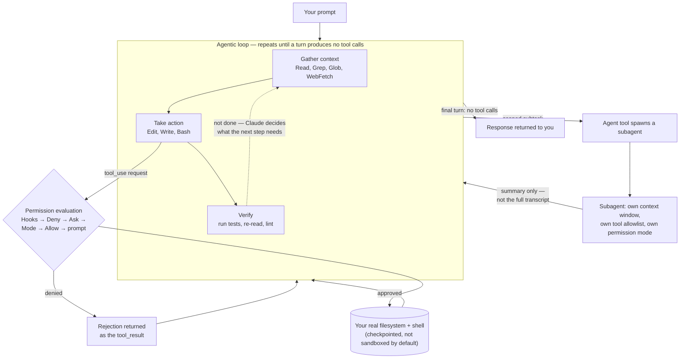

## Claude Code: Architecture Case Study

> Chapter of
> [[ai-architecture-and-system-design/readme#01 — Enterprise AI System Design|Enterprise AI System Design]],
> part of [[ai-architecture-and-system-design/readme|AI Architecture & System Design]].

> **Read this as documentation-grounded analysis, not disclosed internals.** Unlike Cursor's
> engineering-blog-only disclosure in the previous chapter, Anthropic publishes detailed, versioned,
> user-facing documentation for Claude Code's agentic loop, permission model, and subagent system —
> specified precisely enough to cite the exact evaluation order a tool call goes through and which
> product version changed which default. That's an unusually high floor for "documented fact" in
> this chapter's source material, and most of what follows cites it directly. Three sourcing tiers
> still show up:

| Tier                     | What it means here                                                                                                                                   | Example in this chapter                                                                                  |
| ------------------------ | ---------------------------------------------------------------------------------------------------------------------------------------------------- | -------------------------------------------------------------------------------------------------------- |
| **Documented**           | Stated in Anthropic's current product docs, cited to the specific mechanic                                                                           | The six-step permission evaluation order, subagent frontmatter fields, permission-mode inheritance rules |
| **Reasonable inference** | Follows from documented behavior plus general systems design, or from well-established public engineering writing not specific to this exact feature | Why agentic (live-search) exploration was chosen over a persistent index                                 |
| **Flagged uncertain**    | Independent/community analysis, not Anthropic's own claim                                                                                            | The loop's internal concurrency model ("single-threaded master loop")                                    |

> The reason this matters architecturally, not just epistemically: Claude Code is the same product
> category as
> [[agentic-ai-engineering/04-tools-and-environment-interaction/13-agents-in-ci-cd-and-sdlc-workflows/13-agents-in-ci-cd-and-sdlc-workflows|GitHub Copilot's coding agent]]
> and
> [[ai-architecture-and-system-design/01-enterprise-ai-system-design/10-cursor-architecture-case-study/10-cursor-architecture-case-study|Cursor]]
> — an agent with real tool access to a real codebase — but it makes a different, explicit bet on
> where the safety boundary lives. Getting that bet right in an interview answer requires being
> precise about what's actually documented versus what sounds true, the same discipline
> [[production-agent-systems/02-reliability-security-and-governance/11-failure-recovery/11-failure-recovery|Failure Recovery]]
> applies to its own GitHub Copilot section.

## What you will understand at the end

- Why Claude Code's agentic loop operates directly against your real filesystem and shell rather
  than a sandboxed diff-review flow, and what safety net replaces isolation as the default posture
- How a tool call travels through a fixed six-step evaluation order — hooks, deny rules, ask rules,
  permission mode, allow rules, then a prompt — as a concrete, shipped instance of the Permission
  Broker pattern from
  [[agentic-ai-engineering/04-tools-and-environment-interaction/12-tool-security/12-tool-security|Tool Security]]
  and the human-gate pattern from
  [[building-agentic-systems/00-building-single-agent-systems/08-approval-workflows/08-approval-workflows|Approval Workflows]]
  — including a specific, well-documented gotcha where an allowlist you'd expect to be a safety
  boundary turns out not to be one
- Why subagents exist to solve a context and scoping problem before a parallelism problem, what a
  parent conversation actually receives back from one, and how a permission mode set at the top of a
  session can propagate downward through delegation in a way you can't override underneath it
- How to read Claude Code as a worked, component-for-component instance of
  [[harness-engineering|Harness Engineering]] — every mechanism in this chapter is a harness
  decision with a name and a documented failure mode, not a model-capability question

---

## The mental model

Three things are true simultaneously in every Claude Code session: a loop is running, every action
that loop takes is gated by a permission decision, and some of that work may be delegated to a
subagent running the same loop in its own isolated context.

Three things worth noticing before the sections unpack each box:

1. **The loop doesn't distinguish "reading" from "editing" architecturally** — both are just tool
   calls that happen to gather or act. What separates them operationally is the permission gate each
   one passes through, not a different code path in the loop itself.
2. **The permission gate sits between the model's request and the real world on every single tool
   call**, not just the risky-looking ones. A `Read` call and a `Bash(rm -rf ...)` call go through
   the identical six-step evaluation; they just tend to resolve at different steps of it.
3. **A subagent is the same loop, recursively**, not a different execution model. What makes
   delegation useful isn't a smarter subagent — it's that its context window starts empty and only a
   summary crosses back over the boundary.

---

## 1. The agentic loop: gather, act, verify — against your real filesystem and shell

Anthropic's own framing, stated plainly in the product documentation: "Claude Code serves as the
**agentic harness** around Claude: it provides the tools, context management, and execution
environment that turn a language model into a capable coding agent." The loop itself has three named
phases — **gather context**, **take action**, **verify results** — and the documentation is explicit
that these aren't fixed stages executed in order every time. They "blend together": a question about
the codebase might only need context-gathering, a bug fix cycles through all three repeatedly, and a
refactor spends most of its time in verification. Claude decides what the next step needs based on
what the previous step returned — this is the ReAct-shaped loop
[[building-agentic-systems/00-building-single-agent-systems/01-agent-architecture/01-agent-architecture|Agent Architecture]]
covers generically, with these three named phases as Claude Code's own vocabulary for the same
thought-act-observe cycle.

**The default execution model touches real state, not a sandboxed copy of it.** This is the
architectural choice worth contrasting explicitly against a different, equally valid design: a
coding agent that never writes to your actual checkout at all, and instead executes every change in
an isolated environment, surfacing only a diff for you to review and apply — the shape
[[agentic-ai-engineering/04-tools-and-environment-interaction/13-agents-in-ci-cd-and-sdlc-workflows/13-agents-in-ci-cd-and-sdlc-workflows|GitHub Copilot's coding agent]]
takes when it commits to a branch and opens a PR rather than touching your working tree directly.
Claude Code, run locally (its default mode), does the opposite: `Edit` and `Write` land on the
actual files in your actual working directory, and `Bash` runs against your actual shell, with
access to "any command you could run" from the command line — the documentation states this
directly: "If you can do it from the command line, Claude can too."

The safety net for that choice isn't isolation by default — it's two narrower, cheaper mechanisms:

| Mechanism                       | What it covers                                                                                                               | What it doesn't cover                                                                                                                                                                               |
| ------------------------------- | ---------------------------------------------------------------------------------------------------------------------------- | --------------------------------------------------------------------------------------------------------------------------------------------------------------------------------------------------- |
| **Checkpoints**                 | Before Claude edits a file, it snapshots the prior contents. `Esc` `Esc` rewinds. Separate from git; survives session resume | Actions with external side effects — a database write, an API call, a deployment — can't be checkpointed, which is precisely why those route through the permission gate instead of relying on undo |
| **Permission gate (Section 2)** | Every tool call, before it executes                                                                                          | Nothing — this is the actual control surface, not a backstop; checkpoints are what catches an approved-but-wrong edit after the fact                                                                |

Read that "checkpoints" row against the term's other meaning in this book:
[[production-agent-systems/02-reliability-security-and-governance/11-failure-recovery/11-failure-recovery|Failure Recovery]]
uses "checkpoint" for a durable record of a multi-step run's plan, completed-step results, and side
effects — the unit that lets a workflow engine resume a failed run without redoing prior steps.
Claude Code's checkpoint is narrower: a per-file content snapshot for undo, not a resumable run
state. Same word, genuinely different granularity — worth having straight before an interview reuses
one definition where the question means the other.

**Isolation is available, but it's opt-in and scoped to one tool, not the loop's default posture.**
Claude Code ships a sandboxed Bash tool — OS-level filesystem and network isolation (macOS Seatbelt;
Linux/WSL2 via `bubblewrap` + `socat`) that constrains what a shell command and its children can
touch, enforced by the operating system rather than the model's own judgment. It's disabled by
default, configurable per-project or org-wide, and — critically — scoped to the `Bash` tool
specifically, not a blanket sandbox around the whole session; when a sandboxed command needs
something outside its allowed paths or domains, it falls back to the regular permission flow rather
than silently failing. This is the same isolation-technology spectrum
[[production-agent-systems/02-reliability-security-and-governance/04-sandboxing/04-sandboxing|Sandboxing]]
covers for shell-access tools generally — worth naming as the chapter to reach for if a design
question asks you to harden this posture further. Claude Code also ships genuine remote execution
options — cloud-hosted VMs, self-hosted environments, and a "Remote Control" mode where execution
and your files stay local but you drive the session from a browser — but these change _where_ the
identical loop runs, not _whether_ it touches real state once it's running there.

**Agentic search instead of a persistent index.** A second design choice sits underneath "gather
context": Claude Code does not build and maintain a persistent embeddings-based index of the
codebase. It searches the tree live, every session, with the same grep/glob/read primitives a human
would reach for dropped into an unfamiliar repo — this is stated directly in Anthropic's own
engineering writing on why the product is built this way, not merely an omission I'm inferring from
silence. The tradeoff is precise, not a vague "faster vs. smarter": zero index-staleness risk
against a working tree that just changed, zero indexing-pipeline infrastructure to build and keep in
sync, and search behavior that generalizes to any repo on first contact — against more tool calls
and tokens spent per task on exploration a precomputed index could answer near-instantly. This is
the same freshness-vs-precomputed-recall question
[[agentic-ai-engineering/readme#05 — Retrieval & Knowledge Systems|Part 05 of Agentic AI Engineering]]
poses for retrieval generally, answered here in favor of freshness specifically because a coding
agent's corpus mutates on every turn of the very loop that's searching it — a harder staleness
problem than the mostly-static document corpora Part 05 of Agentic AI Engineering's chapters assume.

**Plan mode is "plan" as a literal permission mode, not just a prompting discipline.** Claude Code
supports an explicit plan mode that restricts the agent to read-only exploration — file edits are
never auto-approved, even against a matching allow rule, and (as of recent versions) shell commands
that modify files route to the same prompt. This collapses two concerns that stay separate in the
abstract execution-loop model into one mechanism: planning-before-acting isn't only a system-prompt
instruction here, it's a **smaller tool surface**, so a plan can't accidentally become an action.
That composes directly with Section 2's permission model below rather than sitting beside it as an
unrelated feature.

**What the documentation doesn't specify: the loop's internal concurrency model.** Independent
technical analyses — including at least one academic reverse-engineering write-up — describe the
core execution loop as a "single-threaded master loop" with controlled, limited subagent parallelism
layered on top, prioritizing debuggability over a multi-agent-swarm default. I'm including this
because it's a plausible and specific characterization, not because Anthropic's own docs confirm
that internal implementation detail; treat the three-phase loop and the direct filesystem/shell
access above as documented, and the "single-threaded" internal architecture claim as informed
third-party inference.

---

## 2. The tool-permission model: allow / deny / ask, evaluated in a fixed order

This is the part of Claude Code's design that maps most directly onto material this book already
treats generically.
[[agentic-ai-engineering/04-tools-and-environment-interaction/12-tool-security/12-tool-security|Tool Security]]
builds its entire mental model around a **Permission Broker** that scope-checks every tool_use
request before it can execute, with high-risk calls routed through a separate **Approval Gate**.
Claude Code's documented permission flow is close to a literal implementation of that model,
specified precisely enough to name the exact step order:

| Step                  | What's checked                  | What can happen                                                                                                                           |
| --------------------- | ------------------------------- | ----------------------------------------------------------------------------------------------------------------------------------------- |
| 1. Hooks              | A `PreToolUse` hook runs first  | Can deny outright; an `allow` from a hook does **not** skip the deny/ask rules below                                                      |
| 2. Deny rules         | The deny list                   | If matched, blocked — **even in `bypassPermissions` mode**                                                                                |
| 3. Ask rules          | The ask list                    | If matched, falls through to a prompt regardless of mode, including `bypassPermissions`                                                   |
| 4. Permission mode    | The session's active mode       | `bypassPermissions` approves everything that reaches this step; `plan` routes every file-edit/write-shell call to a prompt no matter what |
| 5. Allow rules        | The allow list                  | If matched, approved                                                                                                                      |
| 6. Interactive prompt | Nothing above resolved the call | You decide — or, in `dontAsk` mode, it's denied automatically                                                                             |

Two design properties fall directly out of this ordering, and both are the same properties Tool
Security's mental model argues a permission system needs:

**Deny always wins, by construction.** Because deny rules are step 2 and permission mode is step 4,
a scoped deny like `Bash(rm *)` blocks matching calls in every mode, including `bypassPermissions` —
the mode most willing to auto-approve everything else. This is least-privilege scoping enforced
structurally, not by convention: no permission mode, however permissive, can walk past an explicit
deny.

**The documented gotcha that catches careful engineers:** an allowlist only _pre-approves the tools
it lists_ — it does not narrow what happens to everything else. Configure `allowed_tools=["Read"]`
alongside `bypassPermissions`, and `Bash`, `Write`, and `Edit` still run without a prompt, because
`Read` matches at step 5 while the unlisted tools fall through all the way to step 4, where
`bypassPermissions` approves them regardless of the allowlist. An allowlist reads, at a glance, like
a safety boundary; it's actually a fast-path for the tools it names, and the real boundary — if one
is needed — is the deny list instead. This is exactly the "looks safe on paper but isn't" failure
mode
[[agentic-ai-engineering/04-tools-and-environment-interaction/12-tool-security/12-tool-security|Tool Security]]
§3 warns a gate can silently degrade into — here the degradation is a configuration mistake rather
than a load condition, but the lesson (verify the control does what its name implies; don't infer
it) is identical.

**Scoped rules are argument-level least-privilege scoping**, the same dimension Tool Security §1
names explicitly, shipped as a real rule syntax rather than described abstractly: `Bash(rm *)`
denies a pattern within an allowed tool rather than the whole tool, and an edit-path rule governs
every built-in tool that writes files by path in one place. A bare deny on the whole tool name is
coarser — it removes the tool definition from what Claude even sees, so the model literally cannot
request it, which is tool-level scoping, one level up from argument-level.

**Permission modes, condensed:**

| Mode                | Behavior                                                                                                      | Fail-closed or fail-open?                                                                   |
| ------------------- | ------------------------------------------------------------------------------------------------------------- | ------------------------------------------------------------------------------------------- |
| `default`           | Unmatched calls prompt interactively                                                                          | Depends on whether a human is watching                                                      |
| `acceptEdits`       | File edits and common filesystem commands auto-approve within the working directory; other Bash still prompts | Partially open, scoped to filesystem ops                                                    |
| `plan`              | File edits never auto-approve, even against an allow rule                                                     | Fail-closed for writes, by design                                                           |
| `dontAsk`           | Anything not pre-approved is **denied**, not prompted                                                         | Fail-closed — the explicit instantiation of Tool Security §3's "fail closed, not open" rule |
| `bypassPermissions` | Approves everything reaching step 4, except explicit ask rules and interaction-required tools                 | Fail-open — documented as "use with extreme caution," intended for isolated environments    |
| `auto`              | A model classifier reviews commands and protected-directory writes instead of prompting a human               | A different axis — automated judgment substituting for both a human and a static rule       |

**Scope layering is documented, not just a general shape to gesture at.** Permission rules compose
across managed (organization) settings, a `--agents`/session-level definition, project settings,
user settings, and plugin-provided settings, evaluated in that priority order — an
organization-level floor a project or user cannot loosen underneath it. That's the same
authorization-precedence pattern
[[production-agent-systems/02-reliability-security-and-governance/06-authorization-and-permissions/06-authorization-and-permissions|Authorization & Permissions]]
covers generally, here shipped as an explicit, ordered five-tier scope list rather than a policy
description.

**Hooks are the deterministic backstop, and they run before any of the above.** Because hooks are
step 1, a `PreToolUse` hook can block a call before deny/ask/mode/allow ever get evaluated — the
harness-engineering distinction between a probabilistic control (the model deciding whether to try
something) and a deterministic one (code that runs unconditionally in your process, not the model's
context) made concrete. A team that needs "never touch this specific config file, no matter what the
model reasons its way into" reaches for a hook, not a more carefully worded system prompt, because a
hook cannot be argued out of its decision the way a model's own judgment sometimes can under a
cleverly-injected instruction.

Put together, Sections 1 and 2 answer the question
[[building-agentic-systems/00-building-single-agent-systems/08-approval-workflows/08-approval-workflows|Approval Workflows]]
poses in the abstract — which actions need a human gate, and what happens on timeout — with a
shipped default: the interactive prompt at step 6 _is_ a synchronous human gate on exactly the calls
that haven't earned a standing rule, and the fail-closed principle shows up here as `dontAsk`
denying outright on timeout rather than proceeding as if approved, while `bypassPermissions` is
opt-in and explicitly flagged as intended for pre-isolated contexts, not the default posture.

---

## 3. Subagents: scoped delegation with isolated context, not general multi-agent orchestration

The problem subagents solve is stated in the documentation before any orchestration language shows
up: "Use one when a side task would flood your main conversation with search results, logs, or file
contents you won't reference again." That's a context-management problem first — the same one
[[building-agentic-systems/01-multi-agent-systems/01-why-multi-agent-systems/01-why-multi-agent-systems|Why Multi-Agent Systems]]
(Part 01 of Building & Evaluating Agents) names as one of the concrete failure modes motivating
splitting work across agents at all — and a delegation mechanism second.

**A subagent's context is completely isolated from the parent's.** It starts with no prior
conversation history — it doesn't see the parent's turns — though it does load its own system prompt
and project-level context (CLAUDE.md, skills). It does the token-heavy work — reading a dozen files,
running a verbose test suite, crawling search results — entirely inside its own window, and only its
**final response** crosses back as a tool result. The parent's context grows by that summary, not by
the subtask's full transcript. This is the mechanism, not just the motivation: a subagent isn't a
smarter or more specialized model by default (its model defaults to inheriting the parent's), it's a
context firewall with an optional narrower tool set behind it.

**Built-in subagents, and what each is actually scoped to do:**

| Agent             | Tools                             | Purpose                                                                           |
| ----------------- | --------------------------------- | --------------------------------------------------------------------------------- |
| `Explore`         | Read-only; `Write`/`Edit` denied  | Fast codebase search and analysis, skips CLAUDE.md and git status for speed       |
| `Plan`            | Read-only                         | Research during plan mode, keeping the main conversation read-only while it works |
| `general-purpose` | Every tool available to subagents | Complex, multi-step tasks needing both exploration and modification               |

Custom subagents are markdown files with YAML frontmatter — `name`, `description`, and optionally
`tools`, `disallowedTools`, `model`, `permissionMode`, `maxTurns`, and more — stored project-scoped
(checked into version control) or user-scoped. The `tools` field is a literal allowlist: a
`safe-researcher` subagent scoped to `Read, Grep, Glob, Bash` cannot edit a file or call an MCP tool
even if the model wanted to, because those tool definitions simply aren't in its schema. This is
least-privilege scoping applied one layer below the main session — the same tool-level control
Section 2 covers, configured per delegated worker instead of per session, and the model cannot
request what the runtime never gave it the schema for, exactly the argument Tool Security §1 makes
generally.

**Permission mode inheritance has a governance-relevant asymmetry, and it's the sharpest lesson in
this section.** A subagent's own permission-mode setting can normally override the parent's — except
when the parent is running `bypassPermissions`, `acceptEdits`, or `auto`. Those three modes apply to
_every_ subagent the parent spawns and **cannot be overridden per subagent**, regardless of what
that subagent's own definition specifies. The documentation states the consequence directly:
subagents "may have different system prompts and less constrained behavior than your main agent, so
inheriting `bypassPermissions` grants them full, autonomous system access." Put concretely — a
headless pipeline that runs the parent session under `bypassPermissions` for automation convenience
doesn't just grant _itself_ full access; it silently grants full access to every subagent it
delegates to along the way, even a narrowly-scoped `db-reader` subagent whose own frontmatter asked
for something tighter. The blast radius of a permission-mode choice at the top of a session
propagates downward through delegation in a way that isn't visible unless you already know to look
for it.

**Foreground versus background changes the tool surface, not just the scheduling.** Subagents run in
the background by default in recent versions — the parent keeps working while the subagent runs
concurrently — but a background subagent is handed a **smaller built-in tool set** than a foreground
one; every other built-in is removed regardless of what the subagent's own `tools` field lists.
Permission prompts a background subagent hits still surface in the parent session, naming which
subagent is asking, rather than auto-denying silently the way earlier versions did.

**Subagents can spawn subagents, but only to a depth limit** — the `Agent` tool itself is stripped
from a subagent's available tools once that limit is reached, even if explicitly listed. A separate,
independent cap sits on top of depth: a session-level spend budget covers subagents too, so once
total spend reaches the cap, spawning another subagent fails outright rather than silently
continuing. Both are structural ceilings, not configuration a subagent's own definition can override
— the same category of problem
[[production-agent-systems/02-reliability-security-and-governance/11-failure-recovery/11-failure-recovery|Failure Recovery]]
§2 treats as a runtime retry-budget concern (nested budgets multiply) and
[[ai-foundations/01-language-models-in-practice/09-ai-failure-modes/09-ai-failure-modes|AI Failure Modes]]
names directly as a cost-and-latency-runaway pattern — a failure that shows up as a billing anomaly,
not a wrong answer, which a per-call correctness eval will never catch because it only exists in
aggregate. Here the runtime doesn't rely on an operator remembering to configure a ceiling
correctly; depth and spend are enforced structurally regardless of what any layer's own settings
say.

**A subagent's report is untrusted input the moment it returns — and Claude Code treats it that
way.** This is
[[agentic-ai-engineering/04-tools-and-environment-interaction/12-tool-security/12-tool-security|Tool Security]]
§2's exact framing — "a tool's return value is not data... it is more tokens in the same context
window" — applied to agent-to-agent output instead of tool-to-agent output. A subagent may have read
a web page, a file, or command output containing text an attacker crafted to look like a system
instruction once it lands back in the parent's context. Claude Code scans every subagent's final
report before the parent reads it: text imitating a system-conversation tag gets a character
inserted so it reads as ordinary text instead of being mistaken for real conversation structure, and
any mention of permission-bypass settings gets a marker line prepended naming the match. What the
scan explicitly does **not** do is judge whether the content is malicious or change what a resulting
tool call is allowed to do — a tool call the report leads the parent to attempt still goes through
the full permission evaluation from Section 2. Which is precisely Tool Security's point stated back
at you from real production behavior: sanitization reduces the odds an injected instruction gets
acted on; scoping is what bounds the damage if it does anyway. Neither control substitutes for the
other here either.

**As a structural pattern, this is orchestrator-worker, decided live rather than planned upfront:**
[[ai-architecture-and-system-design/00-ai-architecture-patterns/04-orchestrator-worker-pattern/04-orchestrator-worker-pattern|Orchestrator–Worker Pattern]]
is the closest fit from the pattern catalog — the primary session as orchestrator, each subagent
invocation as a worker handling one bounded, separable piece of the task — rather than the
planner-executor shape's single upfront plan with no re-planning: a dispatch decision is made
mid-loop, when the orchestrating agent judges a sub-task is bounded enough to hand off.

**Where this stops being "subagents" and starts being multi-agent systems proper:** Claude Code also
supports **agent teams** — multiple independent sessions, each with its own context window,
coordinated by a lead session that assigns tasks, where teammates message each other directly rather
than only reporting back through one parent. It's explicitly experimental (opt-in) and thinner on
documented mechanics than the subagent system above. Worth knowing the primitive exists and roughly
what problem it targets — sustained parallelism beyond what fits in one session's delegation model —
but subagents, not agent teams, are the mechanism doing the documented, load-bearing orchestration
work this section covers.

---

## 4. The harness: what wraps the model to make Sections 1–3 possible

None of the mechanics above — the loop, the permission evaluation, subagent delegation — comes from
the underlying Claude model itself. They're exactly what [[harness-engineering|Harness Engineering]]
defines as its subject: the system that wraps a raw LLM so it behaves as a dependable, steerable
agent. That reference note's own worked example is a Claude Code session specifically — this chapter
is the detailed unpacking of the claim that note makes in passing. Laid out against its
seven-component table:

| Harness component                  | Claude Code instantiation                                                                                                                                                                 |
| ---------------------------------- | ----------------------------------------------------------------------------------------------------------------------------------------------------------------------------------------- |
| Tool contracts                     | The built-in tool schemas (`Read`, `Edit`, `Bash`, `Agent`, ...) plus MCP-server tools, each with a typed input schema the model fills in but never executes directly                     |
| System prompt architecture         | Layered CLAUDE.md (global → project → session) plus, for a subagent, a separate system prompt scoped only to that subagent's frontmatter body                                             |
| Context/memory management          | Automatic compaction as the window fills, auto-memory persisted across sessions, and — the harness-specific move — subagents as a context firewall rather than only a compaction strategy |
| Permission model                   | The six-step evaluation order from Section 2, exactly                                                                                                                                     |
| Sandboxing / execution environment | The opt-in, Bash-scoped OS-level sandbox from Section 1 — narrower than the harness note's generic framing, by design                                                                     |
| Orchestration                      | The `Agent` tool's subagent delegation from Section 3, plus experimental agent teams                                                                                                      |
| Feedback loops                     | `PreToolUse`/`PostToolUse`/`SubagentStart`/`SubagentStop` hooks — code that runs in your process, not the model's context, and can block a call before it executes                        |

Two of those rows are worth dwelling on because they're where the architecture is most legible as a
_set of decisions_, not a feature list:

- **Tool contracts are extensible, not fixed.** Claude Code's tool surface isn't limited to its
  built-in tools — it connects to
  [[agentic-ai-engineering/04-tools-and-environment-interaction/09-model-context-protocol-mcp/09-model-context-protocol-mcp|MCP servers]]
  to add tools for other systems (issue trackers, internal APIs, observability backends) without the
  vendor shipping a bespoke integration for each one. That's the client-server tool-discovery
  problem MCP's chapter covers generally, instantiated here as Claude Code acting as an MCP _host_
  wired to whatever servers an operator connects, with the same permission-scoping obligations from
  Section 2 applying to those tools exactly as they apply to the built-in ones — including
  subagent-scoped MCP servers that never enter the main conversation's context at all, keeping their
  tool-schema token cost off the parent session entirely.
- **The harness is productized, separately from the CLI.** Anthropic ships the same underlying
  agent/tool/permission substrate as an SDK, so a team can build a custom agent on the same harness
  Claude Code itself runs on rather than building a coding-specific tool from scratch. That's the
  [[production-agent-systems/04-ai-platform-engineering/02-agent-sdks/02-agent-sdks|Agent SDKs]]
  design question (Part 04 of Production Agent Systems) answered concretely: build vs. adopt,
  resolved here by offering the harness itself as the adoptable unit, not just a model API.

The practical takeaway, stated the way the reference note states it: every failure mode this chapter
describes — the `bypassPermissions`-leaks-through-delegation gotcha, the
allowlist-that-isn't-a-boundary gotcha, an injected instruction surfacing in a subagent's report —
is a **harness** gap, not a model capability gap. Reword the system prompt and none of them get
fixed. "When an agent misbehaves, the fix is rarely 'reword the prompt.' It's almost always a
harness gap."

---

## 5. Where this sits next to Cursor and GitHub Copilot's coding agent

All three are the same product category — an LLM with real tool access to a real codebase — making
visibly different bets on where the safety boundary lives:

| Product                                                                                                                                                                    | Default execution boundary                                                           | Where "review" happens                                                    |
| -------------------------------------------------------------------------------------------------------------------------------------------------------------------------- | ------------------------------------------------------------------------------------ | ------------------------------------------------------------------------- | ---------------------------------------------------------------- |
| Claude Code                                                                                                                                                                | Real working tree + real shell, gated by the allow/deny/ask permission model + hooks | Inline, per tool call, via the permission model — or none, in bypass mode |
| Cursor (see [[ai-architecture-and-system-design/01-enterprise-ai-system-design/10-cursor-architecture-case-study/10-cursor-architecture-case-study                         | sibling case study]])                                                                | Editor-mediated inline diffs and agent-mode tool calls                    | Per-edit, in the diff view, before it's accepted into the buffer |
| GitHub Copilot coding agent (see [[agentic-ai-engineering/04-tools-and-environment-interaction/13-agents-in-ci-cd-and-sdlc-workflows/13-agents-in-ci-cd-and-sdlc-workflows | CI/CD chapter]])                                                                     | Isolated environment, own branch                                          | Required PR review + branch protection before merge to `main`    |

None of these is strictly "more secure" in the abstract — each is calibrated to a different usage
mode. Copilot's coding agent is built to be triggered by an SDLC event and left unattended until a
PR is ready for review, so its containment has to be architectural: no human is necessarily watching
in real time. Claude Code is built to be driven interactively by a developer at a keyboard for most
of its usage, so the containment can reasonably be a fast, inline prompt rather than a full CI cycle
— right up until it's run unattended (a script, a CI job, `bypassPermissions`), at which point the
responsibility for rebuilding an architectural containment boundary shifts explicitly onto the
operator, per Section 1's optional Bash sandbox and cloud/isolated-environment options. Recognizing
which of these two postures a given deployment actually needs — and not defaulting to "whichever
mode is fastest to demo" — is itself the architectural judgment an L6/L7 loop is checking for.

---

## What an L6/L7 candidate should take from this case study

1. **"Sandboxed by default" and "operates on your real filesystem by default" are both legitimate
   architectural choices, not a maturity gradient with an obviously correct answer.** Claude Code
   picked direct filesystem/shell access plus checkpointing and permission-gating as its default
   safety net; GitHub Copilot's coding agent picked commit-to-branch-plus-required-review instead.
   Be ready to argue the tradeoff — velocity and ground-truth iteration vs. an
   architecturally-enforced boundary — rather than asserting one is simply safer.
2. **A fixed, ordered permission-evaluation pipeline is what makes "deny always wins" a provable
   property instead of a hope.** If asked to design a permission system for an agent platform, the
   evaluation order itself — not just which rules exist — is the decision that determines whether a
   deny rule is actually unconditional.
3. **An allowlist is not automatically a boundary.** The
   allow-rules-don't-constrain-`bypassPermissions` gotcha is a concrete, citable example of a
   control that looks like it bounds blast radius and doesn't, because it operates at only one step
   of a multi-step evaluation. Any permission-system design question should probe for this exact
   class of gap.
4. **Subagents earn their keep on context economics before they earn it on task specialization.**
   The headline documented benefit is "results return as a summary, not a transcript" — lead with
   that framing over "subagents let you parallelize," which undersells the actual architectural
   motivation.
5. **A permission mode set at the top of a session can propagate through delegation in ways that
   aren't visible without reading the inheritance rules.** `bypassPermissions` on a parent isn't
   scoped to the parent — it's scoped to everything the parent can spawn. This generalizes past
   Claude Code: any orchestration layer where a supervisor's trust level defaults onto its workers
   needs the same scrutiny.
6. **Treat a delegated worker's output as untrusted input, symmetrically with a tool's output** —
   Claude Code's subagent-report scanning is a working instance of the tool-security principle this
   book already covers generically, applied one level up the call stack, from tool-to-agent to
   agent-to-agent.
7. **"Harness, not model" is the right level to diagnose a misbehaving agent at**, and Claude Code's
   own documentation states this as a design philosophy, not just as this book's framing device.

---

Where this case study's story continues: Chapter 12 covers GitHub Copilot's evolution from inline
completion into a CI/CD-triggered coding agent — the propose-a-diff, merge-gated model this chapter
contrasted Claude Code's direct-filesystem-access default against in Section 1 and Section 5. Read
it back to back with this chapter and the previous one on Cursor: three coding agents, three
different points on the same isolation-vs-directness spectrum, three different disclosure depths in
their public documentation. What each company chose to build — and to document in exhaustive detail
versus stay quiet on — is itself part of the architectural picture.

## Concept check

| Question                                                                                                                      | Answer hint                                                                                                                                                                                                                                                                      |
| ----------------------------------------------------------------------------------------------------------------------------- | -------------------------------------------------------------------------------------------------------------------------------------------------------------------------------------------------------------------------------------------------------------------------------- |
| What are the three phases of Claude Code's agentic loop, and why do they "blend together" instead of running as fixed stages? | Gather context, take action, verify — Claude decides what each next step needs based on the last result, so a lookup might use only one phase while a refactor cycles through all three repeatedly                                                                               |
| How does Claude Code's default execution model differ from a propose-a-diff coding agent like GitHub Copilot's?               | It edits your actual working directory and runs your actual shell directly by default; the safety net is pre-edit file checkpoints plus permission gating, not routing every change through an isolated environment that only ever surfaces a diff                               |
| In what order does Claude Code evaluate a requested tool call, and which step always wins?                                    | Hooks → deny rules → ask rules → permission mode → allow rules → interactive prompt; deny rules win over every mode, including `bypassPermissions`, because they're checked before the mode step                                                                                 |
| Why does an allowlist containing only `Read` still let `Bash` run unprompted under `bypassPermissions`?                       | Allow rules only pre-approve the tools they list; unlisted tools fall through to the permission-mode step, and `bypassPermissions` approves everything that reaches that step regardless of the allowlist                                                                        |
| What does a parent conversation actually receive back from a subagent?                                                        | Only the subagent's final response — a summary — not its full transcript; the subagent's own context window (searches, file reads, tool output) never crosses back                                                                                                               |
| What happens to a subagent's own permission-mode setting if the parent session runs under `bypassPermissions`?                | It's ignored — `bypassPermissions` (along with `acceptEdits` and `auto`) on the parent applies to every subagent it spawns and can't be overridden per subagent                                                                                                                  |
| What does Claude Code's subagent output scanning do, and what does it explicitly not do?                                      | It flags/escapes text in a subagent's report that imitates system-conversation structure or mentions permission-bypass settings; it does not judge maliciousness or change what a resulting tool call is allowed to do — that still goes through the normal permission checks    |
| Why does this chapter treat Claude Code's design as "the harness, not the model"?                                             | Every mechanism covered — the loop's verification step, the permission evaluation order, subagent context isolation, hooks — is a decision about what wraps the model, not a capability of the model itself; misbehavior traces to one of these, not to "the model got it wrong" |

## Vocabulary glossary

| Term                           | Definition                                                                                                                                                                                                                                      |
| ------------------------------ | ----------------------------------------------------------------------------------------------------------------------------------------------------------------------------------------------------------------------------------------------- | ------------------------------------ |
| Agentic loop                   | Claude Code's gather-context / take-action / verify-results cycle, repeating until a turn produces no further tool calls                                                                                                                        |
| Harness                        | The tools, context management, permission model, and execution environment Claude Code provides around the model — the subject of the [[harness-engineering                                                                                     | Harness Engineering]] reference note |
| Checkpoint (Claude Code sense) | A per-file content snapshot taken before an edit, enabling `Esc`-`Esc` undo — narrower than this book's run-level checkpoint sense in [[production-agent-systems/02-reliability-security-and-governance/11-failure-recovery/11-failure-recovery | Failure Recovery]]                   |
| Sandboxed Bash tool            | Claude Code's opt-in, OS-enforced filesystem/network isolation scoped to the `Bash` tool specifically, not the whole session — see [[production-agent-systems/02-reliability-security-and-governance/04-sandboxing/04-sandboxing                | Sandboxing]]                         |
| Permission evaluation order    | The fixed six-step sequence — hooks, deny, ask, mode, allow, interactive prompt — Claude Code checks before any tool call executes                                                                                                              |
| `bypassPermissions`            | The permission mode that auto-approves nearly everything reaching the mode-evaluation step; explicit deny/ask rules and interaction-required tools still apply, and it propagates, non-overridably, to every spawned subagent                   |
| `dontAsk`                      | The fail-closed permission mode: anything not pre-approved is denied outright rather than prompted                                                                                                                                              |
| Subagent                       | A delegated worker with its own isolated context window, its own (optionally restricted) tool set, and its own permission-mode context, whose parent receives only its final summary                                                            |
| Background subagent            | A subagent that runs concurrently with the parent conversation, by default in recent versions, with a smaller built-in tool set than a foreground subagent                                                                                      |
| Subagent output scanning       | The scan Claude Code runs on every subagent's final report before the parent reads it, escaping text that imitates system-conversation structure without judging or blocking it                                                                 |
