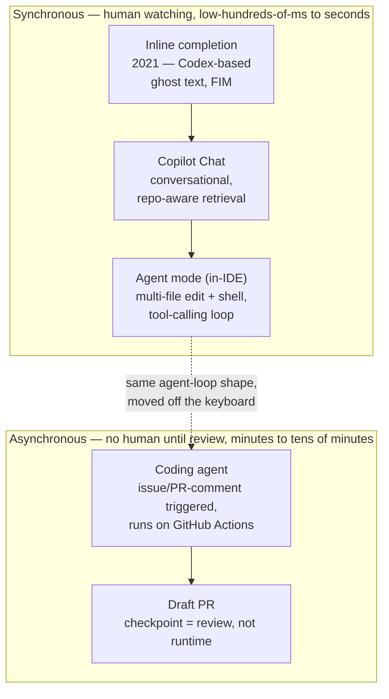
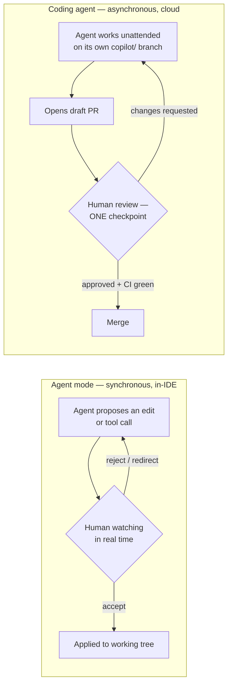

## GitHub Copilot: Architecture Case Study

> Chapter of
> [[ai-architecture-and-system-design/readme#01 — Enterprise AI System Design|Enterprise AI System Design]],
> part of [[ai-architecture-and-system-design/readme|AI Architecture & System Design]].

> **Read this as public inference, not disclosed internals.** GitHub hasn't published a unified
> system-design doc for Copilot — because "Copilot" isn't one system, it's a brand spanning several.
> What follows is grounded in GitHub's own product and engineering blog: "The road to better
> completions" (the completions model's training and serving approach), "GitHub Copilot: Meet the
> new coding agent" and the "coding agent 101" post (the coding agent's triggering, sandboxing, and
> review mechanics), and "The difference between coding agent and agent mode in GitHub Copilot" —
> which is the single most useful post for this chapter's argument, because it's GitHub stating the
> sync/async architectural split explicitly, in its own words, rather than this chapter inferring it
> from behavior. Where a number or mechanism is quoted below, it traces to one of those; where this
> chapter draws a conclusion by reading two posts together, it says so. This is the same sourcing
> discipline the
> [[ai-architecture-and-system-design/01-enterprise-ai-system-design/11-claude-code-architecture-case-study/11-claude-code-architecture-case-study|Claude Code case study]]
> applies to its own three-tier "documented / reasonable inference / flagged uncertain" split —
> worth reading if you want the calibration spelled out once instead of re-argued here.

## What you will understand at the end

- Why inline completion — what "Copilot" originally shipped as — is a prediction problem, not an
  agent, and why that's more than semantics: it dictates a latency budget, a state model, and a
  failure surface that share nothing with the rest of this chapter
- How Copilot grew a second, architecturally unrelated system under the same brand as it moved
  through chat, an issue-to-PR planning surface, and an IDE-embedded agent mode — before finally
  removing the one property all of those still had in common: a human watching in real time
- Why that removal is the whole story architecturally — the point where "serve a completion" and
  "run a task to completion unattended" stop being the same engineering problem — and why this book
  already covers the resulting governance mechanics in depth in
  [[agentic-ai-engineering/04-tools-and-environment-interaction/13-agents-in-ci-cd-and-sdlc-workflows/13-agents-in-ci-cd-and-sdlc-workflows|Agents in CI/CD & SDLC Workflows]]
- Why "act autonomously via PR, gate the merge" is a specific, well-built instance of the
  [[ai-architecture-and-system-design/00-ai-architecture-patterns/09-human-approval-pattern/09-human-approval-pattern|Human Approval Pattern]],
  and why the _shape_ of that gate follows directly from the sync/async split, not from an
  independent design decision
- What an L6/L7 interview answer about Copilot should say that a demo-level answer doesn't

---

## The mental model

Treat "GitHub Copilot" as a brand covering at least two architecturally distinct systems, not one
system that grew up. The first predicts the next few tokens fast enough to render before your next
keystroke. The second reads an issue, plans a multi-file change, runs your test suite, and opens a
pull request — unattended, on its own schedule, no keystroke involved at all. They share a company
and a name. They do not share a serving architecture, a latency budget, or a failure model.

Two things worth noticing before the sections unpack each box:

1. **The left three boxes are one engineering problem wearing three UIs; the right box is a
   different one.** Ghost text, chat, and in-IDE agent mode all share the property that a human is
   present for the entire interaction — which is what actually determines the architecture, not how
   many files get touched in one turn.
2. **The arrow from C to D is a real capability jump, not a bigger version of the same thing.**
   Section 3 is about exactly what breaks — cost model, state model, failure model — when the human
   stops watching.

---

## 1. Inline completion: a prediction problem, not an agent

Run original Copilot — the ghost-text suggestion that appears as you type — against the five
components from
[[building-agentic-systems/00-building-single-agent-systems/01-agent-architecture/01-agent-architecture|Agent Architecture]],
and four of five are simply absent:

| Component      | Present in inline completion?                                                                               |
| -------------- | ----------------------------------------------------------------------------------------------------------- |
| LLM            | Yes — effectively the whole system: a model trained specifically to be a fill-in-the-middle (FIM) engine    |
| Tools          | No — the model can't read a file it wasn't shown, run a command, or take any action beyond emitting text    |
| Memory         | No persistent memory — context is the current buffer and cursor position, reassembled fresh every keystroke |
| Planning       | No — no multi-step decomposition; one forward pass produces one suggestion                                  |
| Execution Loop | No loop — accept/reject is a single binary human decision per suggestion, not iterate-until-done            |

That maps directly onto
[[agentic-ai-engineering/00-introduction-to-agentic-ai/02-agent-vs-workflow-vs-automation/02-agent-vs-workflow-vs-automation|Agent vs Workflow vs Automation]]:
this isn't a workflow that fell short of being an agent, it's a ranking/scoring service that happens
to be backed by a generative model. GitHub's own writing on this model backs up how deliberately
narrow that scope is kept. "The road to better completions" — a 2026 post about a custom completions
model update — describes a **mid-training** stage on "a curated, de-duplicated corpus of modern,
idiomatic, public, and internal code with nearly 10M repositories and 600-plus programming
languages," followed by supervised fine-tuning aimed specifically at FIM behavior ("trained models
specialized in completions by way of synthetic fine-tuning to behave like a great FIM engine"), and
a custom reinforcement-learning pass rewarding relevance and helpfulness rather than raw acceptance
rate. The same post states concrete before/after numbers for that update: **20% more accepted and
retained characters, a 12% higher acceptance rate, 3x higher token-per-second throughput, and a 35%
reduction in latency.** None of that training or serving investment goes toward planning, tool use,
or multi-turn state — it goes entirely into making one forward pass better and faster, because one
forward pass is the whole product surface here. A separate, GitHub-engineer-delivered conference
talk on the completions serving stack (not a blog post, so treat the specific figure as directional
rather than a citable spec) describes chasing sub-200ms responses via HTTP/2 and a custom load
balancer — consistent with the same story: this is latency-and-cost engineering, not cognition
engineering.

**The same shape, arrived at independently.** Cursor's Tab —
[[ai-architecture-and-system-design/01-enterprise-ai-system-design/10-cursor-architecture-case-study/10-cursor-architecture-case-study|covered in the sibling case study]]
— is a structurally identical bet: a small, purpose-trained, single-forward-pass model kept
completely outside the tool-calling loop, because a search round trip or a multi-step reasoning
chain doesn't fit inside a sub-second completion budget. Two competing products, building on
different model stacks, converged on the same architectural answer to "what does the fast path look
like" — which is a stronger signal than either company's marketing about _why_ that shape is close
to forced by the latency budget itself, not a product-taste choice.

---

## 2. Chat, Workspace, and Agent Mode: the tool-calling loop enters the IDE, the human stays in the room

Copilot Chat added a real conversational surface with retrieval over the repository — a question in
chat can pull in relevant files or symbols instead of relying purely on what's open in the editor.
That's the first appearance of something resembling the Memory component: context assembled on
demand, not just whatever's in the current buffer.

**Copilot Workspace** (technical preview from 2024, sunset May 30, 2025) made the missing Planning
component explicit and literal rather than implicit in a chat transcript: given a task, it generated
a **specification** of the current-vs-desired state, then a **plan** naming which files change and
how, both editable in natural language before any code was written, then streamed the
**implementation**. That three-stage shape is the
[[ai-architecture-and-system-design/00-ai-architecture-patterns/02-planner-executor-pattern/02-planner-executor-pattern|Planner–Executor Pattern]]
reified as a product feature, not a metaphor for it — the same shape
[[ai-architecture-and-system-design/01-enterprise-ai-system-design/11-claude-code-architecture-case-study/11-claude-code-architecture-case-study|Claude Code's Plan Mode]]
also instantiates, as an explicit, separately-gated phase rather than a prompting convention.
Workspace itself didn't survive as a standalone product — GitHub folded it into the coding agent
covered in Section 3, but the spec→plan→implementation shape is worth remembering on its own,
because it's a reusable answer to "how do you make an agent's plan reviewable _before_ it starts
spending tool calls," independent of which product ships it.

**Agent mode** — the in-IDE mode where Copilot reads and edits multiple files, runs terminal
commands, and iterates against failures — is where the remaining components show up for real: Tools
(file edits, shell execution), a live Execution Loop (edit → run tests → read the failure → edit
again), and — per GitHub's own description — self-healing behavior that "recognizes errors and fixes
them automatically." Structurally this is the ReAct loop from Agent Architecture running inside an
editor session instead of a backend service, with a dual-model design (per GitHub's own posts) that
separates the model producing edit suggestions from the session's broader context handling.

What agent mode does **not** change is the property that matters most for this chapter: **the human
is in the room for the entire loop.** Every tool call is watched live, can be interrupted, can be
redirected with a follow-up message mid-task, and the whole session lives and dies with one IDE
window being open. This is exactly the "interactively-invoked agent" profile
[[agentic-ai-engineering/04-tools-and-environment-interaction/13-agents-in-ci-cd-and-sdlc-workflows/13-agents-in-ci-cd-and-sdlc-workflows|Agents in CI/CD & SDLC Workflows]]
§3 describes generically — no event trigger, no branch created independent of the developer's own
working tree, no PR opened autonomously. Every property that makes that chapter's "gate merge, not
PR creation" design _necessary_ doesn't apply here yet, because nothing agent mode does is invisible
to a human for even one turn.

---

## 3. The coding agent: crossing into an asynchronous agent-runtime problem

GitHub's coding agent removes that one remaining property. It's triggered by assigning a GitHub
issue to Copilot, by a comment on an existing PR, or by a prompt from VS Code — and once triggered,
it works with no human watching in real time. GitHub's own post on the feature is direct about the
mechanics worth citing precisely:

- **Compute substrate:** the agent runs on GitHub Actions infrastructure — the same platform GitHub
  states executes "more than 40 million daily jobs" across GitHub-hosted and self-hosted runners. It
  boots an environment, clones the repo, and configures it before doing any task-specific work.
- **Context:** the agent uses "advanced retrieval augmented generation (RAG) powered by GitHub code
  search" to analyze the codebase, and can extend its tool surface via
  [[agentic-ai-engineering/04-tools-and-environment-interaction/09-model-context-protocol-mcp/09-model-context-protocol-mcp|MCP]]
  servers an operator configures.
- **Blast-radius controls:** the agent "can only push to branches it created" (documented as
  prefixed `copilot/`) — it has no write path to `main` at all, not even one gated by permission.
  Network egress defaults to "a trusted list of destinations" the operator customizes — the
  coding-agent analogue of the least-privilege default this book argues for generally in
  [[agentic-ai-engineering/04-tools-and-environment-interaction/12-tool-security/12-tool-security|Tool Security]].
- **Separation of duties:** GitHub states explicitly that "the developer requesting work cannot be
  the one to approve it" — the requester and the approver are structurally different people, not a
  convention someone has to remember to follow.
- **Output and checkpoint:** the agent "pushes commits to a draft pull request," and a developer
  tracks progress through "agent session logs" showing its reasoning and validation steps.

This book already covers the _governance_ mechanics of exactly this shift — execution-context
resolution, repo/branch scoping, and the "gate merge, not PR creation" autonomy line — in depth in
[[agentic-ai-engineering/04-tools-and-environment-interaction/13-agents-in-ci-cd-and-sdlc-workflows/13-agents-in-ci-cd-and-sdlc-workflows|Agents in CI/CD & SDLC Workflows]],
using this exact product as its own reference implementation. This chapter isn't re-deriving that —
go there for it. What's worth adding here is the _engineering_ story sitting underneath the
governance story: once a human is out of the loop for the task's duration, "serve a completion fast"
and "run a task to completion unattended" stop being the same problem in any dimension that matters.

| Dimension             | Inline completion (ghost text)                                        | Coding agent                                                                                       |
| --------------------- | --------------------------------------------------------------------- | -------------------------------------------------------------------------------------------------- |
| Problem shape         | Next-token / fill-in-the-middle prediction                            | Multi-step planning, tool use, real side effects (writes, test runs, commits)                      |
| Latency budget        | Tight — must beat the next keystroke, low hundreds of ms              | Loose — minutes to tens of minutes; off any human's critical path                                  |
| State                 | None — every request independent, buffer + cursor only                | A task's worth of durable state: plan, edits so far, test results, review feedback, over hours     |
| Execution environment | None — no sandbox, no shell, nothing beyond what's shown to the model | An isolated, ephemeral GitHub Actions environment with a real repo checkout and shell access       |
| Failure surface       | A bad suggestion costs one keystroke — instantly discarded            | A bad run costs sandbox compute and model spend, and produces an unwanted PR — a run-level failure |
| Output unit           | A string inserted at the cursor                                       | A branch, a sequence of commits, and an opened PR                                                  |
| Human touchpoint      | Continuous — every suggestion seen and accepted/rejected in real time | Single, deferred checkpoint — review of the finished PR, after all the work already happened       |

GitHub's own post drawing this exact contrast — "The difference between coding agent and agent mode
in GitHub Copilot" — is the cleanest primary-source statement of the split this chapter is built
around. In its framing, agent mode is "real-time collaboration, conversational, and iterative" where
"you watch the steps," while the coding agent is asynchronous: you assign an issue and it works in
the background, with oversight landing "at pull request review checkpoint" rather than continuously.
That's GitHub naming the sync/async distinction as a product decision, not this chapter inferring it
from behavior.

Read down the coding-agent column of the table and every row is a
[[production-agent-systems/readme#00 — Production Infrastructure|Production Infrastructure]]
concern, not a model-serving one. The execution substrate that hosts a multi-step loop with real
tool access, with its own timeout and iteration-limit enforcement so a stuck run doesn't burn
sandbox time forever, is exactly the problem
[[production-agent-systems/00-production-infrastructure/01-agent-runtime/01-agent-runtime|Agent Runtime]]
is scoped to — a chapter this book hasn't filled in yet, and this case study is a good concrete
argument for why it needs to be. Durable partial progress across an interrupted or long-running task
is the checkpointing problem, and — as
[[production-agent-systems/02-reliability-security-and-governance/11-failure-recovery/11-failure-recovery|Failure Recovery]]'s
own Copilot section works through in detail — this system gets it essentially for free from git
rather than building a bespoke checkpoint store: each commit pushed to the agent's branch is a
durable, inspectable checkpoint, and a stuck or repeatedly-failing run surfaces as an open,
not-yet-mergeable draft PR instead of looping silently. Worth noticing _why_ that fits so cleanly:
the coding agent didn't need to invent partial-progress semantics — it inherited them from
infrastructure that already solved that exact problem for every human contributor.

**One more 2026-era wrinkle worth flagging, sourced from GitHub's own product changelog rather than
a narrative post:** the coding agent is no longer tied to one model or even one vendor's agent
implementation. GitHub's changelog describes "model selection... for the Claude and Codex... agents
on github.com" — letting a task be handed to an Anthropic-model-backed agent or an OpenAI
Codex-backed agent from the same "assign to Copilot" entry point. Read narrowly, that's a model
picker; read more carefully, the phrasing ("Claude and Codex agents," plural) suggests GitHub's
coding-agent surface is becoming a **host for multiple vendors' agent implementations**, not just a
router choosing among model weights behind one fixed harness — closer to the multi-model
infrastructure problem in
[[production-agent-systems/04-ai-platform-engineering/07-multi-model-infrastructure/07-multi-model-infrastructure|Multi-Model Infrastructure]]
(Part 04 of Production Agent Systems) than to the simpler request-level routing in
[[ai-foundations/01-language-models-in-practice/07-model-selection-and-routing/07-model-selection-and-routing|Model Selection & Routing]].
Flagged explicitly because it's inferred from a changelog title, not a designed-architecture post —
verify the current shape before repeating it as settled fact.

---

## 4. The safety envelope: gated merge as a Human Approval Pattern instance

Section 5 of the CI/CD chapter already argues _why_ "gate merge, not PR creation" is the right
autonomy line for a coding agent generally. What's worth adding at this altitude is the
pattern-catalog framing: it's a specific, well-built instance of the
[[ai-architecture-and-system-design/00-ai-architecture-patterns/09-human-approval-pattern/09-human-approval-pattern|Human Approval Pattern]]
— a human-in-the-loop checkpoint gating a high-risk action — and _why_ it's a good instance is worth
being precise about, because the pattern in the abstract is just as easy to implement as a rubber
stamp.

An approval gate is only as trustworthy as the artifact a human is asked to approve, and the
mechanics GitHub ships answer that directly:

| Design axis                | A weak instance of the pattern                           | Copilot's coding agent                                                                                      |
| -------------------------- | -------------------------------------------------------- | ----------------------------------------------------------------------------------------------------------- |
| What's gated               | The action itself, sight mostly unseen                   | Only the irreversible step (merge) — exploratory work already happened at zero review cost                  |
| Artifact reviewed          | A description of an intended action                      | The actual diff, plus CI status and test results, via the same PR review UI as any human's PR               |
| Separation of duties       | Left to convention — "someone else should probably look" | Structural: "the developer requesting work cannot be the one to approve it," per GitHub's own docs          |
| Timeout / escalation       | Often unspecified, or a forced auto-approve on timeout   | No forced timeout — an unresolved run just sits as an open, not-yet-mergeable draft PR                      |
| Failure mode under fatigue | Rubber-stamping — approval becomes reflexive over time   | Still vulnerable to superficial review, but a large diff reads visibly differently from a one-click approve |

The generalizable lesson this case study hands to the (currently stub) Human Approval Pattern
chapter: **don't design the approval UI first and the artifact second.** A gate that's cheap to
click through eventually gets clicked through without being read — true whether the actor behind it
is an agent or a human's own Friday-afternoon deploy button. The PR is a strong artifact precisely
because PR review was never designed as an "approve the robot" workflow bolted on afterward; it's
the same review discipline a team already runs, applied to a diff that happens to have an agent's
name on the commit. That reuse is what keeps the gate from atrophying — there's no separate,
lower-scrutiny "agent-approval" lane to become the path of least resistance.

It's also worth stating the connection back to Section 3 explicitly, because it's the through-line
of this whole chapter: **the shape of the approval checkpoint follows directly from the sync/async
architecture, not from an independent safety decision.** Agent mode's checkpoint cardinality is
continuous — one micro-approval per tool call, because the architecture puts a human in the loop for
every step anyway. The coding agent's checkpoint cardinality is exactly one — a single review of the
finished diff — because the architecture removed the human from every step _except_ that one.
Neither is "more secure" in the abstract; they're the approval pattern's natural expression of two
different points on the same sync/async axis Section 3 already drew.

---

## Where this sits next to Cursor and Claude Code

All three case studies in this Part are the same product category — an LLM with real tool access to
a real codebase — making visibly different bets on where the safety boundary lives:

| Product                                                                                                                                                           | Default execution boundary                                         | Where review happens                                                                 |
| ----------------------------------------------------------------------------------------------------------------------------------------------------------------- | ------------------------------------------------------------------ | ------------------------------------------------------------------------------------ | ------------------------------------------------------------------------- |
| GitHub Copilot — agent mode                                                                                                                                       | Real working tree, inside the developer's IDE session              | Continuous — every tool call watched live                                            |
| GitHub Copilot — coding agent                                                                                                                                     | Isolated GitHub Actions environment, agent-owned `copilot/` branch | Single checkpoint — required PR review + branch protection before merge to `main`    |
| Cursor (see [[ai-architecture-and-system-design/01-enterprise-ai-system-design/10-cursor-architecture-case-study/10-cursor-architecture-case-study                | sibling case study]])                                              | Editor-mediated inline diffs (Tab); local/remote sandboxed attempts (Agent mode)     | Per-edit, in the diff view, before it's accepted into the buffer          |
| Claude Code (see [[ai-architecture-and-system-design/01-enterprise-ai-system-design/11-claude-code-architecture-case-study/11-claude-code-architecture-case-study | sibling case study]])                                              | Real working tree + real shell, gated by the allow/deny/ask permission model + hooks | Inline, per tool call, via the permission model — or none, in bypass mode |

The pattern worth carrying out of all three: none of these products picked one safety posture and
applied it uniformly. Each one carries at least two — a tight, inline, human-watched mode for
interactive work, and a looser, structurally-gated mode for unattended work — and the boundary
between them tracks the sync/async split, not a maturity level. Recognizing _which_ posture a given
deployment actually needs, rather than defaulting to whichever mode is fastest to demo, is the
judgment call an L6/L7 loop is checking for across all three of these case studies, not just this
one.

---

## What an L6/L7 candidate should take away

1. **"Copilot" is not one system.** An answer that only discusses completion latency, or only
   discusses the coding agent's sandboxing, has described half the product. Naming both — and naming
   that they're architecturally distinct despite the shared brand — separates a user-level answer
   from a systems-level one.
2. **When asked to design "a coding agent," the interesting surface usually isn't the model call.**
   It's session/task lifecycle, ephemeral execution environments, credential scoping per task,
   checkpoint granularity, and where the human touchpoint sits — the Production Infrastructure and
   CI/CD material this chapter keeps pointing back to.
3. **Autonomy boundaries should be structural, not behavioral.** "Gate merge, not PR creation" works
   because merge is the one step with an irreversible consequence, enforced by branch protection —
   not because the agent correctly self-assesses how risky its own change is. That's a stronger
   design than any rule phrased as "the agent decides when to ask for help."
4. **The approval checkpoint's shape is downstream of the sync/async architecture, not a separate
   design choice.** Section 4's continuous-vs-single-checkpoint contrast is the concrete version of
   a general principle: don't design a human-approval gate in isolation from the execution model
   it's gating.
5. **A checkpoint mechanism doesn't have to be bespoke.** The strongest part of this case study is
   that GitHub didn't build a checkpoint-and-resume engine from scratch for the coding agent — it
   ran the agent inside infrastructure (git, PR review) that already solved that problem for every
   other contributor. "What existing infrastructure already solves half of this" is a better first
   move than "what do I build."
6. **Separate confirmed pattern from inference, out loud.** This chapter's own hedging — confident
   about what GitHub's blog states directly (firewall defaults, branch prefixing, separation of
   duties), explicit about what's inferred from a changelog title (the multi-vendor-agent-host
   reading) — is the calibration an L6/L7 answer needs. Stating a specific mechanism with false
   confidence reads worse in the room than "the pattern is X; I haven't verified the current exact
   shape."

---

## Concept check

| Question                                                                                                | Answer hint                                                                                                                                                                   |
| ------------------------------------------------------------------------------------------------------- | ----------------------------------------------------------------------------------------------------------------------------------------------------------------------------- |
| Why isn't inline completion an agent by this book's definition?                                         | It's missing Tools, Memory, Planning, and an Execution Loop — one forward pass producing one suggestion, no durable state, no side effects                                    |
| What does agent mode add that inline completion and chat don't have?                                    | Tools, an execution loop, and self-correction against real test/build output — but a human still watches every step                                                           |
| What's the key trust-model difference between agent mode and the coding agent?                          | Agent mode keeps a human watching every tool call live; the coding agent removes that human for the whole task, checkpointing at PR review only                               |
| What plays the role of "checkpoint" in the coding agent, and where does this book cover it fully?       | Each commit on the agent's branch — see the Failure Recovery chapter's own Copilot section for the full mechanism                                                             |
| Why is "gate merge, not PR creation" a good instance of the Human Approval Pattern, not a rubber stamp? | The gated artifact is a full diff plus CI status, reviewed with the same tooling and required reviewers as any human PR, with structural separation of requester and approver |
| Why does the approval checkpoint's shape differ between agent mode and the coding agent?                | It follows the sync/async architecture: continuous micro-approval when a human is in the loop every step, a single checkpoint when they aren't                                |

---

## Vocabulary glossary

| Term                                 | Definition                                                                                                                      |
| ------------------------------------ | ------------------------------------------------------------------------------------------------------------------------------- |
| Fill-in-the-middle (FIM)             | A completion training objective where the model predicts a missing span given both preceding and following context              |
| Ghost text                           | The greyed-out inline suggestion rendered in the editor before a completion is accepted                                         |
| Copilot Workspace                    | GitHub's retired (May 2025) issue-to-spec-to-plan-to-implementation preview product; its shape was folded into the coding agent |
| Agent mode                           | Copilot's IDE-embedded mode: reads/edits multiple files and runs commands, with a human watching live                           |
| Coding agent                         | GitHub's asynchronous, event-triggered agent that works unattended in an isolated GitHub Actions sandbox and outputs a PR       |
| Separation of duties (approval gate) | The requester of an agent's work being structurally barred from also approving it                                               |
| Gated merge                          | Allowing autonomous PR creation while requiring human review and CI success before the change can merge                         |
| Human Approval Pattern               | The cross-cutting pattern of gating a high-risk agent action behind an explicit human checkpoint                                |
