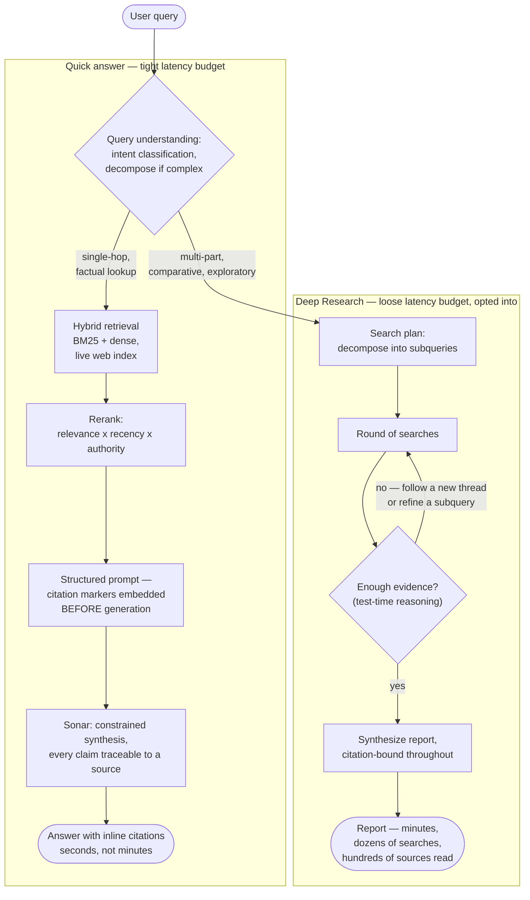
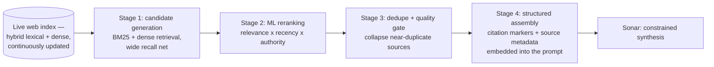

## Perplexity: Architecture Case Study

> Chapter of
> [[ai-architecture-and-system-design/readme#01 — Enterprise AI System Design|Enterprise AI System Design]],
> part of [[ai-architecture-and-system-design/readme|AI Architecture & System Design]].

> **Read this as external analysis, not disclosed internals.** Perplexity hasn't published one
> canonical systems-design document the way GitHub has documented Copilot's autonomy boundary. What
> follows is reconstructed from Perplexity's own product and API documentation (the Sonar API's
> retrieval-native chat-completion contract, the Deep Research launch framing), a public engineering
> partnership disclosure (Vespa's own writing on serving Perplexity's index), and third-party
> technical breakdowns that reverse-engineer the retrieval pipeline from observable product
> behavior. Where a mechanism is Perplexity's own stated design — retrieval-native Sonar,
> citation-bound generation, a shift off a third-party search API onto owned crawl-and-index
> infrastructure — I say so with reasonable confidence. Where a number only exists in a secondary
> aggregator post with no primary citation I could independently verify — index size, engineering
> headcount, an exact reranker quality threshold — I flag it as reported-but-unconfirmed and I'm
> deliberately not repeating it as a fact to cite in an interview. This is the same discipline
> [[ai-architecture-and-system-design/01-enterprise-ai-system-design/10-cursor-architecture-case-study/10-cursor-architecture-case-study|the Cursor case study]]
> applies to its own secondary sourcing — read that chapter's opening note for the calibration if
> you want it spelled out once rather than repeated here.

## What you will understand at the end

- Why Perplexity's retrieval problem is structurally different from the static-corpus default in
  [[agentic-ai-engineering/05-retrieval-and-knowledge-systems/01-retrieval-augmented-generation-rag/01-retrieval-augmented-generation-rag|Retrieval-Augmented Generation (RAG)]]
  — the corpus is the live web, re-fetched and re-ranked per query, not a document set indexed once
  and refreshed on a schedule
- How citation grounding gets enforced as a hard constraint on generation itself, not a best-effort
  layer bolted on afterward — and how that goes further than the citation-requirement mitigation in
  [[ai-foundations/01-language-models-in-practice/08-hallucination-management/08-hallucination-management|Hallucination Management]]
- Why Perplexity ships at least two structurally different latency contracts — an interactive answer
  under a tight budget, and an agentic research mode that deliberately spends minutes instead of
  seconds — and why that split reads completely differently from a coding agent's own latency
  tolerance
- How
  [[agentic-ai-engineering/05-retrieval-and-knowledge-systems/09-multi-stage-retrieval/09-multi-stage-retrieval|Multi-Stage Retrieval]]
  plays out concretely at web scale: a coarse hybrid pass over an enormous candidate pool, narrowed
  by reranking, before a single token of the answer gets generated
- What an L6/L7 answer should say about Perplexity that goes past "it's a chatbot with search bolted
  on"

---

## The mental model

The load-bearing framing: Perplexity is **retrieval-primary**, not
generation-primary-with-retrieval- attached. The retrieval and ranking pipeline is the component
that has to be right — the LLM sits at the end of that pipeline as a constrained synthesizer, bound
to restate and connect what retrieval already found, not as the source of the answer. That ordering
is the opposite of how a lot of RAG tutorials frame the system ("call the model, let it decide to
search"), and it's the single architectural choice everything else in this chapter follows from.

Two things worth noticing before the sections unpack each box:

1. **The corpus is never static.** Both paths retrieve against a continuously updating web index,
   not a document set someone chose and froze. Section 1 is about what that commits Perplexity to
   architecturally, versus what a conventional RAG deployment over an internal corpus commits you
   to.
2. **Quick and Deep Research are the same pipeline shape at two different points on a
   fixed-vs-adaptive retrieval policy.** Quick answers look like a bounded, mostly fixed policy;
   Deep Research is the iterative, model-decided version of the exact same three questions — whether
   to retrieve again, how much, from where — that
   [[agentic-ai-engineering/06-context-engineering/05-retrieval-policies/05-retrieval-policies|Retrieval Policies]]
   covers generically. Section 2 makes that mapping explicit.

---

## 1. Live retrieval over the open web, not a static corpus

[[agentic-ai-engineering/05-retrieval-and-knowledge-systems/01-retrieval-augmented-generation-rag/01-retrieval-augmented-generation-rag|Retrieval-Augmented Generation (RAG)]]'s
default framing — the one most production RAG deployments over an internal knowledge base actually
build — assumes a corpus you control: you chunk it, embed it, index it, and refresh that index on
some cadence (nightly, on-write, whatever your freshness requirement demands). The index might lag
the source system by minutes or days, but "the source system" is finite and enumerable — a wiki, a
ticket tracker, a set of PDFs.

Perplexity's corpus is the public web. It is neither finite nor enumerable, it changes continuously
and out of Perplexity's control, and a meaningful fraction of queries specifically need content that
didn't exist an hour ago. That rules out the periodic-refresh model entirely — there is no cadence
short enough to make "reindex nightly" an acceptable freshness bar for "what did the Fed just
announce."

**What Perplexity's own product history shows about how it solved this.** Perplexity launched in
2022 built on top of a third-party web search API (Bing) paired with an LLM for synthesis — a
reasonable way to ship an answer engine without first building a search engine. Over time, and as
volume grew, the company built its own crawler (branded `PerplexityBot`) and its own index, moving
the search layer in-house rather than continuing to rent it. Multiple independent technical
write-ups describe that index as running on **Vespa** — an open-source distributed search/serving
engine originally built at Yahoo for exactly this problem class (large-scale hybrid lexical+vector
retrieval with continuous, high-rate updates) — which is a real, independently verifiable technology
choice, not a Perplexity-specific invention. The index's reported scale (widely repeated as
"hundreds of billions of pages" across secondary technical breakdowns) and the exact update rate are
the kind of number I'm treating as plausible order-of-magnitude, not a confirmed figure to cite
precisely.

**Why owning the crawl-and-index stack was worth the engineering cost, stated as the architectural
tradeoff rather than a company-history anecdote:**

| Dimension               | Renting a search API (Bing, early Perplexity)                        | Owning crawl + index (current Perplexity)                                                                              |
| ----------------------- | -------------------------------------------------------------------- | ---------------------------------------------------------------------------------------------------------------------- |
| Freshness control       | Bounded by the provider's own crawl cadence and API latency          | Tunable directly — crawl priority, re-crawl frequency, and ranking signals are all first-party                         |
| Ranking control         | Whatever the provider's black-box relevance model returns            | Full control over the relevance x recency x authority composite — the exact lever a citation-bound answer engine needs |
| Cost at scale           | Per-query API pricing that scales linearly with query volume         | Large fixed infrastructure cost, better unit economics at high, sustained query volume                                 |
| Product differentiation | None — every provider layering an LLM on the same API looks the same | The retrieval/ranking layer itself becomes the moat, not just the synthesis layer                                      |
| Engineering cost        | Low — a thin integration                                             | High — crawler, index, ranking, and freshness pipeline are now Perplexity's own operational burden                     |

The general lesson worth carrying into a system-design answer: **"add retrieval" and "own the
retrieval infrastructure" are different scales of commitment**, and the decision to move from one to
the other is usually driven by the same forces that drive any build-vs-buy call — cost at scale,
control over a differentiating layer, and no longer wanting a third party's rate limits and
black-box ranking sitting on your critical path. Owning it doesn't change the retrieval _algorithm_
(Section 3 still applies whichever way you built the index) — it changes who's accountable for
freshness and ranking quality, and how directly Section 4's citation guarantee can be enforced.

---

## 2. Query understanding and decomposition

Not every query needs the same amount of retrieval work, and Perplexity's product surface makes that
explicit rather than hiding it behind one uniform pipeline. A single-fact lookup ("what's the
current version of Kubernetes") and a comparative research question ("how have the major cloud
providers' approaches to confidential computing diverged over the last two years") are not the same
retrieval problem, and treating them identically either wastes latency on the first or under-serves
the second — exactly the fixed-k-is-wrong-in-both-directions argument
[[agentic-ai-engineering/06-context-engineering/05-retrieval-policies/05-retrieval-policies|Retrieval Policies]]
§2 makes generically, now playing out as two different _products_, not just two different `k`
values.

**Quick answers run something close to a fixed, bounded policy.** Intent classification decides
whether the query needs retrieval at all versus can be handled from the model's own knowledge, and
if it does, a small number of searches run against the live index before synthesis — bounded tightly
enough to keep the whole round trip inside an interactive latency budget. This is the fixed-upfront
end of the spectrum from Retrieval Policies §5: a design-time-bounded number of retrieval calls,
predictable cost, predictable latency.

**Deep Research is the iterative, model-decided version of the identical three questions.** Launched
in February 2025, Perplexity's own framing for Deep Research describes it as running dozens of
searches and reading on the order of hundreds of sources before synthesizing a report, typically
taking a few minutes end to end rather than seconds — an explicit, product-level statement that this
mode buys thoroughness by spending a latency budget an order of magnitude larger than the quick-
answer path. Structurally this is
[[agentic-ai-engineering/05-retrieval-and-knowledge-systems/07-agentic-rag/07-agentic-rag|Agentic RAG]]
applied to the search product itself: the system runs a round of searches, evaluates whether what
came back answers the question (Perplexity's own "test-time compute" framing for this — spend more
inference- time reasoning contrasting and synthesizing results before committing to an answer), and
either follows a new thread the interim results surfaced or moves to synthesis. That
evaluate-and-decide step is exactly the retrieve/critique/continue loop Retrieval Policies §5
describes generically, and the same governance point applies here that
[[production-agent-systems/02-reliability-security-and-governance/11-failure-recovery/11-failure-recovery|Failure Recovery]]
§2 makes about nested retry budgets: an iterative research loop with no absolute ceiling on searches
or wall-clock time is an unbounded-cost decision wearing a thoroughness justification, so a "dozens
of searches" product framing is doing double duty — it's both a UX promise and, almost certainly,
the externally visible face of an internal hard cap.

**The practical takeaway for a system-design answer:** these are not two different models — by
Perplexity's own account, Deep Research is a mode built from the same retrieval and synthesis
machinery, run inside a loop with a much larger iteration and time budget, triggered by an explicit
product choice (the user picks "Deep Research" the way they'd pick a slower, more thorough search) —
not an automatic decision the pipeline makes silently based on perceived query complexity. That's a
deliberate, defensible design choice worth naming explicitly: putting the fixed-vs-adaptive decision
in the user's hands, rather than a classifier's, sidesteps the failure mode of a misjudged
complexity estimate silently under- or over-serving a query — the tradeoff is a coarser dial (two
explicit modes, not per-query optimization) in exchange for predictability the user opted into.

---

## 3. The retrieval pipeline: hybrid, then reranked, before synthesis

This is
[[agentic-ai-engineering/05-retrieval-and-knowledge-systems/09-multi-stage-retrieval/09-multi-stage-retrieval|Multi-Stage Retrieval]]'s
coarse-to-fine funnel, instantiated at a candidate pool many orders of magnitude larger than a
typical internal-corpus RAG deployment ever has to filter through.

**Stage 1 — candidate generation.** The same hybrid pattern
[[agentic-ai-engineering/05-retrieval-and-knowledge-systems/05-hybrid-search/05-hybrid-search|Hybrid Search]]
covers generically — sparse (BM25) retrieval for exact-term precision, dense/embedding retrieval for
semantic recall — run against the live index to pull a wide candidate set. Third-party technical
breakdowns describe standard-mode queries pulling on the order of several dozen candidate sources at
this stage; treat the exact count as illustrative rather than a documented constant, since it almost
certainly varies by query.

**Stage 2 — reranking.** A composite score folding in relevance, recency, and source authority — the
identical three-signal tension
[[agentic-ai-engineering/04-tools-and-environment-interaction/05-search-tools/05-search-tools|Search Tools]]'
result-ranking section works through generically (a stale-but-relevant page shouldn't outrank a
fresh advisory on a "what changed" query; a high-lexical-overlap forum comment shouldn't outrank an
authoritative primary source). At web scale the authority signal matters more than it does for an
internal-corpus search tool, because the candidate pool includes content of wildly uneven quality
with no organizational curation behind it — see Section 4 for why that specifically shapes the
citation requirement.

**Stage 3 — dedupe and a quality gate.** Web search candidate sets are dense with near-duplicates —
syndicated copies, mirrors, SEO-optimized restatements of the same underlying fact — collapsed the
same cheapest-first way Search Tools describes (canonical-URL collapsing, then hash-based near-dup
detection, then embedding-similarity clustering for what the cheaper layers miss). Some technical
accounts describe a minimum-quality floor on the reranked set: if too few candidates clear a
relevance threshold, retrieval re-runs rather than handing the model a thin, low-confidence evidence
set to synthesize from anyway. I can't verify the specific threshold reported in secondary sources,
but the _shape_ of that design choice is worth internalizing on its own: it's the same asymmetry
[[agentic-ai-engineering/06-context-engineering/05-retrieval-policies/05-retrieval-policies|Retrieval Policies]]
§3 argues for generically — under-retrieval produces a confidently wrong answer with no visible
seam, which is a worse failure than the visible cost of retrying — so retrying retrieval rather than
synthesizing from thin evidence is the _correct_ lean even before you know the exact threshold that
triggers it.

**Stage 4 — structured, citation-bound assembly.** The surviving, ranked candidates get assembled
into a structured prompt with source metadata and citation markers embedded _before_ the model
generates a single token — not appended afterward. Section 4 is entirely about why that ordering is
the architecturally load-bearing choice in this whole pipeline.

Read top to bottom, this is the same coarse-to-fine principle Multi-Stage Retrieval teaches
generically — recall wide, then narrow through progressively more expensive filtering stages — just
run against a candidate pool sized to the open web instead of a bounded internal corpus, which is
exactly why the funnel needs four stages instead of two: at web scale, a single relevance pass
simply isn't precise enough to hand to a model directly, and the intermediate stages
(recency/authority reranking, dedup, a quality floor) are doing real, load-bearing work that a
smaller, curated corpus often doesn't need at all.

---

## 4. Citation grounding as a hard output constraint

[[ai-foundations/01-language-models-in-practice/08-hallucination-management/08-hallucination-management|Hallucination Management]]
frames citation requirements as one composable mitigation among three — grounding, citations,
confidence-calibrated refusal — each with real limits, none of them a complete fix. Perplexity's
architecture is worth studying specifically because of _where_ it enforces citation in the pipeline,
which goes further than the "prompted convention" version that chapter also describes.

**The ordering is the point.** In a lot of RAG implementations, citation is effectively a
generation- time instruction — "cite your sources" — checked, if at all, after the model has already
produced text. Multiple accounts of Perplexity's pipeline describe citation markers and source
metadata being embedded into the structured prompt _during_ Stage 4 assembly, before generation
starts, with Sonar specifically trained to only assert claims traceable to a retrieved span rather
than trained generically and told to behave that way through a system prompt. That's the difference
between "please cite your sources" as an instruction the model might follow more or less faithfully,
and citation as a structural property of what the model was actually optimized to produce — the same
distinction
[[ai-foundations/01-language-models-in-practice/08-hallucination-management/08-hallucination-management|Hallucination Management]]
draws between native, API-level citation support and a prompted convention achieving a weaker
version of the same goal, here pushed one step further into the model's own training objective.

**Why this matters more here than in an internal-knowledge-base RAG deployment.**
[[agentic-ai-engineering/04-tools-and-environment-interaction/05-search-tools/05-search-tools|Search Tools]]'
web-vs-internal comparison table treats an internal corpus as inherently higher-authority — it's
_your_ curated source of truth. Perplexity's retrieval pool has no equivalent baseline trust: the
candidate set spans primary sources, reputable outlets, forum posts, and outright SEO content,
ranked by an authority signal that's a best-effort proxy, not a guarantee. Citation is what lets the
_user_ finish the trust calibration the system can't fully do on its own — a claim traceable to a
named primary source and a claim traceable to an anonymous forum comment can sit next to each other
in an answer, and the citation is what makes the difference between them visible and checkable
instead of silently flattened into one uniformly confident-sounding sentence.

**What this doesn't fix, stated as plainly as Hallucination Management states it for the general
case.** A citation makes a claim _checkable_, not automatically _correct_ — the model can still
attach a citation to a source that doesn't actually support the specific claim being made, a
misattribution failure mode independent evaluations of search-augmented LLMs generally have
documented as real and non-trivial to eliminate. Citation-bound generation converts an open-ended
"is this true" question into a narrower, more auditable "does this citation actually support this
sentence" question — which is real progress, and also not the same thing as zero hallucination.
Treat citation-first architecture as raising the floor on checkability, not as a claim that the
residual error rate this book's Hallucination Management chapter treats as a permanent, monitored
quantity has gone to zero.

---

## 5. Answer synthesis under a tight latency budget — and why a coding agent's budget looks nothing like it

Perplexity's quick-answer path is a synchronous, human-in-the-room product: a user is watching the
query box the way they would with a conventional search engine, and every stage in Section 3's
funnel — classify, retrieve, rerank, dedupe, assemble, generate a first token — has to complete
inside a budget closer to low seconds than tens of seconds, because a slower-feeling "search engine"
loses to a faster-feeling one on the exact same query. That's a product-UX constraint translated
directly into an architectural one, the same way
[[ai-architecture-and-system-design/01-enterprise-ai-system-design/10-cursor-architecture-case-study/10-cursor-architecture-case-study|Cursor's Tab]]
model's sub-300ms budget is dictated by "faster than the next keystroke," not by how hard next-edit
prediction is in the abstract.

**Contrast that against a coding agent's tolerance, and the difference isn't about task difficulty —
it's about who's waiting and what they were told to expect.**

| Dimension                  | Perplexity quick answer                                                        | Perplexity Deep Research                                          | A coding agent (Cursor's Composer / GitHub Copilot's coding agent)                                      |
| -------------------------- | ------------------------------------------------------------------------------ | ----------------------------------------------------------------- | ------------------------------------------------------------------------------------------------------- |
| Human touchpoint           | Continuous — user watches the query resolve in real time                       | Deferred — user explicitly opts into "come back in a few minutes" | Deferred or absent — the task runs off the user's critical path entirely                                |
| Latency budget             | Low seconds, end to end                                                        | Minutes — dozens of searches, hundreds of sources read            | Tens of seconds to tens of minutes, depending on task scope                                             |
| What sets the budget       | The product's UX contract with a search-engine-shaped expectation              | An explicit, user-chosen tradeoff of speed for exhaustiveness     | The task is asynchronous by product design — nothing about code review requires sub-second turnaround   |
| Retrieval depth            | A bounded number of searches, fixed-ish policy                                 | An iterative, model-decided loop with a much larger cap           | Codebase-index lookups and tool calls, bounded by iteration/timeout limits, not by a human waiting live |
| Failure cost of being slow | Directly visible — the product feels broken compared to a normal search engine | Acceptable — the user was told this mode takes minutes            | Acceptable — a slow PR is still a PR whenever the developer checks back                                 |

The generalizable point for a system-design answer: **latency budget is a product-contract decision
as much as an engineering one.** The exact same retrieval-and-synthesis architecture underlies both
Perplexity paths — Section 3's pipeline doesn't change shape between Quick and Deep Research, only
how many times Section 2's loop is allowed to iterate before handing off to synthesis. What changes
the acceptable latency isn't the pipeline, it's what the human on the other end has been told to
expect. That's the same lesson
[[ai-architecture-and-system-design/01-enterprise-ai-system-design/12-github-copilot-architecture-case-study/12-github-copilot-architecture-case-study|GitHub Copilot's case study]]
draws from its own inline-completion-vs-coding-agent split, arrived at independently by a completely
different product: when a system needs to serve both a synchronous, watched interaction and an
asynchronous, unattended one, the answer is usually two different latency contracts layered on
shared machinery, not one contract stretched to cover both.

---

## What an L6/L7 candidate should take away

1. **Name the retrieval-primary framing explicitly.** In a system like this, retrieval and ranking
   quality bound answer quality far more than model choice does — say that the LLM is a constrained
   synthesizer sitting downstream of the real engineering problem, not the star of the architecture.
   An answer that spends most of its time on "which model" hasn't found the actual bottleneck.
2. **"Own the retrieval infrastructure" is a different-order commitment than "add a retrieval
   step."** Moving off a third-party search API onto a first-party crawler and index is a
   build-vs-buy call driven by cost at scale, ranking control, and no longer having someone else's
   rate limits on your critical path — be ready to name that tradeoff, not just "they built their
   own search engine."
3. **Citation-as-hard-constraint generalizes past search products.** Embedding source-traceability
   into the generation step itself — not appending it after the fact — is the transferable lesson
   for any system whose output a user will act on directly: financial figures, compliance answers,
   incident postmortems. This is the same principle
   [[ai-foundations/01-language-models-in-practice/08-hallucination-management/08-hallucination-management|Hallucination Management]]
   argues for generically, worth citing this case study as the production-hardened instance of.
4. **Latency budget is a product-contract decision, not just an engineering one.** The same
   architecture serves two different latency tiers by changing what the human was told to expect,
   not by rearchitecting retrieval. When asked to design a system that needs both a fast interactive
   mode and a slow thorough one, "two contracts over shared machinery" is a stronger answer than
   "make the fast path faster" or "give the user a spinner and hope."
5. **Multi-stage retrieval at web scale is the same funnel, run against a much bigger, much dirtier
   candidate pool.** Be ready to say what changes (crawl freshness, an authority signal doing real
   work because the corpus has no organizational curation, a quality gate that can trigger a retry
   rather than synthesizing from thin evidence) and what doesn't (coarse recall, then progressively
   more expensive narrowing, before generation).
6. **Calibrate confidence the way every case study in this Part does.** State the documented
   architectural shape — retrieval-primary, citation-bound generation, tiered latency contracts, an
   owned crawl-and-index stack — with confidence. Hold exact figures (index size, engineering
   headcount, a specific reranker threshold) as third-party reconstructions to verify before
   repeating them in an interview room.

---

Where this case study's story generalizes: Perplexity is, structurally, one production instance of
the
[[ai-architecture-and-system-design/01-enterprise-ai-system-design/03-research-agents/03-research-agents|Research Agents]]
chapter's own subject — an agent that plans multi-step retrieval, cites sources, and self-critiques
for completeness before returning a synthesized answer. Reading this chapter alongside
[[ai-architecture-and-system-design/01-enterprise-ai-system-design/10-cursor-architecture-case-study/10-cursor-architecture-case-study|Cursor]]
and
[[ai-architecture-and-system-design/01-enterprise-ai-system-design/12-github-copilot-architecture-case-study/12-github-copilot-architecture-case-study|GitHub Copilot's]]
case studies is more useful than any one alone: all three split a fast, narrow, human-watched path
from a slower, more thorough or more autonomous one — the specific split (Tab vs. Composer, inline
completion vs. coding agent, Quick vs. Deep Research) differs, but the underlying design pressure
that produces two systems instead of one tiered pipeline is the same pressure each time.

## Concept check

| Question                                                                                                           | Answer hint                                                                                                                                                                                     |
| ------------------------------------------------------------------------------------------------------------------ | ----------------------------------------------------------------------------------------------------------------------------------------------------------------------------------------------- |
| Why doesn't Perplexity's corpus fit the periodic-reindex model most internal-corpus RAG uses?                      | The corpus is the public web — not finite, not enumerable, and continuously changing outside Perplexity's control, so there's no refresh cadence that's ever "caught up"                        |
| What did owning the crawl-and-index stack buy Perplexity over renting a third-party search API?                    | Direct control over freshness and ranking signals, better unit economics at scale, and a differentiating layer instead of a commodity wrapper — at the cost of owning the infrastructure burden |
| How does Deep Research relate to Quick answers architecturally?                                                    | Same retrieval-and-synthesis pipeline; Deep Research runs the retrieve/evaluate/continue loop for many more iterations inside a much larger, user-opted-into latency budget                     |
| Why does citation get embedded into the prompt _before_ generation instead of appended after?                      | It's a structural constraint the model was trained around, not a best-effort instruction — closer to native citation support than a prompted convention                                         |
| Why does the authority ranking signal matter more for Perplexity than for an internal search tool?                 | The candidate pool has no organizational curation behind it — authority is what lets a user's own trust calibration work on an otherwise uniformly confident-sounding answer                    |
| What determines whether Quick or Deep Research is the right latency contract for a given task?                     | A product-level choice by the user about how much thoroughness to trade for speed — not a classifier silently deciding query complexity                                                         |
| Why is Perplexity's multi-stage retrieval funnel four stages instead of the two a small curated corpus might need? | Web-scale candidate pools aren't precise enough after one relevance pass — reranking, dedup, and a quality gate are all load-bearing work a smaller corpus often doesn't require                |

---

## Vocabulary glossary

| Term                              | Definition                                                                                                                                                                 |
| --------------------------------- | -------------------------------------------------------------------------------------------------------------------------------------------------------------------------- |
| Retrieval-primary architecture    | A system where retrieval/ranking quality is the primary engineering bottleneck and the LLM is a constrained synthesizer downstream of it, rather than the other way around |
| PerplexityBot                     | Perplexity's own web crawler, part of the first-party crawl-and-index infrastructure it built after moving off a third-party search API                                    |
| Vespa                             | An open-source distributed search/serving engine (originally built at Yahoo) reported to power Perplexity's hybrid lexical+vector index at scale                           |
| Sonar                             | Perplexity's family of models fine-tuned for retrieval-native, citation-bound synthesis — trained to only assert claims traceable to a retrieved source                    |
| Test-time compute (Deep Research) | Perplexity's framing for spending additional inference-time reasoning — contrasting and synthesizing results across search rounds — before committing to a final answer    |
| Citation-bound generation         | Generation where source-traceability is embedded into the assembled prompt and the model's training objective, not appended to the output after the fact                   |
| Quality gate (retrieval)          | A minimum relevance threshold on a reranked candidate set; if too few candidates clear it, retrieval retries instead of synthesizing from thin evidence                    |
| Latency contract                  | The acceptable response-time budget for a given product surface, set by what the human on the other end was told to expect — not by intrinsic task difficulty              |
